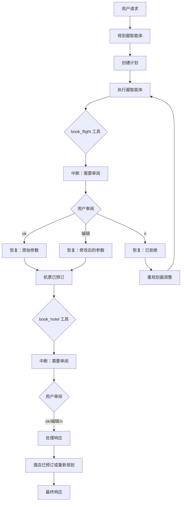

## User

/root/learn/eino-examples/adk/human-in-the-loop/6_plan-execute-replan   这里human-in-the-loop的原理是什么

**Tool Call: List the `eino-examples/adk/human-in-the-loop/6_plan-execute-replan` directory's contents**
Status: Completed

# Folders:
eino-examples/adk/human-in-the-loop/6_plan-execute-replan/.vscode

# Files:
eino-examples/adk/human-in-the-loop/6_plan-execute-replan/README.md
eino-examples/adk/human-in-the-loop/6_plan-execute-replan/README_ZH.md
eino-examples/adk/human-in-the-loop/6_plan-execute-replan/agent.go
eino-examples/adk/human-in-the-loop/6_plan-execute-replan/main.go
eino-examples/adk/human-in-the-loop/6_plan-execute-replan/model.go
eino-examples/adk/human-in-the-loop/6_plan-execute-replan/output.md
eino-examples/adk/human-in-the-loop/6_plan-execute-replan/tools.go


**Tool Call: Read file `adk/human-in-the-loop/6_plan-execute-replan/README_ZH.md` (lines 1-300)**
Status: Completed

````eino-examples/adk/human-in-the-loop/6_plan-execute-replan/README_ZH.md
# 人机协同：Plan-Execute-Replan 模式与审阅编辑

本示例演示了 **Plan-Execute-Replan** 多智能体模式与 **审阅编辑** 人机协同模式的结合。

它展示了如何构建一个规划智能体系统，用户可以在关键操作（如机票和酒店预订）执行前审阅并修改预订参数。

## 工作原理

1. **Plan-Execute-Replan 架构**：系统由三个专业化智能体组成：
   - **Planner（规划器）**：根据用户需求创建初始计划
   - **Executor（执行器）**：使用可用工具执行计划的每个步骤
   - **Replanner（重规划器）**：根据执行结果调整计划

2. **审阅编辑工具**：`book_flight` 和 `book_hotel` 工具被 `InvokableReviewEditTool` 包装。这允许用户：
   - 按原样批准预订
   - 修改预订参数（例如，更改日期、房间类型）
   - 完全拒绝预订

3. **工作流程**：
   - 用户请求旅行计划（例如，"规划一次东京3日游"）
   - 规划器创建多步骤计划
   - 执行器尝试预订机票 → **中断以供审阅**
   - 用户审阅/编辑预订详情 → 恢复
   - 执行器尝试预订酒店 → **中断以供审阅**
   - 用户审阅/编辑 → 恢复
   - 计划完成，所有预订已确认

4. **迭代执行**：Plan-Execute-Replan 模式支持多次迭代，允许重规划器根据执行结果或用户修改来调整计划。

## 实际示例

以下是审阅编辑流程的示例：

```
========================================
User Query: Plan a 3-day trip to Tokyo starting from New York on 2025-10-15.
I need to book flights and a hotel. Also recommend some must-see attractions.
========================================

name: Planner
path: [{PlanExecuteAgent} {Planner}]
answer: Creating travel plan...

name: Executor
path: [{PlanExecuteAgent} {Executor}]
tool name: book_flight
arguments: {"from":"New York","to":"Tokyo","date":"2025-10-15","passengers":1,"preferred_time":"morning"}

========================================
REVIEW REQUIRED
========================================
Tool: book_flight
Arguments: {"from":"New York","to":"Tokyo","date":"2025-10-15","passengers":1,"preferred_time":"morning"}
----------------------------------------
Options:
  - Type 'ok' to approve as-is
  - Type 'n' to reject
  - Or enter modified JSON arguments
----------------------------------------
Your choice: ok

========================================
Resuming execution...
========================================

name: Executor
path: [{PlanExecuteAgent} {Executor}]
tool response: {"booking_id":"FL-2025-10-15-12345","airline":"Japan Airlines",...}

name: Executor
path: [{PlanExecuteAgent} {Executor}]
tool name: book_hotel
arguments: {"city":"Tokyo","check_in":"2025-10-15","check_out":"2025-10-18","guests":1,"room_type":"standard"}

========================================
REVIEW REQUIRED
========================================
Tool: book_hotel
Arguments: {"city":"Tokyo","check_in":"2025-10-15","check_out":"2025-10-18","guests":1,"room_type":"standard"}
----------------------------------------
Your choice: {"city":"Tokyo","check_in":"2025-10-15","check_out":"2025-10-18","guests":1,"room_type":"deluxe"}

========================================
Resuming execution...
========================================

name: Executor
path: [{PlanExecuteAgent} {Executor}]
tool response: {"booking_id":"HT-2025-10-15-67890","hotel_name":"Tokyo Grand Hyatt","room_type":"deluxe",...}
```

此跟踪记录展示了：
- **规划阶段**：规划器创建结构化的旅行计划
- **机票预订审阅**：用户按原样批准机票预订
- **酒店预订编辑**：用户将房间类型从 "standard" 修改为 "deluxe"
- **灵活输入**：用户可以批准、拒绝或提供修改后的 JSON

## 如何配置环境变量

在运行示例之前，您需要设置 LLM API 所需的环境变量。您有两个选项：

### 选项 1: OpenAI 兼容配置
```bash
export OPENAI_API_KEY="{your api key}"
export OPENAI_BASE_URL="{your model base url}"
# 仅在使用 Azure 类 LLM 提供商时配置此项
export OPENAI_BY_AZURE=true
# 'gpt-4o' 只是一个示例，请配置您的 LLM 提供商提供的实际模型名称
export OPENAI_MODEL="gpt-4o-2024-05-13"
```

### 选项 2: ARK 配置
```bash
export MODEL_TYPE="ark"
export ARK_API_KEY="{your ark api key}"
export ARK_MODEL="{your ark model name}"
```

或者，您可以在项目根目录创建一个 `.env` 文件来设置这些变量。

## 如何运行

确保您已设置好环境变量（例如，LLM API 密钥）。然后，在 `eino-examples` 仓库的根目录下运行以下命令：

```sh
go run ./adk/human-in-the-loop/6_plan-execute-replan
```

您将看到规划器创建旅行计划，当尝试进行预订时，系统会提示您审阅并可选择编辑预订参数。

## 工作流程图



````


**Tool Call: Read file `adk/human-in-the-loop/6_plan-execute-replan/agent.go` (lines 1-300)**
Status: Completed

```eino-examples/adk/human-in-the-loop/6_plan-execute-replan/agent.go
/*
 * Copyright 2025 CloudWeGo Authors
 *
 * Licensed under the Apache License, Version 2.0 (the "License");
 * you may not use this file except in compliance with the License.
 * You may obtain a copy of the License at
 *
 *     http://www.apache.org/licenses/LICENSE-2.0
 *
 * Unless required by applicable law or agreed to in writing, software
 * distributed under the License is distributed on an "AS IS" BASIS,
 * WITHOUT WARRANTIES OR CONDITIONS OF ANY KIND, either express or implied.
 * See the License for the specific language governing permissions and
 * limitations under the License.
 */

package main

import (
	"context"
	"fmt"
	"os"
	"strconv"
	"strings"
	"time"

	"github.com/cloudwego/eino/adk"
	"github.com/cloudwego/eino/adk/prebuilt/planexecute"
	"github.com/cloudwego/eino/components/model"
	"github.com/cloudwego/eino/components/prompt"
	"github.com/cloudwego/eino/compose"
	"github.com/cloudwego/eino/schema"
)

type rateLimitedModel struct {
	m     model.ToolCallingChatModel
	delay time.Duration
}

func (r *rateLimitedModel) WithTools(tools []*schema.ToolInfo) (model.ToolCallingChatModel, error) {
	newM, err := r.m.WithTools(tools)
	if err != nil {
		return nil, err
	}
	return &rateLimitedModel{newM, r.delay}, nil
}

func (r *rateLimitedModel) Generate(ctx context.Context, input []*schema.Message, opts ...model.Option) (*schema.Message, error) {
	time.Sleep(r.delay)
	return r.m.Generate(ctx, input, opts...)
}

func (r *rateLimitedModel) Stream(ctx context.Context, input []*schema.Message, opts ...model.Option) (*schema.StreamReader[*schema.Message], error) {
	time.Sleep(r.delay)
	return r.m.Stream(ctx, input, opts...)
}

func getRateLimitDelay() time.Duration {
	delayMs := os.Getenv("RATE_LIMIT_DELAY_MS")
	if delayMs == "" {
		return 0
	}
	ms, err := strconv.Atoi(delayMs)
	if err != nil {
		return 0
	}
	return time.Duration(ms) * time.Millisecond
}

func newRateLimitedModel(ctx context.Context) model.ToolCallingChatModel {
	delay := getRateLimitDelay()
	if delay == 0 {
		return newChatModel(ctx)
	}
	return &rateLimitedModel{
		m:     newChatModel(ctx),
		delay: delay,
	}
}

func NewPlanner(ctx context.Context) (adk.Agent, error) {
	return planexecute.NewPlanner(ctx, &planexecute.PlannerConfig{
		ToolCallingChatModel: newRateLimitedModel(ctx),
	})
}

var executorPrompt = prompt.FromMessages(schema.FString,
	schema.SystemMessage(`You are a diligent travel booking assistant. Follow the given plan and execute your tasks carefully.
Execute each planning step by using available tools.
For weather queries, use get_weather tool.
For flight bookings, use book_flight tool - this will require user review before confirmation.
For hotel bookings, use book_hotel tool - this will require user review before confirmation.
For attraction research, use search_attractions tool.
Provide detailed results for each task.`),
	schema.UserMessage(`## OBJECTIVE
{input}
## Given the following plan:
{plan}
## COMPLETED STEPS & RESULTS
{executed_steps}
## Your task is to execute the first step, which is:
{step}`))

func formatInput(in []adk.Message) string {
	return in[0].Content
}

func formatExecutedSteps(in []planexecute.ExecutedStep) string {
	var sb strings.Builder
	for idx, m := range in {
		_, _ = fmt.Fprintf(&sb, "## %d. Step: %v\n  Result: %v\n\n", idx+1, m.Step, m.Result)
	}
	return sb.String()
}

func NewExecutor(ctx context.Context) (adk.Agent, error) {
	travelTools, err := GetAllTravelTools(ctx)
	if err != nil {
		return nil, err
	}

	return planexecute.NewExecutor(ctx, &planexecute.ExecutorConfig{
		Model: newRateLimitedModel(ctx),
		ToolsConfig: adk.ToolsConfig{
			ToolsNodeConfig: compose.ToolsNodeConfig{
				Tools: travelTools,
			},
		},

		GenInputFn: func(ctx context.Context, in *planexecute.ExecutionContext) ([]adk.Message, error) {
			planContent, err_ := in.Plan.MarshalJSON()
			if err_ != nil {
				return nil, err_
			}

			firstStep := in.Plan.FirstStep()

			msgs, err_ := executorPrompt.Format(ctx, map[string]any{
				"input":          formatInput(in.UserInput),
				"plan":           string(planContent),
				"executed_steps": formatExecutedSteps(in.ExecutedSteps),
				"step":           firstStep,
			})
			if err_ != nil {
				return nil, err_
			}

			return msgs, nil
		},
	})
}

func NewReplanner(ctx context.Context) (adk.Agent, error) {
	return planexecute.NewReplanner(ctx, &planexecute.ReplannerConfig{
		ChatModel: newRateLimitedModel(ctx),
	})
}

func NewTravelPlanningAgent(ctx context.Context) (adk.Agent, error) {
	planAgent, err := NewPlanner(ctx)
	if err != nil {
		return nil, err
	}

	executeAgent, err := NewExecutor(ctx)
	if err != nil {
		return nil, err
	}

	replanAgent, err := NewReplanner(ctx)
	if err != nil {
		return nil, err
	}

	return planexecute.New(ctx, &planexecute.Config{
		Planner:       planAgent,
		Executor:      executeAgent,
		Replanner:     replanAgent,
		MaxIterations: 20,
	})
}

```


**Tool Call: Read file `adk/human-in-the-loop/6_plan-execute-replan/main.go` (lines 1-300)**
Status: Completed

```eino-examples/adk/human-in-the-loop/6_plan-execute-replan/main.go
/*
 * Copyright 2025 CloudWeGo Authors
 *
 * Licensed under the Apache License, Version 2.0 (the "License");
 * you may not use this file except in compliance with the License.
 * You may obtain a copy of the License at
 *
 *     http://www.apache.org/licenses/LICENSE-2.0
 *
 * Unless required by applicable law or agreed to in writing, software
 * distributed under the License is distributed on an "AS IS" BASIS,
 * WITHOUT WARRANTIES OR CONDITIONS OF ANY KIND, either express or implied.
 * See the License for the specific language governing permissions and
 * limitations under the License.
 */

package main

import (
	"bufio"
	"context"
	"fmt"
	"log"
	"os"
	"strings"

	"github.com/cloudwego/eino/adk"

	"github.com/cloudwego/eino-examples/adk/common/prints"
	"github.com/cloudwego/eino-examples/adk/common/store"
	"github.com/cloudwego/eino-examples/adk/common/tool"
)

func main() {
	ctx := context.Background()

	agent, err := NewTravelPlanningAgent(ctx)
	if err != nil {
		log.Fatalf("failed to create travel planning agent: %v", err)
	}

	runner := adk.NewRunner(ctx, adk.RunnerConfig{
		EnableStreaming: true,
		Agent:           agent,
		CheckPointStore: store.NewInMemoryStore(),
	})

	query := `Plan a 3-day trip to Tokyo starting from New York on 2025-10-15. 
I need to book flights and a hotel. Also recommend some must-see attractions.
Today is 2025-09-01.`

	fmt.Println("\n========================================")
	fmt.Println("User Query:", query)
	fmt.Println("========================================")
	fmt.Println()

	iter := runner.Query(ctx, query, adk.WithCheckPointID("travel-plan-1"))

	for {
		lastEvent, interrupted := processEvents(iter)
		if !interrupted {
			break
		}

		interruptCtx := lastEvent.Action.Interrupted.InterruptContexts[0]
		interruptID := interruptCtx.ID
		reInfo := interruptCtx.Info.(*tool.ReviewEditInfo)

		fmt.Println("\n========================================")
		fmt.Println("REVIEW REQUIRED")
		fmt.Println("========================================")
		fmt.Printf("Tool: %s\n", reInfo.ToolName)
		fmt.Printf("Arguments: %s\n", reInfo.ArgumentsInJSON)
		fmt.Println("----------------------------------------")
		fmt.Println("Options:")
		fmt.Println("  - Type 'ok' to approve as-is")
		fmt.Println("  - Type 'n' to reject")
		fmt.Println("  - Or enter modified JSON arguments")
		fmt.Println("----------------------------------------")

		scanner := bufio.NewScanner(os.Stdin)
		fmt.Print("Your choice: ")
		scanner.Scan()
		nInput := scanner.Text()
		fmt.Println()

		result := &tool.ReviewEditResult{}
		switch strings.ToLower(strings.TrimSpace(nInput)) {
		case "ok", "yes", "y":
			result.NoNeedToEdit = true
		case "n", "no":
			result.Disapproved = true
			fmt.Print("Reason for rejection (optional): ")
			scanner.Scan()
			reason := scanner.Text()
			if reason != "" {
				result.DisapproveReason = &reason
			}
		default:
			result.EditedArgumentsInJSON = &nInput
		}

		reInfo.ReviewResult = result

		fmt.Println("\n========================================")
		fmt.Println("Resuming execution...")
		fmt.Println("========================================")
		fmt.Println()

		iter, err = runner.ResumeWithParams(ctx, "travel-plan-1", &adk.ResumeParams{
			Targets: map[string]any{
				interruptID: reInfo,
			},
		})
		if err != nil {
			log.Fatal(err)
		}
	}

	fmt.Println("\n========================================")
	fmt.Println("Travel planning completed!")
	fmt.Println("========================================")
}

func processEvents(iter *adk.AsyncIterator[*adk.AgentEvent]) (*adk.AgentEvent, bool) {
	var lastEvent *adk.AgentEvent
	for {
		event, ok := iter.Next()
		if !ok {
			break
		}
		if event.Err != nil {
			log.Fatal(event.Err)
		}

		prints.Event(event)
		lastEvent = event
	}

	if lastEvent == nil {
		return nil, false
	}
	if lastEvent.Action != nil && lastEvent.Action.Interrupted != nil {
		return lastEvent, true
	}
	return lastEvent, false
}

```


**Tool Call: Read file `adk/human-in-the-loop/6_plan-execute-replan/tools.go` (lines 1-300)**
Status: Completed

```eino-examples/adk/human-in-the-loop/6_plan-execute-replan/tools.go
/*
 * Copyright 2025 CloudWeGo Authors
 *
 * Licensed under the Apache License, Version 2.0 (the "License");
 * you may not use this file except in compliance with the License.
 * You may obtain a copy of the License at
 *
 *     http://www.apache.org/licenses/LICENSE-2.0
 *
 * Unless required by applicable law or agreed to in writing, software
 * distributed under the License is distributed on an "AS IS" BASIS,
 * WITHOUT WARRANTIES OR CONDITIONS OF ANY KIND, either express or implied.
 * See the License for the specific language governing permissions and
 * limitations under the License.
 */

package main

import (
	"context"
	"fmt"
	"hash/fnv"

	"github.com/cloudwego/eino/components/tool"
	"github.com/cloudwego/eino/components/tool/utils"

	tool2 "github.com/cloudwego/eino-examples/adk/common/tool"
)

type WeatherRequest struct {
	City string `json:"city" jsonschema_description:"City name to get weather for"`
	Date string `json:"date" jsonschema_description:"Date in YYYY-MM-DD format"`
}

type WeatherResponse struct {
	City        string `json:"city"`
	Temperature int    `json:"temperature"`
	Condition   string `json:"condition"`
	Date        string `json:"date"`
}

type FlightBookingRequest struct {
	From          string `json:"from" jsonschema_description:"Departure city"`
	To            string `json:"to" jsonschema_description:"Destination city"`
	Date          string `json:"date" jsonschema_description:"Departure date in YYYY-MM-DD format"`
	Passengers    int    `json:"passengers" jsonschema_description:"Number of passengers"`
	PreferredTime string `json:"preferred_time" jsonschema_description:"Preferred departure time (morning/afternoon/evening)"`
}

type FlightBookingResponse struct {
	BookingID     string `json:"booking_id"`
	Airline       string `json:"airline"`
	FlightNo      string `json:"flight_no"`
	From          string `json:"from"`
	To            string `json:"to"`
	Date          string `json:"date"`
	DepartureTime string `json:"departure_time"`
	ArrivalTime   string `json:"arrival_time"`
	Price         int    `json:"price"`
	Status        string `json:"status"`
}

type HotelBookingRequest struct {
	City     string `json:"city" jsonschema_description:"City to book hotel in"`
	CheckIn  string `json:"check_in" jsonschema_description:"Check-in date in YYYY-MM-DD format"`
	CheckOut string `json:"check_out" jsonschema_description:"Check-out date in YYYY-MM-DD format"`
	Guests   int    `json:"guests" jsonschema_description:"Number of guests"`
	RoomType string `json:"room_type" jsonschema_description:"Room type preference (standard/deluxe/suite)"`
}

type HotelBookingResponse struct {
	BookingID     string   `json:"booking_id"`
	HotelName     string   `json:"hotel_name"`
	City          string   `json:"city"`
	CheckIn       string   `json:"check_in"`
	CheckOut      string   `json:"check_out"`
	RoomType      string   `json:"room_type"`
	PricePerNight int      `json:"price_per_night"`
	TotalPrice    int      `json:"total_price"`
	Amenities     []string `json:"amenities"`
	Status        string   `json:"status"`
}

type AttractionRequest struct {
	City     string `json:"city" jsonschema_description:"City to search attractions in"`
	Category string `json:"category" jsonschema_description:"Category of attractions (museum, park, landmark, etc.)"`
}

type AttractionResponse struct {
	Attractions []Attraction `json:"attractions"`
}

type Attraction struct {
	Name        string  `json:"name"`
	Description string  `json:"description"`
	Rating      float64 `json:"rating"`
	OpenHours   string  `json:"open_hours"`
	TicketPrice int     `json:"ticket_price"`
	Category    string  `json:"category"`
}

func NewWeatherTool(ctx context.Context) (tool.BaseTool, error) {
	return utils.InferTool("get_weather", "Get weather information for a specific city and date",
		func(ctx context.Context, req *WeatherRequest) (*WeatherResponse, error) {
			weathers := map[string]WeatherResponse{
				"Tokyo":    {City: "Tokyo", Temperature: 22, Condition: "Partly Cloudy", Date: req.Date},
				"Beijing":  {City: "Beijing", Temperature: 18, Condition: "Sunny", Date: req.Date},
				"Paris":    {City: "Paris", Temperature: 15, Condition: "Rainy", Date: req.Date},
				"New York": {City: "New York", Temperature: 12, Condition: "Cloudy", Date: req.Date},
			}

			if weather, exists := weathers[req.City]; exists {
				return &weather, nil
			}

			conditions := []string{"Sunny", "Cloudy", "Rainy", "Partly Cloudy"}
			hashInput := req.City + req.Date
			return &WeatherResponse{
				City:        req.City,
				Temperature: consistentHashing(hashInput+"temp", 10, 30),
				Condition:   conditions[consistentHashing(hashInput+"cond", 0, len(conditions)-1)],
				Date:        req.Date,
			}, nil
		})
}

func NewFlightBookingTool(ctx context.Context) (tool.BaseTool, error) {
	baseTool, err := utils.InferTool("book_flight", "Book a flight between cities. This requires user review before confirmation.",
		func(ctx context.Context, req *FlightBookingRequest) (*FlightBookingResponse, error) {
			airlines := []string{"Japan Airlines", "ANA", "United Airlines", "Delta", "Air China"}
			hashInput := req.From + req.To + req.Date

			airlineIdx := consistentHashing(hashInput+"airline", 0, len(airlines)-1)
			depHour := consistentHashing(hashInput+"dephour", 6, 20)
			depMin := consistentHashing(hashInput+"depmin", 0, 59)
			duration := consistentHashing(hashInput+"duration", 2, 14)

			arrHour := (depHour + duration) % 24
			arrMin := depMin

			return &FlightBookingResponse{
				BookingID:     fmt.Sprintf("FL-%s-%d", req.Date, consistentHashing(hashInput+"id", 10000, 99999)),
				Airline:       airlines[airlineIdx],
				FlightNo:      fmt.Sprintf("%s%d", airlines[airlineIdx][:2], consistentHashing(hashInput+"flightno", 100, 999)),
				From:          req.From,
				To:            req.To,
				Date:          req.Date,
				DepartureTime: fmt.Sprintf("%02d:%02d", depHour, depMin),
				ArrivalTime:   fmt.Sprintf("%02d:%02d", arrHour, arrMin),
				Price:         consistentHashing(hashInput+"price", 300, 1500) * req.Passengers,
				Status:        "confirmed",
			}, nil
		})
	if err != nil {
		return nil, err
	}

	return &tool2.InvokableReviewEditTool{InvokableTool: baseTool}, nil
}

func NewHotelBookingTool(ctx context.Context) (tool.BaseTool, error) {
	baseTool, err := utils.InferTool("book_hotel", "Book a hotel in a city. This requires user review before confirmation.",
		func(ctx context.Context, req *HotelBookingRequest) (*HotelBookingResponse, error) {
			hotelNames := []string{"Grand Hyatt", "Marriott", "Hilton", "Sheraton", "Ritz-Carlton"}
			amenitiesList := [][]string{
				{"WiFi", "Pool", "Gym", "Spa", "Restaurant"},
				{"WiFi", "Breakfast", "Parking", "Business Center"},
				{"WiFi", "Pool", "Restaurant", "Bar", "Concierge"},
			}

			hashInput := req.City + req.CheckIn + req.CheckOut

			hotelIdx := consistentHashing(hashInput+"hotel", 0, len(hotelNames)-1)
			amenitiesIdx := consistentHashing(hashInput+"amenities", 0, len(amenitiesList)-1)

			pricePerNight := consistentHashing(hashInput+"price", 100, 400)
			switch req.RoomType {
			case "deluxe":
				pricePerNight = int(float64(pricePerNight) * 1.5)
			case "suite":
				pricePerNight = pricePerNight * 2
			}

			nights := 3

			return &HotelBookingResponse{
				BookingID:     fmt.Sprintf("HT-%s-%d", req.CheckIn, consistentHashing(hashInput+"id", 10000, 99999)),
				HotelName:     fmt.Sprintf("%s %s", req.City, hotelNames[hotelIdx]),
				City:          req.City,
				CheckIn:       req.CheckIn,
				CheckOut:      req.CheckOut,
				RoomType:      req.RoomType,
				PricePerNight: pricePerNight,
				TotalPrice:    pricePerNight * nights,
				Amenities:     amenitiesList[amenitiesIdx],
				Status:        "confirmed",
			}, nil
		})
	if err != nil {
		return nil, err
	}

	return &tool2.InvokableReviewEditTool{InvokableTool: baseTool}, nil
}

func NewAttractionSearchTool(ctx context.Context) (tool.BaseTool, error) {
	return utils.InferTool("search_attractions", "Search for tourist attractions in a city",
		func(ctx context.Context, req *AttractionRequest) (*AttractionResponse, error) {
			attractionsByCity := map[string][]Attraction{
				"Tokyo": {
					{Name: "Senso-ji Temple", Description: "Ancient Buddhist temple in Asakusa", Rating: 4.6, OpenHours: "6:00-17:00", TicketPrice: 0, Category: "landmark"},
					{Name: "Tokyo Skytree", Description: "Tallest tower in Japan with observation decks", Rating: 4.5, OpenHours: "10:00-21:00", TicketPrice: 2100, Category: "landmark"},
					{Name: "Meiji Shrine", Description: "Shinto shrine dedicated to Emperor Meiji", Rating: 4.7, OpenHours: "5:00-18:00", TicketPrice: 0, Category: "landmark"},
					{Name: "Ueno Park", Description: "Large public park with museums and zoo", Rating: 4.4, OpenHours: "5:00-23:00", TicketPrice: 0, Category: "park"},
				},
				"Beijing": {
					{Name: "Forbidden City", Description: "Ancient imperial palace complex", Rating: 4.8, OpenHours: "8:30-17:00", TicketPrice: 60, Category: "historic site"},
					{Name: "Great Wall", Description: "Historic fortification stretching thousands of miles", Rating: 4.9, OpenHours: "6:00-18:00", TicketPrice: 45, Category: "landmark"},
					{Name: "Temple of Heaven", Description: "Imperial sacrificial altar", Rating: 4.6, OpenHours: "6:00-22:00", TicketPrice: 35, Category: "park"},
				},
			}

			if attractions, exists := attractionsByCity[req.City]; exists {
				if req.Category != "" {
					var filtered []Attraction
					for _, a := range attractions {
						if a.Category == req.Category {
							filtered = append(filtered, a)
						}
					}
					return &AttractionResponse{Attractions: filtered}, nil
				}
				return &AttractionResponse{Attractions: attractions}, nil
			}

			return &AttractionResponse{
				Attractions: []Attraction{
					{Name: fmt.Sprintf("%s Central Park", req.City), Description: "Popular city park", Rating: 4.3, OpenHours: "6:00-22:00", TicketPrice: 0, Category: "park"},
					{Name: fmt.Sprintf("%s National Museum", req.City), Description: "Major museum with local history", Rating: 4.5, OpenHours: "9:00-17:00", TicketPrice: 15, Category: "museum"},
				},
			}, nil
		})
}

func GetAllTravelTools(ctx context.Context) ([]tool.BaseTool, error) {
	weatherTool, err := NewWeatherTool(ctx)
	if err != nil {
		return nil, err
	}

	flightTool, err := NewFlightBookingTool(ctx)
	if err != nil {
		return nil, err
	}

	hotelTool, err := NewHotelBookingTool(ctx)
	if err != nil {
		return nil, err
	}

	attractionTool, err := NewAttractionSearchTool(ctx)
	if err != nil {
		return nil, err
	}

	return []tool.BaseTool{weatherTool, flightTool, hotelTool, attractionTool}, nil
}

func consistentHashing(s string, min, max int) int {
	h := fnv.New32a()
	h.Write([]byte(s))
	hash := h.Sum32()
	return min + int(hash)%(max-min+1)
}

```


**Tool Call: Read file `adk/human-in-the-loop/6_plan-execute-replan/model.go` (lines 1-300)**
Status: Completed

```eino-examples/adk/human-in-the-loop/6_plan-execute-replan/model.go
package main

import (
	"context"

	"github.com/cloudwego/eino-ext/components/model/qwen"
	"github.com/cloudwego/eino/components/model"
)

func newChatModel(ctx context.Context) model.ToolCallingChatModel {
	model, _ := qwen.NewChatModel(ctx, &qwen.ChatModelConfig{
		BaseURL:        "https://coding.dashscope.aliyuncs.com/v1",
		APIKey:         "sk-sp-59008efd25f04f759cb04d79b62f035a",
		Model:          "qwen3.5-plus",
		EnableThinking: new(false),
	})
	return model
}

```


**Tool Call: 20 matches**
Status: Completed

file:///root/learn/eino-examples/adk/common/tool

file:///root/learn/eino-examples/adk/common/tool/approval_wrapper.go

file:///root/learn/eino-examples/adk/common/tool/follow_up_tool.go

file:///root/learn/eino-examples/adk/common/tool/graphtool

file:///root/learn/eino-examples/adk/common/tool/graphtool/README.md

file:///root/learn/eino-examples/adk/common/tool/graphtool/examples

file:///root/learn/eino-examples/adk/common/tool/graphtool/examples/1_chain_summarize

file:///root/learn/eino-examples/adk/common/tool/graphtool/examples/1_chain_summarize/README.md

file:///root/learn/eino-examples/adk/common/tool/graphtool/examples/1_chain_summarize/main.go

file:///root/learn/eino-examples/adk/common/tool/graphtool/examples/2_graph_research

file:///root/learn/eino-examples/adk/common/tool/graphtool/examples/2_graph_research/README.md

file:///root/learn/eino-examples/adk/common/tool/graphtool/examples/2_graph_research/main.go

file:///root/learn/eino-examples/adk/common/tool/graphtool/examples/3_workflow_order

file:///root/learn/eino-examples/adk/common/tool/graphtool/examples/3_workflow_order/README.md

file:///root/learn/eino-examples/adk/common/tool/graphtool/examples/3_workflow_order/main.go

file:///root/learn/eino-examples/adk/common/tool/graphtool/examples/4_nested_interrupt

file:///root/learn/eino-examples/adk/common/tool/graphtool/examples/4_nested_interrupt/README.md

file:///root/learn/eino-examples/adk/common/tool/graphtool/examples/4_nested_interrupt/main.go

file:///root/learn/eino-examples/adk/common/tool/graphtool/graph_tool.go

file:///root/learn/eino-examples/adk/common/tool/review_edit_wrapper.go

**Tool Call: Search files for regex `type\s+InvokableReviewEditTool|type\s+ReviewEditInfo|type\s+ReviewEditResult|ResumeWithParams|Interrupted` (case-sensitive)**
Status: Completed

Found 13 matches:

## Matches in eino-examples/adk/common/tool/approval_wrapper.go

### func (i InvokableApprovableTool) InvokableRun › L58-68
```
	toolInfo, err := i.Info(ctx)
	if err != nil {
		return "", err
	}

	wasInterrupted, _, storedArguments := tool.GetInterruptState[string](ctx)
	if !wasInterrupted {
		return "", tool.StatefulInterrupt(ctx, &ApprovalInfo{
			ToolName:        toolInfo.Name,
			ArgumentsInJSON: argumentsInJSON,
		}, argumentsInJSON)
```

25 lines remaining in ancestor node. Read the file to see all.

## Matches in eino-examples/adk/common/tool/follow_up_tool.go

### func FollowUp › L60-71
```
func FollowUp(ctx context.Context, input *FollowUpToolInput) (string, error) {
	wasInterrupted, _, storedState := tool.GetInterruptState[*FollowUpState](ctx)

	if !wasInterrupted {
		info := &FollowUpInfo{Questions: input.Questions}
		state := &FollowUpState{Questions: input.Questions}

		return "", tool.StatefulInterrupt(ctx, info, state)
	}

	isResumeTarget, hasData, resumeData := tool.GetResumeContext[*FollowUpInfo](ctx)

```

11 lines remaining in ancestor node. Read the file to see all.

## Matches in eino-examples/adk/common/tool/graphtool/examples/3_workflow_order/main.go

### func main › L253-266
```
	}

	if lastEvent.Action != nil && lastEvent.Action.Interrupted != nil {
		fmt.Println("\n--- Order requires approval ---")

		interruptID := lastEvent.Action.Interrupted.InterruptContexts[0].ID

		var approvalResult *tool2.ApprovalResult
		for {
			scanner := bufio.NewScanner(os.Stdin)
			fmt.Print("\nYour decision (Y/N): ")
			scanner.Scan()
			input := strings.TrimSpace(scanner.Text())

```

### func main › L280-284
```
		fmt.Println("\n--- Resuming order processing ---")

		iter, err = runner.ResumeWithParams(ctx, checkpointID, &adk.ResumeParams{
			Targets: map[string]any{
				interruptID: approvalResult,
```

## Matches in eino-examples/adk/common/tool/graphtool/examples/4_nested_interrupt/main.go

### func NewTransferToolWithInternalInterrupt › L96-107
```
	workflow.AddLambdaNode("risk_check_and_execute", compose.InvokableLambda(func(ctx context.Context, validation *validationResult) (*TransferOutput, error) {
		wasInterrupted, _, storedValidation := compose.GetInterruptState[*validationResult](ctx)

		if wasInterrupted {
			fmt.Println("  [Workflow] Resuming from interrupt...")
			isTarget, hasData, data := compose.GetResumeContext[*InternalApprovalResult](ctx)

			if !isTarget {
				fmt.Println("  [Workflow] Not resume target, re-interrupting...")
				return nil, compose.StatefulInterrupt(ctx, &InternalApprovalInfo{
					Step:    "risk_check",
					Message: fmt.Sprintf("High-value transfer of $%.2f requires risk team approval", storedValidation.Amount),
```

50 lines remaining in ancestor node. Read the file to see all.

### func main › L233-242
```
		}

		if lastEvent.Action != nil && lastEvent.Action.Interrupted != nil {
			interruptCount++
			fmt.Printf("\n--- Interrupt #%d detected ---\n", interruptCount)

			interruptID := lastEvent.Action.Interrupted.InterruptContexts[0].ID
			fmt.Printf("Interrupt ID: %s\n, Address: %v\n, Info: %v\n", interruptID,
				lastEvent.Action.Interrupted.InterruptContexts[0].Address,
				lastEvent.Action.Interrupted.InterruptContexts[0].Info)
```

### func main › L265-269
```
			fmt.Printf("\n--- Resuming (interrupt #%d) ---\n\n", interruptCount)

			iter, err = runner.ResumeWithParams(ctx, checkpointID, &adk.ResumeParams{
				Targets: map[string]any{
					interruptID: resumeData,
```

## Matches in eino-examples/adk/common/tool/graphtool/graph_tool.go

### func (g *InvokableGraphTool[I, O]) InvokableRun › L80-93
```
	var (
		checkpointStore *graphToolStore
		inputParams     I
		originOutput    O
		runnable        compose.Runnable[I, O]
	)

	callOpts := tool.GetImplSpecificOptions(&graphToolOptions{}, opts...).composeOpts
	callOpts = append(callOpts, compose.WithCheckPointID(graphToolCheckPointID))

	wasInterrupted, hasState, state := tool.GetInterruptState[*graphToolInterruptState](ctx)
	if wasInterrupted && hasState {
		input = state.ToolInput

```

48 lines remaining in ancestor node. Read the file to see all.

### func (g *StreamableGraphTool[I, O]) StreamableRun › L176-189
```
	var (
		checkpointStore *graphToolStore
		inputParams     I
		runnable        compose.Runnable[I, O]
		err             error
	)

	callOpts := tool.GetImplSpecificOptions(&graphToolOptions{}, opts...).composeOpts
	callOpts = append(callOpts, compose.WithCheckPointID(graphToolCheckPointID))

	wasInterrupted, hasState, state := tool.GetInterruptState[*graphToolInterruptState](ctx)
	if wasInterrupted && hasState {
		input = state.ToolInput

```

99 lines remaining in ancestor node. Read the file to see all.

## Matches in eino-examples/adk/common/tool/review_edit_wrapper.go

### L28-32
```
type ReviewEditInfo struct {
	ToolName        string
	ArgumentsInJSON string
	ReviewResult    *ReviewEditResult
}
```

### L35-40
```
type ReviewEditResult struct {
	EditedArgumentsInJSON *string
	NoNeedToEdit          bool
	Disapproved           bool
	DisapproveReason      *string
}
```

### L54-56
```
type InvokableReviewEditTool struct {
	tool.InvokableTool
}
```

### func (i InvokableReviewEditTool) InvokableRun › L65-75
```
	toolInfo, err := i.Info(ctx)
	if err != nil {
		return "", err
	}

	wasInterrupted, _, storedArguments := tool.GetInterruptState[string](ctx)
	if !wasInterrupted {
		return "", tool.StatefulInterrupt(ctx, &ReviewEditInfo{
			ToolName:        toolInfo.Name,
			ArgumentsInJSON: argumentsInJSON,
		}, argumentsInJSON)
```

37 lines remaining in ancestor node. Read the file to see all.


**Tool Call: Read file `adk/common/tool/review_edit_wrapper.go` (lines 1-220)**
Status: Completed

```eino-examples/adk/common/tool/review_edit_wrapper.go
/*
 * Copyright 2025 CloudWeGo Authors
 *
 * Licensed under the Apache License, Version 2.0 (the "License");
 * you may not use this file except in compliance with the License.
 * You may obtain a copy of the License at
 *
 *     http://www.apache.org/licenses/LICENSE-2.0
 *
 * Unless required by applicable law or agreed to in writing, software
 * distributed under the License is distributed on an "AS IS" BASIS,
 * WITHOUT WARRANTIES OR CONDITIONS OF ANY KIND, either express or implied.
 * See the License for the specific language governing permissions and
 * limitations under the License.
 */

package tool

import (
	"context"
	"fmt"

	"github.com/cloudwego/eino/components/tool"
	"github.com/cloudwego/eino/schema"
)

// ReviewEditInfo is presented to the user for editing.
type ReviewEditInfo struct {
	ToolName        string
	ArgumentsInJSON string
	ReviewResult    *ReviewEditResult
}

// ReviewEditResult is the result of the user's review.
type ReviewEditResult struct {
	EditedArgumentsInJSON *string
	NoNeedToEdit          bool
	Disapproved           bool
	DisapproveReason      *string
}

func (re *ReviewEditInfo) String() string {
	return fmt.Sprintf("Tool '%s' is about to be called with the following arguments:\n`\n%s\n`\n\n"+
		"Please review and either provide edited arguments in JSON format, "+
		"reply with 'no need to edit', or reply with 'N' to disapprove the tool call.",
		re.ToolName, re.ArgumentsInJSON)
}

func init() {
	schema.Register[*ReviewEditInfo]()
}

// InvokableReviewEditTool is a wrapper that enforces a review-and-edit step.
type InvokableReviewEditTool struct {
	tool.InvokableTool
}

func (i InvokableReviewEditTool) Info(ctx context.Context) (*schema.ToolInfo, error) {
	return i.InvokableTool.Info(ctx)
}

func (i InvokableReviewEditTool) InvokableRun(ctx context.Context, argumentsInJSON string,
	opts ...tool.Option,
) (string, error) {
	toolInfo, err := i.Info(ctx)
	if err != nil {
		return "", err
	}

	wasInterrupted, _, storedArguments := tool.GetInterruptState[string](ctx)
	if !wasInterrupted {
		return "", tool.StatefulInterrupt(ctx, &ReviewEditInfo{
			ToolName:        toolInfo.Name,
			ArgumentsInJSON: argumentsInJSON,
		}, argumentsInJSON)
	}

	isResumeTarget, hasData, data := tool.GetResumeContext[*ReviewEditInfo](ctx)
	if !isResumeTarget {
		return "", tool.StatefulInterrupt(ctx, &ReviewEditInfo{
			ToolName:        toolInfo.Name,
			ArgumentsInJSON: storedArguments,
		}, storedArguments)
	}
	if !hasData || data.ReviewResult == nil {
		return "", fmt.Errorf("tool '%s' resumed with no review data", toolInfo.Name)
	}

	result := data.ReviewResult

	if result.Disapproved {
		if result.DisapproveReason != nil {
			return fmt.Sprintf("tool '%s' disapproved, reason: %s", toolInfo.Name, *result.DisapproveReason), nil
		}
		return fmt.Sprintf("tool '%s' disapproved", toolInfo.Name), nil
	}

	if result.NoNeedToEdit {
		return i.InvokableTool.InvokableRun(ctx, storedArguments, opts...)
	}

	if result.EditedArgumentsInJSON != nil {
		res, err := i.InvokableTool.InvokableRun(ctx, *result.EditedArgumentsInJSON, opts...)
		if err != nil {
			return "", err
		}
		return fmt.Sprintf("after presenting the tool call info to the user, the user explilcitly changed tool call arguments to %s. Tool called, final result: %s",
			*result.EditedArgumentsInJSON, res), nil
	}

	return "", fmt.Errorf("invalid review result for tool '%s'", toolInfo.Name)
}

```


## Assistant

这里的 **human-in-the-loop**，本质上就是：

> **在模型准备执行“关键工具调用”时，先暂停，把工具参数交给人审阅；人确认/修改/拒绝后，再恢复执行。**

这个例子不是“人一直参与”，而是 **在高风险节点插入人工审批点**。  
结合你给的目录 `adk/human-in-the-loop/6_plan-execute-replan`，它的原理可以拆成 3 层来看。

---

## 1. 最外层：它本身是一个 `Plan-Execute-Replan` 代理

在 `agent.go` 里，这个系统由 3 个 agent 组成：

- `Planner`：先做计划
- `Executor`：按计划调用工具执行
- `Replanner`：如果执行结果不理想，或者某步被拒绝，就重新规划

也就是说，LLM 不是一步到位直接回答，而是走这种链路：

1. 用户提出旅行需求
2. `Planner` 生成步骤计划
3. `Executor` 一步步执行
4. 某些步骤涉及真实“预订动作”时，需要人工介入
5. 执行结果再交给 `Replanner` 判断要不要调整

所以这里的 **human-in-the-loop** 是嵌在执行阶段里的，不是独立的一套系统。

---

## 2. 核心机制：把工具包装成“可中断、可恢复”的工具

真正实现 human-in-the-loop 的关键，不在 `Planner`，而在工具层。

### 哪些工具会触发人工介入？

在 `tools.go` 里：

- `book_flight`
- `book_hotel`

这两个工具都没有直接裸用，而是被包装成了：

- `InvokableReviewEditTool`

这个包装器定义在：

- `adk/common/tool/review_edit_wrapper.go`

### 这个包装器做了什么？

它的逻辑非常关键：

#### 第一次调用工具时
不是立即执行，而是先：

- 读取工具名
- 拿到 LLM 生成的 JSON 参数
- 调用 `tool.StatefulInterrupt(...)`

这一步的含义是：

- **中断当前 agent 执行**
- 把当前工具调用信息保存下来
- 把“待审阅信息”抛给外部系统/用户

待审阅的信息结构是：

- `ReviewEditInfo`
  - `ToolName`
  - `ArgumentsInJSON`
  - `ReviewResult`

也就是说，系统把“模型想调用什么工具、参数是什么”暴露给人看。

---

## 3. 人是怎么真正插进来的？

这部分在 `main.go`。

### Runner 开启了 checkpoint store

`main.go` 里 runner 是这样创建的：

- `EnableStreaming: true`
- `CheckPointStore: store.NewInMemoryStore()`

这里的 `CheckPointStore` 很重要，因为一旦工具中断，系统需要记住：

- 当前执行到哪里了
- 哪个工具被中断了
- 当时的参数是什么

没有 checkpoint，就没法“暂停后再继续”。

---

## 4. 中断后发生了什么？

`main.go` 里有个循环处理事件：

- `processEvents(iter)`

它会不断读取 agent 运行时产生的 event。  
如果发现最后一个 event 带有：

- `lastEvent.Action.Interrupted != nil`

就说明：

> 执行流被某个工具主动打断了，等待人工处理。

这时程序会把中断信息取出来：

- `interruptID`
- `ReviewEditInfo`

然后在命令行里提示用户：

- 输入 `ok`：按原参数继续
- 输入 `n`：拒绝执行
- 输入新的 JSON：修改参数后继续

---

## 5. 用户输入后，系统怎么恢复执行？

用户输入不会直接调用工具，而是先被封装成：

- `ReviewEditResult`

三种情况分别对应：

- `NoNeedToEdit = true`：原样批准
- `Disapproved = true`：拒绝
- `EditedArgumentsInJSON = ...`：修改后的参数

然后把这个结果塞回原来的 `ReviewEditInfo`，再调用：

- `runner.ResumeWithParams(...)`

这里最关键的是：

- 用 `interruptID` 作为恢复目标
- 把人工审批结果传回去

这就相当于告诉系统：

> “刚才暂停在这个点，现在给你人工决定，请从这个点继续往下跑。”

---

## 6. 工具恢复后怎么知道该干什么？

这部分还是在 `review_edit_wrapper.go`。

工具恢复时会做几件事：

### 1）判断这是不是恢复后的调用
通过：

- `tool.GetInterruptState(...)`

拿回之前保存的原始参数。

### 2）判断当前恢复数据是不是给自己的
通过：

- `tool.GetResumeContext[*ReviewEditInfo](ctx)`

如果不是自己的恢复消息，就再次中断等待。

### 3）根据人工结果决定下一步

#### 情况 A：用户拒绝
直接返回：

- `"tool 'book_flight' disapproved"`  
或带原因的拒绝信息

注意这里 **不会真正调用底层预订工具**。

#### 情况 B：用户批准原参数
调用原始底层工具：

- `i.InvokableTool.InvokableRun(ctx, storedArguments, opts...)`

#### 情况 C：用户修改了参数
调用修改后的参数：

- `i.InvokableTool.InvokableRun(ctx, *result.EditedArgumentsInJSON, opts...)`

所以 human-in-the-loop 的关键不是“让用户看一眼”，而是：

> **用户的决定真的改变了工具是否执行、以及以什么参数执行。**

---

## 7. 为什么它叫“Review / Edit”而不是单纯 Approval？

因为这里不是只有“批准/拒绝”两态，而是三态：

1. **Approve**：同意
2. **Edit**：改参数后再执行
3. **Reject**：拒绝执行

比如酒店预订时，模型原本生成的是：

- `room_type = "standard"`

人可以改成：

- `room_type = "deluxe"`

恢复后真正执行的就是改过的参数。

所以这是一个比传统审批更强的模式：  
**人工不是只能 veto，还能直接修正 agent 的动作。**

---

## 8. 这个例子里 human-in-the-loop 主要拦截了哪些“高风险动作”？

只有两类：

- `book_flight`
- `book_hotel`

而这些不需要人工的动作，比如：

- `get_weather`
- `search_attractions`

则直接执行。

这说明这个模式通常用于：

- 有成本的操作
- 不可逆的操作
- 涉及真实业务提交的操作
- 需要合规/审批的操作

比如在真实系统里常见于：

- 下单
- 转账
- 发邮件
- 删除资源
- 提交审批
- 改数据库关键字段

---

## 9. 它的“原理”可以总结成一句更技术的话

这个例子的 human-in-the-loop，本质是：

> **通过“可中断工具 + checkpoint 持久化 + resume 恢复机制”，把人工决策插入到 agent 的执行流里。**

也就是这三个核心组件配合：

### A. 可中断工具
`InvokableReviewEditTool`  
负责在关键时刻不执行，而是中断。

### B. 状态保存
`StatefulInterrupt + CheckPointStore`  
负责保存上下文、原始参数、执行位置。

### C. 恢复执行
`ResumeWithParams`  
负责把人工输入回灌给中断点，然后继续工作流。

---

## 10. 你可以把它理解成一个“审批闸门”

如果用更直观的话讲，这里的执行流像这样：

```/dev/null/flow.txt#L1-10
用户请求
-> Planner 出计划
-> Executor 准备调用 book_flight
-> 先暂停，把参数给人看
-> 人：通过 / 修改 / 拒绝
-> 系统恢复
-> 再继续执行后续步骤
-> 必要时 Replanner 调整计划
```

---

## 11. 这个项目里最值得看的几个文件

如果你想顺着源码理解，我建议按这个顺序看：

1. `eino-examples/adk/human-in-the-loop/6_plan-execute-replan/README_ZH.md`  
   先看整体说明

2. `eino-examples/adk/human-in-the-loop/6_plan-execute-replan/tools.go`  
   看哪些工具被包装成需要人工审阅

3. `eino-examples/adk/common/tool/review_edit_wrapper.go`  
   这是 human-in-the-loop 的核心实现

4. `eino-examples/adk/human-in-the-loop/6_plan-execute-replan/main.go`  
   看 CLI 如何接住中断、收集用户输入、恢复执行

5. `eino-examples/adk/human-in-the-loop/6_plan-execute-replan/agent.go`  
   看它如何嵌入 `Plan-Execute-Replan` 架构

---

## 12. 一句话总结

**这里的 human-in-the-loop 原理，就是把关键工具调用变成一个“先中断、后人工确认、再恢复”的状态机流程。**

不是模型“问你一下意见”这么简单，而是：

- 工具调用前先挂起
- 把调用参数暴露给人
- 人的结果决定是否执行、以及如何执行
- 再回到 agent 工作流继续跑

---

如果你愿意，我下一步可以继续给你画一张 **“从 `book_flight` 被调用到 `ResumeWithParams` 恢复”的源码时序图**，这样你会看得更透。

## User

如果我想在web应用中实现有什么需要注意的

## Assistant

如果你想把这个例子的 **human-in-the-loop** 放进 **Web 应用**，要注意的点会比 CLI 版本多不少。  
CLI 版的本质是：

- 工具调用前中断
- 命令行收集人工输入
- `ResumeWithParams` 恢复执行

而 Web 版要把这三步改造成一个 **异步、可持久化、可审计** 的流程。

---

## 我先给你一个结论

在 Web 应用里实现这套机制，最关键的是 5 件事：

1. **中断状态要持久化**
2. **审批动作要可恢复且幂等**
3. **前后端要围绕“待审批任务”设计**
4. **关键工具参数必须做二次校验**
5. **权限、审计、超时、并发处理一定要补齐**

---

## 1. 先看这个示例里哪些地方不能直接照搬到 Web

### `main.go` 的 CLI 交互不能直接用
这个例子里人工介入是通过命令行：

- 输出 `REVIEW REQUIRED`
- 用户输入 `ok` / `n` / JSON
- 然后调用 `ResumeWithParams`

在 Web 场景里，这一段要改成：

- 后端检测到 interrupt
- 把 interrupt 记录成一条“待审批任务”
- 前端页面展示工具名、参数、上下文
- 用户点击“批准 / 修改 / 拒绝”
- 后端收到审批结果后调用 `ResumeWithParams`

也就是说，**Web 版的人工介入不是同步输入，而是异步审批任务。**

---

## 2. checkpoint 绝对不能再用内存存储

这个例子里 runner 用的是：

- `store.NewInMemoryStore()`

这在 Web 应用里基本不够用，因为：

- 服务重启后状态丢失
- 多实例部署时状态不共享
- 用户刷新页面后你找不到中断上下文
- 无法支持多个审批人同时在线

### Web 场景建议
你至少要把这两类信息持久化：

#### A. agent/checkpoint 状态
用于恢复工作流。

#### B. interrupt 审批任务
比如一张 `approval_tasks` 表，至少包含：

- `task_id`
- `checkpoint_id`
- `interrupt_id`
- `tool_name`
- `arguments_json`
- `status`：`pending/approved/edited/rejected/resumed/expired`
- `reviewer_id`
- `review_comment`
- `edited_arguments_json`
- `created_at`
- `updated_at`

### 推荐存储
常见做法是：

- checkpoint 放数据库或 Redis
- 审批任务放数据库
- 事件通知用消息队列 / WebSocket / SSE

---

## 3. 前后端交互模式要改成“异步审批流”

CLI 版相当于一个阻塞式会话。  
Web 版通常不能这样设计成“一个 HTTP 请求等到人审批完”。

### 更合理的流程是

#### 第一步：发起任务
用户提交请求，比如“规划东京旅行”。

后端：

- 创建一次 agent run
- 开始执行
- 如果执行完成，直接返回结果
- 如果执行中断，返回一个运行状态，比如：
  - `status = waiting_for_review`
  - `pending_task_id = xxx`

#### 第二步：前端拉取/订阅待审批任务
前端展示：

- 当前步骤
- 工具名
- 参数
- 原因说明
- 上下文摘要

#### 第三步：用户审批
用户可以：

- 批准
- 修改参数后批准
- 拒绝并填写理由

#### 第四步：后端恢复执行
审批 API 收到数据后：

- 校验用户权限
- 校验任务是否还是 `pending`
- 写入审批结果
- 调用 `ResumeWithParams`
- 更新运行状态

#### 第五步：前端继续观察结果
前端通过：

- 轮询
- WebSocket
- SSE

接收恢复后的执行进度。

---

## 4. 不要只展示参数，要展示“审批上下文”

如果 Web 页面只展示一坨 JSON，用户很难判断能不能批。

### 建议审批页展示这些信息

- 当前用户原始请求
- agent 当前执行到哪一步
- 本次要调用的工具名
- 工具参数
- 为什么需要审批
- 本次操作的预期影响
- 前面已执行的步骤结果
- 修改后可能带来的差异

比如酒店预订时，除了显示：

- `room_type = standard`

还应该显示：

- 入住时间
- 离店时间
- 城市
- 价格估算
- 房型变更后价格变化

这样审批才是“业务可理解”的，不是纯技术字段确认。

---

## 5. 参数校验一定要做两层

这个示例里用户可以直接输入修改后的 JSON。  
在 Web 应用里，这一点很危险。

### 必须做两层校验

#### 第一层：前端表单校验
例如：

- 日期格式是否合法
- 人数是否为正数
- 房型是否在允许枚举内

#### 第二层：后端强校验
绝不能信前端，后端必须再次校验：

- JSON schema
- 字段类型
- 业务规则
- 是否越权
- 是否超预算
- 是否违反策略

### 为什么很重要？
因为 human-in-the-loop 不等于“人说什么都能执行”。  
人只是提供决策，**系统仍然要保证这个决策是安全、合法、可执行的。**

---

## 6. “修改参数”不能成为注入入口

这个例子允许用户改 JSON 参数，这是 human-in-the-loop 的核心能力，但 Web 化时要特别注意：

- 不要允许自由修改任意字段
- 最好按工具定义生成受限表单
- 对隐藏字段和系统字段禁止前端提交
- 对字符串内容做长度和格式限制
- 不能让用户借“编辑参数”去构造 prompt injection 或越权调用

### 一个很实用的做法
对每个可审批工具定义：

- 哪些字段可编辑
- 哪些字段只读
- 哪些字段需要额外权限
- 哪些字段必须由系统重新计算

例如：

- `price` 应该由系统重新计算，不能让前端传
- `booking_id` 不该由用户传
- `reviewer_id` 也不该由前端决定

---

## 7. 要处理并发审批和重复恢复

Web 应用里经常会发生：

- 两个审批人同时打开同一任务
- 用户连点两次批准
- 网络重试导致重复提交
- 后端恢复时任务已经被别人处理

### 必须做的保护
你需要保证：

- 一个 `interrupt_id` 只能成功恢复一次
- 任务状态机要严格，比如：
  - `pending -> approved`
  - `pending -> edited`
  - `pending -> rejected`
  - 之后不能再次写入
- 审批接口要幂等
- `ResumeWithParams` 调用前后要有事务边界或状态锁

### 推荐方式
可以用：

- 数据库乐观锁版本号
- `status = pending` 条件更新
- 唯一约束
- 分布式锁

否则很容易出现：

- 同一个航班被“批准两次”
- 一次被批准，一次又被拒绝
- agent 被恢复两遍

---

## 8. 工具调用要考虑幂等性

这点非常关键。  
`book_flight` / `book_hotel` 在示例里只是 mock 工具，所以问题不明显。  
如果接真实业务系统，你必须考虑：

### 如果恢复请求重放了怎么办？
比如：

- 用户提交审批成功了
- 前端超时又重试一次
- 后端再次调用真实预订接口

那就可能重复下单。

### 解决办法
关键外部操作要支持幂等键，比如：

- `idempotency_key = checkpoint_id + interrupt_id`

真实调用外部系统时：

- 相同幂等键只执行一次
- 重试时返回同一结果

这对订单、支付、发信、工单创建都非常重要。

---

## 9. 审批权限要非常明确

Web 化以后，不是“谁看到页面谁都能批”。

### 至少要控制这些权限

- 谁能查看待审批任务
- 谁能审批某一类工具
- 谁能编辑参数
- 谁只能批准不能改
- 谁能拒绝
- 谁能查看历史审批记录

### 常见做法
按工具和业务域做 RBAC：

- `travel.approve.flight`
- `travel.edit.flight`
- `travel.approve.hotel`

如果是企业应用，还可能需要：

- 主管审批
- 金额阈值审批
- 多级审批
- 双人复核

---

## 10. 要有超时和失效机制

CLI 版里用户可以一直不输入。  
Web 应用里如果审批任务长期不处理，会卡住整个 agent 流程。

### 建议设计超时策略
比如任务创建后：

- 30 分钟未处理 -> 自动过期
- 过期后：
  - 自动拒绝
  - 或通知 agent replan
  - 或进入人工客服队列

### 你要提前决定
超时后你希望系统怎么做：

- 直接终止任务
- 让 `Replanner` 重规划
- 用默认安全策略继续
- 转人工运营处理

这取决于业务风险。

---

## 11. 最好把“拒绝”也当成结构化事件，而不是一句字符串

这个示例里，拒绝后工具返回类似：

- `tool 'book_hotel' disapproved`

这对 demo 足够，但 Web 场景建议更结构化。

### 建议保存这些字段
- `decision = rejected`
- `reason_code`
- `reason_text`
- `reviewer_id`
- `reviewed_at`

因为后面你可能要：

- 做统计分析
- 触发 replan
- 展示在审批历史里
- 给用户反馈更友好的错误信息

---

## 12. 前端体验上，最好把审批做成“半结构化表单”

不要直接让用户手填整段 JSON，除非是内部工程工具。

### 更适合业务用户的方式
把参数渲染成表单：

- 出发地
- 目的地
- 出发日期
- 人数
- 时间偏好

而不是：

- 一个 JSON 文本框

### 可以保留“高级编辑模式”
普通用户用表单，管理员可切到 JSON 编辑。  
这样既保证易用性，又保留灵活性。

---

## 13. 审计日志必须完整

human-in-the-loop 很大的价值之一就是 **可追责**。  
所以你最好记录：

- 用户原始请求
- agent 生成的工具调用参数
- 审批前参数
- 审批后参数
- 审批人是谁
- 审批时间
- 审批意见
- 最终是否真的调用成功
- 调用返回结果是什么

以后出问题时，你才能回答：

- 是模型建议错了？
- 是用户改错了？
- 是工具执行失败了？
- 是谁批准的？

---

## 14. 通知机制要设计好

Web 应用里审批任务出来后，用户不一定盯着当前页面。

### 常见通知方式
- 页面 badge
- WebSocket 实时弹窗
- 邮件
- 企业微信 / 钉钉 / Slack
- 站内消息

特别是多角色审批场景，没有通知的话任务会堆积。

---

## 15. 监控指标也很重要

你上线以后，建议至少监控这些指标：

- 中断次数
- 各工具审批触发率
- 审批通过率 / 修改率 / 拒绝率
- 平均审批耗时
- 超时率
- 恢复失败率
- 重复恢复/并发冲突次数
- 人工修改后成功率

这些指标能帮助你判断：

- 哪些工具太不可靠，老是被修改
- 哪些步骤适合自动化
- 哪些步骤必须继续保留人工审核

---

## 16. 安全上还有一个很现实的问题：密钥管理

我注意到这个示例里的 `model.go` 是把模型 API Key 写死在代码里的。  
这个在 Web 应用里一定不能这么做。

### 你应该改成
- 环境变量
- Secret Manager
- KMS / Vault
- 按环境区分配置

### 不要做的事
- 不要把 API Key 下发到前端
- 不要写死在仓库
- 不要出现在日志里
- 不要跟审批参数一起返回给浏览器

这个点如果不改，哪怕业务逻辑做对了，系统安全也过不了。

---

## 17. 如果未来接真实业务接口，要区分“预览”和“提交”

一个很好的 Web 化实践是把工具分成两段：

### 第一段：预览
先生成一个“拟执行结果”：

- 航班方案
- 酒店方案
- 价格估算
- 风险提示

### 第二段：确认提交
审批通过后再真正下单。

这比“模型一上来就准备真正提交”更稳。  
也更适合前端展示。

---

## 18. 一个推荐的 Web 架构思路

你可以把整个系统拆成 4 层：

### 1）Agent 执行层
负责：

- Planner / Executor / Replanner
- 工具调用
- interrupt / resume

### 2）Workflow 状态层
负责：

- checkpoint
- run 状态
- interrupt 状态
- 幂等控制

### 3）审批业务层
负责：

- 待审批任务创建
- 权限校验
- 审批记录
- 审批 API

### 4）前端展示层
负责：

- 运行进度
- 待审批列表
- 审批详情
- 参数编辑 UI

这样职责会比较清晰。

---

## 19. 最后给你一个最实用的落地建议

如果你现在就要从这个 demo 改 Web，我建议优先做这几步：

### 第一阶段：先把 CLI 审批改成后端审批 API
实现：

- `POST /runs`
- `GET /runs/:id`
- `GET /approval-tasks/:id`
- `POST /approval-tasks/:id/decision`

### 第二阶段：把内存 checkpoint 改成持久化存储
至少保证：

- 服务重启后还能恢复
- 多实例可共享状态

### 第三阶段：给审批页做结构化表单
先别让用户直接改 JSON。

### 第四阶段：补权限、审计、幂等
这是上线前必须补的。

---

## 一句话总结

在 Web 应用里实现这个模式，最需要注意的不是“怎么暂停”，而是：

> **怎么把暂停点变成一个可靠的、可审计的、可并发处理的审批任务，并且能安全地恢复执行。**

如果你愿意，我下一步可以直接结合这个目录，给你整理一版：

- **Web 后端接口设计**
- **数据库表结构**
- **前端审批页字段设计**
- **如何把 `main.go` 改造成 HTTP 服务**

我可以按这个示例的代码结构，给你画一个具体改造方案。

## User

什么时候用得上这个plan-execute-replan的架构

## Assistant

`Plan-Execute-Replan` 适合用在这类场景：

> **任务不是一句话就能稳定做完，而是需要“先拆步骤、执行、根据结果再调整”的场景。**

你可以把它理解成一个更像“项目经理 + 执行员 + 调整者”的 agent 架构，而不是单轮问答。

---

## 一、什么时候适合用

### 1. 任务本身是多步骤的
比如：

- 旅行规划并预订
- 调研后生成报告
- 先查数据再下结论
- 先分析代码再修改再测试
- 先检索资料再写方案

这类任务不是一个 tool call 就结束，而是天然有顺序依赖。

---

### 2. 执行过程中结果不确定
比如：

- 查天气可能影响出行计划
- 查库存后才能决定是否下单
- 搜索结果可能不足，需要补查
- 某一步执行失败，需要换方案

如果你一开始就把所有步骤写死，往往不稳。  
这时就需要：

- 先做初始计划
- 执行一部分
- 根据实际结果重新规划

---

### 3. 工具调用可能失败或被拒绝
像你看的这个例子里：

- 订机票
- 订酒店

这些动作可能：

- 用户不同意
- 参数被修改
- 工具报错
- 外部系统返回异常

这时 `Replan` 就很有价值，因为它可以根据失败结果调整后续计划，而不是整条链直接崩掉。

---

### 4. 目标明确，但路径不完全明确
比如用户说：

- “帮我做一个东京三日游方案并完成预订”
- “帮我研究某个竞品并输出结论”
- “帮我修复这个模块里的 bug”

目标是清楚的，但中间到底要几步、先做什么后做什么，不一定固定。  
这种时候比起硬编码 workflow，`Plan-Execute-Replan` 更灵活。

---

### 5. 需要可解释性
这个架构的一个优势是：**过程清楚**。

你能看到：

- 计划是什么
- 当前在执行哪一步
- 哪一步失败了
- 为什么重规划

所以它适合：

- 企业内部系统
- 有审计需求的场景
- 要让用户理解 agent 决策过程的系统

---

## 二、什么时候特别值得用

我给你几个非常典型的场景。

### 1. 复杂业务助手
比如：

- 差旅助手
- 采购助手
- 客服工单处理助手
- 企业流程自动化助手

这类任务通常都有：

- 多工具调用
- 顺序依赖
- 异常分支
- 人工审批点

这时候 `Plan-Execute-Replan` 很合适。

---

### 2. Research / Analysis 类 agent
比如：

- 市场调研
- 技术选型分析
- 竞品比较
- 法务材料整理
- 学术资料汇总

因为研究任务往往是：

1. 先列研究计划
2. 搜索/抓取/整理
3. 发现信息不足
4. 再补充搜索
5. 最后总结输出

这是标准的 replan 型问题。

---

### 3. 编码 / 运维 / Debug agent
比如：

- 先理解问题
- 找相关文件
- 修改代码
- 跑测试
- 根据报错再调整

这类事情非常符合：

- plan
- execute
- replan
- 再 execute

实际上很多“能干活”的 coding agent，背后都有这个味道。

---

### 4. 涉及外部世界的不确定任务
比如：

- 调 API
- 查数据库
- 查搜索结果
- 调第三方系统
- 下单、预约、发通知

只要外部环境会影响后续步骤，就适合引入 replan。

---

## 三、什么时候没必要用

这也很重要。不是所有 agent 都该上这个架构。

### 1. 单轮问答
比如：

- “解释一下什么是 human-in-the-loop”
- “翻译这段话”
- “总结这篇文章”

这种任务直接回答就行，没必要 plan-execute-replan。

---

### 2. 流程固定得非常死
比如一个完全确定的表单流程：

1. 校验输入
2. 调接口 A
3. 调接口 B
4. 返回结果

如果没有太多不确定性，直接写 workflow 更简单、更可控。  
没必要让 LLM 参与规划。

---

### 3. 任务很短，规划成本比执行成本还高
有些任务一步工具就能完成。  
这时候先让模型规划，再执行，再重规划，反而增加延迟和成本。

---

### 4. 对稳定性要求极高但步骤明确
比如金融核心交易、强合规审批流程。  
这种场景更常见的做法是：

- 用确定性 workflow 编排
- LLM 只负责理解输入或生成建议

而不是把关键流程完全交给 plan/replan。

---

## 四、你可以用一个简单判断标准

如果一个任务同时满足下面 3 条中的 2 条以上，就很适合考虑这个架构：

### 条件 A：需要多个步骤
不是一次调用能完成。

### 条件 B：执行结果会影响后续步骤
后续动作依赖前面的真实结果。

### 条件 C：中途可能需要改计划
因为失败、信息不足、用户反馈、审批修改等原因。

满足这些，就很适合。

---

## 五、和普通 Agent / Workflow 的区别

### 普通单 agent
特点：

- 直接让模型决定做什么
- 简单直接
- 适合轻任务

问题：

- 复杂任务容易乱
- 中间过程不透明
- 失败后不容易恢复

---

### 固定 workflow
特点：

- 稳定
- 可控
- 适合固定流程

问题：

- 对变化不灵活
- 不适合开放式任务
- 一旦偏离预设分支，就很难处理

---

### Plan-Execute-Replan
特点：

- 比单 agent 更有结构
- 比固定 workflow 更灵活
- 适合复杂、动态、工具驱动任务

代价：

- 更慢
- 更贵
- 系统设计更复杂
- 需要更好的状态管理

---

## 六、在你这个例子里为什么适合用

你看的这个旅行例子就很典型：

### 用户目标
“规划东京三日游，订机票酒店，并推荐景点。”

这不是一个简单回答，而是复合任务：

1. 先制定旅行计划
2. 执行订票
3. 等待人工审批
4. 再订酒店
5. 搜景点
6. 如果审批拒绝或参数变了，还可能要调整计划

这正是 `Plan-Execute-Replan` 擅长的：

- **Plan**：先拆成多个步骤
- **Execute**：一步步落地
- **Replan**：如果预订失败、被拒绝、被修改，就调整后续安排

---

## 七、一个非常实用的经验

如果你在设计 agent 系统时发现自己总在处理这些问题：

- “先查完结果再决定下一步”
- “某一步失败后要改方案”
- “用户可能中途插话修改目标”
- “工具返回结果不可预测”
- “我想让过程更可解释”

那你基本就在 `Plan-Execute-Replan` 的适用区间里了。

---

## 八、落地建议

我一般会这样判断：

### 用简单 agent 就够
如果任务是：

- 短
- 单步
- 低风险
- 不依赖外部状态

### 用固定 workflow
如果任务是：

- 步骤稳定
- 强约束
- 高可控要求
- 分支有限

### 用 Plan-Execute-Replan
如果任务是：

- 多步
- 不确定
- 外部依赖多
- 中途常变
- 需要自动调整

---

## 一句话总结

**当任务“复杂、分步骤、结果不确定，而且中途可能要根据执行情况改计划”时，就很适合用 `Plan-Execute-Replan`。**

如果你愿意，我可以下一步继续帮你讲：

1. **它和 ReAct 架构的区别**  
2. **在 Web 应用里，什么时候选 Plan-Execute-Replan，什么时候选固定 workflow**  
3. **结合你这个项目，画一个完整执行时序图**

## User

/root/project/k8s-manage  这是我另外一个正在做的项目，系统里面有个ai助手的模块，适合什么样的

## Assistant

如果你的项目是 `k8s-manage`，而且里面要做一个 **AI 助手模块**，我会建议你**不要只做一种助手**，而是按场景拆成 3 类能力。  
因为 Kubernetes 管理场景里，不同任务适合的 agent 架构差别很大。

先说明一下：你给的路径 `/root/project/k8s-manage` 不在我当前可访问的工程根目录里，所以我现在不能直接读你的项目代码。  
但基于 “K8s 管理系统” 这个类型，我可以先给你一个很实用的架构建议。

---

## 我先给结论

对 `k8s-manage` 这种系统，最适合的不是单一 AI 助手，而是：

1. **知识问答助手**：适合 RAG / 文档问答
2. **诊断分析助手**：适合 `Plan-Execute-Replan`
3. **变更执行助手**：适合 “固定 workflow + human-in-the-loop 审批”

也就是说：

- **问问题**：别上太重的 agent
- **查故障**：很适合 plan-execute-replan
- **做变更**：一定要审批，最好别完全自由 agent 化

---

# 一、你这个项目里，AI 助手最适合做什么

## 1. 集群知识问答
比如用户问：

- 这个 namespace 是干什么的？
- HPA 和 VPA 区别是什么？
- 为什么 ingress 不通？
- 我们公司发布规范是什么？
- 这个系统怎么回滚？

这类任务最适合：

- **RAG + 普通聊天助手**

数据源可以是：

- 内部运维文档
- Runbook
- 发布规范
- 常见故障库
- 集群资源说明
- Helm chart 使用文档

### 这种场景不需要 `Plan-Execute-Replan`
因为目标只是：

- 检索
- 理解
- 生成回答

---

## 2. 故障排查助手
比如用户说：

- `pod` 一直 `CrashLoopBackOff`，帮我看看
- 某个服务 502，帮我定位
- deployment 发版后不可用
- 某 namespace 资源突然飙高
- ingress 配好了但域名访问失败

这类就很适合 `Plan-Execute-Replan`，因为天然是多步骤、不确定的。

典型过程是：

1. 先做排查计划
2. 查 pod / events / logs / describe
3. 查 service / endpoints / ingress / networkpolicy
4. 查 metrics
5. 根据发现继续深入
6. 最后给出结论和建议

### 为什么特别适合
因为故障排查不是固定线性的：

- 有时候看 logs 就够了
- 有时候要继续看 events
- 有时候要追到 configmap / secret / image / probes
- 有时候还要查 rollout history

这就是很典型的：

- **先计划**
- **执行检查**
- **根据结果重规划**

所以如果你系统里 AI 助手有“智能诊断”模块，`Plan-Execute-Replan` 是非常合适的。

---

## 3. 变更执行助手
比如：

- 扩容 deployment 到 5 个副本
- 重启某个 workload
- 回滚某次发布
- 更新镜像版本
- 应用 YAML
- 删除异常 pod
- 开关某个灰度标记

这类我建议你不要直接做成“完全自由 agent 自动执行”，而要做成：

- **AI 生成变更建议**
- **系统展示影响范围**
- **用户审批**
- **固定 workflow 执行**

### 这里最合适的是
- `human-in-the-loop`
- 审批流
- dry-run
- RBAC
- 审计日志

### 不建议的方式
让 agent 自己自由决定并执行任意 `kubectl apply/delete/patch`，风险太高。

---

# 二、具体到架构，哪些任务适合哪种模式

我给你一个简单映射。

## 场景 A：纯问答
例如：

- 解释 K8s 概念
- 回答系统使用方法
- 查公司规范
- 查某功能怎么配置

### 适合
- RAG
- 普通 tool-calling
- 不需要 replan

### 不适合
- 上重型多 agent

---

## 场景 B：多步诊断
例如：

- 为什么 pod 不健康
- 为什么服务不通
- 为什么 rollout 卡住
- 为什么节点压力高
- 为什么 job 没执行成功

### 适合
- `Plan-Execute-Replan`
- 只读工具优先
- 最后输出“诊断报告 + 建议操作”

### 这是我最推荐你用 PRE 的地方

---

## 场景 C：受控执行
例如：

- 重启 deployment
- 扩缩容
- 回滚
- patch 配置
- 执行 helm upgrade

### 适合
- 固定 workflow
- human-in-the-loop
- 参数确认
- 风险提示
- 审批后执行

### 不建议
- 让 LLM 自由规划然后直接改集群

---

## 场景 D：跨系统协同
例如：

- 发现服务异常后，查日志平台、监控平台、告警平台、发布系统，再生成处置建议
- 发布失败后，分析 CI/CD、镜像仓库、K8s rollout、监控指标，再决定回滚还是重试

### 适合
- `Plan-Execute-Replan` + 人工确认
- 因为它有多工具、多系统、不确定分支

---

# 三、如果是 K8s 管理系统，我建议你优先做这 4 个助手能力

## 1. 只读诊断助手
这是最值得先做的，收益高、风险低。

它可以有这些工具：

- 获取 pod / deployment / service / ingress
- `describe`
- logs
- events
- metrics
- rollout status / history
- namespace 资源概览

### 价值
- 降低运维排查门槛
- 让普通研发也能问问题
- 风险低，因为默认只读

### 架构
- 很适合 `Plan-Execute-Replan`

---

## 2. 发布辅助助手
它做的不是直接发版，而是：

- 分析发布影响
- 检查 readiness / probes / resources
- 分析变更项
- 输出建议
- 生成执行计划

### 执行部分
要么交给人点确认，要么交给固定 workflow。

---

## 3. YAML / Helm 助手
比如：

- 帮你生成 deployment YAML
- 修改 probe
- 调整 requests/limits
- 补 HPA 配置
- 分析 chart values

### 这类更像“配置生成/审查助手”
适合：

- LLM + schema 约束
- 变更前 diff 展示
- dry-run 校验

---

## 4. 事件总结与巡检助手
比如每天自动总结：

- 哪些 namespace 异常最多
- 哪些 deployment 最近频繁重启
- 哪些 pod 资源超限
- 哪些服务没有副本
- 哪些 ingress backend 异常

这类适合：

- 批处理工作流
- 总结型 agent
- 不一定需要 replan，除非要进一步深挖

---

# 四、什么时候你这个项目特别适合 `Plan-Execute-Replan`

我给你几个非常贴近 K8s 的例子。

## 例子 1：Pod 异常排查
用户输入：

- “帮我看一下 `payment` 服务为什么一直重启”

合适流程：

1. 找到相关 deployment/pod
2. 看 pod 状态
3. 看 recent events
4. 看容器日志
5. 看 probes 配置
6. 看 config/env/secret 是否异常
7. 如果证据不够，再继续查
8. 给结论

这个过程非常适合 PRE。

---

## 例子 2：服务不可达排查
用户输入：

- “为什么 `order-api` 外网访问 502”

可能要查：

- ingress
- service
- endpoints
- pod ready 状态
- 后端端口映射
- ingress controller logs
- network policy

这不是固定一步完成的，很适合 replan。

---

## 例子 3：发布失败分析
用户输入：

- “v2.3.1 发布后为什么 rollout 卡住”

要查：

- rollout status
- revision history
- events
- readiness probe
- image pull
- config 变更
- 资源不足
- PDB 限制

也是典型 PRE。

---

## 例子 4：资源异常分析
用户输入：

- “哪个 namespace 最近最不稳定，帮我分析原因”

这类要先扫描，再决定重点排查对象，也很适合 PRE。

---

# 五、什么时候别用 `Plan-Execute-Replan`

## 1. 简单操作入口
比如：

- 重启 deployment
- 扩容副本数
- 查看 logs
- 查看 events

这些直接做成：

- 按钮
- 表单
- 固定 API

就行。

没必要为了“炫”而套 PRE。

---

## 2. 强合规变更
比如：

- 删除 namespace
- 修改生产 ingress
- 改 network policy
- 改 secrets
- 改核心服务镜像

这些更适合：

- 固定流程
- 多级审批
- 可审计 workflow

而不是让 agent 自由发挥。

---

## 3. 结果必须完全确定的场景
比如：

- 生成标准发布单
- 执行固定回滚 SOP
- 规范校验

这些固定工作流更可靠。

---

# 六、我对你这个项目的推荐形态

如果我是给 `k8s-manage` 设计 AI 助手，我会拆成下面 3 个模式。

## 模式 1：Chat Assistant
适合：

- 文档问答
- 系统使用帮助
- K8s 概念解释
- 内部规范查询

### 技术形态
- RAG
- 会话记忆
- 文档检索

---

## 模式 2：Diagnosis Agent
适合：

- 故障排查
- 异常分析
- 发布问题定位
- 集群健康分析

### 技术形态
- `Plan-Execute-Replan`
- 工具全是只读
- 输出报告和建议

这是最值得做的 AI 核心模块。

---

## 模式 3：Change Copilot
适合：

- 扩缩容
- 重启
- 回滚
- YAML 修改
- Helm 参数调整

### 技术形态
- AI 只负责建议和生成参数
- 固定 workflow 执行
- `human-in-the-loop`
- 审批
- dry-run
- 审计

---

# 七、K8s 管理系统里一定要注意的边界

这个比选哪种架构还重要。

## 1. 默认只读
如果你要让 AI 助手先上线，我建议第一版只开放：

- get/list/describe/logs/events/metrics

不要一开始就给写权限。

---

## 2. 写操作一定要审批
尤其是生产环境：

- rollout restart
- scale
- patch
- delete
- apply
- rollback

都应该经过：

- 参数确认
- 风险展示
- 审批
- 审计

---

## 3. 严格 RBAC
AI 助手本质上是“能力放大器”，权限不能过大。

你要限制：

- 哪些集群可访问
- 哪些 namespace 可访问
- 哪些工具可用
- 哪些用户能执行写操作

---

## 4. 不能让模型直接拿 shell 全能执行
我非常不建议给 AI 助手一个无限制 shell：

- 风险高
- 不可控
- 不易审计
- 很容易越权

更好的方式是：

- 每个操作封装成明确工具
- 工具有 schema
- 工具有权限控制
- 工具有审计记录

---

## 5. 先 dry-run，再提交
对于 YAML / patch / apply 类操作：

- 先生成建议
- 先 diff
- 先 dry-run
- 再人工确认
- 再正式执行

---

# 八、如果你问我“最适合先做哪一个”

我会建议你按这个优先级：

## 第一优先级：只读诊断助手
原因：

- 用户价值高
- 风险低
- 很适合 `Plan-Execute-Replan`
- 容易做出效果

## 第二优先级：变更建议助手
比如帮你生成：

- kubectl 命令
- patch 参数
- 回滚建议
- YAML diff

但先不自动执行。

## 第三优先级：受控执行助手
等权限、审计、审批都完善了，再做。

---

# 九、最实用的判断标准

如果你这个 AI 助手面对的是：

## “帮我解释 / 查询 / 总结”
用：
- RAG / 普通聊天

## “帮我定位问题 / 多步分析”
用：
- `Plan-Execute-Replan`

## “帮我改集群 / 发变更 / 做动作”
用：
- 固定 workflow + `human-in-the-loop`

---

# 十、一句落地建议

对于 `k8s-manage`，我最推荐你这样设计：

- **诊断类能力**：主打 `Plan-Execute-Replan`
- **执行类能力**：主打审批式 `human-in-the-loop`
- **知识类能力**：主打 RAG

这样既实用，又安全，也符合 K8s 管理系统的风险特征。

---

如果你愿意，我下一步可以直接帮你进一步细化成一版 **`k8s-manage` AI 助手模块设计方案**，包括：

1. **模块划分**
2. **后端接口设计**
3. **建议提供的 K8s 工具列表**
4. **哪些工具只读，哪些必须审批**
5. **哪里适合 PRE，哪里适合固定 workflow**

如果你能把 `k8s-manage` 的目录结构或者现有 AI 模块代码贴给我，我还可以更具体地贴着你的项目讲。

## User

都用 plan-execute-replan+human-in-the-loop

## Assistant

可以，但**我不建议“全都用”**。

更准确地说：

> **`Plan-Execute-Replan + human-in-the-loop` 适合做你系统里的“高价值、非确定、多步骤、带风险”的那部分能力。**
> **不适合拿来统一承载所有 AI 交互。**

如果你在 `k8s-manage` 里把所有 AI 助手能力都套成这一套，短期看架构统一，长期大概率会遇到这几个问题：

- **太慢**：每次都先规划、再执行、再重规划，响应延迟明显高
- **太贵**：模型调用次数变多
- **太复杂**：状态管理、checkpoint、恢复逻辑、审批流都要维护
- **体验太重**：用户只是想问一句话，也被搞成“流程化任务”
- **过度审批**：很多低风险动作没必要人工卡点
- **调试难**：所有事情都变成 agent workflow，出问题不容易定位

---

# 我的结论

## 结论 1：可以作为“核心复杂任务框架”
对于 `k8s-manage` 的 **诊断型、分析型、变更建议型** 场景，`Plan-Execute-Replan + human-in-the-loop` 很适合。

## 结论 2：不建议作为“唯一框架”
对于 **知识问答、简单查询、低风险只读操作**，没必要也套这套。

---

# 什么时候“全都用”会有问题

假设你把下面这些都做成 PRE + HITL：

- “这个 pod 为什么挂了”
- “帮我解释一下 HPA”
- “查一下这个 deployment 副本数”
- “给我看看 ingress 配置”
- “重启这个 deployment”

那会出现两个问题。

## 1. 简单问题被复杂化
比如用户只是问：

- “什么是 CrashLoopBackOff？”

这种问题直接回答就行。  
如果也走：

- planner
- executor
- replanner
- maybe review

那就是明显过度设计。

---

## 2. 读操作和写操作风险不对等
K8s 管理系统里，操作风险差异很大：

### 低风险
- 查 pod
- 查 logs
- 查 events
- 看 YAML
- 看 metrics

### 高风险
- delete
- patch
- rollout restart
- scale
- rollback
- apply

如果你“全部都加 human-in-the-loop”，会让低风险操作也变得很笨重。  
如果你“全部都不加 human-in-the-loop”，高风险操作又不安全。

所以核心不是统一技术，而是**按风险分层**。

---

# 最适合你的方式：统一外壳，内部分层

我更推荐你这样设计：

## 对外：统一成一个 AI 助手模块
用户体验上可以是一个统一入口：

- 一个聊天窗口
- 一个任务中心
- 一个待审批列表

## 对内：按任务类型分流
不是所有请求都走 PRE + HITL，而是分类处理：

### A. 直接回答型
适合：
- 概念解释
- 文档问答
- 系统帮助
- 规范查询

处理方式：
- RAG / 普通聊天
- 不走 PRE
- 不需要 HITL

---

### B. 只读诊断型
适合：
- pod 异常分析
- service 不通排查
- rollout 失败定位
- 集群健康检查
- namespace 资源异常分析

处理方式：
- **Plan-Execute-Replan**
- 默认只读工具
- 一般不需要 human-in-the-loop
- 最终输出“结论 + 建议动作”

这是我最推荐你重点用 PRE 的地方。

---

### C. 变更执行型
适合：
- scale deployment
- restart workload
- rollback release
- patch config
- apply YAML
- delete pod / resource

处理方式：
- 可以先用 PRE 生成执行计划
- 但真正执行前必须 **human-in-the-loop**
- 最后用固定工具执行
- 不能让 agent 无约束自由改集群

也就是说，这类更像：

> **PRE 负责想，HITL 负责把关，固定工具负责落地。**

---

# 如果你坚持“都用 PRE + HITL”，我建议至少这样收敛

如果你就是想统一架构，也不是完全不行，但我会建议你做“强约束版”，不要真的把所有事情都当成全自由 agent。

---

## 方案：统一用 PRE，但 human-in-the-loop 只拦截高风险动作

### 统一用 PRE 的部分
所有复杂任务都可以用：

- Planner：规划步骤
- Executor：调工具
- Replanner：根据结果调整

这部分可以统一。

### human-in-the-loop 只放在“写操作工具”前
比如这些工具必须 review：

- `scale_deployment`
- `restart_deployment`
- `rollback_release`
- `patch_resource`
- `apply_manifest`
- `delete_resource`

而这些工具不需要 review：

- `get_pod`
- `list_events`
- `get_logs`
- `describe_deployment`
- `get_metrics`

这样就比较合理。

---

# 在 `k8s-manage` 场景下，最推荐的落地模式

## 模式 1：问题分析
用户说：

- “为什么 payment 服务一直 502？”

走法：

- PRE
- 全程只读
- 最后给结论和建议
- 不触发人工审批

这是很好的用户体验。

---

## 模式 2：建议执行
用户说：

- “帮我修一下这个 deployment”

走法：

1. PRE 先分析问题
2. PRE 给出建议动作
   - 例如：回滚到上一版本
   - 或调整 probe
   - 或扩容副本
3. human-in-the-loop 展示：
   - 将执行什么
   - 影响哪些资源
   - 参数是什么
4. 用户确认后再执行

这非常适合你现在看的那种模式。

---

## 模式 3：全自动执行
我不建议一开始做。  
特别是生产环境 K8s 管理系统。

除非你已经有：

- 很强的 RBAC
- 非常细的工具边界
- 审计日志
- 幂等保证
- 回滚能力
- dry-run
- 沙箱或测试环境隔离

否则全自动改集群风险很高。

---

# 我给你的实际建议：哪些能力适合 PRE + HITL

## 非常适合
- 故障排查后给出修复建议，并让人确认执行
- 发布异常分析后建议回滚/重启，并审批执行
- YAML 修改建议后人工确认 apply
- 扩缩容建议后人工确认执行
- 高危资源操作前审批

---

## 一般适合
- 巡检任务
- 风险评估
- 升级前检查
- 配置审查

这些可能用 PRE，但不一定每步都要 HITL。

---

## 不太适合
- 纯知识问答
- 简单资源查询
- 普通帮助提示
- 配置字段解释

这些直接聊天/RAG 就够了。

---

# 如果你真的想“统一”，我建议统一的是接口，不是执行策略

你可以做成一个统一 AI 助手入口，但内部有一个路由器：

## 入口统一
用户只看到一个助手。

## 后端路由分类
根据用户意图，把请求分到：

- `qa_flow`
- `diagnosis_pre_flow`
- `change_pre_hitl_flow`

这样：

- 用户体验统一
- 技术实现合理
- 成本和风险可控

---

# 一个特别适合 `k8s-manage` 的分层模型

我建议你这么定义：

## Level 0：直接回答
- 文档问答
- K8s 概念解释
- 系统帮助

## Level 1：只读分析
- PRE
- 无审批
- 只调用只读工具

## Level 2：建议动作
- PRE
- 最终输出操作建议
- 不自动执行

## Level 3：审批执行
- PRE + HITL
- 对写操作设置审批点

## Level 4：自动执行
- 只在低风险、非生产、受限范围内开放

这样会比“全都一个模式”健康很多。

---

# 你如果坚持统一用 PRE + HITL，需要重点注意什么

如果你的决定是：

> “所有复杂任务统一用 PRE，所有写动作统一用 HITL”

那我认为可以接受，但要注意这几个点：

## 1. Tool 设计必须非常细
不要给一个万能 shell。  
而要给这种明确工具：

- 查看类工具
- 分析类工具
- 变更类工具
- 审批类工具

---

## 2. 写操作必须 schema 化
比如：

- `scale_deployment(namespace, name, replicas)`
- `restart_deployment(namespace, name)`
- `rollback_deployment(namespace, name, revision)`

而不是让模型随便拼 `kubectl` 命令。

---

## 3. 审批页要展示影响范围
不能只给用户看 JSON。  
至少展示：

- 目标集群
- namespace
- 资源类型
- 资源名称
- 当前值
- 修改后值
- 风险提示

---

## 4. 一定要做 dry-run / diff
特别是：

- apply manifest
- patch resource
- helm upgrade

先预览，再审批，再执行。

---

## 5. 审批和执行要幂等
避免：

- 重复提交
- 重复恢复
- 重复执行
- 一次审批多次落地

---

# 最后给你一句最直接的建议

## 如果你问我：
**`k8s-manage` 里的 AI 助手是不是都用 `Plan-Execute-Replan + human-in-the-loop`？**

我的回答是：

> **不要“都用”。**
> **复杂诊断用 `Plan-Execute-Replan`，高风险执行再叠加 `human-in-the-loop`。**
> **简单问答和普通查询不要硬套。**

这是最稳、最实用、也最像一个真正能上线的 K8s AI 助手方案。

---

如果你愿意，我下一步可以直接给你一版：

- **`k8s-manage` AI 助手模块分层设计图**
- **哪些 K8s 工具该归到只读 / 审批 / 禁止自动执行**
- **一套适合你的 PRE + HITL 的任务分类表**

你只要回我一句：

- `继续，按k8s-manage设计`

我就按 K8s 管理系统给你展开。

## User

按照你的建议，就是分层了，入口是一个模型判断用户输入应该走哪个助手，然后执行后续的步骤？

## Assistant

对，**就是这个思路**。

更准确地说，你可以把它设计成：

> **统一入口 + 路由层 + 不同类型助手/工作流**

也就是用户只看到一个 AI 助手，但后端不是“一套逻辑跑所有请求”，而是先判断这次请求属于哪一类，再交给对应的处理链路。

---

# 一、整体结构可以这样理解

## 1. 统一入口
用户只用一个聊天框或一个助手入口，比如：

- “帮我看看 payment 服务为什么 502”
- “把 staging 的 user-service 扩到 5 个副本”
- “解释一下 HPA 是怎么工作的”
- “帮我回滚昨天的发布”

对用户来说，都是在和“一个 AI 助手”说话。

---

## 2. 路由层
入口收到请求后，先做一次**任务判别**，决定走哪类助手。

比如分成：

- **问答助手**
- **诊断助手**
- **变更助手**

这是你说的“入口是一个模型判断用户输入应该走哪个助手”，本质上就是 **intent routing**。

---

## 3. 对应助手执行
路由完成后，再进入具体执行链路：

- 问答助手：RAG / 知识检索 / 直接回答
- 诊断助手：`Plan-Execute-Replan`
- 变更助手：`Plan-Execute-Replan` 或固定 workflow + `human-in-the-loop`

---

# 二、但我建议你不要“完全只靠一个模型判断”

更稳妥的做法是：

> **规则优先，模型兜底**

因为 K8s 管理系统里，有些意图非常明显，完全可以先用规则识别，不必每次都让模型判断。

---

## 比如这些很容易规则识别

### 问答类关键词
- 什么是
- 区别
- 原理
- 怎么配置
- 为什么会有

### 只读诊断类关键词
- 为什么挂了
- 帮我排查
- 看一下日志
- 为什么 502
- 为什么 CrashLoopBackOff
- 分析一下

### 变更类关键词
- 重启
- 扩容
- 缩容
- 回滚
- 删除
- 更新镜像
- apply
- patch

这些都可以先做一层轻量规则分类。

---

## 模型适合兜底的情况
比如用户说得很模糊：

- “帮我处理一下 payment 服务”
- “这个 namespace 有点不对劲”
- “线上这个服务有问题，你看下怎么办”

这种模糊请求再交给模型判断更合适。

---

# 三、所以推荐的判断流程是

## 第一步：做意图识别
把请求归类成类似这些类型：

- `qa`
- `diagnosis`
- `change`
- `mixed`
- `unknown`

---

## 第二步：决定执行策略

### `qa`
走：
- RAG / 文档知识库 / 普通聊天

### `diagnosis`
走：
- `Plan-Execute-Replan`
- 默认只读工具

### `change`
走：
- 变更工作流
- 高风险动作加 `human-in-the-loop`

### `mixed`
比如：
- “帮我查一下 payment 为什么挂了，如果是探针问题就帮我重启”

这种属于**先诊断，再变更**。  
这时不能直接交给问答助手，而应该走一个更完整的 agent/workflow。

---

# 四、你可以把“一个入口”理解成一个总控 Orchestrator

这个统一入口背后，实际上可以有一个“总控器”，负责这几件事：

## 1. 识别用户意图
判断是：
- 问答
- 诊断
- 执行
- 混合任务

## 2. 识别风险等级
判断这次请求是：
- 低风险：只读
- 中风险：建议执行
- 高风险：实际变更

## 3. 选择执行路径
决定交给哪个子助手。

## 4. 管理上下文
如果用户连续对话：

- “先帮我看看”
- “那你建议怎么处理？”
- “行，帮我执行吧”

总控器要记得前面查到的结果，并切换到下一阶段。

---

# 五、在 K8s 场景下，我建议你至少拆成这 3 个助手

## 1. Knowledge Assistant
负责：

- K8s 概念解释
- 系统帮助
- 内部文档问答
- Runbook 检索

特点：

- 快
- 便宜
- 不需要复杂 agent

---

## 2. Diagnosis Assistant
负责：

- 故障排查
- 发布异常分析
- 服务不可达分析
- 资源异常分析

特点：

- 适合 `Plan-Execute-Replan`
- 工具以只读为主
- 输出诊断结论 + 建议动作

---

## 3. Change Assistant
负责：

- 扩缩容
- 重启
- 回滚
- patch/apply
- 删除特定资源

特点：

- 建议 `PRE + human-in-the-loop`
- 或固定 workflow + 审批
- 必须可审计

---

# 六、最关键的一点：不只是“判断走哪个助手”，还要判断“做到哪一步”

因为用户请求不一定一开始就能归到单一助手里。

比如：

## 场景 1
用户说：

- “payment 服务为什么 502？”

这是诊断助手。

诊断完后，系统可能输出：

- 怀疑是 readiness probe 配置错误
- 建议先回滚到上一版本

这时用户再说：

- “那你帮我回滚”

就从诊断阶段切到变更阶段了。

---

## 场景 2
用户说：

- “帮我处理 payment 服务故障”

这就是混合意图。  
它可能意味着：

1. 先诊断
2. 再给建议
3. 最后执行变更

所以统一入口背后，不一定只是“选一个助手然后跑完”，而可能是：

> **先进入一个助手，产出结果后，再根据状态和用户确认切换到另一个助手。**

---

# 七、所以你后端更像是“分层路由 + 状态机”

你可以把整体做成：

## 层 1：意图分类
识别用户想干嘛。

## 层 2：风险分级
判断是否涉及写操作、生产环境、高危资源。

## 层 3：执行编排
选择：

- 直接回答
- 只读诊断
- 变更建议
- 审批执行

## 层 4：恢复/继续
如果任务被打断，比如等审批，就等待 `resume`。

---

# 八、一个很实用的流程示例

比如用户输入：

- “帮我看一下 prod 里的 payment 服务为什么一直 502，如果确实是新版本问题就回滚”

后端可以这么处理：

## 第一步：识别为 mixed task
包含：

- 诊断
- 潜在变更

## 第二步：先进入诊断助手
走 `Plan-Execute-Replan`，调用只读工具：

- 查 ingress
- 查 service
- 查 endpoints
- 查 pod
- 查 logs/events
- 查 rollout history

## 第三步：得出建议
例如：

- 新版本 readiness probe 错误
- 建议回滚到 revision 12

## 第四步：进入 human-in-the-loop
展示：

- 目标资源
- 当前版本 / 目标版本
- 影响范围
- 回滚风险

## 第五步：用户批准后执行
调用固定变更工具：

- `rollback_deployment(namespace, name, revision)`

这就是“一个入口，但不是一个逻辑”的典型例子。

---

# 九、这个路由器本身要不要也是一个模型？

可以，但我建议**半模型化**。

## 更推荐的做法
### 方案 A：规则 + 模型
- 先规则粗分
- 再模型细分
- 最后用安全策略兜底

这是最稳的。

---

## 不太推荐的做法
### 方案 B：完全靠大模型自由判断
问题是：

- 不稳定
- 难调试
- 容易误判
- 高风险场景不好控

尤其你是 `k8s-manage`，不能把“是否允许执行变更”完全交给自由文本判断。

---

# 十、你可以把这个统一入口设计成这样几种输出

路由层的输出不只是“助手名字”，最好还有结构化决策，比如：

- `intent_type`
- `risk_level`
- `target_cluster`
- `target_namespace`
- `target_resource`
- `execution_mode`

例如：

- `intent_type = diagnosis`
- `risk_level = read_only`
- `execution_mode = plan_execute_replan`

或者：

- `intent_type = change`
- `risk_level = high`
- `execution_mode = pre_hitl`

这样后续链路就更稳定。

---

# 十一、我建议你把“变更执行权”从路由层剥离出来

也就是说：

- 路由层可以判断“这像是一个变更请求”
- 但真正能不能执行，不能只靠路由结果

你还要再检查：

- 用户权限
- 资源范围
- 环境类型
- 是否生产
- 是否高危操作
- 是否需要审批

所以最后是：

> **模型判断意图，系统判断权限与策略。**

这个边界很重要。

---

# 十二、最终你可以这样落地

## 用户侧
一个统一 AI 助手入口。

## 后端侧
一个总控服务，负责：

- 意图识别
- 风险识别
- 路由到不同 assistant
- 维护任务状态
- 审批恢复

## 子助手
- `qa assistant`
- `diagnosis assistant`
- `change assistant`

## 执行策略
- 低风险：直接执行只读分析
- 中风险：先给建议
- 高风险：必须 `human-in-the-loop`

---

# 十三、一句话回答你的问题

**对，整体上就是“一个入口先判断用户请求应该走哪个助手，再执行对应的后续步骤”。**

但更推荐你实现成：

> **规则 + 模型做路由，路由后进入不同层级的 assistant / workflow；涉及高风险变更时，再进入 human-in-the-loop。**

---

如果你愿意，我下一步可以直接帮你画一版 **`k8s-manage` AI 助手总控流程图**，包括：

- 用户输入
- 意图路由
- 问答 / 诊断 / 变更三条链路
- 审批恢复点
- 最终输出

我也可以顺手给你一个 **后端模块拆分方案**。

## User

给我一份详细的项目设计

## Assistant

下面我给你一份**适合 `k8s-manage` 的 AI 助手模块详细项目设计**。  
我会按“**可落地的工程设计文档**”来写，不是泛泛而谈。

先说明一个前提：

- 你前面给的路径 `/root/project/k8s-manage` 不在我当前可直接读取的工程范围内
- 所以下面的设计是**基于 K8s 管理系统场景**做的通用可落地方案
- 如果你后面把现有模块结构贴给我，我可以再帮你改成**贴项目现状的版本**

---

# 1. 项目目标

## 1.1 目标
在 `k8s-manage` 中建设一个统一入口的 AI 助手模块，支持三类核心能力：

1. **知识问答**
   - 回答 Kubernetes 概念、平台使用方式、内部运维规范、Runbook
2. **故障诊断**
   - 针对 Pod、Deployment、Service、Ingress、发布失败、资源异常等问题做多步分析
3. **变更辅助**
   - 对扩缩容、重启、回滚、配置修改、YAML 变更等操作给出建议，并在必要时执行审批后的受控变更

## 1.2 设计原则
1. **统一入口，分层处理**
2. **默认只读，写操作严格受控**
3. **高风险动作必须 human-in-the-loop**
4. **复杂诊断使用 Plan-Execute-Replan**
5. **简单问答不要过度 agent 化**
6. **所有关键动作可审计、可追踪、可恢复**

## 1.3 非目标
第一阶段不建议做这些事情：

- 给 AI 一个无限制 shell
- 允许 AI 自由执行任意 `kubectl`
- 允许未审批的生产变更自动落地
- 让一个单一 agent 承担所有能力

---

# 2. 用户角色与使用场景

## 2.1 用户角色
建议按角色设计能力边界：

- **研发工程师**
  - 查问题、看建议、发起低风险操作
- **SRE / 运维**
  - 执行诊断、审批和执行变更
- **平台管理员**
  - 配置工具权限、策略、模型、知识库、审计规则
- **审计/安全角色**
  - 查看审批历史、操作记录、风险事件

## 2.2 核心场景

### 场景 A：知识问答
- “HPA 和 VPA 有什么区别？”
- “这个平台怎么回滚一个 deployment？”
- “公司规定的 liveness probe 配置规范是什么？”

### 场景 B：故障诊断
- “`payment` 服务为什么一直 502？”
- “这个 Pod 为什么 `CrashLoopBackOff`？”
- “发布后 rollout 卡住了，帮我分析一下”

### 场景 C：变更辅助
- “把 `staging` 里的 `user-service` 扩到 5 个副本”
- “帮我回滚 `payment` 到上一个稳定版本”
- “帮我重启这个 deployment”
- “根据诊断结果，修复 readiness probe 配置”

---

# 3. 总体架构

## 3.1 核心思路
整体采用：

- **统一 AI 入口**
- **路由层做意图识别与风险判断**
- **不同请求进入不同 assistant / workflow**
- **高风险动作进入 human-in-the-loop**
- **所有任务通过状态机与 checkpoint 管理生命周期**

## 3.2 架构分层

### 第一层：交互入口层
对用户提供统一入口：

- Web 聊天窗口
- 历史对话
- 任务中心
- 待审批中心

### 第二层：AI Orchestrator 总控层
负责：

- 意图识别
- 风险分级
- 目标资源解析
- 请求路由
- 多轮上下文管理
- 任务状态流转

### 第三层：能力执行层
按能力拆成三个子系统：

1. `QA Assistant`
2. `Diagnosis Assistant`
3. `Change Assistant`

### 第四层：工具与执行层
封装 K8s 与平台能力：

- K8s 只读工具
- K8s 变更工具
- 平台工具
- 文档检索工具
- 监控日志工具
- 审批工具

### 第五层：安全与状态层
负责：

- RBAC / ABAC
- 审批流
- 审计日志
- checkpoint 存储
- 幂等控制
- 策略引擎

---

# 4. 核心模块设计

---

## 4.1 Unified AI Entry：统一入口模块

### 作用
为用户提供一个统一的“AI 助手”体验，但不暴露后端复杂性。

### 前端功能
1. 聊天输入框
2. 推荐问题
3. 任务状态展示
4. 待审批提醒
5. 历史记录
6. 当前上下文面板
7. 诊断结论 / 执行计划 / 风险说明展示

### 输出类型
统一入口的回答不是只有文本，还应支持：

- 普通文本回答
- 结构化诊断结论
- 操作建议卡片
- 审批卡片
- 执行计划卡片
- 风险提示卡片

---

## 4.2 Intent Router：意图路由模块

这是整个系统的大脑之一。

### 作用
将用户输入识别为不同任务类型，并确定执行策略。

### 输入
- 当前用户消息
- 最近几轮会话上下文
- 用户身份与权限
- 当前页面上下文
- 当前选中的集群 / namespace / 资源

### 输出
建议结构化成：

- `intent_type`
- `sub_intent`
- `risk_level`
- `execution_mode`
- `targets`
- `need_clarification`

### 推荐的分类
#### `intent_type`
- `qa`
- `diagnosis`
- `change`
- `mixed`
- `unknown`

#### `risk_level`
- `read_only`
- `suggestion_only`
- `approval_required`
- `forbidden`

#### `execution_mode`
- `direct_answer`
- `rag_answer`
- `diagnosis_pre`
- `change_pre_hitl`
- `fixed_workflow`

### 识别策略
采用：

- **规则优先**
- **模型兜底**
- **策略系统最终裁决**

#### 规则层适合识别
- “什么是”“区别”“原理” -> `qa`
- “为什么挂了”“帮我排查” -> `diagnosis`
- “重启”“扩容”“回滚”“删除” -> `change`

#### 模型层适合识别
- 模糊、混合、隐含意图
- 上下文依赖型表达
- 带条件的复合指令

#### 策略层适合裁决
- 某些用户不能执行生产变更
- 某些资源不可自动操作
- 某些操作必须审批

---

## 4.3 QA Assistant：知识问答助手

### 适用场景
- Kubernetes 概念问答
- 平台功能使用说明
- 内部规范查询
- 运维 Runbook 查询

### 技术方案
- RAG
- 文档索引
- FAQ 检索
- 会话记忆

### 数据来源
建议纳入这些知识源：

1. 平台产品文档
2. Kubernetes 常见概念库
3. 公司内部 SOP / Runbook
4. 常见故障库
5. 部署规范
6. YAML 配置规范
7. 发布流程说明

### 输出要求
- 回答必须附带来源摘要
- 区分“平台知识”和“实时集群状态”
- 不要伪装成真实变更结果

### 为什么不用 PRE
因为这类问题重点是“查知识并回答”，不是多步工具执行。

---

## 4.4 Diagnosis Assistant：诊断助手

这是最适合 `Plan-Execute-Replan` 的模块。

### 适用场景
- Pod 异常排查
- 服务不可达分析
- 发布失败分析
- 集群异常定位
- namespace 健康分析

### 执行模式
使用：

- **Plan**
- **Execute**
- **Replan**

### 典型工作流
1. 解析目标资源
2. 制定诊断计划
3. 调用只读工具收集信息
4. 根据结果判断下一步
5. 如果信息不足，重规划
6. 最终输出：
   - 根因推断
   - 证据链
   - 修复建议
   - 风险提示

### 工具范围
只读工具优先，建议包括：

- 获取 deployment / pod / service / ingress / configmap / secret metadata
- describe 资源
- 查看 events
- 查看 logs
- 查看 rollout status / history
- 查看 HPA / resource requests / limits
- 查看 endpoints
- 查看 namespace 资源概览
- 查询 metrics
- 查询告警 / 监控摘要
- 查询最近发布记录

### 输出格式建议
诊断结果最好结构化成：

- 问题摘要
- 影响范围
- 主要证据
- 推测根因
- 建议动作
- 建议优先级
- 是否建议进入变更流程

### 关键设计点
#### 1. 默认只读
诊断助手第一阶段不要直接执行写操作。

#### 2. 保留证据链
输出不能只说结论，要能回答“为什么这么判断”。

#### 3. 可切换到变更助手
用户如果接受建议，可以一键进入变更流程。

---

## 4.5 Change Assistant：变更助手

这是风险最高、约束最多的模块。

### 适用场景
- 扩缩容
- 重启 workload
- 回滚版本
- patch 资源
- apply manifest
- 删除异常 Pod
- 修改 deployment 配置
- 调整 probe / resources

### 总体设计原则
不是让 AI “自由改集群”，而是：

> **AI 负责理解需求、生成建议、制定执行计划；真正执行前必须经过策略检查和必要的人机审批。**

### 推荐执行模式
- 复杂变更：`Plan-Execute-Replan + human-in-the-loop`
- 简单确定性变更：固定 workflow + human-in-the-loop

### 工作流建议
1. 解析变更意图
2. 识别目标资源
3. 校验权限与环境
4. 生成执行计划
5. 进行 dry-run / diff
6. 风险评估
7. 创建审批任务
8. 用户或审批人确认
9. 执行变更工具
10. 验证执行结果
11. 输出结果与回滚建议

### 为什么不是纯 PRE
因为真正的 K8s 变更动作需要：

- 权限控制
- 风险评估
- 审批
- 幂等
- 审计

所以 Change Assistant 更适合：

- 前半段可以智能
- 后半段必须受控

---

# 5. Tool 体系设计

---

## 5.1 工具分级

建议把工具分成四级。

### Level 1：知识工具
- 文档检索
- FAQ 检索
- 规范检索

### Level 2：只读 K8s 工具
- 查看资源
- describe
- logs
- events
- metrics
- rollout status

### Level 3：建议型工具
- 生成 patch 建议
- 生成 YAML 建议
- 生成回滚建议
- 生成风险分析

### Level 4：执行型工具
- scale
- restart
- rollback
- patch
- apply
- delete

---

## 5.2 工具设计原则

### 原则 1：禁止万能 shell
不要把一个无限制 shell 当成主工具。

### 原则 2：工具必须 schema 化
每个工具有明确参数定义。

例如：

- `scale_deployment(cluster, namespace, name, replicas)`
- `restart_deployment(cluster, namespace, name)`
- `rollback_deployment(cluster, namespace, name, revision)`
- `get_pod_logs(cluster, namespace, pod, container, tail_lines)`

### 原则 3：工具要区分只读与写入
系统层面应对工具打标签：

- `read_only = true/false`
- `approval_required = true/false`
- `environment_scope`
- `allowed_roles`

### 原则 4：工具要可审计
每次调用都记录：

- 调用人
- agent run id
- 工具名
- 参数
- 结果
- 时间
- 风险级别

---

## 5.3 推荐工具清单

### 只读工具
- `list_clusters`
- `list_namespaces`
- `get_resource`
- `describe_resource`
- `get_pod_logs`
- `get_events`
- `get_rollout_status`
- `get_rollout_history`
- `get_service_endpoints`
- `get_ingress_routes`
- `get_hpa_status`
- `get_resource_metrics`
- `get_recent_deployments`
- `get_alert_summary`

### 建议型工具
- `generate_scale_plan`
- `generate_restart_plan`
- `generate_rollback_plan`
- `generate_patch_plan`
- `generate_yaml_fix_suggestion`
- `evaluate_change_risk`

### 执行型工具
- `scale_deployment`
- `restart_deployment`
- `rollback_deployment`
- `patch_resource`
- `apply_manifest`
- `delete_pod`
- `pause_rollout`
- `resume_rollout`

---

# 6. human-in-the-loop 设计

---

## 6.1 哪些动作必须进入 HITL

建议这些情况必须审批：

1. 生产环境写操作
2. 删除类操作
3. `apply` / `patch`
4. 回滚
5. 修改副本数超出阈值
6. 修改 probe / image / resource limits
7. 涉及多个资源批量变更

## 6.2 审批任务结构
审批任务至少包含：

- 任务 ID
- run ID
- checkpoint ID
- interrupt ID
- 操作类型
- 工具名
- 原始参数
- 编辑后参数
- 风险说明
- 影响范围
- 审批状态
- 审批人
- 审批意见
- 创建时间 / 处理时间

## 6.3 审批页面建议展示
不要只展示 JSON。建议展示：

- 集群
- namespace
- 资源类型
- 资源名称
- 当前值
- 计划修改值
- 风险等级
- 预估影响
- dry-run 结果
- diff 结果
- agent 建议原因

## 6.4 审批操作类型
- 通过
- 修改后通过
- 拒绝
- 转交
- 过期

## 6.5 恢复执行机制
审批结果提交后，后端调用恢复接口，将结果注入对应 interrupt，继续任务执行。

### 关键点
- 一个 interrupt 只能恢复一次
- 恢复动作必须幂等
- 审批结果必须持久化
- 服务重启不能丢状态

---

# 7. 状态管理与任务编排

---

## 7.1 为什么要状态管理
你的 AI 助手不是单轮问答，而是一个会经历这些状态的系统：

- 运行中
- 等待补充信息
- 等待审批
- 已恢复
- 已完成
- 已失败
- 已取消

如果没有状态层，复杂 agent 和审批流很难落地。

## 7.2 任务状态机
建议设计一个统一的 `run` 状态机：

- `created`
- `routing`
- `running`
- `waiting_clarification`
- `waiting_approval`
- `resuming`
- `completed`
- `failed`
- `cancelled`
- `expired`

## 7.3 checkpoint
对于 PRE / HITL 流程，必须有 checkpoint 存储。

建议持久化：

- 当前计划
- 已执行步骤
- 当前中断点
- 当前工具上下文
- 用户会话上下文

## 7.4 存储建议
### 数据库
存：

- run
- task
- approval task
- audit log
- conversation history

### Redis
存：

- 短期状态缓存
- 幂等 key
- 会话锁
- 订阅通知状态

### 对象存储
存：

- 大型日志摘要
- 诊断报告
- YAML diff 报告

---

# 8. 后端服务设计

---

## 8.1 服务划分建议

### 1. `ai-gateway`
职责：

- 接收前端请求
- 鉴权
- 统一响应
- 会话管理

### 2. `ai-orchestrator`
职责：

- 路由
- 任务编排
- 状态流转
- 调用子助手

### 3. `ai-qa-service`
职责：

- 检索知识库
- 生成问答结果

### 4. `ai-diagnosis-service`
职责：

- PRE 诊断
- 只读工具编排
- 输出诊断报告

### 5. `ai-change-service`
职责：

- 生成执行计划
- 风险评估
- 审批中断
- 执行变更
- 执行后验证

### 6. `approval-service`
职责：

- 创建审批任务
- 审批流转
- 恢复运行
- 审批通知

### 7. `tool-executor`
职责：

- 调 K8s API
- 调监控/日志/发布系统
- 统一工具协议
- 幂等控制

### 8. `audit-service`
职责：

- 记录所有关键行为
- 供审计与回放查询

---

# 9. 前端设计

---

## 9.1 页面模块

### 1. AI 助手主页面
- 聊天输入
- 推荐提问
- 当前任务状态
- 执行过程流
- 最终结果卡片

### 2. 诊断报告页面
- 问题摘要
- 影响范围
- 证据链
- 根因分析
- 建议动作

### 3. 审批中心
- 待审批列表
- 审批详情
- diff 展示
- 批准/修改/拒绝操作

### 4. 历史记录中心
- 查询历史问答
- 查询历史诊断
- 查询历史变更与审批记录

## 9.2 前端交互要求
1. 长任务异步化
2. 支持流式结果
3. 支持中断状态提示
4. 支持一键从诊断结果进入变更建议
5. 支持审批后自动刷新运行状态

---

# 10. API 设计

下面给你一套建议接口，不绑定具体框架。

## 10.1 会话与任务接口
- `POST /api/ai/runs`
  - 创建一个新任务
- `GET /api/ai/runs/{runId}`
  - 查询运行状态
- `GET /api/ai/runs/{runId}/events`
  - 拉取执行事件流
- `POST /api/ai/runs/{runId}/cancel`
  - 取消任务

## 10.2 聊天接口
- `POST /api/ai/chat`
  - 统一聊天入口
- `GET /api/ai/conversations/{conversationId}`
  - 查询会话历史

## 10.3 审批接口
- `GET /api/approvals`
  - 查询待审批列表
- `GET /api/approvals/{taskId}`
  - 查询审批详情
- `POST /api/approvals/{taskId}/approve`
- `POST /api/approvals/{taskId}/edit-approve`
- `POST /api/approvals/{taskId}/reject`

## 10.4 诊断报告接口
- `GET /api/diagnosis/{runId}/report`
  - 查询诊断报告

## 10.5 审计接口
- `GET /api/audit/logs`
- `GET /api/audit/runs/{runId}`

---

# 11. 数据模型设计

---

## 11.1 `conversation`
字段建议：

- `id`
- `user_id`
- `title`
- `created_at`
- `updated_at`

## 11.2 `message`
字段建议：

- `id`
- `conversation_id`
- `role`
- `content`
- `intent_type`
- `created_at`

## 11.3 `ai_run`
字段建议：

- `id`
- `conversation_id`
- `user_id`
- `intent_type`
- `execution_mode`
- `status`
- `risk_level`
- `target_cluster`
- `target_namespace`
- `target_resource`
- `checkpoint_id`
- `started_at`
- `finished_at`

## 11.4 `ai_run_event`
字段建议：

- `id`
- `run_id`
- `event_type`
- `payload`
- `created_at`

## 11.5 `approval_task`
字段建议：

- `id`
- `run_id`
- `checkpoint_id`
- `interrupt_id`
- `tool_name`
- `action_type`
- `original_arguments_json`
- `edited_arguments_json`
- `risk_level`
- `status`
- `reviewer_id`
- `review_comment`
- `created_at`
- `reviewed_at`

## 11.6 `audit_log`
字段建议：

- `id`
- `actor_type`
- `actor_id`
- `run_id`
- `operation`
- `resource_scope`
- `request_payload`
- `response_payload`
- `result`
- `created_at`

---

# 12. 模型与 Prompt 设计

---

## 12.1 模型分工建议
不要所有场景都用一个大模型。

### 路由模型
要求：

- 快
- 成本低
- 结构化输出稳定

### 问答模型
要求：

- 文档总结能力强
- 回答清晰
- 引用准确

### 诊断模型
要求：

- 工具调用能力强
- 逻辑链清楚
- 能根据结果调整计划

### 变更模型
要求：

- 严格遵守工具 schema
- 能做风险提示
- 不擅自越权

## 12.2 Prompt 约束重点
### QA Prompt
- 严格基于检索结果回答
- 不确定时明确说明
- 引导用户提供集群上下文

### Diagnosis Prompt
- 优先使用只读工具
- 先收集证据再下结论
- 结论必须附带证据链
- 信息不足时可主动澄清

### Change Prompt
- 不允许直接执行未授权变更
- 必须先生成计划
- 必须说明影响范围
- 高风险操作必须等待审批

---

# 13. 权限与安全设计

---

## 13.1 权限原则
- 最小权限
- 默认拒绝
- 读写分离
- 生产环境更严格

## 13.2 权限模型
建议结合：

- 用户 RBAC
- 资源级权限
- 环境级策略
- 工具级权限

### 例如
- 研发只能看 `dev/staging`
- SRE 可以审批 `prod`
- 某些 delete 工具只有管理员可以用

## 13.3 安全要求
1. 不暴露集群凭据给前端
2. 不在日志里记录敏感 secret
3. 执行工具时脱敏
4. 对 patch / apply 做 schema 校验
5. 对审批结果做签名与幂等防重放
6. 所有关键变更有审计日志

---

# 14. 可观测性设计

---

## 14.1 监控指标
建议至少采集：

- 路由请求数
- 各意图类型占比
- QA 命中率
- 诊断任务成功率
- 平均诊断耗时
- 审批触发率
- 审批通过率 / 拒绝率 / 修改率
- 变更执行成功率
- checkpoint 恢复成功率
- 工具失败率
- 误路由率

## 14.2 日志要求
日志至少包含：

- run id
- conversation id
- user id
- tool name
- target resource
- event type
- error stack
- approval id

## 14.3 Trace
建议做分布式追踪，把这些串起来：

- 用户请求
- 路由决策
- agent 步骤
- 工具调用
- 审批任务
- 恢复执行

---

# 15. 典型执行流程

---

## 15.1 场景一：知识问答
用户输入：

- “HPA 和 VPA 有什么区别？”

流程：

1. 统一入口接收请求
2. 路由判断为 `qa`
3. 调用文档检索
4. 生成回答
5. 返回来源与说明

---

## 15.2 场景二：故障诊断
用户输入：

- “`payment` 服务为什么一直 502？”

流程：

1. 路由判断为 `diagnosis`
2. 启动 Diagnosis Assistant
3. Planner 制定诊断计划
4. Executor 调用只读工具：
   - 查 ingress
   - 查 service/endpoints
   - 查 pod
   - 查 logs/events
5. Replanner 根据结果决定是否追加步骤
6. 输出诊断报告和建议动作

---

## 15.3 场景三：诊断后执行变更
用户输入：

- “那你帮我回滚”

流程：

1. 路由判断为 `change`
2. 读取前面诊断上下文
3. 生成回滚计划
4. 生成风险评估与 diff
5. 创建审批任务
6. 审批人通过
7. 恢复执行
8. 调用回滚工具
9. 验证 rollout 状态
10. 返回执行结果

---

# 16. MVP 版本建议

---

## Phase 1：只读诊断 MVP
优先做：

- 统一聊天入口
- 路由层
- QA 助手
- Diagnosis Assistant
- 只读 K8s 工具
- 基础审计与日志

### 目标
让用户能：

- 问知识问题
- 做 Pod / Service / Deployment 故障诊断

## Phase 2：审批式变更
增加：

- Change Assistant
- 审批中心
- checkpoint 持久化
- restart / scale / rollback 等低复杂度变更工具
- 审批恢复流程

## Phase 3：高级变更与策略
增加：

- patch/apply 工具
- diff / dry-run
- 风险评分
- 多级审批
- 与发布平台、监控平台集成

## Phase 4：优化与智能化
增加：

- 更强的混合任务处理
- 自动推荐下一步动作
- 巡检与日报
- 根因分析知识沉淀
- 反馈学习闭环

---

# 17. 风险与应对

---

## 风险 1：模型误判路由
### 应对
- 规则优先
- 结构化输出
- 风险场景强制策略校验

## 风险 2：Agent 胡乱执行
### 应对
- 写操作必须审批
- 工具强 schema
- 禁止万能 shell

## 风险 3：审批流程卡住
### 应对
- 超时机制
- 待办提醒
- 转交审批
- 支持取消与过期

## 风险 4：诊断结果不稳定
### 应对
- 证据链输出
- 限制工具范围
- 建立故障案例库
- 人工反馈闭环

## 风险 5：多实例状态不一致
### 应对
- checkpoint 持久化
- run 状态机
- 幂等恢复
- 分布式锁或乐观锁

---

# 18. 最终推荐方案总结

如果把这份设计压缩成一句话，就是：

> **`k8s-manage` 的 AI 助手应采用“统一入口 + 智能路由 + 分层 assistant + 受控工具 + 高风险审批执行”的架构。**

具体是：

- **知识问答**：RAG，不必 PRE
- **故障诊断**：`Plan-Execute-Replan`
- **变更执行**：`Plan-Execute-Replan` 负责分析与计划，真正执行前接入 `human-in-the-loop`
- **所有关键动作**：必须可审计、可恢复、可追踪

---

# 19. 我建议你接下来怎么做

如果你要开始落地，我建议下一步不是直接写代码，而是先定这 4 份东西：

## 第一步：定义意图分类与路由规则
先把这些类别写死：

- `qa`
- `diagnosis`
- `change`
- `mixed`

## 第二步：定义第一批工具
先只做：

- 只读工具 8~12 个
- 变更工具 3~5 个

## 第三步：定义审批策略
明确：

- 哪些动作必须审批
- 哪些环境不能自动执行
- 哪些角色有权限审批

## 第四步：定义 run / approval / audit 三套表
这是整个系统真正能跑起来的基础。

---

如果你愿意，我下一步可以继续直接给你补两份非常实用的内容：

1. **数据库表结构设计**
2. **后端接口详细定义**
3. **前端页面原型说明**
4. **适合 `k8s-manage` 的第一批工具清单**
5. **一版 Go 后端项目目录结构**

你只要回复我一句：

- **继续，给我数据库和接口设计**
  
或者：

- **继续，给我 Go 项目目录结构**

我就接着往下细化。

