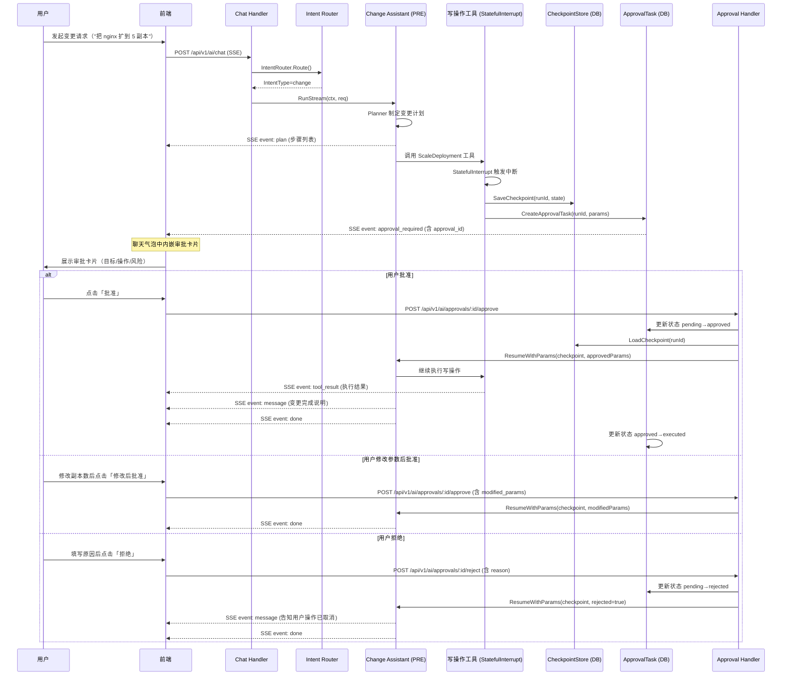

# OpsPilot AI 助手 Phase 1 & Phase 2 技术设计文档

> **文档版本**：v1.0  
> **状态**：草稿  
> **适用范围**：`internal/service/ai/`、`internal/ai/`、`web/src/pages/AI/`  
> **模块路径**：`github.com/cy77cc/OpsPilot`

---

## 目录

- [Phase 1：只读诊断 MVP 技术设计](#phase-1只读诊断-mvp-技术设计)
  - [1.1 目标与范围](#11-目标与范围)
  - [1.2 后端架构设计](#12-后端架构设计)
  - [1.3 前端设计](#13-前端设计)
  - [1.4 测试计划](#14-测试计划)
  - [1.5 成功标准](#15-成功标准)
- [Phase 2：审批式变更技术设计](#phase-2审批式变更技术设计)
  - [2.1 目标与范围](#21-目标与范围)
  - [2.2 HITL 架构设计](#22-hitlhuman-in-the-loop架构设计)
  - [2.3 后端新增接口](#23-后端新增接口)
  - [2.4 Change Assistant 设计](#24-change-assistant-设计)
  - [2.5 前端新增页面](#25-前端新增页面)
  - [2.6 安全设计](#26-安全设计)
  - [2.7 测试计划](#27-测试计划)
  - [2.8 成功标准](#28-成功标准)

---

# Phase 1：只读诊断 MVP 技术设计

## 1.1 目标与范围

### 交付能力边界

| 能力 | 描述 | 是否在范围内 |
|------|------|-------------|
| 会话管理 | 创建、列表、详情、删除对话会话 | ✅ |
| QA 问答 | 基于 RAG 的知识库问答（K8s 文档、平台文档） | ✅ |
| 集群诊断 | 基于只读 K8s 工具的智能诊断，输出结构化诊断报告 | ✅ |
| SSE 流式输出 | 实时推送 token、工具调用过程、诊断报告 | ✅ |
| 意图路由 | 自动识别用户意图（qa / diagnosis），分发到对应 Assistant | ✅ |
| 运行状态查询 | 查询 Agent 运行进度与状态 | ✅ |
| 写操作（变更） | 执行任何变更操作 | ❌（Phase 2） |
| 审批流 | 人工审批机制 | ❌（Phase 2） |
| 多集群切换 | 在对话中切换目标集群 | ❌（待规划） |

### 约束条件

- 所有 K8s 操作**只读**，工具集限定在 `internal/ai/tools/kubernetes/` 的只读工具
- Agent 最大迭代轮次：20 次
- SSE 连接超时：10 分钟（无活动自动断开）
- 单用户并发 Agent 运行上限：3 个

---

## 1.2 后端架构设计

### 1.2.1 服务层目录结构

```
internal/service/ai/
├── routes.go                  # 路由注册，挂载所有 AI 相关路由
└── handler/
    ├── chat.go                # POST /api/v1/ai/chat（SSE 流式聊天）
    ├── session.go             # 会话 CRUD（创建/列表/详情/删除）
    ├── run.go                 # GET /api/v1/ai/runs/:runId（查询运行状态）
    └── diagnosis.go           # GET /api/v1/ai/diagnosis/:runId/report（诊断报告）
```

**routes.go 路由注册示例**

```go
// Package ai 提供 AI 助手模块的 HTTP 路由注册。
package ai

import (
	"github.com/cy77cc/OpsPilot/internal/middleware"
	"github.com/gin-gonic/gin"
)

// RegisterRoutes 注册 AI 模块的所有 HTTP 路由。
//
// 参数:
//   - rg: 路由组（已挂载 /api/v1 前缀）
//   - deps: 服务依赖注入容器
//
// 返回: 无
func RegisterRoutes(rg *gin.RouterGroup, deps *Deps) {
	h := NewHandlers(deps)

	ai := rg.Group("/ai", middleware.JWTAuth())
	{
		// 会话管理
		ai.POST("/sessions", h.Session.Create)
		ai.GET("/sessions", h.Session.List)
		ai.GET("/sessions/:id", h.Session.Get)
		ai.DELETE("/sessions/:id", h.Session.Delete)

		// 聊天（SSE）
		ai.POST("/chat", h.Chat.Chat)

		// 运行状态
		ai.GET("/runs/:runId", h.Run.GetStatus)

		// 诊断报告
		ai.GET("/diagnosis/:runId/report", h.Diagnosis.GetReport)
	}
}
```

### 1.2.2 意图路由器设计

**位置**：`internal/ai/agents/intent/`

```
internal/ai/agents/intent/
├── intent.go          # IntentRouter 主体（三层策略）
├── rule_layer.go      # 规则层（关键词匹配）
├── model_layer.go     # 模型层（LLM 分类）
├── policy_layer.go    # 策略层（权限裁决）
└── types.go           # IntentRequest / IntentResult 类型定义
```

#### IntentRequest / IntentResult 结构体

```go
// Package intent 实现用户意图识别与路由分发。
//
// 架构:
//   规则层（快速匹配） → 模型层（LLM 分类） → 策略层（权限裁决）
package intent

// IntentType 枚举用户意图类型。
type IntentType string

const (
	// IntentTypeQA 问答意图，路由到 QA Assistant。
	IntentTypeQA IntentType = "qa"
	// IntentTypeDiagnosis 诊断意图，路由到 Diagnosis Assistant（只读）。
	IntentTypeDiagnosis IntentType = "diagnosis"
	// IntentTypeChange 变更意图，路由到 Change Assistant（需审批，Phase 2）。
	IntentTypeChange IntentType = "change"
	// IntentTypeUnknown 无法识别的意图，降级为 QA。
	IntentTypeUnknown IntentType = "unknown"
)

// RiskLevel 枚举操作风险等级。
type RiskLevel string

const (
	// RiskLevelNone 无风险，纯查询场景。
	RiskLevelNone RiskLevel = "none"
	// RiskLevelLow 低风险，只读诊断场景。
	RiskLevelLow RiskLevel = "low"
	// RiskLevelMedium 中等风险，无损变更（如扩容）。
	RiskLevelMedium RiskLevel = "medium"
	// RiskLevelHigh 高风险，可能影响服务稳定性。
	RiskLevelHigh RiskLevel = "high"
	// RiskLevelCritical 极高风险，如删除资源、回滚生产环境。
	RiskLevelCritical RiskLevel = "critical"
)

// ExecutionMode 枚举 Agent 执行模式。
type ExecutionMode string

const (
	// ExecutionModeDirect 直接执行，无需中断（只读场景）。
	ExecutionModeDirect ExecutionMode = "direct"
	// ExecutionModeApproval 需要人工审批后执行（写操作场景）。
	ExecutionModeApproval ExecutionMode = "approval"
)

// IntentRequest 意图识别请求。
type IntentRequest struct {
	// UserID 发起请求的用户 ID，用于策略层权限裁决。
	UserID int64 `json:"user_id"`
	// SessionID 当前会话 ID。
	SessionID int64 `json:"session_id"`
	// Message 用户输入的原始消息。
	Message string `json:"message"`
	// History 最近 N 条历史消息（用于上下文理解）。
	History []HistoryMessage `json:"history,omitempty"`
}

// HistoryMessage 表示一条历史消息。
type HistoryMessage struct {
	// Role 消息角色：user / assistant。
	Role string `json:"role"`
	// Content 消息内容。
	Content string `json:"content"`
}

// IntentResult 意图识别结果。
type IntentResult struct {
	// IntentType 识别出的意图类型。
	IntentType IntentType `json:"intent_type"`
	// RiskLevel 评估出的风险等级。
	RiskLevel RiskLevel `json:"risk_level"`
	// ExecutionMode 执行模式（直接 or 需审批）。
	ExecutionMode ExecutionMode `json:"execution_mode"`
	// Targets 操作目标（集群、命名空间、资源名等）。
	Targets IntentTargets `json:"targets"`
	// MatchedBy 命中的识别层（rule / model / policy），用于调试。
	MatchedBy string `json:"matched_by"`
	// Confidence 置信度 [0, 1]，仅模型层填充。
	Confidence float64 `json:"confidence"`
	// Reason 识别理由（可选，供前端展示）。
	Reason string `json:"reason,omitempty"`
}

// IntentTargets 意图操作目标信息。
type IntentTargets struct {
	// ClusterName 目标集群名称（从消息中提取或使用会话上下文）。
	ClusterName string `json:"cluster_name,omitempty"`
	// Namespace 目标命名空间。
	Namespace string `json:"namespace,omitempty"`
	// ResourceKind 资源类型（Pod、Deployment、Service 等）。
	ResourceKind string `json:"resource_kind,omitempty"`
	// ResourceName 资源名称。
	ResourceName string `json:"resource_name,omitempty"`
	// Operation 操作类型（get / list / logs / scale / restart 等）。
	Operation string `json:"operation,omitempty"`
}
```

#### 三层识别策略

```
用户消息
   │
   ▼
┌──────────────────────────────────────────┐
│  Layer 1：规则层（< 1ms，无 LLM 调用）     │
│  关键词/正则快速匹配 → 高置信度直接返回     │
└──────────────┬───────────────────────────┘
               │ 未命中
               ▼
┌──────────────────────────────────────────┐
│  Layer 2：模型层（调用 LLM 分类）          │
│  输出 IntentType + Confidence             │
│  Confidence < 0.7 → 降级为 qa            │
└──────────────┬───────────────────────────┘
               │
               ▼
┌──────────────────────────────────────────┐
│  Layer 3：策略层（权限裁决）               │
│  change 意图 → 校验用户是否有变更权限      │
│  无权限 → 强制降级为 diagnosis 或拒绝      │
└──────────────────────────────────────────┘
```

**规则层关键词映射**

```go
// ruleKeywords 规则层关键词映射表。
// key 为意图类型，value 为触发关键词列表（大小写不敏感）。
var ruleKeywords = map[IntentType][]string{
	IntentTypeQA: {
		"是什么", "怎么", "为什么", "如何", "什么是",
		"介绍", "解释", "文档", "帮助", "说明",
		"what is", "how to", "why", "explain",
	},
	IntentTypeDiagnosis: {
		"诊断", "排查", "分析", "检查", "查看日志",
		"pod 崩溃", "crashloopbackoff", "oomkilled",
		"异常", "报错", "故障", "不可用", "pending",
		"imagepullbackoff", "连接超时", "内存", "cpu",
		"diagnose", "troubleshoot", "analyze", "check logs",
	},
	IntentTypeChange: {
		"扩容", "缩容", "重启", "回滚", "更新镜像",
		"删除", "暂停", "恢复", "修改副本", "scale",
		"restart", "rollback", "update image", "delete",
		"deploy", "部署", "升级",
	},
}
```

**规则层实现（rule_layer.go）**

```go
// Package intent 实现用户意图识别与路由分发。
package intent

import (
	"strings"
)

// ruleLayer 规则层，通过关键词快速匹配意图。
type ruleLayer struct{}

// Match 尝试通过关键词匹配识别意图。
//
// 参数:
//   - msg: 用户输入消息
//
// 返回: 匹配到的意图类型（未匹配返回 IntentTypeUnknown）和置信度
func (r *ruleLayer) Match(msg string) (IntentType, float64) {
	lower := strings.ToLower(msg)

	// 变更意图优先级最高（规避误识别为诊断）
	for _, kw := range ruleKeywords[IntentTypeChange] {
		if strings.Contains(lower, kw) {
			return IntentTypeChange, 0.95
		}
	}
	for _, kw := range ruleKeywords[IntentTypeDiagnosis] {
		if strings.Contains(lower, kw) {
			return IntentTypeDiagnosis, 0.90
		}
	}
	for _, kw := range ruleKeywords[IntentTypeQA] {
		if strings.Contains(lower, kw) {
			return IntentTypeQA, 0.85
		}
	}
	return IntentTypeUnknown, 0.0
}
```

### 1.2.3 QA Assistant 设计

#### 调用链

```
POST /api/v1/ai/chat
        │
        ▼
  chat.go Handler
        │  解析 ChatRequest，校验 sessionID
        ▼
  IntentRouter.Route()
        │  → IntentType: qa
        ▼
  QAAssistant.Run(ctx, message)
        │
        ├─→ RAG Retriever（internal/rag/retriever.go）
        │       ├─ 向量检索（Milvus）
        │       └─ 返回相关文档片段（TopK=5）
        │
        ├─→ 构建 Prompt（system + context + user）
        │
        └─→ LLM Stream（chatmodel）
                │
                ▼
         SSE 流式写入（event: message）
```

**QA Assistant 位置**：`internal/ai/agents/qa/qa.go`

```go
// Package qa 实现基于 RAG 的知识库问答助手。
package qa

import (
	"context"

	"github.com/cy77cc/OpsPilot/internal/rag"
	"github.com/cloudwego/eino/schema"
)

// QAAssistant 知识库问答助手，结合 RAG 检索增强回答质量。
type QAAssistant struct {
	retriever  rag.Retriever
	chatModel  ChatModel
}

// StreamResult QA 流式结果。
type StreamResult struct {
	// TokenCh 文本 token 流。
	TokenCh <-chan string
	// ErrCh 错误流。
	ErrCh <-chan error
}

// Run 执行 QA 问答，返回流式结果。
//
// 参数:
//   - ctx: 上下文（含超时控制）
//   - userID: 用户 ID（用于日志追踪）
//   - sessionID: 会话 ID
//   - message: 用户消息
//   - history: 历史消息列表
//
// 返回: StreamResult 和 error（启动失败时返回非 nil error）
func (a *QAAssistant) Run(
	ctx context.Context,
	userID, sessionID int64,
	message string,
	history []*schema.Message,
) (*StreamResult, error) {
	// 1. RAG 检索相关文档
	docs, err := a.retriever.Retrieve(ctx, message)
	if err != nil {
		// 检索失败不阻断，降级为无上下文回答
		docs = nil
	}

	// 2. 构建 Prompt
	prompt := buildQAPrompt(message, docs, history)

	// 3. 调用 LLM 流式输出
	return a.streamGenerate(ctx, prompt)
}
```

**Prompt 设计要点**

```
System Prompt：
你是 OpsPilot 平台的 K8s 专家助手。
- 基于提供的知识库文档回答用户问题
- 如果知识库中没有相关内容，明确告知用户
- 回答简洁清晰，代码示例使用 markdown 格式
- 不要凭空编造命令或配置，确保准确性

Context（RAG 检索结果）：
<context>
{retrieved_documents}
</context>

User Question：{user_message}
```

### 1.2.4 Diagnosis Assistant 设计

#### 调用链

```
POST /api/v1/ai/chat
        │
        ▼
  chat.go Handler
        │
        ▼
  IntentRouter.Route()
        │  → IntentType: diagnosis
        ▼
  DiagnosisAssistant.RunAsync(ctx, req)
        │  异步启动，立即返回 runId
        ▼
  NewPlanExecute(ctx, deps)  ← internal/ai/agents/planexecute/
        │
        ├─ Planner：制定诊断计划
        │
        ├─ Executor：执行只读工具
        │   ├─ K8sQuery        ← 查询资源状态
        │   ├─ K8sListResources ← 列举资源
        │   ├─ K8sGetEvents    ← 获取事件
        │   ├─ K8sLogs         ← 获取日志摘要
        │   └─ K8sGetPodLogs   ← 获取特定 Pod 日志
        │
        └─ Replanner：根据工具结果调整计划
                │
                ▼
         DiagnosisReportBuilder.Build()
                │
                ▼
         SSE event: diagnosis_report
```

#### 诊断工具集（只读）

| 工具名 | 功能 | 输入 | 输出 |
|--------|------|------|------|
| `K8sQuery` | 查询单个资源详情 | cluster, kind, ns, name | 资源 JSON |
| `K8sListResources` | 列举资源（支持 label selector） | cluster, kind, ns, selector | 资源列表 |
| `K8sGetEvents` | 获取命名空间事件 | cluster, ns, kind, name | 事件列表 |
| `K8sLogs` | 获取日志摘要 | cluster, ns, pod, container | 日志摘要 |
| `K8sGetPodLogs` | 获取完整 Pod 日志（带行数限制） | cluster, ns, pod, tail | 日志文本 |

#### DiagnosisReport 结构体

```go
// Package diagnosis 实现 K8s 集群智能诊断能力。
package diagnosis

import "time"

// DiagnosisReport 诊断报告，包含完整的诊断分析结果。
type DiagnosisReport struct {
	// RunID 对应的 Agent 运行 ID。
	RunID string `json:"run_id"`
	// SessionID 所属会话 ID。
	SessionID int64 `json:"session_id"`
	// CreatedAt 报告生成时间。
	CreatedAt time.Time `json:"created_at"`
	// Target 诊断目标描述。
	Target DiagnosisTarget `json:"target"`
	// Summary 诊断摘要（1-3 句话概括问题）。
	Summary string `json:"summary"`
	// Evidence 诊断证据列表（工具调用收集的原始数据摘要）。
	Evidence []DiagnosisEvidence `json:"evidence"`
	// RootCause 根因分析。
	RootCause DiagnosisRootCause `json:"root_cause"`
	// Suggestions 处理建议列表（Phase 1 仅展示，Phase 2 可一键执行）。
	Suggestions []DiagnosisSuggestion `json:"suggestions"`
	// Severity 问题严重程度。
	Severity DiagnosisSeverity `json:"severity"`
}

// DiagnosisSeverity 诊断严重程度。
type DiagnosisSeverity string

const (
	DiagnosisSeverityInfo     DiagnosisSeverity = "info"
	DiagnosisSeverityWarning  DiagnosisSeverity = "warning"
	DiagnosisSeverityCritical DiagnosisSeverity = "critical"
)

// DiagnosisTarget 诊断目标。
type DiagnosisTarget struct {
	ClusterName  string `json:"cluster_name"`
	Namespace    string `json:"namespace,omitempty"`
	ResourceKind string `json:"resource_kind,omitempty"`
	ResourceName string `json:"resource_name,omitempty"`
}

// DiagnosisEvidence 诊断证据（工具调用收集的数据）。
type DiagnosisEvidence struct {
	// ToolName 产生该证据的工具名称。
	ToolName string `json:"tool_name"`
	// Title 证据标题（如"Pod nginx-xxx 状态异常"）。
	Title string `json:"title"`
	// Content 证据内容（截断后的关键信息）。
	Content string `json:"content"`
	// Severity 该条证据的严重程度。
	Severity string `json:"severity"`
}

// DiagnosisRootCause 根因分析。
type DiagnosisRootCause struct {
	// Category 根因分类（配置错误/资源不足/镜像问题/网络问题/依赖故障）。
	Category string `json:"category"`
	// Description 根因描述。
	Description string `json:"description"`
	// Confidence 根因置信度 [0, 1]。
	Confidence float64 `json:"confidence"`
}

// DiagnosisSuggestion 诊断建议。
type DiagnosisSuggestion struct {
	// Priority 优先级（1=最高）。
	Priority int `json:"priority"`
	// Action 建议操作描述。
	Action string `json:"action"`
	// Command 可执行的命令示例（kubectl 等）。
	Command string `json:"command,omitempty"`
	// Executable Phase 2 中是否可通过 AI 直接执行（Phase 1 固定为 false）。
	Executable bool `json:"executable"`
	// RiskLevel 执行该建议的风险等级（Phase 2 使用）。
	RiskLevel string `json:"risk_level,omitempty"`
}
```

### 1.2.5 API 接口设计

#### 创建会话

| 字段 | 值 |
|------|----|
| Method | `POST` |
| Path | `/api/v1/ai/sessions` |
| Auth | JWT |

**Request Body**

```json
{
  "title": "诊断 prod 集群 nginx 问题",
  "cluster_name": "prod-cluster"
}
```

**Response Body**

```json
{
  "code": 1000,
  "msg": "请求成功",
  "data": {
    "id": 123,
    "title": "诊断 prod 集群 nginx 问题",
    "cluster_name": "prod-cluster",
    "created_at": "2025-01-01T10:00:00Z",
    "updated_at": "2025-01-01T10:00:00Z"
  }
}
```

---

#### 会话列表

| 字段 | 值 |
|------|----|
| Method | `GET` |
| Path | `/api/v1/ai/sessions` |
| Auth | JWT |

**Query Params**

| 参数 | 类型 | 必填 | 说明 |
|------|------|------|------|
| `page` | int | 否 | 默认 1 |
| `page_size` | int | 否 | 默认 20，最大 100 |

**Response Body**

```json
{
  "code": 1000,
  "msg": "请求成功",
  "data": {
    "total": 50,
    "items": [
      {
        "id": 123,
        "title": "诊断 prod 集群 nginx 问题",
        "cluster_name": "prod-cluster",
        "last_message": "Pod 出现 OOMKilled 问题已诊断完成",
        "message_count": 6,
        "created_at": "2025-01-01T10:00:00Z",
        "updated_at": "2025-01-01T10:05:00Z"
      }
    ]
  }
}
```

---

#### 会话详情（含消息列表）

| 字段 | 值 |
|------|----|
| Method | `GET` |
| Path | `/api/v1/ai/sessions/:id` |
| Auth | JWT |

**Response Body**

```json
{
  "code": 1000,
  "msg": "请求成功",
  "data": {
    "session": {
      "id": 123,
      "title": "诊断 prod 集群 nginx 问题",
      "cluster_name": "prod-cluster"
    },
    "messages": [
      {
        "id": 1,
        "role": "user",
        "content": "帮我诊断一下 prod 集群 nginx deployment 的问题",
        "created_at": "2025-01-01T10:00:00Z"
      },
      {
        "id": 2,
        "role": "assistant",
        "content": "",
        "blocks": [
          {
            "type": "text",
            "content": "我来分析 nginx deployment 的问题..."
          },
          {
            "type": "tool_call",
            "tool_name": "K8sQuery",
            "input": {"kind": "Deployment", "name": "nginx"},
            "output": {"status": "..."}
          },
          {
            "type": "diagnosis_report",
            "report": {}
          }
        ],
        "created_at": "2025-01-01T10:00:05Z"
      }
    ]
  }
}
```

---

#### 删除会话

| 字段 | 值 |
|------|----|
| Method | `DELETE` |
| Path | `/api/v1/ai/sessions/:id` |
| Auth | JWT |

**Response Body**

```json
{ "code": 1000, "msg": "请求成功", "data": null }
```

---

#### SSE 聊天（流式）

| 字段 | 值 |
|------|----|
| Method | `POST` |
| Path | `/api/v1/ai/chat` |
| Auth | JWT |
| Content-Type | `application/json` |
| Response | `text/event-stream` |

**Request Body**

```json
{
  "session_id": 123,
  "message": "帮我诊断一下 prod 集群 default namespace 下 nginx deployment 的问题",
  "cluster_name": "prod-cluster"
}
```

**Response**：SSE 流，见 1.2.6 小节。

**首先同步返回 runId（在 SSE 第一条消息中携带）**

---

#### 查询运行状态

| 字段 | 值 |
|------|----|
| Method | `GET` |
| Path | `/api/v1/ai/runs/:runId` |
| Auth | JWT |

**Response Body**

```json
{
  "code": 1000,
  "msg": "请求成功",
  "data": {
    "run_id": "run_abc123",
    "session_id": 123,
    "status": "running",
    "intent_type": "diagnosis",
    "iteration": 3,
    "started_at": "2025-01-01T10:00:00Z",
    "finished_at": null
  }
}
```

`status` 枚举值：`pending` / `running` / `completed` / `failed` / `interrupted`（Phase 2 审批中断）

---

#### 获取诊断报告

| 字段 | 值 |
|------|----|
| Method | `GET` |
| Path | `/api/v1/ai/diagnosis/:runId/report` |
| Auth | JWT |

**Response Body**

```json
{
  "code": 1000,
  "msg": "请求成功",
  "data": {
    "run_id": "run_abc123",
    "target": {
      "cluster_name": "prod-cluster",
      "namespace": "default",
      "resource_kind": "Deployment",
      "resource_name": "nginx"
    },
    "severity": "critical",
    "summary": "nginx Deployment 存在 OOMKilled 问题，内存限制设置过低（128Mi），Pod 反复重启已达 15 次。",
    "evidence": [
      {
        "tool_name": "K8sQuery",
        "title": "Deployment nginx 副本异常",
        "content": "availableReplicas: 0 / 3，Pod 状态 CrashLoopBackOff",
        "severity": "critical"
      },
      {
        "tool_name": "K8sGetEvents",
        "title": "OOMKilled 事件",
        "content": "OOMKilled 事件在过去 1 小时内出现 15 次",
        "severity": "critical"
      }
    ],
    "root_cause": {
      "category": "资源不足",
      "description": "容器内存限制 128Mi 低于实际工作负载需求，JVM 堆外内存导致 OOM。",
      "confidence": 0.92
    },
    "suggestions": [
      {
        "priority": 1,
        "action": "将 nginx 容器内存限制调整为 512Mi",
        "command": "kubectl set resources deployment/nginx -c=nginx --limits=memory=512Mi -n default",
        "executable": false,
        "risk_level": "medium"
      }
    ],
    "created_at": "2025-01-01T10:05:00Z"
  }
}
```

---

### 1.2.6 SSE 流式协议设计

所有 SSE 消息遵循标准 `text/event-stream` 格式：

```
event: <event_type>
data: <JSON 字符串>

```

#### Event 类型完整定义

| Event 类型 | 触发时机 | data 结构 |
|-----------|---------|----------|
| `init` | 连接建立后首条消息 | `{"run_id": "...", "intent_type": "diagnosis"}` |
| `message` | LLM 输出文本 token | `{"content": "正在分析...", "index": 0}` |
| `thinking` | LLM 思考过程（CoT） | `{"content": "需要先检查 Pod 状态..."}` |
| `tool_call` | 工具调用开始 | `{"tool_name": "K8sQuery", "input": {...}, "call_id": "c1"}` |
| `tool_result` | 工具调用结束 | `{"call_id": "c1", "tool_name": "K8sQuery", "output": {...}, "duration_ms": 120}` |
| `plan` | PRE 规划阶段输出计划 | `{"steps": ["检查 Pod 状态", "查看事件", "分析日志"]}` |
| `replan` | 重新规划 | `{"reason": "发现新的线索", "steps": [...]}` |
| `diagnosis_report` | 诊断完成，输出结构化报告 | `DiagnosisReport` 完整 JSON |
| `done` | 运行完成 | `{"run_id": "...", "total_tokens": 1580, "duration_ms": 8200}` |
| `error` | 运行失败 | `{"code": 3000, "message": "LLM 调用超时"}` |

#### SSE 流示例（诊断场景）

```
event: init
data: {"run_id":"run_abc123","intent_type":"diagnosis","session_id":123}

event: plan
data: {"steps":["查询 nginx Deployment 状态","获取相关 Pod 事件","分析最近日志"]}

event: thinking
data: {"content":"首先需要查看 nginx Deployment 的当前副本状态和条件..."}

event: tool_call
data: {"call_id":"c1","tool_name":"K8sQuery","input":{"cluster":"prod-cluster","kind":"Deployment","namespace":"default","name":"nginx"}}

event: tool_result
data: {"call_id":"c1","tool_name":"K8sQuery","output":{"available_replicas":0,"ready_replicas":0},"duration_ms":95}

event: tool_call
data: {"call_id":"c2","tool_name":"K8sGetEvents","input":{"cluster":"prod-cluster","namespace":"default","name":"nginx"}}

event: tool_result
data: {"call_id":"c2","tool_name":"K8sGetEvents","output":{"events":[{"reason":"OOMKilled","count":15}]},"duration_ms":78}

event: message
data: {"content":"经过分析，nginx Deployment 存在严重的内存不足问题。","index":0}

event: message
data: {"content":"以下是完整的诊断报告：","index":1}

event: diagnosis_report
data: {"run_id":"run_abc123","severity":"critical","summary":"...","evidence":[...],"root_cause":{...},"suggestions":[...]}

event: done
data: {"run_id":"run_abc123","total_tokens":1580,"duration_ms":8200}
```

#### SSE Handler 实现要点

```go
// Chat 处理 SSE 流式聊天请求。
//
// 参数:
//   - c: Gin 上下文
//
// 返回: 无（通过 SSE 流式写入响应）
//
// 副作用: 异步启动 Agent，持续写入 SSE 事件直至完成或超时
func (h *ChatHandler) Chat(c *gin.Context) {
	var req ChatRequest
	if err := c.ShouldBindJSON(&req); err != nil {
		httpx.BindErr(c, err)
		return
	}

	// 设置 SSE 响应头
	c.Header("Content-Type", "text/event-stream")
	c.Header("Cache-Control", "no-cache")
	c.Header("Connection", "keep-alive")
	c.Header("X-Accel-Buffering", "no") // 禁止 Nginx 缓冲

	// 创建 SSE 写入器
	writer := NewSSEWriter(c.Writer)

	// 异步运行 Agent，通过 channel 推送事件
	ctx, cancel := context.WithTimeout(c.Request.Context(), 10*time.Minute)
	defer cancel()

	if err := h.orchestrator.RunStream(ctx, req, writer); err != nil {
		_ = writer.WriteError(err)
	}
}
```

### 1.2.7 数据库变更

#### 已有模型（无需新建表）

| 模型 | 表名 | 用途 |
|------|------|------|
| `AIChatSession` | `ai_chat_sessions` | 会话 |
| `AIChatMessage` | `ai_chat_messages` | 消息 |
| `AIChatTurn` | `ai_chat_turns` | 单轮对话 |
| `AIChatBlock` | `ai_chat_blocks` | 消息块（text/tool_call/report） |
| `AIExecution` | `ai_executions` | 运行记录（含 token 统计） |
| `AICheckPoint` | `ai_checkpoints` | Eino ADK Checkpoint |
| `AITraceSpan` | `ai_trace_spans` | 链路追踪 |

#### Phase 1 新增 Migration

**Migration 文件**：`storage/migration/20250101_add_ai_indexes.sql`

```sql
-- 为 ai_chat_sessions 增加用户 ID 查询索引
ALTER TABLE ai_chat_sessions ADD INDEX idx_user_id_updated (user_id, updated_at DESC);

-- 为 ai_chat_messages 增加会话 ID + 创建时间索引（消息分页查询）
ALTER TABLE ai_chat_messages ADD INDEX idx_session_id_created (session_id, created_at ASC);

-- 为 ai_executions 增加 run_id 唯一索引（运行状态查询）
ALTER TABLE ai_executions ADD UNIQUE INDEX uniq_run_id (run_id);

-- 为 ai_chat_blocks 增加消息 ID 索引（消息详情查询）
ALTER TABLE ai_chat_blocks ADD INDEX idx_message_id (message_id);
```

**Migration 文件**：`storage/migration/20250101_add_diagnosis_report.sql`

```sql
-- 新增诊断报告表（独立于 ai_chat_blocks，便于直接按 run_id 查询）
CREATE TABLE ai_diagnosis_reports (
    id          BIGINT UNSIGNED NOT NULL AUTO_INCREMENT,
    run_id      VARCHAR(64)     NOT NULL COMMENT 'Agent 运行 ID',
    session_id  BIGINT UNSIGNED NOT NULL,
    user_id     BIGINT UNSIGNED NOT NULL,
    cluster_name VARCHAR(128)   NOT NULL DEFAULT '',
    namespace    VARCHAR(128)   NOT NULL DEFAULT '',
    resource_kind VARCHAR(64)   NOT NULL DEFAULT '',
    resource_name VARCHAR(128)  NOT NULL DEFAULT '',
    severity     VARCHAR(32)    NOT NULL DEFAULT 'info',
    report_json  MEDIUMTEXT     NOT NULL COMMENT '完整诊断报告 JSON',
    created_at   DATETIME(3)    NOT NULL DEFAULT CURRENT_TIMESTAMP(3),
    PRIMARY KEY (id),
    UNIQUE KEY uniq_run_id (run_id),
    KEY idx_session_id (session_id),
    KEY idx_user_id_created (user_id, created_at DESC)
) ENGINE=InnoDB DEFAULT CHARSET=utf8mb4 COMMENT='AI 诊断报告';
```

---

## 1.3 前端设计

### 1.3.1 页面结构

```
web/src/
├── pages/AI/
│   ├── Chat/                        # 主聊天页（新建）
│   │   ├── index.tsx                # 页面入口，布局容器（左侧会话列表 + 右侧聊天区）
│   │   ├── SessionList.tsx          # 会话列表（含搜索、新建、删除）
│   │   ├── MessageList.tsx          # 消息列表（虚拟滚动，支持流式追加）
│   │   ├── MessageItem.tsx          # 单条消息渲染（user/assistant 气泡）
│   │   ├── AssistantMessage.tsx     # AI 消息（含 blocks 渲染分发）
│   │   ├── ToolCallBlock.tsx        # 工具调用气泡（可折叠展开）
│   │   ├── DiagnosisReportCard.tsx  # 诊断报告内嵌卡片（含折叠）
│   │   ├── InputBar.tsx             # 输入栏（含发送、停止、集群选择）
│   │   ├── ThinkingIndicator.tsx    # 思考中动画指示器
│   │   └── hooks/
│   │       ├── useSSEChat.ts        # SSE 连接管理 Hook
│   │       └── useSession.ts        # 会话 CRUD Hook
│   └── DiagnosisReport/             # 诊断报告独立页（从消息跳转）
│       └── index.tsx                # 完整报告展示（含时间线、证据列表）
├── api/modules/
│   └── ai.ts                        # AI 模块 API 客户端（新建）
└── components/AI/
    ├── SeverityTag.tsx              # 严重程度标签（info/warning/critical）
    └── RiskLevelBadge.tsx           # 风险等级徽章（Phase 2 使用）
```

### 1.3.2 SSE 消费设计

#### useSSEChat Hook

```typescript
// web/src/pages/AI/Chat/hooks/useSSEChat.ts

import { useRef, useState, useCallback } from 'react';
import type { DiagnosisReport, SSEEvent, RunStatus } from '@/api/modules/ai';

interface UseSSEChatOptions {
  sessionId: number;
  onToken: (token: string, index: number) => void;
  onToolCall: (event: SSEEvent<'tool_call'>) => void;
  onToolResult: (event: SSEEvent<'tool_result'>) => void;
  onPlan: (steps: string[]) => void;
  onDiagnosisReport: (report: DiagnosisReport) => void;
  onDone: (runId: string) => void;
  onError: (msg: string) => void;
}

export function useSSEChat(options: UseSSEChatOptions) {
  const [isStreaming, setIsStreaming] = useState(false);
  const [runId, setRunId] = useState<string | null>(null);
  const abortRef = useRef<AbortController | null>(null);

  const sendMessage = useCallback(
    async (message: string, clusterName?: string) => {
      // 中止上一次未完成的流
      abortRef.current?.abort();
      const ctrl = new AbortController();
      abortRef.current = ctrl;

      setIsStreaming(true);

      try {
        const resp = await fetch('/api/v1/ai/chat', {
          method: 'POST',
          headers: {
            'Content-Type': 'application/json',
            Authorization: `Bearer ${getToken()}`,
          },
          body: JSON.stringify({
            session_id: options.sessionId,
            message,
            cluster_name: clusterName,
          }),
          signal: ctrl.signal,
        });

        if (!resp.ok || !resp.body) {
          throw new Error(`HTTP ${resp.status}`);
        }

        const reader = resp.body.getReader();
        const decoder = new TextDecoder();
        let buffer = '';

        while (true) {
          const { done, value } = await reader.read();
          if (done) break;

          buffer += decoder.decode(value, { stream: true });
          const lines = buffer.split('\n');
          buffer = lines.pop() ?? '';

          let currentEvent = '';
          for (const line of lines) {
            if (line.startsWith('event: ')) {
              currentEvent = line.slice(7).trim();
            } else if (line.startsWith('data: ')) {
              const payload = JSON.parse(line.slice(6));
              dispatchSSEEvent(currentEvent, payload, options, setRunId);
            }
          }
        }
      } catch (err: unknown) {
        if ((err as Error).name !== 'AbortError') {
          options.onError((err as Error).message);
        }
      } finally {
        setIsStreaming(false);
      }
    },
    [options]
  );

  const stopStreaming = useCallback(() => {
    abortRef.current?.abort();
    setIsStreaming(false);
  }, []);

  return { sendMessage, stopStreaming, isStreaming, runId };
}

// dispatchSSEEvent 根据事件类型分发到对应回调。
function dispatchSSEEvent(
  eventType: string,
  payload: unknown,
  options: UseSSEChatOptions,
  setRunId: (id: string) => void
) {
  switch (eventType) {
    case 'init':
      setRunId((payload as { run_id: string }).run_id);
      break;
    case 'message':
      options.onToken(
        (payload as { content: string; index: number }).content,
        (payload as { content: string; index: number }).index
      );
      break;
    case 'tool_call':
      options.onToolCall(payload as SSEEvent<'tool_call'>);
      break;
    case 'tool_result':
      options.onToolResult(payload as SSEEvent<'tool_result'>);
      break;
    case 'plan':
      options.onPlan((payload as { steps: string[] }).steps);
      break;
    case 'diagnosis_report':
      options.onDiagnosisReport(payload as DiagnosisReport);
      break;
    case 'done':
      options.onDone((payload as { run_id: string }).run_id);
      break;
    case 'error':
      options.onError((payload as { message: string }).message);
      break;
  }
}
```

#### ToolCallBlock 组件设计

- 默认折叠，展示工具名称和加载动画（调用中）
- 完成后展示执行耗时（duration_ms）和结果摘要
- 点击展开查看完整 input/output（JSON 高亮展示）

#### 流式 Token 追加渲染

使用 `useState` 累积 token，每次 `onToken` 回调时拼接字符串并触发重渲染。为避免高频渲染性能问题，使用 `requestAnimationFrame` 批量合并 50ms 内的 token 更新。

### 1.3.3 新增 API 模块

```typescript
// web/src/api/modules/ai.ts

import request from '@/utils/request';

// ===================== 类型定义 =====================

export type IntentType = 'qa' | 'diagnosis' | 'change' | 'unknown';
export type RiskLevel = 'none' | 'low' | 'medium' | 'high' | 'critical';
export type RunStatus = 'pending' | 'running' | 'completed' | 'failed' | 'interrupted';
export type DiagnosisSeverity = 'info' | 'warning' | 'critical';

export interface AISession {
  id: number;
  title: string;
  cluster_name: string;
  last_message?: string;
  message_count: number;
  created_at: string;
  updated_at: string;
}

export interface AIMessageBlock {
  type: 'text' | 'tool_call' | 'tool_result' | 'diagnosis_report' | 'approval_required';
  content?: string;
  tool_name?: string;
  input?: Record<string, unknown>;
  output?: Record<string, unknown>;
  report?: DiagnosisReport;
  duration_ms?: number;
}

export interface AIMessage {
  id: number;
  role: 'user' | 'assistant';
  content: string;
  blocks?: AIMessageBlock[];
  created_at: string;
}

export interface DiagnosisEvidence {
  tool_name: string;
  title: string;
  content: string;
  severity: string;
}

export interface DiagnosisRootCause {
  category: string;
  description: string;
  confidence: number;
}

export interface DiagnosisSuggestion {
  priority: number;
  action: string;
  command?: string;
  executable: boolean;
  risk_level?: string;
}

export interface DiagnosisReport {
  run_id: string;
  target: {
    cluster_name: string;
    namespace?: string;
    resource_kind?: string;
    resource_name?: string;
  };
  severity: DiagnosisSeverity;
  summary: string;
  evidence: DiagnosisEvidence[];
  root_cause: DiagnosisRootCause;
  suggestions: DiagnosisSuggestion[];
  created_at: string;
}

export interface AIRunInfo {
  run_id: string;
  session_id: number;
  status: RunStatus;
  intent_type: IntentType;
  iteration: number;
  started_at: string;
  finished_at: string | null;
}

// SSE 事件类型映射
export interface SSEEventMap {
  init: { run_id: string; intent_type: IntentType; session_id: number };
  message: { content: string; index: number };
  thinking: { content: string };
  tool_call: { call_id: string; tool_name: string; input: Record<string, unknown> };
  tool_result: { call_id: string; tool_name: string; output: Record<string, unknown>; duration_ms: number };
  plan: { steps: string[] };
  replan: { reason: string; steps: string[] };
  diagnosis_report: DiagnosisReport;
  done: { run_id: string; total_tokens: number; duration_ms: number };
  error: { code: number; message: string };
}

export type SSEEvent<K extends keyof SSEEventMap> = SSEEventMap[K];

// ===================== 会话 API =====================

export interface CreateSessionParams {
  title: string;
  cluster_name?: string;
}

export interface ListSessionsParams {
  page?: number;
  page_size?: number;
}

export interface ListSessionsResponse {
  total: number;
  items: AISession[];
}

export interface SessionDetailResponse {
  session: AISession;
  messages: AIMessage[];
}

/** 创建 AI 会话 */
export const createSession = (params: CreateSessionParams) =>
  request.post<AISession>('/ai/sessions', params);

/** 获取会话列表 */
export const listSessions = (params?: ListSessionsParams) =>
  request.get<ListSessionsResponse>('/ai/sessions', { params });

/** 获取会话详情（含消息） */
export const getSession = (id: number) =>
  request.get<SessionDetailResponse>(`/ai/sessions/${id}`);

/** 删除会话 */
export const deleteSession = (id: number) =>
  request.delete(`/ai/sessions/${id}`);

// ===================== 运行状态 API =====================

/** 查询 Agent 运行状态 */
export const getRunStatus = (runId: string) =>
  request.get<AIRunInfo>(`/ai/runs/${runId}`);

/** 获取诊断报告 */
export const getDiagnosisReport = (runId: string) =>
  request.get<DiagnosisReport>(`/ai/diagnosis/${runId}/report`);
```

---

## 1.4 测试计划

### 单元测试

| 测试文件 | 覆盖点 |
|---------|--------|
| `internal/ai/agents/intent/rule_layer_test.go` | 规则层关键词命中、边界词、大小写不敏感 |
| `internal/ai/agents/intent/intent_test.go` | 三层路由完整流程（mock 模型层） |
| `internal/ai/agents/qa/qa_test.go` | RAG 检索失败降级、Prompt 构建 |
| `internal/ai/agents/diagnosis/report_builder_test.go` | DiagnosisReport 各字段生成逻辑 |
| `internal/service/ai/handler/session_test.go` | 会话 CRUD Handler（httptest） |
| `internal/service/ai/handler/chat_test.go` | SSE 响应头、首条 init 事件 |

### 集成测试

| 场景 | 验证内容 |
|------|---------|
| QA 完整链路 | message → intent(qa) → RAG → LLM → SSE done |
| Diagnosis 完整链路 | message → intent(diagnosis) → PRE agent → 只读工具 → report |
| 会话持久化 | Chat 完成后 messages 写入 DB，`GET /sessions/:id` 可查 |
| 运行状态同步 | SSE done 后 `GET /runs/:runId` status=completed |

### E2E 场景

| 场景 | 输入 | 预期输出 |
|------|------|---------|
| OOMKilled 诊断 | "prod 集群 nginx pod 一直重启" | diagnosis_report 含 OOMKilled 根因 |
| K8s 概念问答 | "什么是 HPA？" | 流式回答，无工具调用 |
| 混合意图 | "帮我看看 default 下有哪些 pod 在 pending" | diagnosis 意图，列举 pending pod |
| 会话续问 | 上一条诊断后追问 "怎么修复？" | 基于上下文给出修复建议 |

---

## 1.5 成功标准

| 标准 | 验收指标 |
|------|---------|
| SSE 首 token 延迟 | P95 < 3s（从请求到第一条 `message` 事件） |
| 诊断准确率 | 预设 10 个已知问题场景，RootCause 分类准确率 ≥ 80% |
| 会话功能完整 | 创建/列表/详情/删除均返回正确数据，历史消息可完整还原 |
| SSE 稳定性 | 连续运行 50 次诊断（mock K8s），无连接泄漏，无 goroutine 泄漏 |
| 工具调用可见性 | 每次 tool_call 均有对应 tool_result 事件，call_id 一一匹配 |
| 只读保证 | 全量扫描工具代码，确认无任何写操作（kubectl apply/delete/patch 等） |
| 单元测试覆盖率 | `internal/ai/` 包覆盖率 ≥ 40%（`make test-coverage-check`） |
| 并发安全 | 3 个并发会话同时诊断，无数据串扰，响应独立 |

---

# Phase 2：审批式变更技术设计

## 2.1 目标与范围

### 交付能力边界

| 能力 | 描述 | 是否在范围内 |
|------|------|-------------|
| Change Assistant | 基于 PRE 架构的变更执行 Agent | ✅ |
| 写操作工具集 | Scale/Restart/Rollback/DeletePod 等 K8s 写操作 | ✅ |
| HITL 审批流 | 写操作前强制人工确认，支持修改参数后批准 | ✅ |
| 审批中心 | 待审批列表、审批详情、批准/拒绝操作 | ✅ |
| Checkpoint 持久化 | Agent 状态持久化，支持跨进程恢复 | ✅ |
| 聊天内嵌审批卡片 | SSE 推送 approval_required 事件，聊天中内嵌卡片 | ✅ |
| 超时自动过期 | pending 超时（默认 24h）自动拒绝 | ✅ |
| 批量变更 | 一次会话执行多个资源的批量变更 | ❌（待规划） |
| 变更预演（Dry Run） | 变更前模拟执行结果 | ❌（待规划） |

### 约束条件

- 写操作工具**必须**通过 HITL 审批，不允许绕过
- 同一 interrupt 只能被 Resume 一次（幂等）
- Critical 风险操作审批超时时间为 2h，其余为 24h
- 审批人必须具备目标集群的 `cluster:write` 权限

---

## 2.2 HITL（Human-in-the-Loop）架构设计

### 2.2.1 核心流程



### 2.2.2 可中断写操作工具设计

**位置**：`internal/ai/tools/kubernetes/write_tools.go`

每个写操作工具通过包装 Eino ADK 的 `InvokableReviewEditTool`（或等价的 `StatefulInterruptTool`）实现"调用即中断、审批后继续"语义。

#### 工具输入/输出结构体

```go
// Package kubernetes 提供 K8s 集群操作工具集，包含只读和写操作两类。
package kubernetes

import "time"

// ---- ScaleDeployment ----

// ScaleDeploymentInput 扩缩容 Deployment 的输入参数。
type ScaleDeploymentInput struct {
	// ClusterName 目标集群名称。
	ClusterName string `json:"cluster_name"`
	// Namespace 目标命名空间。
	Namespace string `json:"namespace"`
	// DeploymentName Deployment 名称。
	DeploymentName string `json:"deployment_name"`
	// Replicas 目标副本数（1-100）。
	Replicas int32 `json:"replicas"`
	// Reason AI 建议执行此操作的原因（展示给审批人）。
	Reason string `json:"reason"`
}

// ScaleDeploymentOutput 扩缩容操作结果。
type ScaleDeploymentOutput struct {
	// Success 操作是否成功。
	Success bool `json:"success"`
	// PreviousReplicas 操作前的副本数。
	PreviousReplicas int32 `json:"previous_replicas"`
	// CurrentReplicas 操作后的副本数。
	CurrentReplicas int32 `json:"current_replicas"`
	// Message 操作结果描述。
	Message string `json:"message"`
}

// ---- RestartDeployment ----

// RestartDeploymentInput 重启 Deployment 的输入参数（通过更新 annotation 触发滚动重启）。
type RestartDeploymentInput struct {
	ClusterName    string `json:"cluster_name"`
	Namespace      string `json:"namespace"`
	DeploymentName string `json:"deployment_name"`
	// Reason 重启原因（必填，展示给审批人）。
	Reason string `json:"reason"`
}

// RestartDeploymentOutput 重启操作结果。
type RestartDeploymentOutput struct {
	Success     bool      `json:"success"`
	RestartedAt time.Time `json:"restarted_at"`
	Message     string    `json:"message"`
}

// ---- RollbackDeployment ----

// RollbackDeploymentInput 回滚 Deployment 的输入参数。
type RollbackDeploymentInput struct {
	ClusterName    string `json:"cluster_name"`
	Namespace      string `json:"namespace"`
	DeploymentName string `json:"deployment_name"`
	// TargetRevision 目标版本号（0 表示回滚到上一版本）。
	TargetRevision int64 `json:"target_revision"`
	Reason         string `json:"reason"`
}

// RollbackDeploymentOutput 回滚操作结果。
type RollbackDeploymentOutput struct {
	Success          bool   `json:"success"`
	PreviousRevision int64  `json:"previous_revision"`
	CurrentRevision  int64  `json:"current_revision"`
	Message          string `json:"message"`
}

// ---- DeletePod ----

// DeletePodInput 删除 Pod 的输入参数。
type DeletePodInput struct {
	ClusterName string `json:"cluster_name"`
	Namespace   string `json:"namespace"`
	PodName     string `json:"pod_name"`
	// GracePeriodSeconds 优雅终止等待秒数（0 表示强制删除）。
	GracePeriodSeconds int64  `json:"grace_period_seconds"`
	Reason             string `json:"reason"`
}

// DeletePodOutput 删除 Pod 操作结果。
type DeletePodOutput struct {
	Success bool   `json:"success"`
	Message string `json:"message"`
}
```

#### StatefulInterrupt 集成机制

Eino ADK 中，写操作工具通过实现 `InvokableTool` 接口并在执行前调用 `interrupt.Raise()` 实现暂停：

```go
// ScaleDeploymentTool 扩缩容工具，执行前触发 HITL 中断等待审批。
type ScaleDeploymentTool struct {
	k8sClient  K8sClient
	interrupter Interrupter // Eino ADK interrupt 注入
}

// Invoke 执行扩缩容，首先触发中断等待审批。
//
// 参数:
//   - ctx: 上下文（携带 runId、userID 等元数据）
//   - input: 扩缩容参数
//
// 返回: 操作结果和错误（中断期间阻塞，审批后继续）
func (t *ScaleDeploymentTool) Invoke(
	ctx context.Context,
	input ScaleDeploymentInput,
) (*ScaleDeploymentOutput, error) {
	// 1. 构建审批请求（展示给审批人的信息）
	approvalReq := ApprovalRequest{
		ToolName:    "ScaleDeployment",
		RiskLevel:   RiskLevelMedium,
		Description: fmt.Sprintf("将 %s/%s 副本数从当前值调整为 %d", input.Namespace, input.DeploymentName, input.Replicas),
		Params:      input,
		Reason:      input.Reason,
	}

	// 2. 触发 Eino ADK 中断（阻塞直到 ResumeWithParams 被调用）
	resumeParams, err := t.interrupter.Interrupt(ctx, approvalReq)
	if err != nil {
		return nil, err
	}

	// 3. 检查审批结果
	if resumeParams.Rejected {
		return nil, ErrApprovalRejected
	}

	// 4. 使用审批后的参数（可能被修改）执行实际操作
	finalInput := mergeParams(input, resumeParams.ModifiedParams)
	return t.doScale(ctx, finalInput)
}
```

### 2.2.3 Checkpoint 持久化设计

Eino ADK 需要外部实现 `CheckpointStore` 接口，用于持久化 Agent 的中间状态，支持进程重启后恢复。

**位置**：`internal/ai/state/db_checkpoint_store.go`

```go
// Package state 提供 AI Agent 状态持久化实现。
package state

import (
	"context"
	"encoding/json"
	"fmt"
	"time"

	"github.com/cy77cc/OpsPilot/internal/model"
	"gorm.io/gorm"
)

// DBCheckpointStore 基于 MySQL 的 Checkpoint 持久化实现。
// 实现 Eino ADK 的 CheckpointStore 接口。
type DBCheckpointStore struct {
	db *gorm.DB
}

// NewDBCheckpointStore 创建数据库 Checkpoint 存储实例。
//
// 参数:
//   - db: GORM 数据库连接
//
// 返回: DBCheckpointStore 实例
func NewDBCheckpointStore(db *gorm.DB) *DBCheckpointStore {
	return &DBCheckpointStore{db: db}
}

// Save 保存 Checkpoint。
//
// 参数:
//   - ctx: 上下文
//   - key: Checkpoint 唯一键（通常为 runId + stepId）
//   - value: 序列化后的 Agent 状态（二进制）
//
// 返回: 保存失败时返回 error
func (s *DBCheckpointStore) Save(ctx context.Context, key string, value []byte) error {
	cp := &model.AICheckPoint{
		Key:   key,
		Value: value,
	}
	return s.db.WithContext(ctx).
		Where(model.AICheckPoint{Key: key}).
		Assign(cp).
		FirstOrCreate(cp).Error
}

// Load 加载 Checkpoint。
//
// 参数:
//   - ctx: 上下文
//   - key: Checkpoint 唯一键
//
// 返回: 序列化状态字节和 error（未找到返回 nil, nil）
func (s *DBCheckpointStore) Load(ctx context.Context, key string) ([]byte, error) {
	var cp model.AICheckPoint
	err := s.db.WithContext(ctx).Where("key = ?", key).First(&cp).Error
	if err != nil {
		if err == gorm.ErrRecordNotFound {
			return nil, nil
		}
		return nil, fmt.Errorf("load checkpoint: %w", err)
	}
	return cp.Value, nil
}

// Delete 删除 Checkpoint（Agent 完成或过期时清理）。
//
// 参数:
//   - ctx: 上下文
//   - key: Checkpoint 唯一键
//
// 返回: 删除失败时返回 error
func (s *DBCheckpointStore) Delete(ctx context.Context, key string) error {
	return s.db.WithContext(ctx).
		Where("key = ?", key).
		Delete(&model.AICheckPoint{}).Error
}

// ListByPrefix 按前缀列举 Checkpoint（用于清理过期数据）。
//
// 参数:
//   - ctx: 上下文
//   - prefix: 键前缀
//
// 返回: 匹配的键列表和 error
func (s *DBCheckpointStore) ListByPrefix(ctx context.Context, prefix string) ([]string, error) {
	var keys []string
	err := s.db.WithContext(ctx).
		Model(&model.AICheckPoint{}).
		Where("key LIKE ?", prefix+"%").
		Pluck("key", &keys).Error
	return keys, err
}
```

**Checkpoint Key 命名规范**

```
checkpoint:{runId}:{stepIndex}
```

- 每个 interrupt 点产生一个 Checkpoint
- Resume 后旧 Checkpoint 保留 72h 后由定时任务清理

### 2.2.4 审批任务生命周期

#### 状态机

```
                    ┌─────────┐
                    │ created │  ApprovalTask 记录落库
                    └────┬────┘
                         │ SSE 推送 approval_required
                         ▼
                    ┌─────────┐
             ┌──────│ pending │──────┐
             │      └─────────┘      │
             │ 超时（24h/2h）         │ 用户操作
             ▼                        ▼
        ┌─────────┐         ┌──────────┬──────────┐
        │ expired │         │ approved │ rejected │
        └─────────┘         └────┬─────┴──────────┘
              │（rejected/expired   │（approved）
              │  均终止 Agent）      ▼
              │             ┌───────────┐
              │             │ executing │  ResumeWithParams 调用后
              │             └─────┬─────┘
              │                   │
              │       ┌───────────┴───────────┐
              │       ▼                       ▼
              │  ┌──────────┐           ┌────────┐
              │  │ executed │           │ failed │
              │  └──────────┘           └────────┘
              │
              ▼
           ┌───────┐
           │ ended │  所有终态统一归档
           └───────┘
```

#### 状态流转触发条件

| 当前状态 | 目标状态 | 触发条件 |
|---------|---------|---------|
| `created` | `pending` | ApprovalTask 写入 DB 成功，SSE 推送完成 |
| `pending` | `approved` | `POST /approvals/:id/approve` 成功 |
| `pending` | `rejected` | `POST /approvals/:id/reject` 成功 |
| `pending` | `expired` | 定时任务检测到超时（Redis TTL 触发或 cron 扫描） |
| `approved` | `executing` | `ResumeWithParams` 被调用，工具开始执行 |
| `executing` | `executed` | 工具执行成功，Agent 正常完成 |
| `executing` | `failed` | 工具执行抛出非审批拒绝错误 |
| `rejected` / `expired` / `executed` / `failed` | `ended` | 归档定时任务（T+7d） |

### 2.2.5 幂等控制设计

#### 防重复审批（Redis 分布式锁）

```
Redis Key:  ai:resume:lock:{approval_id}
TTL:        30s（操作完成后主动删除，TTL 兜底）
Value:      {operator_user_id}:{timestamp}
```

**流程**：
1. `POST /approvals/:id/approve` 到达时，先 `SET NX` 获取锁
2. 获取锁失败 → 返回 `xcode.ApprovalAlreadyProcessed`（409）
3. 获取锁成功 → 执行数据库乐观锁更新
4. 操作完成（成功或失败）→ `DEL` 锁键

#### 数据库乐观锁

`ai_approval_tasks` 表使用 `version` 字段实现乐观锁：

```go
// updateApprovalStatus 用乐观锁更新审批状态，防止并发重复审批。
//
// 参数:
//   - ctx: 上下文
//   - id: 审批任务 ID
//   - fromStatus: 期望的当前状态（乐观锁条件）
//   - toStatus: 目标状态
//   - operatorID: 操作人 ID
//
// 返回: 更新行数为 0 时返回 ErrOptimisticLock
func (d *ApprovalDAO) updateApprovalStatus(
	ctx context.Context,
	id int64,
	fromStatus, toStatus model.ApprovalStatus,
	operatorID int64,
) error {
	result := d.db.WithContext(ctx).
		Model(&model.AIApprovalTask{}).
		Where("id = ? AND status = ?", id, fromStatus).
		Updates(map[string]interface{}{
			"status":      toStatus,
			"operator_id": operatorID,
			"operated_at": time.Now(),
		})
	if result.Error != nil {
		return result.Error
	}
	if result.RowsAffected == 0 {
		// 说明状态已被其他请求修改，乐观锁冲突
		return ErrOptimisticLock
	}
	return nil
}
```

---

## 2.3 后端新增接口

**新增路由文件**：`internal/service/ai/handler/approval.go`

路由注册追加到 `routes.go`：

```go
// 审批管理（需要 cluster:write 权限）
approvals := ai.Group("/approvals", middleware.RequirePermission("cluster:write"))
{
    approvals.GET("", h.Approval.List)
    approvals.GET("/:id", h.Approval.Get)
    approvals.POST("/:id/approve", h.Approval.Approve)
    approvals.POST("/:id/reject", h.Approval.Reject)
}

// 恢复执行（内部）
ai.POST("/chat/resume", h.Chat.Resume)
```

---

#### 待审批列表

| 字段 | 值 |
|------|----|
| Method | `GET` |
| Path | `/api/v1/ai/approvals` |
| Auth | JWT + `cluster:write` 权限 |

**Query Params**

| 参数 | 类型 | 必填 | 说明 |
|------|------|------|------|
| `status` | string | 否 | `pending`/`approved`/`rejected`/`expired`，默认 `pending` |
| `cluster_name` | string | 否 | 按集群筛选 |
| `page` | int | 否 | 默认 1 |
| `page_size` | int | 否 | 默认 20 |

**Response Body**

```json
{
  "code": 1000,
  "msg": "请求成功",
  "data": {
    "total": 3,
    "pending_count": 3,
    "items": [
      {
        "id": 1,
        "run_id": "run_abc123",
        "session_id": 123,
        "tool_name": "ScaleDeployment",
        "operation_desc": "将 default/nginx 副本数调整为 5",
        "risk_level": "medium",
        "cluster_name": "prod-cluster",
        "namespace": "default",
        "resource_kind": "Deployment",
        "resource_name": "nginx",
        "params": {"replicas": 5},
        "ai_reason": "当前 CPU 使用率超过 85%，建议扩容以分散压力",
        "status": "pending",
        "expires_at": "2025-01-02T10:00:00Z",
        "created_at": "2025-01-01T10:00:00Z"
      }
    ]
  }
}
```

---

#### 审批详情

| 字段 | 值 |
|------|----|
| Method | `GET` |
| Path | `/api/v1/ai/approvals/:id` |
| Auth | JWT + `cluster:write` 权限 |

**Response Body**（在列表字段基础上追加）

```json
{
  "code": 1000,
  "msg": "请求成功",
  "data": {
    "id": 1,
    "...": "（含列表所有字段）",
    "current_state": {
      "replicas": 2,
      "available_replicas": 2,
      "cpu_usage": "87%"
    },
    "planned_state": {
      "replicas": 5
    },
    "session_context": "用户请求：帮我把 nginx 扩到 5 副本，因为现在 CPU 很高"
  }
}
```

---

#### 批准审批

| 字段 | 值 |
|------|----|
| Method | `POST` |
| Path | `/api/v1/ai/approvals/:id/approve` |
| Auth | JWT + `cluster:write` 权限 |

**Request Body**

```json
{
  "modified_params": {
    "replicas": 4
  },
  "comment": "同意扩容，但考虑成本改为 4 副本"
}
```

`modified_params` 为可选，不传则使用 AI 原始参数。

**Response Body**

```json
{
  "code": 1000,
  "msg": "请求成功",
  "data": {
    "approval_id": 1,
    "status": "executing",
    "final_params": {"replicas": 4}
  }
}
```

---

#### 拒绝审批

| 字段 | 值 |
|------|----|
| Method | `POST` |
| Path | `/api/v1/ai/approvals/:id/reject` |
| Auth | JWT + `cluster:write` 权限 |

**Request Body**

```json
{
  "reason": "当前为业务高峰期，暂不变更，请在凌晨 2 点后重新执行"
}
```

`reason` 字段为**必填**，最少 5 个字符。

**Response Body**

```json
{
  "code": 1000,
  "msg": "请求成功",
  "data": {
    "approval_id": 1,
    "status": "rejected"
  }
}
```

---

#### 恢复执行（内部接口）

| 字段 | 值 |
|------|----|
| Method | `POST` |
| Path | `/api/v1/ai/chat/resume` |
| Auth | JWT |
| 说明 | 审批通过后由 Approval Handler 内部调用，前端也可直接调用 |

**Request Body**

```json
{
  "approval_id": 1,
  "run_id": "run_abc123",
  "action": "approve",
  "final_params": {"replicas": 4}
}
```

---

## 2.4 Change Assistant 设计

**位置**：`internal/ai/agents/change/change.go`

### Prompt 约束要点

```
System Prompt（Change Assistant）：

你是 OpsPilot 平台的变更执行助手。你只能在以下约束条件下工作：

## 执行约束
1. 【禁止自由执行】所有写操作工具调用前必须触发人工审批中断，绝不跳过审批步骤
2. 【必须说明理由】调用每个写操作工具时，reason 字段必须填写清晰的技术理由
3. 【影响范围评估】执行变更前，必须先调用只读工具收集当前状态（作为 before 快照）
4. 【单次单操作】每次对话只执行一项变更操作，避免批量高风险变更

## 输出规范
- 变更前：输出结构化执行计划（目标资源/操作类型/预期影响/风险等级）
- 变更中：实时说明每步执行进度
- 变更后：对比 before/after 状态，输出变更结果摘要

## 禁止行为
- 禁止在用户未明确指定资源时自行推断变更目标
- 禁止连续执行多个高风险操作（两个 high/critical 操作之间必须等待用户确认）
- 禁止对 kube-system 命名空间执行任何变更
```

### 工具集

| 类型 | 工具 | 用途 |
|------|------|------|
| 只读（收集 before 快照） | `K8sQuery` | 读取变更前资源状态 |
| 只读（收集 before 快照） | `K8sGetEvents` | 收集当前异常事件 |
| 只读（验证变更后状态） | `K8sListResources` | 确认变更后副本状态 |
| 写操作（需审批） | `ScaleDeployment` | 扩缩容 |
| 写操作（需审批） | `RestartDeployment` | 滚动重启 |
| 写操作（需审批） | `RollbackDeployment` | 回滚版本 |
| 写操作（需审批） | `DeletePod` | 删除异常 Pod |

### 执行计划输出格式

Change Assistant 在 Planner 阶段通过 SSE `event: plan` 输出变更计划：

```json
{
  "steps": [
    "1. 查询 nginx Deployment 当前状态（副本数、镜像版本）",
    "2. 收集 nginx Pod 当前事件和日志",
    "3. 【需审批】将 nginx Deployment 副本数从 2 调整为 5",
    "4. 等待新 Pod 就绪（预计 60s）",
    "5. 验证扩容后所有副本 Running 状态"
  ],
  "risk_assessment": {
    "overall_risk": "medium",
    "affected_resources": ["default/Deployment/nginx"],
    "estimated_duration_seconds": 90,
    "rollback_plan": "若新副本无法就绪，执行 ScaleDeployment 缩回 2 副本"
  }
}
```

---

## 2.5 前端新增页面

### 2.5.1 审批中心页面

```
web/src/pages/AI/Approvals/
├── index.tsx            # 审批列表（含 Badge 待审批数、状态筛选 Tab）
└── ApprovalDetail.tsx   # 审批详情（diff 展示、批准/修改/拒绝操作）
```

**index.tsx 设计要点**

- 顶部 Tab：`待审批(3)` / `已批准` / `已拒绝` / `已过期`
- 列表卡片：资源信息 + 操作类型 + 风险等级 Tag + 剩余过期时间倒计时
- 实时更新：通过轮询（5s）或 WebSocket 刷新待审批数量
- 空状态：友好提示"当前无待审批任务"

**ApprovalDetail.tsx 设计要点**

- 顶部面包屑：`审批中心 > 审批详情 #1`
- **变更对比表格**（核心组件）：

  | 字段 | 当前值 | 变更后 |
  |------|--------|--------|
  | 副本数 | 2 | **5** (红色高亮) |
  | CPU 限制 | 500m | 500m |

- AI 分析理由（蓝色信息卡片，折叠展示）
- 风险等级 Tag：`medium`（橙色）/ `high`（红色）/ `critical`（深红闪烁）
- 操作区域（底部固定栏）：
  - `批准` 按钮（绿色，Primary）
  - `修改后批准` 按钮（蓝色）→ 打开参数编辑抽屉
  - `拒绝` 按钮（红色）→ 弹出 Modal 填写拒绝原因

### 2.5.2 审批卡片设计

**显示字段**

| 字段 | 展示方式 |
|------|---------|
| 目标资源 | `prod-cluster / default / Deployment / nginx` 面包屑格式 |
| 操作类型 | Badge 标签（`扩容` / `重启` / `回滚` / `删除 Pod`） |
| 当前值 vs 计划值 | 简洁 diff 行（副本数：2 → 5） |
| 风险等级 | `RiskLevelBadge` 组件（颜色编码） |
| AI 建议原因 | 折叠文本，最多展示 2 行 |
| 过期倒计时 | 红色倒计时（距过期 < 1h 时闪烁） |

**操作按钮**

```typescript
// ApprovalCard.tsx 组件的操作按钮区
<Space>
  <Button type="primary" onClick={handleApprove} loading={approving}>
    批准
  </Button>
  <Button onClick={handleOpenModifyDrawer}>
    修改后批准
  </Button>
  <Button danger onClick={handleOpenRejectModal}>
    拒绝
  </Button>
  <Button type="link" href={`/ai/approvals/${approval.id}`} target="_blank">
    查看详情
  </Button>
</Space>
```

**状态 Badge 样式**

| 状态 | 颜色 | 动效 |
|------|------|------|
| `pending` | 橙色 `#fa8c16` | 外发光脉冲动画（CSS pulse） |
| `approved` | 绿色 `#52c41a` | 无 |
| `executing` | 蓝色 `#1677ff` | 旋转加载图标 |
| `executed` | 绿色 `#52c41a` | 对勾图标 |
| `rejected` | 红色 `#ff4d4f` | 无 |
| `expired` | 灰色 `#8c8c8c` | 无 |

### 2.5.3 聊天界面中的审批通知

#### SSE event: approval_required 格式

```json
{
  "approval_id": 1,
  "run_id": "run_abc123",
  "tool_name": "ScaleDeployment",
  "operation_desc": "将 default/nginx 副本数从 2 调整为 5",
  "risk_level": "medium",
  "cluster_name": "prod-cluster",
  "namespace": "default",
  "resource_kind": "Deployment",
  "resource_name": "nginx",
  "params": { "replicas": 5 },
  "ai_reason": "当前 nginx Pod CPU 使用率持续超过 85%，建议扩容至 5 副本以分散压力",
  "expires_at": "2025-01-02T10:00:00Z"
}
```

#### 聊天气泡内嵌审批卡片

当 SSE 推送 `event: approval_required` 时，`AssistantMessage.tsx` 渲染一个内嵌的 `InlineApprovalCard` 组件，**不跳转页面**，直接在对话流中操作：

```typescript
// web/src/pages/AI/Chat/InlineApprovalCard.tsx

import { Card, Tag, Button, Space, Descriptions, Typography, Modal, Input } from 'antd';
import { ExclamationCircleOutlined, CheckOutlined, CloseOutlined } from '@ant-design/icons';
import type { ApprovalRequiredEvent } from '@/api/modules/ai';

interface InlineApprovalCardProps {
  event: ApprovalRequiredEvent;
  // 审批完成后回调（用于更新卡片状态）
  onApproved: (approvalId: number) => void;
  onRejected: (approvalId: number) => void;
}

export function InlineApprovalCard({ event, onApproved, onRejected }: InlineApprovalCardProps) {
  const [status, setStatus] = useState<'pending' | 'approved' | 'rejected'>('pending');
  const [rejectVisible, setRejectVisible] = useState(false);
  const [rejectReason, setRejectReason] = useState('');
  const [loading, setLoading] = useState(false);

  const handleApprove = async () => {
    setLoading(true);
    try {
      await approveApproval(event.approval_id, {});
      setStatus('approved');
      onApproved(event.approval_id);
    } finally {
      setLoading(false);
    }
  };

  const handleReject = async () => {
    if (!rejectReason.trim() || rejectReason.length < 5) return;
    setLoading(true);
    try {
      await rejectApproval(event.approval_id, { reason: rejectReason });
      setStatus('rejected');
      setRejectVisible(false);
      onRejected(event.approval_id);
    } finally {
      setLoading(false);
    }
  };

  return (
    <Card
      size="small"
      style={{ border: '1px solid #fa8c16', borderRadius: 8, maxWidth: 480 }}
      title={
        <Space>
          <ExclamationCircleOutlined style={{ color: '#fa8c16' }} />
          <span>需要审批才能继续</span>
          <RiskLevelBadge level={event.risk_level} />
        </Space>
      }
    >
      <Descriptions size="small" column={1}>
        <Descriptions.Item label="操作">{event.operation_desc}</Descriptions.Item>
        <Descriptions.Item label="目标">
          {`${event.cluster_name} / ${event.namespace} / ${event.resource_kind} / ${event.resource_name}`}
        </Descriptions.Item>
        <Descriptions.Item label="AI 理由">
          <Typography.Text type="secondary">{event.ai_reason}</Typography.Text>
        </Descriptions.Item>
      </Descriptions>

      {status === 'pending' && (
        <Space style={{ marginTop: 12 }}>
          <Button type="primary" size="small" icon={<CheckOutlined />} loading={loading} onClick={handleApprove}>
            批准
          </Button>
          <Button size="small" href={`/ai/approvals/${event.approval_id}`} target="_blank">
            查看详情 / 修改参数
          </Button>
          <Button danger size="small" icon={<CloseOutlined />} onClick={() => setRejectVisible(true)}>
            拒绝
          </Button>
        </Space>
      )}

      {status === 'approved' && (
        <Tag color="success" style={{ marginTop: 8 }}>已批准，执行中...</Tag>
      )}

      {status === 'rejected' && (
        <Tag color="error" style={{ marginTop: 8 }}>已拒绝</Tag>
      )}

      <Modal
        title="填写拒绝原因"
        open={rejectVisible}
        onOk={handleReject}
        onCancel={() => setRejectVisible(false)}
        okButtonProps={{ danger: true, disabled: rejectReason.length < 5 }}
        okText="确认拒绝"
      >
        <Input.TextArea
          rows={3}
          placeholder="请说明拒绝原因（至少 5 个字符）"
          value={rejectReason}
          onChange={e => setRejectReason(e.target.value)}
        />
      </Modal>
    </Card>
  );
}
```

#### 新增 TypeScript 类型（追加到 ai.ts）

```typescript
// ===================== Phase 2 审批相关类型 =====================

export type ApprovalStatus =
  | 'pending'
  | 'approved'
  | 'rejected'
  | 'expired'
  | 'executing'
  | 'executed'
  | 'failed'
  | 'ended';

export interface ApprovalItem {
  id: number;
  run_id: string;
  session_id: number;
  tool_name: string;
  operation_desc: string;
  risk_level: RiskLevel;
  cluster_name: string;
  namespace: string;
  resource_kind: string;
  resource_name: string;
  params: Record<string, unknown>;
  ai_reason: string;
  status: ApprovalStatus;
  expires_at: string;
  created_at: string;
  operator_id?: number;
  operated_at?: string;
  reject_reason?: string;
}

export interface ApprovalDetail extends ApprovalItem {
  current_state: Record<string, unknown>;
  planned_state: Record<string, unknown>;
  session_context: string;
}

export interface ApprovalRequiredEvent {
  approval_id: number;
  run_id: string;
  tool_name: string;
  operation_desc: string;
  risk_level: RiskLevel;
  cluster_name: string;
  namespace: string;
  resource_kind: string;
  resource_name: string;
  params: Record<string, unknown>;
  ai_reason: string;
  expires_at: string;
}

export interface ListApprovalsParams {
  status?: ApprovalStatus;
  cluster_name?: string;
  page?: number;
  page_size?: number;
}

export interface ListApprovalsResponse {
  total: number;
  pending_count: number;
  items: ApprovalItem[];
}

export interface ApproveParams {
  modified_params?: Record<string, unknown>;
  comment?: string;
}

export interface RejectParams {
  reason: string;
}

// Phase 2 新增 SSE 事件类型
export interface SSEEventMapV2 extends SSEEventMap {
  approval_required: ApprovalRequiredEvent;
}

/** 获取审批列表 */
export const listApprovals = (params?: ListApprovalsParams) =>
  request.get<ListApprovalsResponse>('/ai/approvals', { params });

/** 获取审批详情 */
export const getApproval = (id: number) =>
  request.get<ApprovalDetail>(`/ai/approvals/${id}`);

/** 批准审批 */
export const approveApproval = (id: number, params: ApproveParams) =>
  request.post(`/ai/approvals/${id}/approve`, params);

/** 拒绝审批 */
export const rejectApproval = (id: number, params: RejectParams) =>
  request.post(`/ai/approvals/${id}/reject`, params);
```

---

## 2.6 安全设计

### ApprovalToken 验证

`AIApprovalTask` 模型中的 `ApprovalToken` 字段为一次性随机令牌（UUID v4），用于以下场景：

- **邮件/站内信通知**中携带审批链接时，URL 中附加 `?token=xxx`，验证操作人无需重新登录
- Token 在审批任务**创建时**生成，**一次使用后立即失效**（无论批准还是拒绝）
- Token 不可复用，防止截获后重复操作

```go
// validateApprovalToken 校验审批 Token 有效性（一次性令牌）。
//
// 参数:
//   - ctx: 上下文
//   - approvalID: 审批任务 ID
//   - token: 客户端提供的 Token
//
// 返回: Token 合法且未使用返回 nil，否则返回错误
func (s *ApprovalService) validateApprovalToken(
	ctx context.Context,
	approvalID int64,
	token string,
) error {
	task, err := s.approvalDAO.GetByID(ctx, approvalID)
	if err != nil {
		return err
	}
	if task.ApprovalToken != token {
		return xcode.ErrInvalidApprovalToken
	}
	if task.TokenUsed {
		return xcode.ErrApprovalTokenAlreadyUsed
	}
	// 立即标记 Token 已使用（防止并发重放）
	return s.approvalDAO.MarkTokenUsed(ctx, approvalID)
}
```

### 写操作权限校验

每个写操作工具在执行前（`doScale` 等实际执行函数内）必须校验：

```go
// checkWritePermission 校验用户对目标集群的写操作权限。
//
// 参数:
//   - ctx: 上下文（含 userID）
//   - clusterName: 目标集群名
//   - namespace: 目标命名空间（kube-system 直接拒绝）
//
// 返回: 有权限返回 nil，否则返回 xcode.ErrPermissionDenied
func checkWritePermission(ctx context.Context, clusterName, namespace string) error {
	// kube-system 硬编码禁止
	if namespace == "kube-system" {
		return fmt.Errorf("%w: 禁止对 kube-system 命名空间执行变更", xcode.ErrPermissionDenied)
	}
	userID := middleware.GetUserIDFromCtx(ctx)
	// 调用权限服务校验 cluster:write 权限
	return permissionService.Check(ctx, userID, clusterName, "cluster:write")
}
```

### 审批超时策略

| 风险等级 | 超时时间 | 到期行为 |
|---------|---------|---------|
| `none` / `low` | 不适用（无审批） | — |
| `medium` | 24 小时 | 自动拒绝，Agent 终止 |
| `high` | 12 小时 | 自动拒绝，Agent 终止 |
| `critical` | 2 小时 | 自动拒绝，Agent 终止，触发告警 |

**超时实现**：定时任务（cron，每 5 分钟运行一次）扫描 `WHERE status='pending' AND expires_at < NOW()`，批量更新为 `expired` 并调用 `ResumeWithParams(rejected=true)`。

---

## 2.7 测试计划

### 单元测试

| 测试文件 | 覆盖点 |
|---------|--------|
| `internal/ai/tools/kubernetes/write_tools_test.go` | 中断触发、参数合并、权限校验 |
| `internal/ai/state/db_checkpoint_store_test.go` | Save/Load/Delete 的正确性和并发安全 |
| `internal/service/ai/handler/approval_test.go` | 审批 CRUD Handler（httptest） |
| `internal/service/ai/handler/approval_test.go` | 幂等性：重复 approve 返回 409 |
| `internal/ai/agents/change/change_test.go` | Prompt 约束验证（mock LLM 校验 reason 字段） |

### 集成测试

| 场景 | 验证内容 |
|------|---------|
| 完整 HITL 流程（批准） | chat → approval_required SSE → approve API → done SSE，工具实际执行 |
| 完整 HITL 流程（拒绝） | chat → approval_required SSE → reject API → done SSE，工具未执行 |
| 修改参数后批准 | modified_params 中的值覆盖原始 params，写操作使用修改后的参数 |
| Checkpoint 跨进程恢复 | 模拟进程重启后通过 DB Checkpoint 恢复 Agent，继续执行到 done |
| 超时自动拒绝 | 创建审批任务，Mock 时间超时，验证状态变为 expired，Agent 终止 |
| 幂等重复审批 | 并发 2 个 approve 请求，只有一个成功，另一个返回 409 |
| kube-system 防护 | 尝试变更 kube-system 资源，工具返回权限拒绝错误 |

### E2E 场景

| 场景 | 输入 | 预期行为 |
|------|------|---------|
| 正常扩容流程 | "把 nginx 扩到 5 副本" | plan SSE → approval_required → approve → tool_result → done |
| 拒绝后 AI 响应 | 拒绝后观察 AI 回复 | AI 明确告知操作已被拒绝，给出替代建议 |
| 高风险回滚 | "把 nginx 回滚到上一版本" | risk_level=high，审批卡片显示红色警告 |
| 超时场景模拟 | 创建后不操作等待超时 | 2h/24h 后状态变 expired，聊天显示"审批已过期" |
| 无权限用户 | 无 `cluster:write` 权限用户请求变更 | Intent Router 策略层降级为 diagnosis 或返回 403 |

---

## 2.8 成功标准

| 标准 | 验收指标 |
|------|---------|
| HITL 流程完整性 | 完整执行"扩容 → 审批 → 批准 → 执行 → 完成"全链路，端到端无报错 |
| 写操作保护 | 全量扫描确认：所有写操作工具在无 approval 中断的情况下**无法**直接执行 |
| 幂等性 | 并发 10 次 approve 请求同一任务，只有 1 次成功，其余返回 4xx，DB 只有 1 条 executed 记录 |
| Checkpoint 恢复 | 在 interrupt 阶段强制 kill 进程，重启后通过 `/approvals/:id/approve` 触发恢复，Agent 正常执行到完成 |
| 超时精度 | 设置 2 分钟超时（测试环境配置），定时任务在 2-5 分钟内将状态更新为 expired |
| 权限隔离 | 无 `cluster:write` 权限账号调用 approve 接口返回 `4007 PermissionDenied` |
| kube-system 防护 | 尝试变更 kube-system 命名空间资源，返回明确的权限拒绝错误，不创建审批任务 |
| 参数修改正确性 | `modified_params` 中 `replicas=4` 时，实际 K8s 调用使用 4 而非原始的 5 |
| 前端审批中心 | Badge 实时反映 pending 数量，批准/拒绝操作后列表状态同步更新，无需刷新页面 |
| 单元测试覆盖率 | Phase 2 新增代码覆盖率 ≥ 40%（`make test-coverage-check`） |

---

## 附录：错误码规划

| 错误码 | 常量名 | 说明 |
|--------|--------|------|
| 4100 | `ErrApprovalNotFound` | 审批任务不存在 |
| 4101 | `ErrApprovalAlreadyProcessed` | 审批任务已处理（幂等） |
| 4102 | `ErrApprovalExpired` | 审批任务已过期 |
| 4103 | `ErrInvalidApprovalToken` | 无效的审批 Token |
| 4104 | `ErrApprovalTokenAlreadyUsed` | 审批 Token 已使用 |
| 4105 | `ErrApprovalRejectReasonEmpty` | 拒绝原因不能为空 |
| 4110 | `ErrAgentRunNotFound` | Agent 运行记录不存在 |
| 4111 | `ErrAgentRunNotInterrupted` | Agent 当前非中断状态，无法 Resume |
| 4112 | `ErrAgentMaxIterations` | Agent 超过最大迭代次数（20 次） |
| 4120 | `ErrWriteOpForbiddenNS` | 禁止对该命名空间执行写操作 |
| 4121 | `ErrWriteOpPermissionDenied` | 无目标集群写权限 |

---

*文档由 OpsPilot 架构团队维护，最后更新：Phase 1 & Phase 2 初稿*