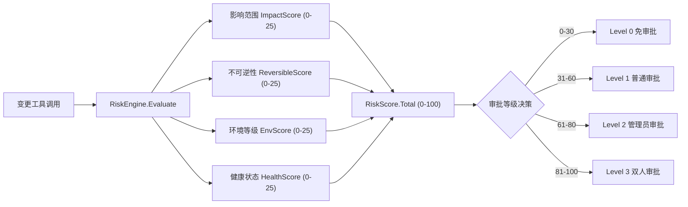

# OpsPilot AI 助手 Phase 3 & Phase 4 技术设计文档

> **文档版本**：v1.0
> **维护团队**：OpsPilot 架构团队
> **适用阶段**：Phase 3（高级变更与策略）/ Phase 4（智能化与优化）
> **前置依赖**：Phase 1（只读诊断）已完成；Phase 2（审批式变更）已完成
> **模块路径**：`github.com/cy77cc/OpsPilot`

---

## 目录

- [Phase 3：高级变更与策略](#phase-3高级变更与策略)
  - [3.1 目标与范围](#31-目标与范围)
  - [3.2 高级变更工具设计](#32-高级变更工具设计)
  - [3.3 风险评分引擎](#33-风险评分引擎)
  - [3.4 多级审批设计](#34-多级审批设计)
  - [3.5 监控集成设计](#35-监控集成设计)
  - [3.6 工具级 RBAC](#36-工具级-rbac)
  - [3.7 数据库变更](#37-数据库变更)
  - [3.8 前端增强](#38-前端增强)
  - [3.9 成功标准](#39-成功标准)
- [Phase 4：智能化与优化](#phase-4智能化与优化)
  - [4.1 目标与范围](#41-目标与范围)
  - [4.2 混合任务设计](#42-混合任务设计)
  - [4.3 自动巡检助手](#43-自动巡检助手)
  - [4.4 根因知识沉淀](#44-根因知识沉淀)
  - [4.5 用户反馈闭环](#45-用户反馈闭环)
  - [4.6 模型分级调用策略](#46-模型分级调用策略)
  - [4.7 Token 成本优化](#47-token-成本优化)
  - [4.8 前端新增能力](#48-前端新增能力)
  - [4.9 成功标准](#49-成功标准)
- [附录：错误码规划](#附录错误码规划)

---

# Phase 3：高级变更与策略

## 3.1 目标与范围

### 交付能力边界

| 能力 | 描述 | 是否在范围内 |
|------|------|-------------|
| `patch_resource` 工具 | 对任意 K8s 资源执行 strategic/merge/json patch，支持 dry-run + diff 预览 | ✅ |
| `apply_manifest` 工具 | Server-Side Apply 方式应用 YAML 清单，支持多文档和 dry-run diff 输出 | ✅ |
| 风险评分引擎 | 4 维度评分（影响范围/不可逆性/环境等级/健康状态），合计 0-100 分 | ✅ |
| 多级审批 | Level 0 免审批 / Level 1 普通 / Level 2 管理员 / Level 3 双人审批 | ✅ |
| 监控集成 | 变更前后 Prometheus 指标对比，SSE 推送 `change_metric_diff` 事件 | ✅ |
| 工具级 RBAC | 每个工具绑定所需权限，执行前调用 `PermissionCheck` 校验 | ✅ |
| 幂等控制完善 | 扩展至 `patch`/`apply` 操作的 Redis 幂等键管理 | ✅ |
| 批量资源变更 | 一次 manifest apply 多个资源对象 | ✅（通过 apply_manifest） |
| GitOps 集成 | 将 manifest 推送至 Git 仓库 | ❌（待规划） |
| 自动回滚触发 | 变更后指标异常时自动触发回滚 | ❌（待规划） |

### 约束条件

- `patch_resource` 和 `apply_manifest` 必须先执行 dry-run，diff 结果写入审批票据后才能提交人工审批
- 风险评分由后端引擎强制计算，不允许 AI 自行判断审批等级
- Level 3（双人审批）要求第一审批人和第二审批人为不同账号，且均需具备 `cluster:write` 权限
- 监控指标对比仅在变更状态变为 `executed` 后触发，延迟 3 分钟后采集"变更后"快照
- `kube-system`、`kube-public` 命名空间禁止通过 AI 工具变更

---

## 3.2 高级变更工具设计

### 3.2.1 目录结构新增

```
internal/ai/tools/kubernetes/
├── tools.go          # 只读工具（已有）
├── write_tools.go    # scale/restart/rollback/delete_pod（Phase 2 已有）
├── patch_tool.go     # NEW: patch_resource 工具
└── apply_tool.go     # NEW: apply_manifest 工具

internal/ai/risk/
└── engine.go         # NEW: 风险评分引擎

internal/ai/tools/common/
├── common.go         # 已有
└── rbac.go           # NEW: 工具级权限映射表
```

### 3.2.2 `patch_resource` 工具

**文件路径**：`internal/ai/tools/kubernetes/patch_tool.go`

```go
// Package kubernetes 提供 Kubernetes 资源操作工具。
//
// patch_tool.go 实现对任意 K8s 资源的 patch 操作，
// 支持 strategic/merge/json 三种 patch 类型及 dry-run diff 预览。
package kubernetes

import (
	"context"
	"encoding/json"
	"fmt"

	metav1 "k8s.io/apimachinery/pkg/apis/meta/v1"
	"k8s.io/apimachinery/pkg/types"

	"github.com/cy77cc/OpsPilot/internal/ai/tools/common"
)

// PatchType 定义 Patch 操作的类型。
type PatchType string

const (
	// PatchTypeStrategic 策略性合并补丁，推荐用于 Deployment/DaemonSet 等工作负载
	PatchTypeStrategic PatchType = "strategic"
	// PatchTypeMerge JSON 合并补丁（RFC 7396），适用于 ConfigMap/Secret 等资源
	PatchTypeMerge PatchType = "merge"
	// PatchTypeJSON JSON 补丁（RFC 6902），支持 add/remove/replace/move/copy/test 操作
	PatchTypeJSON PatchType = "json"
)

// PatchResourceInput 是 patch_resource 工具的输入参数。
//
// 字段说明：
//   - ClusterID:    目标集群 ID（必填，用于解析对应 KubeConfig）
//   - Namespace:    资源所在命名空间（集群级资源留空）
//   - ResourceType: 资源类型，如 deployment/configmap/service/hpa
//   - Name:         资源名称（必填）
//   - PatchType:    patch 类型，strategic/merge/json，默认 strategic
//   - PatchContent: patch 内容（JSON 字符串；json 类型时为 JSON Array）
//   - DryRun:       true 时仅预览，不实际变更集群
//   - Reason:       变更原因，写入审批票据，便于审批人决策
type PatchResourceInput struct {
	ClusterID    int       `json:"cluster_id"    jsonschema:"description=目标集群ID"`
	Namespace    string    `json:"namespace"     jsonschema:"description=命名空间，集群级资源留空"`
	ResourceType string    `json:"resource_type" jsonschema:"description=资源类型如deployment/configmap"`
	Name         string    `json:"name"          jsonschema:"description=资源名称"`
	PatchType    PatchType `json:"patch_type"    jsonschema:"description=patch类型:strategic/merge/json"`
	PatchContent string    `json:"patch_content" jsonschema:"description=patch内容JSON字符串"`
	DryRun       bool      `json:"dry_run"       jsonschema:"description=是否仅预览不实际执行"`
	Reason       string    `json:"reason"        jsonschema:"description=变更原因"`
}

// PatchResourceOutput 是 patch_resource 工具的输出结果。
//
// 字段说明：
//   - DryRunResult:    dry-run 阶段返回的资源 JSON 快照（DryRun=true 时有值）
//   - Diff:            与当前资源的字段级差异（unified diff 格式，+/- 行标注）
//   - Applied:         是否已实际执行（DryRun=false 且审批通过后为 true）
//   - ResourceVersion: 执行后的资源版本号（用于乐观锁验证）
//   - Message:         人类可读的执行摘要
type PatchResourceOutput struct {
	DryRunResult    string `json:"dry_run_result,omitempty"`
	Diff            string `json:"diff,omitempty"`
	Applied         bool   `json:"applied"`
	ResourceVersion string `json:"resource_version,omitempty"`
	Message         string `json:"message"`
}

// PatchResourceTool 实现 patch_resource 工具逻辑。
//
// 工具执行流程：
//  1. 调用工具级 RBAC 校验（checkToolPermission）
//  2. 解析 K8s Dynamic Client（多集群支持）
//  3. 获取目标资源当前状态作为 diff 基准
//  4. 构造 dryRun=All 请求，获取变更后快照
//  5. 计算 unified diff（当前状态 vs 变更后状态）
//  6. 若 DryRun=true，直接返回 diff 结果
//  7. 计算风险评分，触发 StatefulInterrupt，携带 diff 和风险分等待审批
//  8. 审批通过后执行实际 patch
type PatchResourceTool struct {
	deps        common.PlatformDeps
	interrupter StatefulInterrupter // Phase 2 已有接口，支持 HITL 中断/恢复
	riskEngine  RiskEvaluator       // 风险评分引擎接口
}

// NewPatchResourceTool 创建 PatchResourceTool 实例。
//
// 参数:
//   - deps:        平台依赖（DB、Prometheus 等）
//   - interrupter: 用于 HITL 中断的接口实现
//   - riskEngine:  风险评分引擎，用于确定审批等级
//
// 返回: 初始化好的 PatchResourceTool 指针
func NewPatchResourceTool(
	deps common.PlatformDeps,
	interrupter StatefulInterrupter,
	riskEngine RiskEvaluator,
) *PatchResourceTool {
	return &PatchResourceTool{
		deps:        deps,
		interrupter: interrupter,
		riskEngine:  riskEngine,
	}
}

// Invoke 执行 patch_resource 工具。
//
// 参数:
//   - ctx:   携带 PlatformDeps 和用户身份的 context
//   - input: patch 操作参数
//
// 返回:
//   - *PatchResourceOutput: 执行结果（dry-run 预览或实际变更结果）
//   - error: 执行过程中的错误
//
// 副作用: 非 dry-run 模式下会触发 StatefulInterrupt，暂停 Agent 等待人工审批
func (t *PatchResourceTool) Invoke(ctx context.Context, input PatchResourceInput) (*PatchResourceOutput, error) {
	// Step 1: 工具级 RBAC 校验
	if err := checkToolPermission(ctx, "patch_resource", input.ClusterID); err != nil {
		return nil, err
	}

	// Step 2: 解析 K8s Dynamic Client（支持多集群 KubeConfig）
	dynClient, err := resolveDynamicClient(t.deps, input.ClusterID)
	if err != nil {
		return nil, fmt.Errorf("resolve k8s dynamic client: %w", err)
	}

	// Step 3: 解析 GroupVersionResource
	gvr, err := resolveGVR(ctx, dynClient, input.ResourceType)
	if err != nil {
		return nil, fmt.Errorf("resolve GVR for %q: %w", input.ResourceType, err)
	}

	// Step 4: 获取目标资源当前状态（作为 diff 基准）
	current, err := dynClient.Resource(gvr).Namespace(input.Namespace).
		Get(ctx, input.Name, metav1.GetOptions{})
	if err != nil {
		return nil, fmt.Errorf("get current resource %s/%s: %w", input.Namespace, input.Name, err)
	}

	// Step 5: 执行 dry-run patch，获取变更后快照（不写入集群）
	pt := toPatchType(input.PatchType)
	dryRunOpts := metav1.PatchOptions{DryRun: []string{metav1.DryRunAll}}
	dryResult, err := dynClient.Resource(gvr).Namespace(input.Namespace).
		Patch(ctx, input.Name, pt, []byte(input.PatchContent), dryRunOpts)
	if err != nil {
		return nil, fmt.Errorf("dry-run patch failed: %w", err)
	}

	// Step 6: 生成 unified diff（当前状态 vs patch 后状态）
	currentJSON, _ := json.MarshalIndent(current.Object, "", "  ")
	dryResultJSON, _ := json.MarshalIndent(dryResult.Object, "", "  ")
	diffStr := generateUnifiedDiff(
		fmt.Sprintf("a/%s/%s/%s", input.ResourceType, input.Namespace, input.Name),
		fmt.Sprintf("b/%s/%s/%s", input.ResourceType, input.Namespace, input.Name),
		string(currentJSON),
		string(dryResultJSON),
	)

	out := &PatchResourceOutput{
		DryRunResult: string(dryResultJSON),
		Diff:         diffStr,
		Applied:      false,
		Message:      fmt.Sprintf("dry-run 成功，共 %d 行变更", countDiffLines(diffStr)),
	}

	// Step 7: 仅 dry-run 时直接返回，无需审批
	if input.DryRun {
		return out, nil
	}

	// Step 8: 计算风险评分，触发 HITL 中断等待审批
	riskScore := t.riskEngine.Evaluate(ctx, RiskEvalInput{
		ToolName:     "patch_resource",
		ClusterID:    fmt.Sprintf("%d", input.ClusterID),
		Namespace:    input.Namespace,
		ResourceType: input.ResourceType,
		IsReversible: true, // patch 操作可通过反向 patch 回滚
	})
	approvalParams := ApprovalParams{
		ToolName:      "patch_resource",
		OperationDesc: fmt.Sprintf("Patch %s %s/%s（类型：%s）", input.ResourceType, input.Namespace, input.Name, input.PatchType),
		RiskScore:     riskScore,
		DiffContent:   diffStr,
		Reason:        input.Reason,
		Params:        common.StructToMap(input),
	}
	if err := t.interrupter.Interrupt(ctx, approvalParams); err != nil {
		return nil, fmt.Errorf("interrupt for approval: %w", err)
	}

	// Step 9: 审批通过后执行实际 patch（Resume 后重新进入此处）
	realResult, err := dynClient.Resource(gvr).Namespace(input.Namespace).
		Patch(ctx, input.Name, pt, []byte(input.PatchContent), metav1.PatchOptions{})
	if err != nil {
		return nil, fmt.Errorf("apply patch: %w", err)
	}

	out.Applied = true
	out.ResourceVersion = realResult.GetResourceVersion()
	out.Message = fmt.Sprintf("patch 执行成功，资源版本 %s", realResult.GetResourceVersion())
	return out, nil
}

// toPatchType 将自定义 PatchType 映射为 k8s types.PatchType。
//
// 参数:
//   - pt: 自定义 patch 类型枚举
//
// 返回: k8s 原生 PatchType 常量
func toPatchType(pt PatchType) types.PatchType {
	switch pt {
	case PatchTypeJSON:
		return types.JSONPatchType
	case PatchTypeMerge:
		return types.MergePatchType
	default:
		// 默认使用 strategic merge patch（K8s 工作负载推荐类型）
		return types.StrategicMergePatchType
	}
}
```

### 3.2.3 `apply_manifest` 工具

**文件路径**：`internal/ai/tools/kubernetes/apply_tool.go`

```go
// Package kubernetes 提供 Kubernetes 资源操作工具。
//
// apply_tool.go 实现基于 Server-Side Apply（SSA）的 manifest 应用工具，
// 支持多文档 YAML 拆分、dry-run diff 输出及变更资源清单汇总。
package kubernetes

import (
	"context"
	"fmt"
	"strings"

	"github.com/cy77cc/OpsPilot/internal/ai/tools/common"
)

// ApplyManifestInput 是 apply_manifest 工具的输入参数。
//
// 字段说明：
//   - ClusterID:    目标集群 ID（必填）
//   - Namespace:    若 manifest 中未指定 namespace，使用此默认值
//   - ManifestYAML: 完整的 YAML 内容（支持 --- 多文档分隔符）
//   - DryRun:       true 时调用 SSA dry-run，不实际变更集群
//   - FieldManager: SSA 字段管理器名称，默认 "opspilot"
//   - Force:        是否强制接管字段所有权（等效 --force-conflicts），默认 false
//   - Reason:       变更原因，写入审批票据
type ApplyManifestInput struct {
	ClusterID    int    `json:"cluster_id"              jsonschema:"description=目标集群ID"`
	Namespace    string `json:"namespace"               jsonschema:"description=默认命名空间"`
	ManifestYAML string `json:"manifest_yaml"           jsonschema:"description=YAML内容支持多文档"`
	DryRun       bool   `json:"dry_run"                 jsonschema:"description=是否仅预览"`
	FieldManager string `json:"field_manager,omitempty" jsonschema:"description=SSA字段管理器名称"`
	Force        bool   `json:"force,omitempty"         jsonschema:"description=是否强制接管字段所有权"`
	Reason       string `json:"reason"                  jsonschema:"description=变更原因"`
}

// ApplyManifestOutput 是 apply_manifest 工具的输出结果。
//
// 字段说明：
//   - DryRunDiff:         各资源的 dry-run diff 汇总（unified diff 格式，按资源分块展示）
//   - ResourcesChanged:   本次有变更的资源列表（"Kind/Namespace/Name" 格式）
//   - ResourcesUnchanged: 无变更的资源列表（内容与集群完全一致）
//   - Errors:             各资源处理过程中的错误列表（不中断其他资源处理）
//   - Applied:            是否已实际执行（审批通过且无严重错误时为 true）
//   - TotalResources:     YAML 中解析到的资源总数
//   - Message:            人类可读的执行摘要
type ApplyManifestOutput struct {
	DryRunDiff         string   `json:"dry_run_diff,omitempty"`
	ResourcesChanged   []string `json:"resources_changed,omitempty"`
	ResourcesUnchanged []string `json:"resources_unchanged,omitempty"`
	Errors             []string `json:"errors,omitempty"`
	Applied            bool     `json:"applied"`
	TotalResources     int      `json:"total_resources"`
	Message            string   `json:"message"`
}

// ApplyManifestTool 实现 apply_manifest 工具逻辑。
type ApplyManifestTool struct {
	deps        common.PlatformDeps
	interrupter StatefulInterrupter
	riskEngine  RiskEvaluator
}

// NewApplyManifestTool 创建 ApplyManifestTool 实例。
//
// 参数:
//   - deps:        平台依赖（DB、Prometheus 等）
//   - interrupter: HITL 中断接口
//   - riskEngine:  风险评分引擎
//
// 返回: 初始化好的 ApplyManifestTool 指针
func NewApplyManifestTool(
	deps common.PlatformDeps,
	interrupter StatefulInterrupter,
	riskEngine RiskEvaluator,
) *ApplyManifestTool {
	return &ApplyManifestTool{deps: deps, interrupter: interrupter, riskEngine: riskEngine}
}

// Invoke 执行 apply_manifest 工具。
//
// 执行流程：
//  1. RBAC 校验
//  2. 解析多文档 YAML，拆分为独立对象列表
//  3. 对每个对象执行 SSA dry-run，收集 diff 和变更资源列表
//  4. 若 DryRun=true，返回汇总 diff
//  5. 计算风险评分，触发 HITL 中断等待审批（携带完整 diff）
//  6. 审批通过后批量执行 SSA
//
// 参数:
//   - ctx:   请求上下文
//   - input: apply 操作参数
//
// 返回:
//   - *ApplyManifestOutput: 执行结果
//   - error: 执行错误
func (t *ApplyManifestTool) Invoke(ctx context.Context, input ApplyManifestInput) (*ApplyManifestOutput, error) {
	if err := checkToolPermission(ctx, "apply_manifest", input.ClusterID); err != nil {
		return nil, err
	}

	// 设置默认字段管理器标识
	if input.FieldManager == "" {
		input.FieldManager = "opspilot"
	}

	dynClient, err := resolveDynamicClient(t.deps, input.ClusterID)
	if err != nil {
		return nil, fmt.Errorf("resolve dynamic client: %w", err)
	}

	// 解析多文档 YAML（支持 --- 分隔符，跳过空文档）
	docs, err := splitYAMLDocuments(input.ManifestYAML)
	if err != nil {
		return nil, fmt.Errorf("parse manifest yaml: %w", err)
	}

	out := &ApplyManifestOutput{TotalResources: len(docs)}
	var diffBuilder strings.Builder

	// 对每个文档执行 dry-run SSA，收集 diff 和变更资源列表
	for _, doc := range docs {
		result, err := serverSideApplyDryRun(ctx, dynClient, doc, input.Namespace, input.FieldManager, input.Force)
		if err != nil {
			out.Errors = append(out.Errors, fmt.Sprintf("%s/%s: %v", doc.GetKind(), doc.GetName(), err))
			continue
		}
		resKey := fmt.Sprintf("%s/%s/%s", result.Kind, result.Namespace, result.Name)
		if result.HasChanges {
			out.ResourcesChanged = append(out.ResourcesChanged, resKey)
			diffBuilder.WriteString(fmt.Sprintf("=== %s ===\n", resKey))
			diffBuilder.WriteString(result.Diff)
			diffBuilder.WriteString("\n")
		} else {
			out.ResourcesUnchanged = append(out.ResourcesUnchanged, resKey)
		}
	}
	out.DryRunDiff = diffBuilder.String()

	if input.DryRun {
		out.Message = fmt.Sprintf("dry-run 完成：%d 个资源有变更，%d 个无变更，%d 个错误",
			len(out.ResourcesChanged), len(out.ResourcesUnchanged), len(out.Errors))
		return out, nil
	}

	// 计算风险评分并触发 HITL 中断
	riskScore := t.riskEngine.Evaluate(ctx, RiskEvalInput{
		ToolName:      "apply_manifest",
		ClusterID:     fmt.Sprintf("%d", input.ClusterID),
		Namespace:     input.Namespace,
		ResourceType:  "manifest",
		AffectedCount: len(out.ResourcesChanged),
		IsReversible:  false, // manifest apply 视为不可逆（覆盖式变更）
	})
	approvalParams := ApprovalParams{
		ToolName:      "apply_manifest",
		OperationDesc: fmt.Sprintf("Apply Manifest（%d 个资源有变更）", len(out.ResourcesChanged)),
		RiskScore:     riskScore,
		DiffContent:   out.DryRunDiff,
		Reason:        input.Reason,
		Params:        common.StructToMap(input),
	}
	if err := t.interrupter.Interrupt(ctx, approvalParams); err != nil {
		return nil, fmt.Errorf("interrupt for approval: %w", err)
	}

	// 审批通过后批量执行 SSA（逐个资源，单个失败不中断整体）
	for _, doc := range docs {
		if err := serverSideApply(ctx, dynClient, doc, input.Namespace, input.FieldManager, input.Force); err != nil {
			out.Errors = append(out.Errors, fmt.Sprintf("apply %s/%s: %v", doc.GetKind(), doc.GetName(), err))
		}
	}

	out.Applied = len(out.Errors) == 0
	out.Message = fmt.Sprintf("apply 完成：%d 个资源变更成功，%d 个错误",
		len(out.ResourcesChanged), len(out.Errors))
	return out, nil
}
```

---

## 3.3 风险评分引擎

### 3.3.1 设计原理

风险评分采用 **4 维度加权求和**模型，各维度满分 25 分，总分 0-100 分。



| 维度 | 字段 | 评分逻辑摘要 |
|------|------|-------------|
| **影响范围** | `ImpactScore` | 受影响资源数 × 环境系数（prod×1.5 / staging×1.2 / dev×1.0），上限 25 分 |
| **操作不可逆性** | `ReversibleScore` | 不可逆操作（如删除 ConfigMap）满 25 分；可逆操作按工具类型给基础分（scale=5/restart=8/patch=10） |
| **环境等级** | `EnvScore` | prod=25 / staging=15 / dev=5 / unknown=20（保守处理） |
| **当前健康状态** | `HealthScore` | 活跃告警数越多得分越高（每个告警+3分，上限15）；健康副本比越低得分越高（比例0.5时+10分） |

评分区间与审批等级映射：

```
 0 ─────── 30 ─────── 60 ─────── 80 ────── 100
  low(L0)    medium(L1)   high(L2)   critical(L3)
  免审批      普通审批      管理员审批    双人审批
```

### 3.3.2 数据结构与实现

**文件路径**：`internal/ai/risk/engine.go`

```go
// Package risk 实现变更操作的风险评分引擎。
//
// 架构概览：
//   变更工具 → RiskEngine.Evaluate(ctx, input) → RiskScore → 审批等级决策
package risk

import (
	"context"
	"fmt"
	"math"
)

// RiskEvalInput 风险评估输入参数。
//
// 由变更工具在触发 HITL 前填充，包含操作上下文和当前环境状态。
// 各字段由调用方负责准确填充，引擎不做额外 I/O 查询（保持纯函数特性）。
type RiskEvalInput struct {
	ToolName        string  // 工具名称，如 patch_resource/scale_deployment/apply_manifest
	ClusterID       string  // 目标集群标识（用于日志记录）
	Namespace       string  // 目标命名空间
	ResourceType    string  // 资源类型，如 Deployment/ConfigMap
	AffectedCount   int     // 受影响资源数量（副本数/关联 Pod 数/manifest 内资源数等）
	Environment     string  // 环境标识：dev / staging / prod（由集群元数据决定）
	IsReversible    bool    // 操作是否可回滚（false 时 ReversibleScore 得满分 25）
	CurrentAlerts   int     // 当前命名空间/集群的活跃告警数（从 Prometheus 查询）
	ReplicasHealthy float64 // 健康副本比例 0.0-1.0（-1 表示不适用，如 ConfigMap）
}

// RiskScore 风险评分结果。
//
// 包含各维度分数、总分、等级及建议的审批等级，
// 由审批逻辑根据 ApprovalLevel 路由至对应审批流程。
type RiskScore struct {
	Total           int      // 总分 0-100
	Level           string   // low / medium / high / critical
	ImpactScore     int      // 影响范围得分 0-25
	ReversibleScore int      // 不可逆性得分 0-25
	EnvScore        int      // 环境等级得分 0-25
	HealthScore     int      // 健康状态得分 0-25
	ApprovalLevel   int      // 建议审批等级 0/1/2/3
	Reasons         []string // 各维度评分说明（用于审批详情页展示）
}

// RiskEvaluator 风险评分引擎接口，便于测试时 mock。
type RiskEvaluator interface {
	Evaluate(ctx context.Context, input RiskEvalInput) RiskScore
}

// RiskEngine 风险评分引擎，实现 RiskEvaluator 接口。
type RiskEngine struct{}

// NewRiskEngine 创建默认风险评分引擎实例。
//
// 返回: 实现了 RiskEvaluator 接口的 *RiskEngine
func NewRiskEngine() *RiskEngine {
	return &RiskEngine{}
}

// Evaluate 执行风险评估，返回 RiskScore。
//
// 评分为纯函数，不依赖外部 I/O，所有输入均由调用方提前采集传入。
//
// 参数:
//   - ctx:   请求上下文（预留，当前未使用）
//   - input: 评估输入参数（由变更工具填充）
//
// 返回:
//   - RiskScore: 包含总分、等级、各维度分和建议审批等级
func (e *RiskEngine) Evaluate(_ context.Context, input RiskEvalInput) RiskScore {
	score := RiskScore{}

	// ── 维度一：影响范围评分 (0-25) ────────────────────────────────
	// 影响资源数越多分数越高；生产环境放大系数
	envMultiplier := envCoefficient(input.Environment)
	rawImpact := math.Min(float64(input.AffectedCount)*2.5*envMultiplier, 25)
	score.ImpactScore = int(rawImpact)
	if input.AffectedCount > 0 {
		score.Reasons = append(score.Reasons,
			fmt.Sprintf("影响 %d 个资源（环境系数 %.1f，得 %d 分）", input.AffectedCount, envMultiplier, score.ImpactScore))
	}

	// ── 维度二：操作不可逆性评分 (0-25) ───────────────────────────
	// 不可逆操作（如 delete ConfigMap、apply 全量覆盖）得满分
	// 可逆操作（如 scale、patch）按工具类型给基础分
	if !input.IsReversible {
		score.ReversibleScore = 25
		score.Reasons = append(score.Reasons, "操作不可逆，无自动回滚路径（得 25 分）")
	} else {
		score.ReversibleScore = irreversibleBaseScore(input.ToolName)
		if score.ReversibleScore > 0 {
			score.Reasons = append(score.Reasons,
				fmt.Sprintf("操作可回滚但存在风险（工具 %s 基础分 %d）", input.ToolName, score.ReversibleScore))
		}
	}

	// ── 维度三：环境等级评分 (0-25) ────────────────────────────────
	// 生产环境权重最高，开发环境权重最低
	score.EnvScore = envLevelScore(input.Environment)
	score.Reasons = append(score.Reasons,
		fmt.Sprintf("环境等级 %s（得 %d 分）", input.Environment, score.EnvScore))

	// ── 维度四：当前健康状态评分 (0-25) ───────────────────────────
	// 告警数多 + 健康副本比低 → 得高分（在不健康时变更风险更大）
	score.HealthScore = healthStateScore(input.CurrentAlerts, input.ReplicasHealthy)
	if score.HealthScore > 0 {
		score.Reasons = append(score.Reasons,
			fmt.Sprintf("当前 %d 个告警，健康副本比 %.0f%%（得 %d 分）",
				input.CurrentAlerts, input.ReplicasHealthy*100, score.HealthScore))
	}

	// 汇总总分并映射等级和审批等级
	score.Total = score.ImpactScore + score.ReversibleScore + score.EnvScore + score.HealthScore
	score.Level, score.ApprovalLevel = scoreToLevel(score.Total)
	return score
}

// envCoefficient 返回环境对应的影响范围系数。
//
// 参数:
//   - env: 环境标识字符串
//
// 返回: 浮点系数，prod=1.5 / staging=1.2 / dev=1.0 / 其他=1.3
func envCoefficient(env string) float64 {
	switch env {
	case "prod":
		return 1.5
	case "staging":
		return 1.2
	case "dev":
		return 1.0
	default:
		// 未知环境保守处理，取 staging 和 prod 之间
		return 1.3
	}
}

// envLevelScore 返回环境等级的固定评分。
//
// 参数:
//   - env: 环境标识字符串
//
// 返回: 环境等级得分（0-25）
func envLevelScore(env string) int {
	switch env {
	case "prod":
		return 25
	case "staging":
		return 15
	case "dev":
		return 5
	default:
		// 未知环境保守处理，高于 staging
		return 20
	}
}

// irreversibleBaseScore 返回可逆操作的基础风险分。
//
// 即使操作可逆，不同工具仍有不同程度的变更风险。
//
// 参数:
//   - toolName: 工具名称
//
// 返回: 基础风险分（0-25），越高代表越难回滚
func irreversibleBaseScore(toolName string) int {
	// 工具基础风险分映射（可逆操作）
	scores := map[string]int{
		"scale_deployment":   5,  // 可直接扩缩回去
		"restart_deployment": 8,  // 重启操作，回滚需重新部署
		"rollback_deployment": 3, // 本身就是回滚操作，风险最低
		"delete_pod":         8,  // Pod 自动重建，但期间有短暂不可用
		"patch_resource":     10, // patch 可通过反向 patch 回滚，但操作复杂
		"apply_manifest":     18, // SSA 虽可覆盖，但恢复原状需重新 apply 旧版本
	}
	if s, ok := scores[toolName]; ok {
		return s
	}
	// 未知工具保守处理，给中等风险分
	return 12
}

// healthStateScore 根据当前健康状态计算风险分。
//
// 逻辑：在系统已经不健康时变更，风险倍增。
//
// 参数:
//   - alerts:         当前活跃告警数（0 表示无告警）
//   - replicasHealthy: 健康副本比例（0.0-1.0，-1 表示不适用）
//
// 返回: 健康状态风险分（0-25）
func healthStateScore(alerts int, replicasHealthy float64) int {
	score := 0

	// 活跃告警：每个告警 +3 分，上限 15 分
	alertScore := min(alerts*3, 15)
	score += alertScore

	// 健康副本比：副本比越低，风险越高
	if replicasHealthy >= 0 {
		// 完全健康(1.0)=0分，完全不健康(0.0)=10分
		unhealthyScore := int((1.0 - replicasHealthy) * 10)
		score += unhealthyScore
	}

	return min(score, 25)
}

// scoreToLevel 将总分映射为风险等级和审批等级。
//
// 参数:
//   - total: 风险总分 0-100
//
// 返回:
//   - level: 文字等级（low/medium/high/critical）
//   - approvalLevel: 审批等级（0=免审批/1=普通/2=管理员/3=双人）
func scoreToLevel(total int) (level string, approvalLevel int) {
	switch {
	case total <= 30:
		return "low", 0
	case total <= 60:
		return "medium", 1
	case total <= 80:
		return "high", 2
	default:
		return "critical", 3
	}
}

// min 返回两个整数中的较小值（Go 1.21+ 标准库已内置，此为兼容旧版本）。
func min(a, b int) int {
	if a < b {
		return a
	}
	return b
}
```

### 3.3.3 风险评分单元测试骨架

**文件路径**：`internal/ai/risk/engine_test.go`

```go
// Package risk 测试风险评分引擎。
package risk

import (
	"context"
	"testing"

	"github.com/stretchr/testify/assert"
)

// TestRiskEngine_Evaluate 使用表驱动测试验证各场景的评分和审批等级。
func TestRiskEngine_Evaluate(t *testing.T) {
	engine := NewRiskEngine()
	ctx := context.Background()

	tests := []struct {
		name            string
		input           RiskEvalInput
		wantLevel       string
		wantApproval    int
		wantTotalMin    int
		wantTotalMax    int
	}{
		{
			name: "dev环境scale操作_低风险免审批",
			input: RiskEvalInput{
				ToolName: "scale_deployment", Environment: "dev",
				AffectedCount: 1, IsReversible: true, CurrentAlerts: 0, ReplicasHealthy: 1.0,
			},
			wantLevel: "low", wantApproval: 0, wantTotalMin: 0, wantTotalMax: 30,
		},
		{
			name: "staging环境patch操作_中等风险普通审批",
			input: RiskEvalInput{
				ToolName: "patch_resource", Environment: "staging",
				AffectedCount: 3, IsReversible: true, CurrentAlerts: 1, ReplicasHealthy: 0.9,
			},
			wantLevel: "medium", wantApproval: 1, wantTotalMin: 31, wantTotalMax: 60,
		},
		{
			name: "prod环境apply_manifest_高风险管理员审批",
			input: RiskEvalInput{
				ToolName: "apply_manifest", Environment: "prod",
				AffectedCount: 2, IsReversible: false, CurrentAlerts: 0, ReplicasHealthy: 1.0,
			},
			wantLevel: "high", wantApproval: 2, wantTotalMin: 61, wantTotalMax: 80,
		},
		{
			name: "prod环境apply_manifest且有告警_极高风险双人审批",
			input: RiskEvalInput{
				ToolName: "apply_manifest", Environment: "prod",
				AffectedCount: 5, IsReversible: false, CurrentAlerts: 5, ReplicasHealthy: 0.5,
			},
			wantLevel: "critical", wantApproval: 3, wantTotalMin: 81, wantTotalMax: 100,
		},
	}

	for _, tt := range tests {
		t.Run(tt.name, func(t *testing.T) {
			got := engine.Evaluate(ctx, tt.input)
			assert.Equal(t, tt.wantLevel, got.Level, "Level 不符")
			assert.Equal(t, tt.wantApproval, got.ApprovalLevel, "ApprovalLevel 不符")
			assert.GreaterOrEqual(t, got.Total, tt.wantTotalMin, "Total 低于预期最小值")
			assert.LessOrEqual(t, got.Total, tt.wantTotalMax, "Total 高于预期最大值")
			// 各维度分之和应等于总分
			assert.Equal(t, got.Total, got.ImpactScore+got.ReversibleScore+got.EnvScore+got.HealthScore)
		})
	}
}
```

| **操作不可逆性** | `ReversibleScore` | 不可逆（如删除 ConfigMap）满 25 分；可逆操作按工具类型给基础分（
