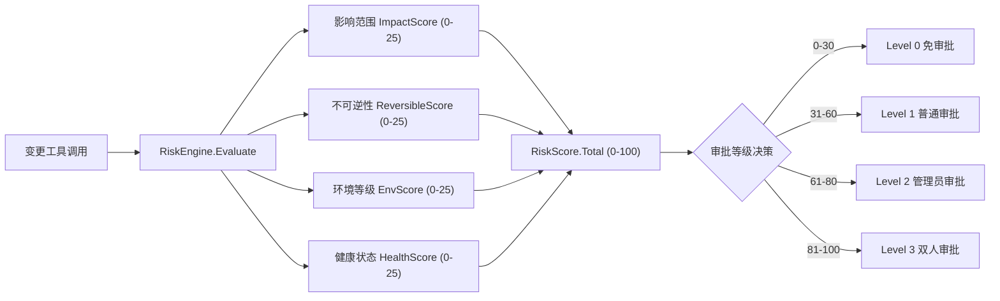
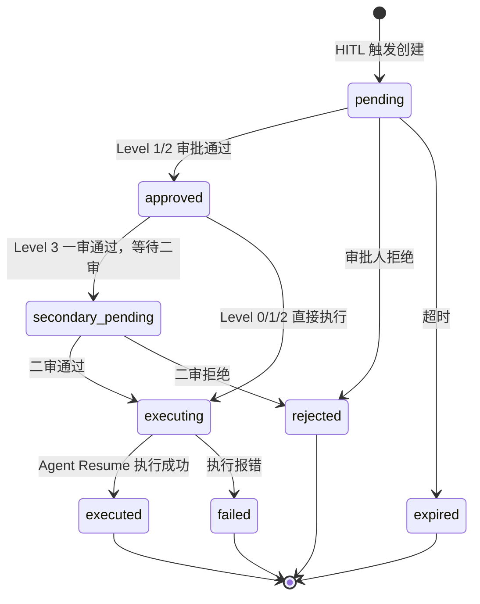
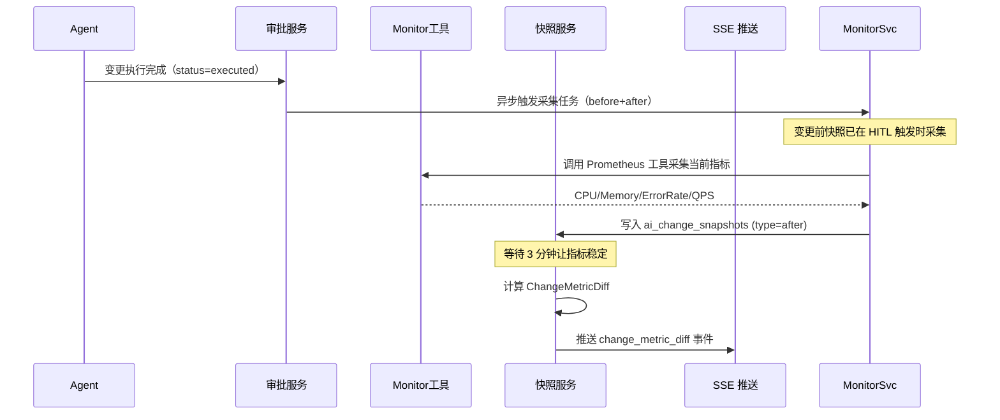
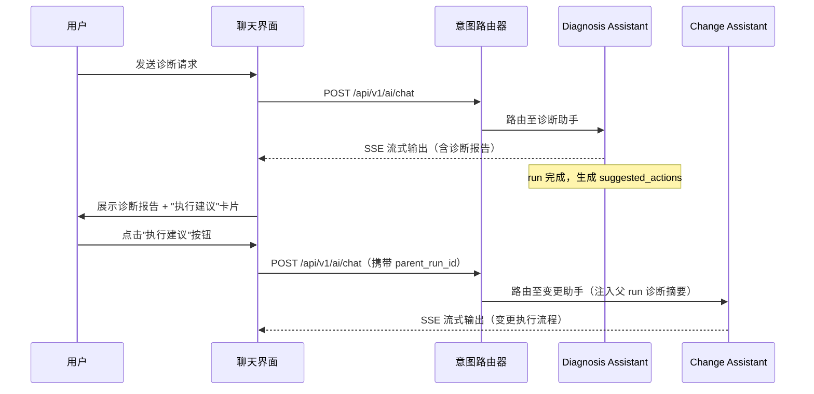
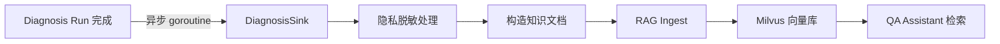

# OpsPilot AI 助手 Phase 3 & Phase 4 技术设计文档

> **文档版本**：v1.1
> **维护团队**：OpsPilot 架构团队
> **适用阶段**：Phase 3（高级变更与策略）/ Phase 4（智能化与优化）
> **前置依赖**：Phase 1（只读诊断）已完成；Phase 2（审批式变更）已完成
> **模块路径**：`github.com/cy77cc/OpsPilot`
> **修订说明**：本版已根据 `docs/ai/review-issues.md` 对齐现有审批主表、运行标识定义、状态机说明与前端 ID 类型

---

## 目录

- [Phase 3：高级变更与策略](#phase-3高级变更与策略)
  - [3.1 目标与范围](#31-目标与范围)
  - [3.2 高级变更工具设计](#32-高级变更工具设计)
  - [3.3 风险评分引擎](#33-风险评分引擎)
  - [3.4 多级审批设计](#34-多级审批设计)
  - [3.5 监控集成设计](#35-监控集成设计)
  - [3.6 工具级 RBAC](#36-工具级-rbac)
  - [3.7 数据库变更](#37-数据库变更)
  - [3.8 前端增强](#38-前端增强)
  - [3.9 成功标准](#39-成功标准)
- [Phase 4：智能化与优化](#phase-4智能化与优化)
  - [4.1 目标与范围](#41-目标与范围)
  - [4.2 混合任务设计](#42-混合任务设计)
  - [4.3 自动巡检助手](#43-自动巡检助手)
  - [4.4 根因知识沉淀](#44-根因知识沉淀)
  - [4.5 用户反馈闭环](#45-用户反馈闭环)
  - [4.6 模型分级调用策略](#46-模型分级调用策略)
  - [4.7 Token 成本优化](#47-token-成本优化)
  - [4.8 前端新增能力](#48-前端新增能力)
  - [4.9 成功标准](#49-成功标准)
- [附录：错误码规划](#附录错误码规划)

---

# Phase 3：高级变更与策略

## 3.1 目标与范围

### 交付能力边界

| 能力 | 描述 | 是否在范围内 |
|------|------|-------------|
| `patch_resource` 工具 | 对任意 K8s 资源执行 strategic/merge/json patch，支持 dry-run + diff 预览 | ✅ |
| `apply_manifest` 工具 | Server-Side Apply 方式应用 YAML 清单，支持多文档和 dry-run diff 输出 | ✅ |
| 风险评分引擎 | 4 维度评分（影响范围/不可逆性/环境等级/健康状态），合计 0-100 分 | ✅ |
| 多级审批 | Level 0 免审批 / Level 1 普通 / Level 2 管理员 / Level 3 双人审批 | ✅ |
| 监控集成 | 变更前后 Prometheus 指标对比，SSE 推送 `change_metric_diff` 事件 | ✅ |
| 工具级 RBAC | 每个工具绑定所需权限，执行前调用 `PermissionCheck` 校验 | ✅ |
| 幂等控制完善 | 扩展至 `patch`/`apply` 操作的 Redis 幂等键管理 | ✅ |
| 批量资源变更 | 一次 manifest apply 多个资源对象 | ✅（通过 apply_manifest） |
| GitOps 集成 | 将 manifest 推送至 Git 仓库 | ❌（待规划） |
| 自动回滚触发 | 变更后指标异常时自动触发回滚 | ❌（待规划） |

### 约束条件

- `patch_resource` 和 `apply_manifest` 必须先执行 dry-run，diff 结果写入审批票据后才能提交人工审批
- 风险评分由后端引擎强制计算，不允许 AI 自行判断审批等级
- Level 3（双人审批）要求第一审批人和第二审批人为不同账号，且均需具备 `cluster:write` 权限
- 监控指标对比仅在变更状态变为 `executed` 后触发，延迟 3 分钟后采集"变更后"快照
- `kube-system`、`kube-public` 命名空间禁止通过 AI 工具变更

---

## 3.2 高级变更工具设计

### 3.2.1 目录结构新增

```
internal/ai/tools/kubernetes/
├── tools.go          # 只读工具（已有）
├── write_tools.go    # scale/restart/rollback/delete_pod（Phase 2 已有）
├── patch_tool.go     # NEW: patch_resource 工具
└── apply_tool.go     # NEW: apply_manifest 工具

internal/ai/risk/
└── engine.go         # NEW: 风险评分引擎

internal/ai/tools/common/
├── common.go         # 已有
└── rbac.go           # NEW: 工具级权限映射表
```

### 3.2.2 `patch_resource` 工具

**文件路径**：`internal/ai/tools/kubernetes/patch_tool.go`

```go
// Package kubernetes 提供 Kubernetes 资源操作工具。
//
// patch_tool.go 实现对任意 K8s 资源的 patch 操作，
// 支持 strategic/merge/json 三种 patch 类型及 dry-run diff 预览。
package kubernetes

import (
	"context"
	"encoding/json"
	"fmt"

	metav1 "k8s.io/apimachinery/pkg/apis/meta/v1"
	"k8s.io/apimachinery/pkg/types"

	"github.com/cy77cc/OpsPilot/internal/ai/tools/common"
)

// PatchType 定义 Patch 操作的类型。
type PatchType string

const (
	// PatchTypeStrategic 策略性合并补丁，推荐用于 Deployment/DaemonSet 等工作负载
	PatchTypeStrategic PatchType = "strategic"
	// PatchTypeMerge JSON 合并补丁（RFC 7396），适用于 ConfigMap/Secret 等资源
	PatchTypeMerge PatchType = "merge"
	// PatchTypeJSON JSON 补丁（RFC 6902），支持 add/remove/replace/move/copy/test 操作
	PatchTypeJSON PatchType = "json"
)

// PatchResourceInput 是 patch_resource 工具的输入参数。
//
// 字段说明：
//   - ClusterID:    目标集群 ID（必填，用于解析对应 KubeConfig）
//   - Namespace:    资源所在命名空间（集群级资源留空）
//   - ResourceType: 资源类型，如 deployment/configmap/service/hpa
//   - Name:         资源名称（必填）
//   - PatchType:    patch 类型，strategic/merge/json，默认 strategic
//   - PatchContent: patch 内容（JSON 字符串；json 类型时为 JSON Array）
//   - DryRun:       true 时仅预览，不实际变更集群
//   - Reason:       变更原因，写入审批票据，便于审批人决策
type PatchResourceInput struct {
	ClusterID    int       `json:"cluster_id"    jsonschema:"description=目标集群ID"`
	Namespace    string    `json:"namespace"     jsonschema:"description=命名空间，集群级资源留空"`
	ResourceType string    `json:"resource_type" jsonschema:"description=资源类型如deployment/configmap"`
	Name         string    `json:"name"          jsonschema:"description=资源名称"`
	PatchType    PatchType `json:"patch_type"    jsonschema:"description=patch类型:strategic/merge/json"`
	PatchContent string    `json:"patch_content" jsonschema:"description=patch内容JSON字符串"`
	DryRun       bool      `json:"dry_run"       jsonschema:"description=是否仅预览不实际执行"`
	Reason       string    `json:"reason"        jsonschema:"description=变更原因"`
}

// PatchResourceOutput 是 patch_resource 工具的输出结果。
//
// 字段说明：
//   - DryRunResult:    dry-run 阶段返回的资源 JSON 快照（DryRun=true 时有值）
//   - Diff:            与当前资源的字段级差异（unified diff 格式，+/- 行标注）
//   - Applied:         是否已实际执行（DryRun=false 且审批通过后为 true）
//   - ResourceVersion: 执行后的资源版本号（用于乐观锁验证）
//   - Message:         人类可读的执行摘要
type PatchResourceOutput struct {
	DryRunResult    string `json:"dry_run_result,omitempty"`
	Diff            string `json:"diff,omitempty"`
	Applied         bool   `json:"applied"`
	ResourceVersion string `json:"resource_version,omitempty"`
	Message         string `json:"message"`
}

// PatchResourceTool 实现 patch_resource 工具逻辑。
//
// 工具执行流程：
//  1. 调用工具级 RBAC 校验（checkToolPermission）
//  2. 解析 K8s Dynamic Client（多集群支持）
//  3. 获取目标资源当前状态作为 diff 基准
//  4. 构造 dryRun=All 请求，获取变更后快照
//  5. 计算 unified diff（当前状态 vs 变更后状态）
//  6. 若 DryRun=true，直接返回 diff 结果
//  7. 计算风险评分，触发 StatefulInterrupt，携带 diff 和风险分等待审批
//  8. 审批通过后执行实际 patch
type PatchResourceTool struct {
	deps        common.PlatformDeps
	interrupter StatefulInterrupter // Phase 2 已有接口，支持 HITL 中断/恢复
	riskEngine  RiskEvaluator       // 风险评分引擎接口
}

// NewPatchResourceTool 创建 PatchResourceTool 实例。
//
// 参数:
//   - deps:        平台依赖（DB、Prometheus 等）
//   - interrupter: 用于 HITL 中断的接口实现
//   - riskEngine:  风险评分引擎，用于确定审批等级
//
// 返回: 初始化好的 PatchResourceTool 指针
func NewPatchResourceTool(
	deps common.PlatformDeps,
	interrupter StatefulInterrupter,
	riskEngine RiskEvaluator,
) *PatchResourceTool {
	return &PatchResourceTool{
		deps:        deps,
		interrupter: interrupter,
		riskEngine:  riskEngine,
	}
}

// Invoke 执行 patch_resource 工具。
//
// 参数:
//   - ctx:   携带 PlatformDeps 和用户身份的 context
//   - input: patch 操作参数
//
// 返回:
//   - *PatchResourceOutput: 执行结果（dry-run 预览或实际变更结果）
//   - error: 执行过程中的错误
//
// 副作用: 非 dry-run 模式下会触发 StatefulInterrupt，暂停 Agent 等待人工审批
func (t *PatchResourceTool) Invoke(ctx context.Context, input PatchResourceInput) (*PatchResourceOutput, error) {
	// Step 1: 工具级 RBAC 校验
	if err := checkToolPermission(ctx, "patch_resource", input.ClusterID); err != nil {
		return nil, err
	}

	// Step 2: 解析 K8s Dynamic Client（支持多集群 KubeConfig）
	dynClient, err := resolveDynamicClient(t.deps, input.ClusterID)
	if err != nil {
		return nil, fmt.Errorf("resolve k8s dynamic client: %w", err)
	}

	// Step 3: 解析 GroupVersionResource
	gvr, err := resolveGVR(ctx, dynClient, input.ResourceType)
	if err != nil {
		return nil, fmt.Errorf("resolve GVR for %q: %w", input.ResourceType, err)
	}

	// Step 4: 获取目标资源当前状态（作为 diff 基准）
	current, err := dynClient.Resource(gvr).Namespace(input.Namespace).
		Get(ctx, input.Name, metav1.GetOptions{})
	if err != nil {
		return nil, fmt.Errorf("get current resource %s/%s: %w", input.Namespace, input.Name, err)
	}

	// Step 5: 执行 dry-run patch，获取变更后快照（不写入集群）
	pt := toPatchType(input.PatchType)
	dryRunOpts := metav1.PatchOptions{DryRun: []string{metav1.DryRunAll}}
	dryResult, err := dynClient.Resource(gvr).Namespace(input.Namespace).
		Patch(ctx, input.Name, pt, []byte(input.PatchContent), dryRunOpts)
	if err != nil {
		return nil, fmt.Errorf("dry-run patch failed: %w", err)
	}

	// Step 6: 生成 unified diff（当前状态 vs patch 后状态）
	currentJSON, _ := json.MarshalIndent(current.Object, "", "  ")
	dryResultJSON, _ := json.MarshalIndent(dryResult.Object, "", "  ")
	diffStr := generateUnifiedDiff(
		fmt.Sprintf("a/%s/%s/%s", input.ResourceType, input.Namespace, input.Name),
		fmt.Sprintf("b/%s/%s/%s", input.ResourceType, input.Namespace, input.Name),
		string(currentJSON),
		string(dryResultJSON),
	)

	out := &PatchResourceOutput{
		DryRunResult: string(dryResultJSON),
		Diff:         diffStr,
		Applied:      false,
		Message:      fmt.Sprintf("dry-run 成功，共 %d 行变更", countDiffLines(diffStr)),
	}

	// Step 7: 仅 dry-run 时直接返回，无需审批
	if input.DryRun {
		return out, nil
	}

	// Step 8: 计算风险评分，触发 HITL 中断等待审批
	riskScore := t.riskEngine.Evaluate(ctx, RiskEvalInput{
		ToolName:     "patch_resource",
		ClusterID:    fmt.Sprintf("%d", input.ClusterID),
		Namespace:    input.Namespace,
		ResourceType: input.ResourceType,
		IsReversible: true, // patch 操作可通过反向 patch 回滚
	})
	approvalParams := ApprovalParams{
		ToolName:      "patch_resource",
		OperationDesc: fmt.Sprintf("Patch %s %s/%s（类型：%s）", input.ResourceType, input.Namespace, input.Name, input.PatchType),
		RiskScore:     riskScore,
		DiffContent:   diffStr,
		Reason:        input.Reason,
		Params:        common.StructToMap(input),
	}
	if err := t.interrupter.Interrupt(ctx, approvalParams); err != nil {
		return nil, fmt.Errorf("interrupt for approval: %w", err)
	}

	// Step 9: 审批通过后执行实际 patch（Resume 后重新进入此处）
	// 从恢复上下文获取最终参数（可能被审批人修改）
	resumeCtx := t.interrupter.GetResumeContext(ctx)
	finalPatchContent := input.PatchContent
	if resumeCtx != nil && resumeCtx.ModifiedParams != nil {
		if pc, ok := resumeCtx.ModifiedParams["patch_content"].(string); ok && pc != "" {
			finalPatchContent = pc
		}
	}
	realResult, err := dynClient.Resource(gvr).Namespace(input.Namespace).
		Patch(ctx, input.Name, pt, []byte(finalPatchContent), metav1.PatchOptions{})
	if err != nil {
		return nil, fmt.Errorf("apply patch: %w", err)
	}

	out.Applied = true
	out.ResourceVersion = realResult.GetResourceVersion()
	out.Message = fmt.Sprintf("patch 执行成功，资源版本 %s", realResult.GetResourceVersion())
	return out, nil
}

// toPatchType 将自定义 PatchType 映射为 k8s types.PatchType。
//
// 参数:
//   - pt: 自定义 patch 类型枚举
//
// 返回: k8s 原生 PatchType 常量
func toPatchType(pt PatchType) types.PatchType {
	switch pt {
	case PatchTypeJSON:
		return types.JSONPatchType
	case PatchTypeMerge:
		return types.MergePatchType
	default:
		// 默认使用 strategic merge patch（K8s 工作负载推荐类型）
		return types.StrategicMergePatchType
	}
}
```

### 3.2.3 `apply_manifest` 工具

**文件路径**：`internal/ai/tools/kubernetes/apply_tool.go`

```go
// Package kubernetes 提供 Kubernetes 资源操作工具。
//
// apply_tool.go 实现基于 Server-Side Apply（SSA）的 manifest 应用工具，
// 支持多文档 YAML 拆分、dry-run diff 输出及变更资源清单汇总。
package kubernetes

import (
	"context"
	"fmt"
	"strings"

	"github.com/cy77cc/OpsPilot/internal/ai/tools/common"
)

// ApplyManifestInput 是 apply_manifest 工具的输入参数。
//
// 字段说明：
//   - ClusterID:    目标集群 ID（必填）
//   - Namespace:    若 manifest 中未指定 namespace，使用此默认值
//   - ManifestYAML: 完整的 YAML 内容（支持 --- 多文档分隔符）
//   - DryRun:       true 时调用 SSA dry-run，不实际变更集群
//   - FieldManager: SSA 字段管理器名称，默认 "opspilot"
//   - Force:        是否强制接管字段所有权（等效 --force-conflicts），默认 false
//   - Reason:       变更原因，写入审批票据
type ApplyManifestInput struct {
	ClusterID    int    `json:"cluster_id"              jsonschema:"description=目标集群ID"`
	Namespace    string `json:"namespace"               jsonschema:"description=默认命名空间"`
	ManifestYAML string `json:"manifest_yaml"           jsonschema:"description=YAML内容支持多文档"`
	DryRun       bool   `json:"dry_run"                 jsonschema:"description=是否仅预览"`
	FieldManager string `json:"field_manager,omitempty" jsonschema:"description=SSA字段管理器名称"`
	Force        bool   `json:"force,omitempty"         jsonschema:"description=是否强制接管字段所有权"`
	Reason       string `json:"reason"                  jsonschema:"description=变更原因"`
}

// ApplyManifestOutput 是 apply_manifest 工具的输出结果。
//
// 字段说明：
//   - DryRunDiff:         各资源的 dry-run diff 汇总（unified diff 格式，按资源分块展示）
//   - ResourcesChanged:   本次有变更的资源列表（"Kind/Namespace/Name" 格式）
//   - ResourcesUnchanged: 无变更的资源列表（内容与集群完全一致）
//   - Errors:             各资源处理过程中的错误列表（不中断其他资源处理）
//   - Applied:            是否已实际执行（审批通过且无严重错误时为 true）
//   - TotalResources:     YAML 中解析到的资源总数
//   - Message:            人类可读的执行摘要
type ApplyManifestOutput struct {
	DryRunDiff         string   `json:"dry_run_diff,omitempty"`
	ResourcesChanged   []string `json:"resources_changed,omitempty"`
	ResourcesUnchanged []string `json:"resources_unchanged,omitempty"`
	Errors             []string `json:"errors,omitempty"`
	Applied            bool     `json:"applied"`
	TotalResources     int      `json:"total_resources"`
	Message            string   `json:"message"`
}

// ApplyManifestTool 实现 apply_manifest 工具逻辑。
type ApplyManifestTool struct {
	deps        common.PlatformDeps
	interrupter StatefulInterrupter
	riskEngine  RiskEvaluator
}

// NewApplyManifestTool 创建 ApplyManifestTool 实例。
//
// 参数:
//   - deps:        平台依赖（DB、Prometheus 等）
//   - interrupter: HITL 中断接口
//   - riskEngine:  风险评分引擎
//
// 返回: 初始化好的 ApplyManifestTool 指针
func NewApplyManifestTool(
	deps common.PlatformDeps,
	interrupter StatefulInterrupter,
	riskEngine RiskEvaluator,
) *ApplyManifestTool {
	return &ApplyManifestTool{deps: deps, interrupter: interrupter, riskEngine: riskEngine}
}

// Invoke 执行 apply_manifest 工具。
//
// 执行流程：
//  1. RBAC 校验
//  2. 解析多文档 YAML，拆分为独立对象列表
//  3. 对每个对象执行 SSA dry-run，收集 diff 和变更资源列表
//  4. 若 DryRun=true，返回汇总 diff
//  5. 计算风险评分，触发 HITL 中断等待审批（携带完整 diff）
//  6. 审批通过后批量执行 SSA
//
// 参数:
//   - ctx:   请求上下文
//   - input: apply 操作参数
//
// 返回:
//   - *ApplyManifestOutput: 执行结果
//   - error: 执行错误
func (t *ApplyManifestTool) Invoke(ctx context.Context, input ApplyManifestInput) (*ApplyManifestOutput, error) {
	if err := checkToolPermission(ctx, "apply_manifest", input.ClusterID); err != nil {
		return nil, err
	}

	// 设置默认字段管理器标识
	if input.FieldManager == "" {
		input.FieldManager = "opspilot"
	}

	dynClient, err := resolveDynamicClient(t.deps, input.ClusterID)
	if err != nil {
		return nil, fmt.Errorf("resolve dynamic client: %w", err)
	}

	// 解析多文档 YAML（支持 --- 分隔符，跳过空文档）
	docs, err := splitYAMLDocuments(input.ManifestYAML)
	if err != nil {
		return nil, fmt.Errorf("parse manifest yaml: %w", err)
	}

	out := &ApplyManifestOutput{TotalResources: len(docs)}
	var diffBuilder strings.Builder

	// 对每个文档执行 dry-run SSA，收集 diff 和变更资源列表
	for _, doc := range docs {
		result, err := serverSideApplyDryRun(ctx, dynClient, doc, input.Namespace, input.FieldManager, input.Force)
		if err != nil {
			out.Errors = append(out.Errors, fmt.Sprintf("%s/%s: %v", doc.GetKind(), doc.GetName(), err))
			continue
		}
		resKey := fmt.Sprintf("%s/%s/%s", result.Kind, result.Namespace, result.Name)
		if result.HasChanges {
			out.ResourcesChanged = append(out.ResourcesChanged, resKey)
			diffBuilder.WriteString(fmt.Sprintf("=== %s ===\n", resKey))
			diffBuilder.WriteString(result.Diff)
			diffBuilder.WriteString("\n")
		} else {
			out.ResourcesUnchanged = append(out.ResourcesUnchanged, resKey)
		}
	}
	out.DryRunDiff = diffBuilder.String()

	if input.DryRun {
		out.Message = fmt.Sprintf("dry-run 完成：%d 个资源有变更，%d 个无变更，%d 个错误",
			len(out.ResourcesChanged), len(out.ResourcesUnchanged), len(out.Errors))
		return out, nil
	}

	// 计算风险评分并触发 HITL 中断
	riskScore := t.riskEngine.Evaluate(ctx, RiskEvalInput{
		ToolName:      "apply_manifest",
		ClusterID:     fmt.Sprintf("%d", input.ClusterID),
		Namespace:     input.Namespace,
		ResourceType:  "manifest",
		AffectedCount: len(out.ResourcesChanged),
		IsReversible:  false, // manifest apply 视为不可逆（覆盖式变更）
	})
	approvalParams := ApprovalParams{
		ToolName:      "apply_manifest",
		OperationDesc: fmt.Sprintf("Apply Manifest（%d 个资源有变更）", len(out.ResourcesChanged)),
		RiskScore:     riskScore,
		DiffContent:   out.DryRunDiff,
		Reason:        input.Reason,
		Params:        common.StructToMap(input),
	}
	if err := t.interrupter.Interrupt(ctx, approvalParams); err != nil {
		return nil, fmt.Errorf("interrupt for approval: %w", err)
	}

	// 审批通过后批量执行 SSA（逐个资源，单个失败不中断整体）
	// 从恢复上下文获取最终参数（可能被审批人修改）
	resumeCtx := t.interrupter.GetResumeContext(ctx)
	finalManifestYAML := input.ManifestYAML
	if resumeCtx != nil && resumeCtx.ModifiedParams != nil {
		if my, ok := resumeCtx.ModifiedParams["manifest_yaml"].(string); ok && my != "" {
			finalManifestYAML = my
			// 重新解析修改后的 YAML
			docs, err = splitYAMLDocuments(finalManifestYAML)
			if err != nil {
				return nil, fmt.Errorf("parse modified manifest yaml: %w", err)
			}
		}
	}
	for _, doc := range docs {
		if err := serverSideApply(ctx, dynClient, doc, input.Namespace, input.FieldManager, input.Force); err != nil {
			out.Errors = append(out.Errors, fmt.Sprintf("apply %s/%s: %v", doc.GetKind(), doc.GetName(), err))
		}
	}

	out.Applied = len(out.Errors) == 0
	out.Message = fmt.Sprintf("apply 完成：%d 个资源变更成功，%d 个错误",
		len(out.ResourcesChanged), len(out.Errors))
	return out, nil
}
```

#### 辅助函数接口签名

以下辅助函数用于支持 `patch_resource` 和 `apply_manifest` 工具的实现：

```go
// splitYAMLDocuments 解析多文档 YAML，返回 Unstructured 对象列表。
//
// 参数:
//   - yamlContent: YAML 内容字符串，支持 --- 分隔符的多文档格式
//
// 返回: 解析后的 Unstructured 对象列表，跳过空文档
func splitYAMLDocuments(yamlContent string) ([]unstructured.Unstructured, error)

// serverSideApplyDryRun 执行 Server-Side Apply 的 dry-run，返回 diff 结果。
//
// 参数:
//   - ctx: 上下文
//   - dynClient: Dynamic Client
//   - obj: 待应用的对象
//   - namespace: 目标命名空间
//   - fieldManager: 字段管理器标识
//   - force: 是否强制覆盖冲突
//
// 返回: ApplyResult 包含 diff 信息和变更状态
func serverSideApplyDryRun(ctx context.Context, dynClient dynamic.Interface, obj unstructured.Unstructured, namespace, fieldManager string, force bool) (*ApplyResult, error)

// serverSideApply 执行实际的 Server-Side Apply。
//
// 参数: 同 serverSideApplyDryRun
//
// 返回: 错误信息，成功返回 nil
func serverSideApply(ctx context.Context, dynClient dynamic.Interface, obj unstructured.Unstructured, namespace, fieldManager string, force bool) error

// resolveDynamicClient 根据集群 ID 获取 Dynamic Client。
//
// 参数:
//   - deps: 平台依赖注入容器（包含 DB、KubeConfig 管理器等）
//   - clusterID: 集群 ID
//
// 返回: Dynamic Interface 和错误信息
// 实现: 从 deps.DB 查询集群凭据，构建 rest.Config，创建 dynamic.Client
func resolveDynamicClient(deps *common.PlatformDeps, clusterID int) (dynamic.Interface, error)

// resolveGVR 根据资源类型字符串解析 GroupVersionResource。
//
// 参数:
//   - ctx: 上下文
//   - dynClient: Dynamic Client（用于发现 API 资源）
//   - resourceType: 资源类型字符串，如 "deployments"、"pods"、"configmaps" 或完整 GVR 格式 "apps/v1/deployments"
//
// 返回: GroupVersionResource 和错误信息
// 实现: 使用 discovery client 查找匹配的资源类型，支持短名称和完整 GVR
func resolveGVR(ctx context.Context, dynClient dynamic.Interface, resourceType string) (schema.GroupVersionResource, error)
```

---

## 3.3 风险评分引擎

### 3.3.1 设计原理

风险评分采用 **4 维度加权求和**模型，各维度满分 25 分，总分 0-100 分。



| 维度 | 字段 | 评分逻辑摘要 |
|------|------|-------------|
| **影响范围** | `ImpactScore` | 受影响资源数 × 环境系数（prod×1.5 / staging×1.2 / dev×1.0），上限 25 分 |
| **操作不可逆性** | `ReversibleScore` | 不可逆操作（如删除 ConfigMap）满 25 分；可逆操作按工具类型给基础分（scale=5/restart=8/patch=10） |
| **环境等级** | `EnvScore` | prod=25 / staging=15 / dev=5 / unknown=20（保守处理） |
| **当前健康状态** | `HealthScore` | 活跃告警数越多得分越高（每个告警+3分，上限15）；健康副本比越低得分越高（比例0.5时+10分） |

评分区间与审批等级映射：

```
 0 ─────── 30 ─────── 60 ─────── 80 ────── 100
  low(L0)    medium(L1)   high(L2)   critical(L3)
  免审批      普通审批      管理员审批    双人审批
```

### 3.3.2 数据结构与实现

**文件路径**：`internal/ai/risk/engine.go`

```go
// Package risk 实现变更操作的风险评分引擎。
//
// 架构概览：
//   变更工具 → RiskEngine.Evaluate(ctx, input) → RiskScore → 审批等级决策
package risk

import (
	"context"
	"fmt"
	"math"
)

// RiskEvalInput 风险评估输入参数。
//
// 由变更工具在触发 HITL 前填充，包含操作上下文和当前环境状态。
// 各字段由调用方负责准确填充，引擎不做额外 I/O 查询（保持纯函数特性）。
type RiskEvalInput struct {
	ToolName        string  // 工具名称，如 patch_resource/scale_deployment/apply_manifest
	ClusterID       string  // 目标集群标识（用于日志记录）
	Namespace       string  // 目标命名空间
	ResourceType    string  // 资源类型，如 Deployment/ConfigMap
	AffectedCount   int     // 受影响资源数量（副本数/关联 Pod 数/manifest 内资源数等）
	Environment     string  // 环境标识：dev / staging / prod（由集群元数据决定）
	IsReversible    bool    // 操作是否可回滚（false 时 ReversibleScore 得满分 25）
	CurrentAlerts   int     // 当前命名空间/集群的活跃告警数（从 Prometheus 查询）
	ReplicasHealthy float64 // 健康副本比例 0.0-1.0（-1 表示不适用，如 ConfigMap）
}

// RiskScore 风险评分结果。
//
// 包含各维度分数、总分、等级及建议的审批等级，
// 由审批逻辑根据 ApprovalLevel 路由至对应审批流程。
type RiskScore struct {
	Total           int      // 总分 0-100
	Level           string   // low / medium / high / critical
	ImpactScore     int      // 影响范围得分 0-25
	ReversibleScore int      // 不可逆性得分 0-25
	EnvScore        int      // 环境等级得分 0-25
	HealthScore     int      // 健康状态得分 0-25
	ApprovalLevel   int      // 建议审批等级 0/1/2/3
	Reasons         []string // 各维度评分说明（用于审批详情页展示）
}

// RiskEvaluator 风险评分引擎接口，便于测试时 mock。
type RiskEvaluator interface {
	Evaluate(ctx context.Context, input RiskEvalInput) RiskScore
}

// RiskEngine 风险评分引擎，实现 RiskEvaluator 接口。
type RiskEngine struct{}

// NewRiskEngine 创建默认风险评分引擎实例。
//
// 返回: 实现了 RiskEvaluator 接口的 *RiskEngine
func NewRiskEngine() *RiskEngine {
	return &RiskEngine{}
}

// Evaluate 执行风险评估，返回 RiskScore。
//
// 评分为纯函数，不依赖外部 I/O，所有输入均由调用方提前采集传入。
//
// 参数:
//   - ctx:   请求上下文（预留，当前未使用）
//   - input: 评估输入参数（由变更工具填充）
//
// 返回:
//   - RiskScore: 包含总分、等级、各维度分和建议审批等级
func (e *RiskEngine) Evaluate(_ context.Context, input RiskEvalInput) RiskScore {
	score := RiskScore{}

	// ── 维度一：影响范围评分 (0-25) ────────────────────────────────
	// 影响资源数越多分数越高；生产环境放大系数
	envMultiplier := envCoefficient(input.Environment)
	rawImpact := math.Min(float64(input.AffectedCount)*2.5*envMultiplier, 25)
	score.ImpactScore = int(rawImpact)
	if input.AffectedCount > 0 {
		score.Reasons = append(score.Reasons,
			fmt.Sprintf("影响 %d 个资源（环境系数 %.1f，得 %d 分）", input.AffectedCount, envMultiplier, score.ImpactScore))
	}

	// ── 维度二：操作不可逆性评分 (0-25) ───────────────────────────
	// 不可逆操作（如 delete ConfigMap、apply 全量覆盖）得满分
	// 可逆操作（如 scale、patch）按工具类型给基础分
	if !input.IsReversible {
		score.ReversibleScore = 25
		score.Reasons = append(score.Reasons, "操作不可逆，无自动回滚路径（得 25 分）")
	} else {
		score.ReversibleScore = irreversibleBaseScore(input.ToolName)
		if score.ReversibleScore > 0 {
			score.Reasons = append(score.Reasons,
				fmt.Sprintf("操作可回滚但存在风险（工具 %s 基础分 %d）", input.ToolName, score.ReversibleScore))
		}
	}

	// ── 维度三：环境等级评分 (0-25) ────────────────────────────────
	// 生产环境权重最高，开发环境权重最低
	score.EnvScore = envLevelScore(input.Environment)
	score.Reasons = append(score.Reasons,
		fmt.Sprintf("环境等级 %s（得 %d 分）", input.Environment, score.EnvScore))

	// ── 维度四：当前健康状态评分 (0-25) ───────────────────────────
	// 告警数多 + 健康副本比低 → 得高分（在不健康时变更风险更大）
	score.HealthScore = healthStateScore(input.CurrentAlerts, input.ReplicasHealthy)
	if score.HealthScore > 0 {
		score.Reasons = append(score.Reasons,
			fmt.Sprintf("当前 %d 个告警，健康副本比 %.0f%%（得 %d 分）",
				input.CurrentAlerts, input.ReplicasHealthy*100, score.HealthScore))
	}

	// 汇总总分并映射等级和审批等级
	score.Total = score.ImpactScore + score.ReversibleScore + score.EnvScore + score.HealthScore
	score.Level, score.ApprovalLevel = scoreToLevel(score.Total)
	return score
}

// envCoefficient 返回环境对应的影响范围系数。
//
// 参数:
//   - env: 环境标识字符串
//
// 返回: 浮点系数，prod=1.5 / staging=1.2 / dev=1.0 / 其他=1.3
func envCoefficient(env string) float64 {
	switch env {
	case "prod":
		return 1.5
	case "staging":
		return 1.2
	case "dev":
		return 1.0
	default:
		// 未知环境保守处理，取 staging 和 prod 之间
		return 1.3
	}
}

// envLevelScore 返回环境等级的固定评分。
//
// 参数:
//   - env: 环境标识字符串
//
// 返回: 环境等级得分（0-25）
func envLevelScore(env string) int {
	switch env {
	case "prod":
		return 25
	case "staging":
		return 15
	case "dev":
		return 5
	default:
		// 未知环境保守处理，高于 staging
		return 20
	}
}

// irreversibleBaseScore 返回可逆操作的基础风险分。
//
// 即使操作可逆，不同工具仍有不同程度的变更风险。
//
// 参数:
//   - toolName: 工具名称
//
// 返回: 基础风险分（0-25），越高代表越难回滚
func irreversibleBaseScore(toolName string) int {
	// 工具基础风险分映射（可逆操作）
	scores := map[string]int{
		"scale_deployment":   5,  // 可直接扩缩回去
		"restart_deployment": 8,  // 重启操作，回滚需重新部署
		"rollback_deployment": 3, // 本身就是回滚操作，风险最低
		"delete_pod":         8,  // Pod 自动重建，但期间有短暂不可用
		"patch_resource":     10, // patch 可通过反向 patch 回滚，但操作复杂
		"apply_manifest":     18, // SSA 虽可覆盖，但恢复原状需重新 apply 旧版本
	}
	if s, ok := scores[toolName]; ok {
		return s
	}
	// 未知工具保守处理，给中等风险分
	return 12
}

// healthStateScore 根据当前健康状态计算风险分。
//
// 逻辑：在系统已经不健康时变更，风险倍增。
//
// 参数:
//   - alerts:         当前活跃告警数（0 表示无告警）
//   - replicasHealthy: 健康副本比例（0.0-1.0，-1 表示不适用）
//
// 返回: 健康状态风险分（0-25）
func healthStateScore(alerts int, replicasHealthy float64) int {
	score := 0

	// 活跃告警：每个告警 +3 分，上限 15 分
	alertScore := min(alerts*3, 15)
	score += alertScore

	// 健康副本比：副本比越低，风险越高
	if replicasHealthy >= 0 {
		// 完全健康(1.0)=0分，完全不健康(0.0)=10分
		unhealthyScore := int((1.0 - replicasHealthy) * 10)
		score += unhealthyScore
	}

	return min(score, 25)
}

// scoreToLevel 将总分映射为风险等级和审批等级。
//
// 参数:
//   - total: 风险总分 0-100
//
// 返回:
//   - level: 文字等级（low/medium/high/critical）
//   - approvalLevel: 审批等级（0=免审批/1=普通/2=管理员/3=双人）
func scoreToLevel(total int) (level string, approvalLevel int) {
	switch {
	case total <= 30:
		return "low", 0
	case total <= 60:
		return "medium", 1
	case total <= 80:
		return "high", 2
	default:
		return "critical", 3
	}
}

```

### 3.3.3 风险评分单元测试骨架

**文件路径**：`internal/ai/risk/engine_test.go`

```go
// Package risk 测试风险评分引擎。
package risk

import (
	"context"
	"testing"

	"github.com/stretchr/testify/assert"
)

// TestRiskEngine_Evaluate 使用表驱动测试验证各场景的评分和审批等级。
func TestRiskEngine_Evaluate(t *testing.T) {
	engine := NewRiskEngine()
	ctx := context.Background()

	tests := []struct {
		name            string
		input           RiskEvalInput
		wantLevel       string
		wantApproval    int
		wantTotalMin    int
		wantTotalMax    int
	}{
		{
			name: "dev环境scale操作_低风险免审批",
			input: RiskEvalInput{
				ToolName: "scale_deployment", Environment: "dev",
				AffectedCount: 1, IsReversible: true, CurrentAlerts: 0, ReplicasHealthy: 1.0,
			},
			wantLevel: "low", wantApproval: 0, wantTotalMin: 0, wantTotalMax: 30,
		},
		{
			name: "staging环境patch操作_中等风险普通审批",
			input: RiskEvalInput{
				ToolName: "patch_resource", Environment: "staging",
				AffectedCount: 3, IsReversible: true, CurrentAlerts: 1, ReplicasHealthy: 0.9,
			},
			wantLevel: "medium", wantApproval: 1, wantTotalMin: 31, wantTotalMax: 60,
		},
		{
			name: "prod环境apply_manifest_高风险管理员审批",
			input: RiskEvalInput{
				ToolName: "apply_manifest", Environment: "prod",
				AffectedCount: 2, IsReversible: false, CurrentAlerts: 0, ReplicasHealthy: 1.0,
			},
			wantLevel: "high", wantApproval: 2, wantTotalMin: 61, wantTotalMax: 80,
		},
		{
			name: "prod环境apply_manifest且有告警_极高风险双人审批",
			input: RiskEvalInput{
				ToolName: "apply_manifest", Environment: "prod",
				AffectedCount: 5, IsReversible: false, CurrentAlerts: 5, ReplicasHealthy: 0.5,
			},
			wantLevel: "critical", wantApproval: 3, wantTotalMin: 81, wantTotalMax: 100,
		},
	}

	for _, tt := range tests {
		t.Run(tt.name, func(t *testing.T) {
			got := engine.Evaluate(ctx, tt.input)
			assert.Equal(t, tt.wantLevel, got.Level, "Level 不符")
			assert.Equal(t, tt.wantApproval, got.ApprovalLevel, "ApprovalLevel 不符")
			assert.GreaterOrEqual(t, got.Total, tt.wantTotalMin, "Total 低于预期最小值")
			assert.LessOrEqual(t, got.Total, tt.wantTotalMax, "Total 高于预期最大值")
			// 各维度分之和应等于总分
			assert.Equal(t, got.Total, got.ImpactScore+got.ReversibleScore+got.EnvScore+got.HealthScore)
		})
	}
}
```

---

## 3.4 多级审批设计

### 3.4.1 审批等级定义

| 等级 | 名称 | 触发条件（风险分） | 审批人要求 | 超时时间 |
|------|------|-----------------|-----------|---------|
| Level 0 | 免审批 | 0-30（low） | 无需审批，直接执行 | — |
| Level 1 | 普通审批 | 31-60（medium） | 任意具备 `cluster:write` 权限的用户 | 24h |
| Level 2 | 管理员审批 | 61-80（high） | 需 `cluster:admin` 权限 | 8h |
| Level 3 | 双人审批 | 81-100（critical） | 第一审批人（`cluster:write`）+ 第二审批人（`cluster:admin`），且不能为同一账号 | 4h（每步） |

### 3.4.2 数据库扩展

**Migration 文件**：`storage/migrations/20260316_000041_extend_ai_approvals_for_multilevel.sql`

```sql
-- 扩展 ai_approvals 表，支持多级审批字段
ALTER TABLE `ai_approvals`
    ADD COLUMN `approval_level`             INT             NOT NULL DEFAULT 1 COMMENT '审批等级 0-3' AFTER `risk_level`,
    ADD COLUMN `risk_score`                 INT             NOT NULL DEFAULT 0 COMMENT '风险总分 0-100' AFTER `approval_level`,
    ADD COLUMN `risk_score_detail_json`     JSON            NULL COMMENT '风险评分各维度详情 JSON' AFTER `risk_score`,
    ADD COLUMN `diff_content`               MEDIUMTEXT      NULL COMMENT 'dry-run 产生的 unified diff 内容' AFTER `risk_score_detail_json`,
    ADD COLUMN `secondary_reviewer_user_id` BIGINT UNSIGNED NOT NULL DEFAULT 0 COMMENT 'Level 3 第二审批人 user_id' AFTER `reviewer_user_id`,
    ADD COLUMN `secondary_status`           VARCHAR(20)     NOT NULL DEFAULT '' COMMENT '第二审批状态: pending/approved/rejected' AFTER `secondary_reviewer_user_id`,
    ADD COLUMN `secondary_approved_at`      TIMESTAMP       NULL COMMENT '第二审批人审批时间' AFTER `approved_at`,
    ADD COLUMN `secondary_reject_reason`    VARCHAR(500)    NOT NULL DEFAULT '' COMMENT '第二审批人拒绝原因' AFTER `secondary_status`;

-- 为多级审批查询添加索引
ALTER TABLE `ai_approvals`
    ADD INDEX `idx_ai_approvals_secondary_reviewer_status` (`secondary_reviewer_user_id`, `secondary_status`),
    ADD INDEX `idx_ai_approvals_level_status` (`approval_level`, `status`);
```

### 3.4.3 多级审批决策表

以下为典型场景的审批等级决策参考（覆盖 dev/staging/prod × 操作类型 × 风险等级）：

| # | 环境 | 操作类型 | 影响副本数 | 活跃告警 | 健康比例 | 风险分(估) | 审批等级 | 说明 |
|---|------|---------|-----------|---------|---------|-----------|---------|------|
| 1 | dev | scale_deployment | 1 | 0 | 1.0 | 10 | Level 0 免审批 | 开发环境小规模扩容，低风险 |
| 2 | dev | patch_resource | 2 | 0 | 1.0 | 25 | Level 0 免审批 | 开发环境 patch，风险低于阈值 |
| 3 | staging | scale_deployment | 3 | 1 | 0.9 | 42 | Level 1 普通审批 | Staging 有告警，触发普通审批 |
| 4 | staging | restart_deployment | 2 | 0 | 1.0 | 35 | Level 1 普通审批 | Staging 重启，影响范围适中 |
| 5 | staging | apply_manifest | 4 | 2 | 0.8 | 58 | Level 1 普通审批 | Staging apply 多资源，接近 medium 上限 |
| 6 | prod | scale_deployment | 2 | 0 | 1.0 | 55 | Level 1 普通审批 | 生产小规模扩容，健康状态良好 |
| 7 | prod | patch_resource | 3 | 3 | 0.7 | 72 | Level 2 管理员审批 | 生产有告警且副本不健康，高风险 |
| 8 | prod | rollback_deployment | 5 | 5 | 0.5 | 75 | Level 2 管理员审批 | 生产回滚，受影响资源多 |
| 9 | prod | apply_manifest | 6 | 2 | 0.9 | 83 | Level 3 双人审批 | 生产多资源 apply 不可逆，极高风险 |
| 10 | prod | apply_manifest | 10 | 8 | 0.3 | 100 | Level 3 双人审批 | 生产多资源 apply + 系统大面积告警，满分场景 |
| 11 | prod | delete_pod | 1 | 0 | 1.0 | 38 | Level 1 普通审批 | 生产单 Pod 删除，影响范围小 |
| 12 | staging | apply_manifest | 1 | 0 | 1.0 | 46 | Level 1 普通审批 | Staging 单资源 apply，不可逆但影响小 |

### 3.4.4 新增接口

#### 第二审批（Level 3 专用）

```
POST /api/v1/ai/approvals/:id/secondary-approve
Authorization: Bearer <token>     // 必须为 cluster:admin 角色
Content-Type: application/json
```

**请求体**：
```json
{
  "action": "approve",           // approve | reject
  "comment": "二审通过，影响评估合理",
  "reject_reason": ""            // action=reject 时必填
}
```

**响应**：
```json
{
  "code": 1000,
  "msg": "请求成功",
  "data": {
    "approval_id": "appr_123",
    "status": "executed",
    "secondary_status": "approved",
    "final_executed_at": "2024-08-10T10:30:00Z"
  }
}
```

**业务逻辑约束**：
- 第二审批人不能与第一审批人为同一账号（返回 `4203 ErrSecondaryApproverSameAsPrimary`）
- 只有在 `status=approved` 且 `secondary_status=pending` 时才允许操作
- 第二审批拒绝后状态变为 `rejected`，不触发执行

### 3.4.5 多级审批状态机



> 状态定义补充：
> - `secondary_pending` 是 Phase 3 新增的 `status` 合法值
> - 该状态仅用于 `approval_level=3` 的双人审批场景
> - 一审通过后主状态进入 `secondary_pending`，二审通过后再进入 `executing`
> - 模型注释、数据库枚举说明、前端状态映射必须同步包含该状态

---

## 3.5 监控集成设计

### 3.5.1 总体流程



### 3.5.2 快照数据模型

**Migration 文件**：`storage/migrations/20260316_000042_ai_change_snapshots.sql`

```sql
CREATE TABLE `ai_change_snapshots` (
    `id`            BIGINT UNSIGNED NOT NULL AUTO_INCREMENT COMMENT '主键',
    `run_id`        VARCHAR(64)     NOT NULL                COMMENT 'Agent 运行 ID（对应 ai_chat_turns.id）',
    `approval_id`   VARCHAR(64)     NOT NULL                COMMENT '关联审批记录 ID（对应 ai_approvals.id）',
    `snapshot_type` VARCHAR(10)     NOT NULL                COMMENT '快照类型: before / after',
    `cluster_id`    INT             NOT NULL                COMMENT '集群 ID',
    `namespace`     VARCHAR(63)     NOT NULL DEFAULT ''     COMMENT '命名空间',
    `resource_name` VARCHAR(253)    NOT NULL DEFAULT ''     COMMENT '资源名称',
    `metrics_json`  JSON            NOT NULL                COMMENT '指标快照 JSON',
    `collected_at`  DATETIME(3)     NOT NULL                COMMENT '实际采集时间（毫秒精度）',
    `created_at`    DATETIME(3)     NOT NULL DEFAULT CURRENT_TIMESTAMP(3),
    PRIMARY KEY (`id`),
    INDEX `idx_run_id`       (`run_id`),
    INDEX `idx_approval_id`  (`approval_id`),
    INDEX `idx_type_run`     (`snapshot_type`, `run_id`)
) ENGINE=InnoDB DEFAULT CHARSET=utf8mb4 COMMENT='变更前后指标快照表';
```

`metrics_json` 字段内容示例：

```json
{
  "cpu_usage_percent":    45.2,
  "memory_usage_percent": 72.1,
  "error_rate_per_min":   0.05,
  "qps":                  1250.0,
  "pod_ready_count":      3,
  "pod_total_count":      3
}
```

### 3.5.3 Go 数据结构

```go
// ChangeMetricSnapshot 单次指标快照。
type ChangeMetricSnapshot struct {
    RunID         string    `json:"run_id"`
    ApprovalID    string    `json:"approval_id"`
    SnapshotType  string    `json:"snapshot_type"` // before / after
    ClusterID     int       `json:"cluster_id"`
    Namespace     string    `json:"namespace"`
    ResourceName  string    `json:"resource_name"`
    CPUUsage      float64   `json:"cpu_usage_percent"`
    MemoryUsage   float64   `json:"memory_usage_percent"`
    ErrorRate     float64   `json:"error_rate_per_min"`
    QPS           float64   `json:"qps"`
    PodReady      int       `json:"pod_ready_count"`
    PodTotal      int       `json:"pod_total_count"`
    CollectedAt   time.Time `json:"collected_at"`
}

// ChangeMetricDiff 变更前后指标对比结果。
//
// 字段说明：
//   - BeforeSnapshot: 变更前采集的指标快照
//   - AfterSnapshot:  变更后（+3min）采集的指标快照
//   - CPUDelta:       CPU 使用率变化百分比（正数=上升）
//   - MemoryDelta:    内存使用率变化百分比
//   - ErrorRateDelta: 错误率变化（正数=错误率上升，需关注）
//   - QPSDelta:       QPS 变化
//   - IsAnomaly:      是否检测到指标异常（任意维度变化超过阈值）
//   - AnomalyReasons: 异常原因列表（用于 SSE 推送和前端展示）
type ChangeMetricDiff struct {
    RunID          string               `json:"run_id"`
    ApprovalID     string               `json:"approval_id"`
    BeforeSnapshot ChangeMetricSnapshot `json:"before"`
    AfterSnapshot  ChangeMetricSnapshot `json:"after"`
    CPUDelta       float64              `json:"cpu_delta_percent"`
    MemoryDelta    float64              `json:"memory_delta_percent"`
    ErrorRateDelta float64              `json:"error_rate_delta"`
    QPSDelta       float64              `json:"qps_delta"`
    IsAnomaly      bool                 `json:"is_anomaly"`
    AnomalyReasons []string             `json:"anomaly_reasons,omitempty"`
}
```

### 3.5.4 新增接口

```
GET /api/v1/ai/runs/:runId/metric-diff
Authorization: Bearer <token>
```

**响应**：
```json
{
  "code": 1000,
  "msg": "请求成功",
  "data": {
    "run_id": "turn_abc123",
    "approval_id": "appr_456",
    "before": {
      "snapshot_type": "before",
      "cpu_usage_percent": 45.2,
      "memory_usage_percent": 72.1,
      "error_rate_per_min": 0.05,
      "qps": 1250.0,
      "pod_ready_count": 3,
      "pod_total_count": 3,
      "collected_at": "2024-08-10T10:00:00Z"
    },
    "after": {
      "snapshot_type": "after",
      "cpu_usage_percent": 48.5,
      "memory_usage_percent": 73.0,
      "error_rate_per_min": 0.03,
      "qps": 1310.0,
      "pod_ready_count": 3,
      "pod_total_count": 3,
      "collected_at": "2024-08-10T10:03:00Z"
    },
    "cpu_delta_percent": 3.3,
    "memory_delta_percent": 0.9,
    "error_rate_delta": -0.02,
    "qps_delta": 60.0,
    "is_anomaly": false,
    "anomaly_reasons": []
  }
}
```

### 3.5.5 SSE 事件推送

变更完成 3 分钟后，通过 SSE 推送 `change_metric_diff` 事件：

```
event: change_metric_diff
data: {"run_id":"run_abc123","cpu_delta_percent":3.3,"memory_delta_percent":0.9,"error_rate_delta":-0.02,"qps_delta":60.0,"is_anomaly":false}
```

若检测到异常（如错误率上升超过 50% 或 CPU 超过 90%）：

```
event: change_metric_diff
data: {"run_id":"run_abc123","is_anomaly":true,"anomaly_reasons":["错误率上升 120%（0.05→0.11）","CPU 使用率超过 90%"]}
```

---

## 3.6 工具级 RBAC

### 3.6.1 设计思路

工具级 RBAC 在**工具执行前**强制校验，基于已有的 `governance.PermissionCheck` 工具实现。
每个工具绑定一组所需权限（`RequiredPermissions`），校验失败立即返回错误，不进入执行逻辑。

### 3.6.2 权限映射表

**文件路径**：`internal/ai/tools/common/rbac.go`

```go
// Package common 提供工具模块的共享类型和辅助函数。
//
// rbac.go 定义工具级权限映射表，实现工具执行前的权限校验。
package common

import (
	"context"
	"fmt"
)

// ToolPermission 单个工具的权限配置。
//
// 字段说明：
//   - ToolName:           工具名称（唯一标识）
//   - RequiredPermissions: 执行该工具所需的最小权限集合（AND 关系）
//   - RequiredAnyOf:      至少需要其中一个权限（OR 关系，与 RequiredPermissions 并列）
//   - ForbiddenNamespaces: 禁止操作的命名空间列表（空则不限制）
//   - RequireApproval:    是否强制走审批流（即使风险分为 low）
type ToolPermission struct {
	ToolName            string   // 工具标识名称
	RequiredPermissions []string // AND 关系的必须权限列表
	RequiredAnyOf       []string // OR 关系的权限（满足其一即可）
	ForbiddenNamespaces []string // 禁止操作的命名空间
	RequireApproval     bool     // 是否强制审批（不受风险分影响）
}

// toolPermissionRegistry 工具权限映射注册表（至少 8 个工具配置）。
//
// 此注册表为包级单例，在程序启动时初始化，运行时只读。
var toolPermissionRegistry = []ToolPermission{
	{
		// 查询类工具：只需读权限，无需审批
		ToolName:            "k8s_query",
		RequiredPermissions: []string{"cluster:read"},
		ForbiddenNamespaces: []string{},
		RequireApproval:     false,
	},
	{
		// 日志查询：只需读权限
		ToolName:            "k8s_logs",
		RequiredPermissions: []string{"cluster:read"},
		ForbiddenNamespaces: []string{},
		RequireApproval:     false,
	},
	{
		// 扩缩容：需写权限，禁止操作 kube-system
		ToolName:            "scale_deployment",
		RequiredPermissions: []string{"cluster:write"},
		ForbiddenNamespaces: []string{"kube-system", "kube-public"},
		RequireApproval:     false, // 由风险评分决定是否审批
	},
	{
		// 重启：需写权限
		ToolName:            "restart_deployment",
		RequiredPermissions: []string{"cluster:write"},
		ForbiddenNamespaces: []string{"kube-system", "kube-public"},
		RequireApproval:     false,
	},
	{
		// 回滚：需写权限
		ToolName:            "rollback_deployment",
		RequiredPermissions: []string{"cluster:write"},
		ForbiddenNamespaces: []string{"kube-system", "kube-public"},
		RequireApproval:     false,
	},
	{
		// 删除 Pod：需写权限，禁止操作 kube-system
		ToolName:            "delete_pod",
		RequiredPermissions: []string{"cluster:write"},
		ForbiddenNamespaces: []string{"kube-system", "kube-public"},
		RequireApproval:     false,
	},
	{
		// Patch 资源：需写权限，高危工具强制审批（即使低风险分）
		ToolName:            "patch_resource",
		RequiredPermissions: []string{"cluster:write"},
		ForbiddenNamespaces: []string{"kube-system", "kube-public"},
		RequireApproval:     true, // patch 操作强制审批，不允许免审批
	},
	{
		// Apply Manifest：需写权限，强制审批，且需要 admin 级别
		ToolName:            "apply_manifest",
		RequiredPermissions: []string{"cluster:write", "manifest:apply"},
		ForbiddenNamespaces: []string{"kube-system", "kube-public"},
		RequireApproval:     true,
	},
	{
		// 监控查询：只需读权限
		ToolName:            "monitor_query",
		RequiredPermissions: []string{"monitor:read"},
		ForbiddenNamespaces: []string{},
		RequireApproval:     false,
	},
	{
		// 权限检查工具本身：需要管理权限
		ToolName:            "permission_check",
		RequiredPermissions: []string{"cluster:read"},
		ForbiddenNamespaces: []string{},
		RequireApproval:     false,
	},
}

// CheckToolPermission 校验调用方是否有执行指定工具的权限。
//
// 参数:
//   - ctx:       携带用户身份信息的 context
//   - toolName:  待执行的工具名称
//   - clusterID: 目标集群 ID
//   - namespace: 目标命名空间（用于禁止列表校验）
//
// 返回:
//   - error: nil 表示有权限；非 nil 表示权限不足，包含具体原因
func CheckToolPermission(ctx context.Context, toolName string, clusterID int, namespace string) error {
	perm := findToolPermission(toolName)
	if perm == nil {
		// 未注册的工具默认允许（向前兼容）
		return nil
	}

	// 校验禁止命名空间
	for _, ns := range perm.ForbiddenNamespaces {
		if ns == namespace {
			return fmt.Errorf("工具 %s 禁止操作命名空间 %s: %w",
				toolName, namespace, ErrToolForbiddenNamespace)
		}
	}

	// 从 context 提取用户权限集合，调用已有 PermissionCheck 逻辑
	userPerms := extractUserPermissions(ctx, clusterID)
	for _, required := range perm.RequiredPermissions {
		if !userPerms.Has(required) {
			return fmt.Errorf("工具 %s 需要权限 %s，当前用户缺少该权限: %w",
				toolName, required, ErrToolPermissionDenied)
		}
	}

	return nil
}

// findToolPermission 在注册表中查找工具权限配置。
//
// 参数:
//   - toolName: 工具名称
//
// 返回: 对应的 ToolPermission 指针，未注册时返回 nil
func findToolPermission(toolName string) *ToolPermission {
	for i := range toolPermissionRegistry {
		if toolPermissionRegistry[i].ToolName == toolName {
			return &toolPermissionRegistry[i]
		}
	}
	return nil
}

// 工具权限相关错误变量
var (
	ErrToolPermissionDenied   = fmt.Errorf("工具权限不足")
	ErrToolForbiddenNamespace = fmt.Errorf("禁止操作该命名空间")
)
```

---

## 3.7 数据库变更

### 3.7.1 Migration 文件清单

| 文件名 | 说明 |
|--------|------|
| `storage/migrations/20260316_000041_extend_ai_approvals_for_multilevel.sql` | 扩展 `ai_approvals` 表，添加多级审批字段 |
| `storage/migrations/20260316_000042_ai_change_snapshots.sql` | 新建 `ai_change_snapshots` 监控快照表 |

### 3.7.2 完整 DDL

**`storage/migrations/20260316_000041_extend_ai_approvals_for_multilevel.sql`**

```sql
-- Phase 3: 扩展审批主表，支持多级审批和风险评分存储
-- 作者: OpsPilot 架构团队
-- 日期: 2026-03-16

ALTER TABLE `ai_approvals`
    ADD COLUMN `approval_level`             INT             NOT NULL DEFAULT 1
        COMMENT '审批等级 0=免审批/1=普通/2=管理员/3=双人' AFTER `risk_level`,
    ADD COLUMN `risk_score`                 INT             NOT NULL DEFAULT 0
        COMMENT '风险总分 0-100' AFTER `approval_level`,
    ADD COLUMN `risk_score_detail_json`     JSON            NULL
        COMMENT '风险评分各维度详情: {impact,reversible,env,health,reasons}' AFTER `risk_score`,
    ADD COLUMN `diff_content`               MEDIUMTEXT      NULL
        COMMENT 'dry-run 产生的 unified diff 内容（存储审批时的变更预览）' AFTER `risk_score_detail_json`,
    ADD COLUMN `secondary_reviewer_user_id` BIGINT UNSIGNED NOT NULL DEFAULT 0
        COMMENT 'Level 3 第二审批人 user_id（必须与一审不同账号）' AFTER `reviewer_user_id`,
    ADD COLUMN `secondary_status`           VARCHAR(20)     NOT NULL DEFAULT ''
        COMMENT '第二审批状态: pending/approved/rejected' AFTER `secondary_reviewer_user_id`,
    ADD COLUMN `secondary_approved_at`      TIMESTAMP       NULL
        COMMENT '第二审批人审批时间' AFTER `approved_at`,
    ADD COLUMN `secondary_reject_reason`    VARCHAR(500)    NOT NULL DEFAULT ''
        COMMENT '第二审批人拒绝原因' AFTER `secondary_status`;

-- 为第二审批人查询添加索引（审批中心页面过滤用）
ALTER TABLE `ai_approvals`
    ADD INDEX `idx_ai_approvals_secondary_reviewer_status` (`secondary_reviewer_user_id`, `secondary_status`),
    ADD INDEX `idx_ai_approvals_level_status` (`approval_level`, `status`);
```

**`storage/migrations/20260316_000042_ai_change_snapshots.sql`**

```sql
-- Phase 3: 新建变更前后监控指标快照表
-- 作者: OpsPilot 架构团队
-- 日期: 2026-03-16

CREATE TABLE `ai_change_snapshots` (
    `id`            BIGINT UNSIGNED NOT NULL AUTO_INCREMENT COMMENT '主键 ID',
    `run_id`        VARCHAR(64)     NOT NULL                COMMENT 'Agent 运行 ID（对应 ai_chat_turns.id）',
    `approval_id`   VARCHAR(64)     NOT NULL                COMMENT '关联审批记录 ID（对应 ai_approvals.id）',
    `snapshot_type` VARCHAR(10)     NOT NULL                COMMENT '快照类型: before（变更前）/ after（变更后）',
    `cluster_id`    INT             NOT NULL                COMMENT '集群 ID',
    `namespace`     VARCHAR(63)     NOT NULL DEFAULT ''     COMMENT '命名空间',
    `resource_name` VARCHAR(253)    NOT NULL DEFAULT ''     COMMENT '资源名称',
    `metrics_json`  JSON            NOT NULL                COMMENT '指标快照 JSON: {cpu_usage_percent,memory_usage_percent,error_rate_per_min,qps,pod_ready_count,pod_total_count}',
    `collected_at`  DATETIME(3)     NOT NULL                COMMENT '实际采集时间（毫秒精度）',
    `created_at`    DATETIME(3)     NOT NULL DEFAULT CURRENT_TIMESTAMP(3) COMMENT '记录创建时间',
    PRIMARY KEY (`id`),
    INDEX `idx_run_id`      (`run_id`),
    INDEX `idx_approval_id` (`approval_id`),
    INDEX `idx_type_run`    (`snapshot_type`, `run_id`)
) ENGINE=InnoDB DEFAULT CHARSET=utf8mb4 COMMENT='变更前后监控指标快照表（Phase 3 新增）';
```

---

## 3.8 前端增强

### 3.8.1 组件清单

| 组件/页面 | 文件路径 | 功能描述 |
|----------|---------|---------|
| `DiffViewer` | `web/src/components/AI/DiffViewer/index.tsx` | 展示 unified diff，+/- 行高亮 |
| `RiskScorePanel` | `web/src/components/AI/RiskScorePanel/index.tsx` | 4 维度进度条风险面板 |
| `MetricSnapshotCard` | `web/src/components/AI/MetricSnapshotCard/index.tsx` | 变更前/后指标快照卡片 |
| `MultiLevelApprovalProgress` | `web/src/components/AI/MultiLevelApprovalProgress/index.tsx` | 多级审批进度条 |
| 审批详情页（扩展） | `web/src/pages/AI/Approvals/Detail.tsx` | 集成上述所有组件 |

### 3.8.2 `DiffViewer` 组件

```typescript
// DiffViewer: 展示 unified diff 内容，以 +/- 行格式高亮变更
import React, { useMemo } from 'react';
import styles from './DiffViewer.module.css';

interface DiffLine {
  type: 'add' | 'remove' | 'context' | 'header';
  content: string;
  lineNo?: number;
}

interface DiffViewerProps {
  /** unified diff 格式字符串（来自 PatchResourceOutput.diff 或 ApplyManifestOutput.dry_run_diff） */
  diff: string;
  /** 是否显示行号，默认 true */
  showLineNumbers?: boolean;
  /** 最大高度（px），超出时滚动，默认 400 */
  maxHeight?: number;
  /** 文件标题（可选） */
  title?: string;
}

/**
 * DiffViewer 组件：以类 GitHub 方式展示 unified diff 内容。
 *
 * - 新增行（+）：绿色背景 (#e6ffed)
 * - 删除行（-）：红色背景 (#ffeef0)
 * - 上下文行：白色背景
 * - @@ 头部：蓝灰色背景
 */
export const DiffViewer: React.FC<DiffViewerProps> = ({
  diff,
  showLineNumbers = true,
  maxHeight = 400,
  title,
}) => {
  const lines = useMemo<DiffLine[]>(() => parseDiff(diff), [diff]);

  if (!diff || lines.length === 0) {
    return <div className={styles.empty}>暂无变更内容</div>;
  }

  return (
    <div className={styles.container}>
      {title && <div className={styles.title}>{title}</div>}
      <div className={styles.scroll} style={{ maxHeight }}>
        <table className={styles.table}>
          <tbody>
            {lines.map((line, idx) => (
              <tr key={idx} className={styles[`line_${line.type}`]}>
                {showLineNumbers && (
                  <td className={styles.lineNo}>{line.lineNo ?? ''}</td>
                )}
                <td className={styles.prefix}>
                  {line.type === 'add' ? '+' : line.type === 'remove' ? '-' : ' '}
                </td>
                <td className={styles.content}>
                  <pre>{line.content}</pre>
                </td>
              </tr>
            ))}
          </tbody>
        </table>
      </div>
    </div>
  );
};

/** parseDiff 将 unified diff 字符串解析为结构化行列表 */
function parseDiff(raw: string): DiffLine[] {
  return raw.split('\n').map((line) => {
    if (line.startsWith('+++') || line.startsWith('---')) {
      return { type: 'header', content: line };
    } else if (line.startsWith('@@')) {
      return { type: 'header', content: line };
    } else if (line.startsWith('+')) {
      return { type: 'add', content: line.slice(1) };
    } else if (line.startsWith('-')) {
      return { type: 'remove', content: line.slice(1) };
    }
    return { type: 'context', content: line };
  });
}
```

### 3.8.3 `RiskScorePanel` 组件

```typescript
// RiskScorePanel: 展示 4 维度风险评分面板，颜色编码区分等级
import React from 'react';
import { Progress, Tag, Tooltip } from 'antd';

/** 风险评分颜色映射 */
const LEVEL_COLOR: Record<string, string> = {
  low:      '#52c41a', // 绿色
  medium:   '#faad14', // 橙色
  high:     '#ff4d4f', // 红色
  critical: '#820014', // 深红色
};

interface RiskDimension {
  label: string;
  score: number;   // 0-25
  maxScore: number;
  reason?: string;
}

interface RiskScorePanelProps {
  /** 风险总分 0-100 */
  total: number;
  /** 风险等级 low/medium/high/critical */
  level: string;
  /** 影响范围得分 */
  impactScore: number;
  /** 不可逆性得分 */
  reversibleScore: number;
  /** 环境等级得分 */
  envScore: number;
  /** 健康状态得分 */
  healthScore: number;
  /** 各维度评分说明 */
  reasons?: string[];
  /** 建议审批等级 */
  approvalLevel: number;
}

const APPROVAL_LEVEL_LABEL: Record<number, string> = {
  0: 'Level 0 免审批',
  1: 'Level 1 普通审批',
  2: 'Level 2 管理员审批',
  3: 'Level 3 双人审批',
};

/**
 * RiskScorePanel 组件：展示 4 维度风险评分，颜色随等级变化。
 *
 * 颜色规则：
 * - low      (0-30)   → 绿色 (#52c41a)
 * - medium   (31-60)  → 橙色 (#faad14)
 * - high     (61-80)  → 红色 (#ff4d4f)
 * - critical (81-100) → 深红色 (#820014)
 */
export const RiskScorePanel: React.FC<RiskScorePanelProps> = ({
  total, level, impactScore, reversibleScore, envScore, healthScore,
  reasons, approvalLevel,
}) => {
  const color = LEVEL_COLOR[level] ?? '#d9d9d9';

  const dimensions: RiskDimension[] = [
    { label: '影响范围', score: impactScore,     maxScore: 25, reason: reasons?.[0] },
    { label: '操作不可逆性', score: reversibleScore, maxScore: 25, reason: reasons?.[1] },
    { label: '环境等级',   score: envScore,       maxScore: 25, reason: reasons?.[2] },
    { label: '当前健康状态', score: healthScore,    maxScore: 25, reason: reasons?.[3] },
  ];

  return (
    <div style={{ padding: '16px', border: `1px solid ${color}`, borderRadius: 8 }}>
      {/* 总分展示 */}
      <div style={{ display: 'flex', justifyContent: 'space-between', marginBottom: 16 }}>
        <span style={{ fontSize: 16, fontWeight: 600 }}>风险评分</span>
        <div>
          <Tag color={color} style={{ fontSize: 14, padding: '2px 10px' }}>
            {total} / 100
          </Tag>
          <Tag color={color}>{level.toUpperCase()}</Tag>
        </div>
      </div>

      {/* 4 维度进度条 */}
      {dimensions.map((dim) => (
        <Tooltip key={dim.label} title={dim.reason ?? ''}>
          <div style={{ marginBottom: 8 }}>
            <div style={{ display: 'flex', justifyContent: 'space-between' }}>
              <span style={{ fontSize: 12, color: '#666' }}>{dim.label}</span>
              <span style={{ fontSize: 12 }}>{dim.score} / {dim.maxScore}</span>
            </div>
            <Progress
              percent={(dim.score / dim.maxScore) * 100}
              strokeColor={color}
              showInfo={false}
              size="small"
            />
          </div>
        </Tooltip>
      ))}

      {/* 建议审批等级 */}
      <div style={{ marginTop: 12, borderTop: '1px solid #f0f0f0', paddingTop: 8 }}>
        <span style={{ fontSize: 12, color: '#999' }}>建议审批等级：</span>
        <Tag color={color}>{APPROVAL_LEVEL_LABEL[approvalLevel]}</Tag>
      </div>
    </div>
  );
};
```

### 3.8.4 `MultiLevelApprovalProgress` 组件

```typescript
// MultiLevelApprovalProgress: 展示多级审批进度（一审 → 二审 → 执行）
import React from 'react';
import { Steps, Tag } from 'antd';
import {
  CheckCircleOutlined,
  CloseCircleOutlined,
  ClockCircleOutlined,
  UserOutlined,
} from '@ant-design/icons';

interface ApprovalStep {
  title: string;
  description?: string;
  status: 'wait' | 'process' | 'finish' | 'error';
  approverName?: string;
  approvedAt?: string;
  rejectReason?: string;
}

interface MultiLevelApprovalProgressProps {
  approvalLevel: number;             // 0-3
  primaryStatus: string;             // pending/approved/rejected/expired
  primaryApproverName?: string;
  primaryApprovedAt?: string;
  secondaryStatus?: string;          // pending/approved/rejected（Level 3 专用）
  secondaryApproverName?: string;
  secondaryApprovedAt?: string;
  executionStatus: string;           // executing/executed/failed
}

/**
 * MultiLevelApprovalProgress 组件：展示多级审批进度条。
 *
 * Level 0: 无审批步骤，直接显示"自动执行"
 * Level 1/2: 一审 → 执行 两步
 * Level 3: 一审 → 二审 → 执行 三步
 */
export const MultiLevelApprovalProgress: React.FC<MultiLevelApprovalProgressProps> = ({
  approvalLevel, primaryStatus, primaryApproverName, primaryApprovedAt,
  secondaryStatus, secondaryApproverName, secondaryApprovedAt, executionStatus,
}) => {
  if (approvalLevel === 0) {
    return <Tag color="green">Level 0 免审批，自动执行</Tag>;
  }

  const steps: ApprovalStep[] = [
    {
      title: `第一审批人${primaryApproverName ? `（${primaryApproverName}）` : ''}`,
      status: statusToStepStatus(primaryStatus),
      approvedAt: primaryApprovedAt,
    },
  ];

  if (approvalLevel === 3) {
    steps.push({
      title: `第二审批人${secondaryApproverName ? `（${secondaryApproverName}）` : ''}`,
      status: secondaryStatus ? statusToStepStatus(secondaryStatus) : 'wait',
      approvedAt: secondaryApprovedAt,
    });
  }

  steps.push({
    title: '执行变更',
    status: statusToStepStatus(executionStatus),
  });

  return (
    <Steps
      size="small"
      items={steps.map((s) => ({
        title: s.title,
        description: s.approvedAt ? `审批时间：${s.approvedAt}` : undefined,
        status: s.status,
        icon: stepIcon(s.status),
      }))}
    />
  );
};

function statusToStepStatus(status: string): 'wait' | 'process' | 'finish' | 'error' {
  switch (status) {
    case 'approved': case 'executed': return 'finish';
    case 'rejected': case 'failed': case 'expired': return 'error';
    case 'executing': case 'pending': return 'process';
    default: return 'wait';
  }
}

function stepIcon(status: 'wait' | 'process' | 'finish' | 'error') {
  switch (status) {
    case 'finish': return <CheckCircleOutlined style={{ color: '#52c41a' }} />;
    case 'error':  return <CloseCircleOutlined style={{ color: '#ff4d4f' }} />;
    case 'process': return <ClockCircleOutlined style={{ color: '#1890ff' }} />;
    default: return <UserOutlined style={{ color: '#d9d9d9' }} />;
  }
}
```

### 3.8.5 新增 TypeScript 类型（追加至 `web/src/api/modules/ai/ai.ts`）

```typescript
// ── Phase 3 新增类型 ────────────────────────────────────────────────

/** 风险评分结果 */
export interface RiskScore {
  total:           number;    // 0-100
  level:           'low' | 'medium' | 'high' | 'critical';
  impact_score:    number;    // 0-25
  reversible_score: number;   // 0-25
  env_score:       number;    // 0-25
  health_score:    number;    // 0-25
  approval_level:  0 | 1 | 2 | 3;
  reasons:         string[];
}

/** 变更指标快照 */
export interface ChangeMetricSnapshot {
  snapshot_type:         'before' | 'after';
  cluster_id:            number;
  namespace:             string;
  resource_name:         string;
  cpu_usage_percent:     number;
  memory_usage_percent:  number;
  error_rate_per_min:    number;
  qps:                   number;
  pod_ready_count:       number;
  pod_total_count:       number;
  collected_at:          string;
}

/** 变更前后指标对比 */
export interface ChangeMetricDiff {
  run_id:                string;
  approval_id:           string;
  before:                ChangeMetricSnapshot;
  after:                 ChangeMetricSnapshot;
  cpu_delta_percent:     number;
  memory_delta_percent:  number;
  error_rate_delta:      number;
  qps_delta:             number;
  is_anomaly:            boolean;
  anomaly_reasons:       string[];
}

/** 扩展审批详情（Phase 3） */
export interface ApprovalDetailV3 extends ApprovalDetail {
  approval_level:              0 | 1 | 2 | 3;
  risk_score:                  number;
  risk_score_detail:           RiskScore;
  diff_content:                string;
  secondary_approver_user_id?: number;
  secondary_status?:           'pending' | 'approved' | 'rejected';
  secondary_approved_at?:      string;
  secondary_reject_reason?:    string;
}

// API 调用函数
export const getMetricDiff = (runId: string) =>
  request.get<ChangeMetricDiff>(`/ai/runs/${runId}/metric-diff`);

export const secondaryApprove = (id: number, params: { action: 'approve' | 'reject'; comment?: string; reject_reason?: string }) =>
  request.post(`/ai/approvals/${id}/secondary-approve`, params);
```

---

## 3.9 成功标准

| # | 标准 | 验收指标 |
|---|------|---------|
| 1 | **Patch dry-run 正确性** | 给定已知 patch 内容，dry-run 返回的 diff 与实际执行结果一致；10 个预设场景通过率 100% |
| 2 | **Apply manifest 多文档解析** | 包含 5 个资源的 YAML（Deployment/Service/ConfigMap/HPA/PDB）可正确拆分并生成独立 diff |
| 3 | **风险评分精度** | 20 个预设场景（覆盖 4 个等级边界值）评分与预期偏差 ≤ 5 分，等级映射 100% 正确 |
| 4 | **多级审批完整流程** | Level 3 双人审批场景：一审通过 → 二审通过 → 执行，全链路无报错，DB 状态正确流转 |
| 5 | **RBAC 阻断生效** | 无 `cluster:write` 权限用户调用 `patch_resource`/`apply_manifest` 返回 `4208 ErrToolPermissionDenied` |
| 6 | **kube-system 防护** | 尝试 patch/apply kube-system 命名空间资源，返回 `4209 ErrToolForbiddenNamespace` |
| 7 | **监控快照采集** | 变更执行后 3-5 分钟内，`ai_change_snapshots` 表出现 before/after 两条记录，SSE 推送 `change_metric_diff` 事件 |
| 8 | **DiffViewer 渲染** | 前端 DiffViewer 正确渲染 +/- 行（新增绿色/删除红色），100 行以上 diff 不出现性能卡顿（< 200ms） |

---

# Phase 4：智能化与优化

## 4.1 目标与范围

### 交付能力边界

| 能力 | 描述 | 是否在范围内 |
|------|------|-------------|
| 混合任务 | 诊断完成后无缝切换 Change Assistant，携带父 run 上下文 | ✅ |
| 自动巡检日报 | 每日 08:00 定时触发，生成 AI 自然语言摘要并通知 | ✅ |
| 根因知识沉淀 | 诊断 run 完成后异步写入 Milvus，用于 RAG 检索 | ✅ |
| 用户反馈闭环 | 消息级别👍/👎反馈，管理员可查看满意率统计 | ✅ |
| 模型分级调用 | 按任务类型路由至不同规格模型，降低成本 | ✅ |
| Token 成本优化 | 上下文裁剪、工具结果压缩、按需工具加载 | ✅ |
| 自动回滚触发 | 变更后指标异常时 AI 自动发起回滚 | ❌（待规划） |
| 多租户隔离 | 不同组织的会话数据完全隔离 | ❌（待规划） |

### 约束条件

- 混合任务：Change Assistant 只读取父 run 的**诊断报告摘要**，不读取完整工具调用链（避免 Token 浪费）
- 根因知识写入 Milvus 前必须完成隐私脱敏（移除集群 ID、namespace、资源名等 PII 信息）
- 模型分级配置在 `configs/config.yaml` 中维护，不在代码中硬编码
- 成本统计接口仅限 `role=admin` 的用户访问

---

## 4.2 混合任务设计

### 4.2.1 总体流程



### 4.2.2 数据结构扩展

扩展 `DiagnosisReport` 结构体（追加至已有定义）：

```go
// SuggestedAction 诊断报告中的可执行建议。
//
// 由 Diagnosis Assistant 在生成诊断报告时填充，
// 供用户一键触发 Change Assistant 执行。
type SuggestedAction struct {
	// ActionType 建议操作类型，如 scale/restart/patch/rollback
	ActionType string `json:"action_type"`
	// TargetResource 目标资源标识（"Kind/Namespace/Name" 格式）
	TargetResource string `json:"target_resource"`
	// Params 操作参数（键值对，类型由 ActionType 决定）
	Params map[string]any `json:"params,omitempty"`
	// RiskLevel 预估风险等级 low/medium/high/critical
	RiskLevel string `json:"risk_level"`
	// CanExecute 当前是否可直接执行（false 时按钮置灰，如缺少权限）
	CanExecute bool `json:"can_execute"`
	// RequiresApproval 执行是否需要审批
	RequiresApproval bool `json:"requires_approval"`
	// Description 对用户的操作描述（展示在按钮旁边）
	Description string `json:"description"`
}

// DiagnosisReport 诊断报告（追加 SuggestedActions 字段）
// 注意：其余字段在 Phase 1 已定义，此处仅展示新增字段
type DiagnosisReportV2 struct {
	// ... Phase 1 已有字段 ...

	// SuggestedActions 基于诊断结果的可执行建议列表
	// AI 最多生成 3 条建议，按优先级降序排列
	SuggestedActions []SuggestedAction `json:"suggested_actions,omitempty"`
}
```

### 4.2.3 混合任务接口

触发混合任务时，前端在 POST `/api/v1/ai/chat` 中携带 `parent_run_id`：

```json
{
  "session_id": "sess_abc",
  "message": "请执行第一条建议：将 nginx-deployment 副本扩容至 3",
  "cluster_name": "prod-cluster-01",
  "parent_run_id": "run_diag_xyz",
  "suggested_action_index": 0
}
```

Change Assistant System Prompt 注入逻辑（伪代码）：

```go
// buildChangeSystemPrompt 构造携带诊断上下文的变更助手 System Prompt。
//
// 参数:
//   - basePrompt:    变更助手基础 System Prompt
//   - parentRunID:   父诊断 run 的 ID（可选）
//
// 返回: 注入了诊断摘要的完整 System Prompt
func buildChangeSystemPrompt(ctx context.Context, basePrompt string, parentRunID string) string {
	if parentRunID == "" {
		return basePrompt
	}

	// 从 DB 加载父 run 的诊断报告摘要（只取 summary + root_cause + suggestions，不取 evidence 详情）
	report, err := loadDiagnosisReportSummary(ctx, parentRunID)
	if err != nil || report == nil {
		return basePrompt
	}

	context := fmt.Sprintf(`
## 诊断上下文（来自上一轮诊断，run_id: %s）

**问题摘要**: %s
**根因**: %s（置信度: %.0f%%）
**诊断建议**:
%s

请基于以上诊断结论执行变更操作。
`, parentRunID, report.Summary, report.RootCause.Description,
		report.RootCause.Confidence*100, formatSuggestions(report.Suggestions))

	return basePrompt + "\n\n" + context
}
```

---

## 4.3 自动巡检助手

### 4.3.1 巡检任务设计

**文件路径**：`internal/service/jobs/daily_inspection_job.go`

```go
// Package jobs 提供定时任务实现。
//
// daily_inspection_job.go 实现每日集群健康巡检任务，
// 自动汇总所有集群的异常状态并生成 AI 自然语言摘要。
package jobs

import (
	"context"
	"encoding/json"
	"fmt"
	"time"

	"github.com/cy77cc/OpsPilot/internal/ai/chatmodel"
	"github.com/cy77cc/OpsPilot/internal/model"
	"go.uber.org/zap"
	"gorm.io/gorm"
)

// InspectionJobConfig 巡检任务配置。
type InspectionJobConfig struct {
	// CronExpr 定时表达式，默认每日 08:00（"0 8 * * *"）
	CronExpr string `yaml:"cron_expr"`
	// ReplicaThreshold 副本健康比例告警阈值，默认 0.8（低于则告警）
	ReplicaThreshold float64 `yaml:"replica_threshold"`
	// NodeResourceThreshold 节点资源压力阈值（百分比），默认 85
	NodeResourceThreshold float64 `yaml:"node_resource_threshold"`
	// AlertLookbackHours 告警回溯时间窗口（小时），默认 24
	AlertLookbackHours int `yaml:"alert_lookback_hours"`
}

// DailyInspectionJob 每日巡检定时任务。
type DailyInspectionJob struct {
	db        *gorm.DB
	chatModel chatmodel.ChatModel // 用于生成自然语言摘要
	config    InspectionJobConfig
	logger    *zap.Logger
}

// NewDailyInspectionJob 创建巡检任务实例。
//
// 参数:
//   - db:        数据库连接
//   - chatModel: LLM 客户端（经济模型，见 4.6 模型分级策略）
//   - config:    巡检配置
//   - logger:    日志记录器
//
// 返回: 初始化好的 DailyInspectionJob 指针
func NewDailyInspectionJob(
	db *gorm.DB,
	chatModel chatmodel.ChatModel,
	config InspectionJobConfig,
	logger *zap.Logger,
) *DailyInspectionJob {
	return &DailyInspectionJob{db: db, chatModel: chatModel, config: config, logger: logger}
}

// Run 执行一次巡检任务。
//
// 巡检内容：
//  1. 遍历所有启用集群，采集以下指标：
//     - Deployment 副本异常（available < desired）
//     - Pod 非 Running/Completed 状态
//     - 节点资源压力（CPU/Memory > 85%）
//     - 近 24h 告警统计
//  2. 调用 LLM 生成自然语言摘要
//  3. 写入 ai_inspection_reports 表
//  4. 通过已有通知服务发送告警
//
// 参数:
//   - ctx:         请求上下文（支持超时取消）
//   - triggeredBy: 触发来源，"auto"=定时任务，"manual"=手动触发
//
// 返回:
//   - *InspectionReport: 生成的巡检报告
//   - error: 执行过程中的错误
func (j *DailyInspectionJob) Run(ctx context.Context, triggeredBy string) (*model.AIInspectionReport, error) {
	j.logger.Info("开始执行集群巡检", zap.String("triggered_by", triggeredBy))

	// Step 1: 查询所有启用集群
	var clusters []model.Cluster
	if err := j.db.Where("status = ?", "active").Find(&clusters).Error; err != nil {
		return nil, fmt.Errorf("查询集群列表失败: %w", err)
	}

	var (
		clusterIDs    []int
		healthyCount  int
		warningCount  int
		criticalCount int
		details       []ClusterInspectionDetail
	)

	// Step 2: 逐集群采集健康数据
	for _, cluster := range clusters {
		clusterIDs = append(clusterIDs, cluster.ID)
		detail, err := j.inspectCluster(ctx, cluster)
		if err != nil {
			j.logger.Warn("巡检集群失败，跳过", zap.Int("cluster_id", cluster.ID), zap.Error(err))
			continue
		}
		details = append(details, *detail)

		// 汇总健康计数
		switch detail.HealthLevel {
		case "healthy":
			healthyCount++
		case "warning":
			warningCount++
		case "critical":
			criticalCount++
		}
	}

	// Step 3: 调用 LLM 生成自然语言摘要
	summary, err := j.generateSummary(ctx, details)
	if err != nil {
		// 摘要生成失败不阻断整体流程，使用默认摘要
		j.logger.Warn("LLM 生成摘要失败，使用默认摘要", zap.Error(err))
		summary = fmt.Sprintf("共巡检 %d 个集群：%d 健康，%d 告警，%d 严重",
			len(clusters), healthyCount, warningCount, criticalCount)
	}

	// Step 4: 序列化集群 ID 列表和详情
	clusterIDsJSON, _ := json.Marshal(clusterIDs)
	detailJSON, _ := json.Marshal(details)

	// Step 5: 写入 ai_inspection_reports 表
	report := &model.AIInspectionReport{
		ClusterIDsJSON: string(clusterIDsJSON),
		Summary:        summary,
		DetailJSON:     string(detailJSON),
		HealthyCount:   healthyCount,
		WarningCount:   warningCount,
		CriticalCount:  criticalCount,
		TriggeredBy:    triggeredBy,
		CreatedAt:      time.Now(),
	}
	if err := j.db.Create(report).Error; err != nil {
		return nil, fmt.Errorf("保存巡检报告失败: %w", err)
	}

	// Step 6: 有告警或严重问题时发送通知
	if warningCount > 0 || criticalCount > 0 {
		j.sendNotification(ctx, report)
	}

	j.logger.Info("集群巡检完成",
		zap.Int("report_id", int(report.ID)),
		zap.Int("healthy", healthyCount),
		zap.Int("warning", warningCount),
		zap.Int("critical", criticalCount))
	return report, nil
}

// ClusterInspectionDetail 单集群巡检详情。
type ClusterInspectionDetail struct {
	ClusterID              int      `json:"cluster_id"`
	ClusterName            string   `json:"cluster_name"`
	HealthLevel            string   `json:"health_level"` // healthy/warning/critical
	AbnormalDeployments    []string `json:"abnormal_deployments,omitempty"`
	NotRunningPods         []string `json:"not_running_pods,omitempty"`
	PressuredNodes         []string `json:"pressured_nodes,omitempty"`
	AlertCount24h          int      `json:"alert_count_24h"`
	InspectionErrors       []string `json:"inspection_errors,omitempty"`
}
```

### 4.3.2 巡检报告数据模型

**Migration 文件**：`storage/migrations/20260316_000043_ai_inspection_reports.sql`

```sql
-- Phase 4: 新建 AI 自动巡检报告表
-- 作者: OpsPilot 架构团队
-- 日期: 2026-03-16

CREATE TABLE `ai_inspection_reports` (
    `id`               BIGINT UNSIGNED NOT NULL AUTO_INCREMENT COMMENT '主键 ID',
    `cluster_ids_json` JSON            NOT NULL                COMMENT '巡检集群 ID 列表（JSON 数组）',
    `summary`          TEXT            NOT NULL                COMMENT 'AI 生成的自然语言摘要',
    `detail_json`      LONGTEXT        NULL                    COMMENT '各集群巡检详情 JSON（ClusterInspectionDetail 数组）',
    `healthy_count`    INT             NOT NULL DEFAULT 0      COMMENT '健康集群数量',
    `warning_count`    INT             NOT NULL DEFAULT 0      COMMENT '告警集群数量',
    `critical_count`   INT             NOT NULL DEFAULT 0      COMMENT '严重问题集群数量',
    `triggered_by`     VARCHAR(20)     NOT NULL DEFAULT 'auto' COMMENT '触发来源: auto（定时）/ manual（手动）',
    `created_at`       DATETIME        NOT NULL DEFAULT CURRENT_TIMESTAMP COMMENT '报告生成时间',
    PRIMARY KEY (`id`),
    INDEX `idx_created_at`   (`created_at`),
    INDEX `idx_triggered_by` (`triggered_by`)
) ENGINE=InnoDB DEFAULT CHARSET=utf8mb4 COMMENT='AI 集群自动巡检报告表（Phase 4 新增）';
```

对应 Go GORM 模型（`internal/model/ai_inspection_report.go`）：

```go
// Package model 定义 GORM 数据模型。
package model

import "time"

// AIInspectionReport AI 集群自动巡检报告模型。
//
// 对应数据库表 ai_inspection_reports，由定时任务或手动触发写入。
type AIInspectionReport struct {
	ID             uint64    `gorm:"primaryKey;autoIncrement" json:"id"`
	ClusterIDsJSON string    `gorm:"type:json;not null"       json:"cluster_ids_json"`
	Summary        string    `gorm:"type:text;not null"       json:"summary"`
	DetailJSON     string    `gorm:"type:longtext"            json:"detail_json,omitempty"`
	HealthyCount   int       `gorm:"not null;default:0"       json:"healthy_count"`
	WarningCount   int       `gorm:"not null;default:0"       json:"warning_count"`
	CriticalCount  int       `gorm:"not null;default:0"       json:"critical_count"`
	TriggeredBy    string    `gorm:"size:20;not null"         json:"triggered_by"`
	CreatedAt      time.Time `gorm:"autoCreateTime"           json:"created_at"`
}

// TableName 返回表名。
func (AIInspectionReport) TableName() string {
	return "ai_inspection_reports"
}
```

### 4.3.3 巡检接口设计

| 方法 | 路径 | 说明 | 权限 |
|------|------|------|------|
| `GET` | `/api/v1/ai/inspection/reports` | 巡检报告列表（分页） | `cluster:read` |
| `GET` | `/api/v1/ai/inspection/reports/:id` | 巡检报告详情 | `cluster:read` |
| `POST` | `/api/v1/ai/inspection/trigger` | 手动触发巡检 | `cluster:admin` |

**报告列表响应示例**：

```json
{
  "code": 1000,
  "msg": "请求成功",
  "data": {
    "total": 15,
    "items": [
      {
        "id": 15,
        "summary": "今日共巡检 5 个集群，3 个健康，1 个告警（prod-cluster-02 存在 2 个 Deployment 副本不足），1 个严重（staging-cluster 节点内存压力超过 90%）",
        "healthy_count": 3,
        "warning_count": 1,
        "critical_count": 1,
        "triggered_by": "auto",
        "created_at": "2024-08-20T08:00:35Z"
      }
    ]
  }
}
```

---

## 4.4 根因知识沉淀

### 4.4.1 设计目标

将每次成功完成的诊断 run 的根因和解决方案写入 Milvus，
丰富 QA Assistant 的 RAG 知识库，使平台能从历史案例中学习。

### 4.4.2 数据流



### 4.4.3 知识文档格式

写入 Milvus 的知识文档采用统一 JSON 格式：

```json
{
  "type":          "diagnosis_case",
  "problem":       "Deployment 副本持续减少，Pod CrashLoopBackOff",
  "root_cause":    "容器内存限制过低（128Mi），导致 OOMKilled 循环重启",
  "solution":      "将 resources.limits.memory 从 128Mi 调整至 512Mi",
  "resource_type": "Deployment",
  "severity":      "critical",
  "tags":          ["OOMKilled", "资源限制", "内存", "CrashLoopBackOff"],
  "source_run_id": "run_diag_xxx",    // 脱敏后保留，便于溯源
  "created_at":    "2024-08-20T10:00:00Z"
}
```

**隐私脱敏规则**：

| 原始字段 | 脱敏处理 |
|---------|---------|
| `cluster_id` / `cluster_name` | 完全移除 |
| `namespace` | 完全移除 |
| `resource_name`（如 `nginx-deployment-prod`） | 移除，只保留类型（Deployment） |
| IP 地址 | 替换为 `[REDACTED_IP]` |
| 镜像 tag（含版本号） | 只保留镜像名，移除 registry 域名和 tag |

### 4.4.4 实现

**文件路径**：`internal/ai/knowledge/diagnosis_sink.go`

```go
// Package knowledge 实现 AI 诊断结果到知识库的沉淀逻辑。
//
// diagnosis_sink.go 在诊断 run 完成后，
// 异步将根因知识写入 Milvus 向量数据库。
package knowledge

import (
	"context"
	"encoding/json"
	"fmt"
	"regexp"
	"strings"
	"time"

	"go.uber.org/zap"

	"github.com/cy77cc/OpsPilot/internal/ai/state"
	"github.com/cy77cc/OpsPilot/internal/rag"
)

// DiagnosisKnowledgeDoc 写入 Milvus 的诊断知识文档结构。
type DiagnosisKnowledgeDoc struct {
	Type         string    `json:"type"`          // 固定值 "diagnosis_case"
	Problem      string    `json:"problem"`       // 问题描述（脱敏后）
	RootCause    string    `json:"root_cause"`    // 根因分析（脱敏后）
	Solution     string    `json:"solution"`      // 解决方案
	ResourceType string    `json:"resource_type"` // 资源类型（Deployment/Pod 等）
	Severity     string    `json:"severity"`      // 严重程度
	Tags         []string  `json:"tags"`          // 检索标签
	SourceRunID  string    `json:"source_run_id"` // 来源 run_id（脱敏后保留）
	CreatedAt    time.Time `json:"created_at"`
}

// DiagnosisSink 诊断知识沉淀器。
type DiagnosisSink struct {
	ingester rag.Ingester // 已有 RAG 写入接口
	logger   *zap.Logger
}

// NewDiagnosisSink 创建诊断知识沉淀器实例。
//
// 参数:
//   - ingester: RAG 写入接口（internal/rag/ingestion.go 已有实现）
//   - logger:   日志记录器
//
// 返回: 初始化好的 DiagnosisSink 指针
func NewDiagnosisSink(ingester rag.Ingester, logger *zap.Logger) *DiagnosisSink {
	return &DiagnosisSink{ingester: ingester, logger: logger}
}

// SinkAsync 异步写入诊断知识，失败时重试最多 3 次。
//
// 此方法在 goroutine 中运行，不阻塞调用方。
//
// 参数:
//   - runID:  诊断 run 的 ID
//   - report: 诊断报告（包含根因和建议）
//
// 副作用: 启动一个后台 goroutine 写入 Milvus，失败记录日志但不 panic
func (s *DiagnosisSink) SinkAsync(runID string, report *state.DiagnosisReport) {
	go func() {
		ctx, cancel := context.WithTimeout(context.Background(), 30*time.Second)
		defer cancel()

		const maxRetries = 3
		for attempt := 1; attempt <= maxRetries; attempt++ {
			if err := s.sink(ctx, runID, report); err != nil {
				s.logger.Warn("诊断知识写入 Milvus 失败",
					zap.String("run_id", runID),
					zap.Int("attempt", attempt),
					zap.Error(err))
				if attempt < maxRetries {
					time.Sleep(time.Duration(attempt*2) * time.Second)
				}
				continue
			}
			s.logger.Info("诊断知识写入 Milvus 成功", zap.String("run_id", runID))
			return
		}
		s.logger.Error("诊断知识写入 Milvus 达到最大重试次数，放弃",
			zap.String("run_id", runID))
	}()
}

// sink 执行实际的知识写入逻辑。
func (s *DiagnosisSink) sink(ctx context.Context, runID string, report *state.DiagnosisReport) error {
	// 构造脱敏后的知识文档
	doc := DiagnosisKnowledgeDoc{
		Type:         "diagnosis_case",
		Problem:      sanitize(report.Summary),
		RootCause:    sanitize(report.RootCause.Description),
		Solution:     buildSolutionText(report.Suggestions),
		ResourceType: report.Target.ResourceKind,
		Severity:     string(report.Severity),
		Tags:         extractTags(report),
		SourceRunID:  runID,
		CreatedAt:    time.Now(),
	}

	content, err := json.Marshal(doc)
	if err != nil {
		return fmt.Errorf("序列化知识文档失败: %w", err)
	}

	// 调用已有 RAG Ingest 接口写入 Milvus
	return s.ingester.Ingest(ctx, rag.IngestRequest{
		Content:    string(content),
		SourceType: "diagnosis_case",
		SourceID:   runID,
		Tags:       doc.Tags,
	})
}

// sanitize 对文本进行隐私脱敏处理。
//
// 移除或替换以下内容：
//   - IP 地址 → [REDACTED_IP]
//   - 镜像完整路径 → 只保留镜像名
//   - 看起来像资源名称的标识符（含 namespace 前缀）→ 保留类型特征
func sanitize(text string) string {
	// 替换 IP 地址
	ipRegex := regexp.MustCompile(`\b\d{1,3}\.\d{1,3}\.\d{1,3}\.\d{1,3}\b`)
	text = ipRegex.ReplaceAllString(text, "[REDACTED_IP]")

	// 替换容器镜像完整路径（保留镜像名，去除 registry 域名和 tag）
	imageRegex := regexp.MustCompile(`[a-z0-9.-]+\.[a-z]{2,}/[a-z0-9/_-]+:[a-z0-9._-]+`)
	text = imageRegex.ReplaceAllStringFunc(text, func(s string) string {
		parts := strings.Split(s, "/")
		name := parts[len(parts)-1]
		if idx := strings.Index(name, ":"); idx > 0 {
			name = name[:idx] // 去除 tag
		}
		return "[IMAGE:" + name + "]"
	})
	return text
}
```

---

## 4.5 用户反馈闭环

### 4.5.1 数据库设计

**Migration 文件**：`storage/migrations/20260316_000044_ai_feedbacks.sql`

```sql
-- Phase 4: 新建用户反馈表
-- 作者: OpsPilot 架构团队
-- 日期: 2026-03-16

CREATE TABLE `ai_feedbacks` (
    `id`          BIGINT UNSIGNED NOT NULL AUTO_INCREMENT COMMENT '主键',
    `session_id`  VARCHAR(64)     NOT NULL                COMMENT 'AI 会话 ID',
    `message_id`  BIGINT UNSIGNED NOT NULL                COMMENT '被评价的消息 ID',
    `run_id`      VARCHAR(64)     NOT NULL DEFAULT ''     COMMENT '关联 run_id（可选）',
    `intent_type` VARCHAR(30)     NOT NULL DEFAULT ''     COMMENT '意图类型: qa/diagnosis/change',
    `is_positive` TINYINT(1)      NOT NULL                COMMENT '是否正向反馈: 1=👍/0=👎',
    `comment`     VARCHAR(500)    NULL                    COMMENT '用户补充评论（可选）',
    `user_id`     BIGINT UNSIGNED NOT NULL                COMMENT '提交反馈的用户 ID',
    `created_at`  DATETIME        NOT NULL DEFAULT CURRENT_TIMESTAMP,
    PRIMARY KEY (`id`),
    UNIQUE KEY `uk_user_message` (`user_id`, `message_id`),   -- 每用户每条消息只能反馈一次
    INDEX `idx_session_id`  (`session_id`),
    INDEX `idx_intent_type` (`intent_type`, `is_positive`),
    INDEX `idx_created_at`  (`created_at`)
) ENGINE=InnoDB DEFAULT CHARSET=utf8mb4 COMMENT='AI 助手用户反馈表（Phase 4 新增）';
```

### 4.5.2 接口设计

#### 提交反馈

```
POST /api/v1/ai/feedback
Authorization: Bearer <token>
Content-Type: application/json
```

**请求体**：
```json
{
  "session_id":  "sess_abc123",
  "message_id":  456,
  "run_id":      "run_diag_xyz",
  "intent_type": "diagnosis",
  "is_positive": true,
  "comment":     "诊断结果准确，建议操作有效"
}
```

**响应**：
```json
{
  "code": 1000,
  "msg": "反馈提交成功",
  "data": { "feedback_id": 789 }
}
```

#### 满意率统计（管理员）

```
GET /api/v1/ai/analytics/feedback-summary?start_date=2024-08-01&end_date=2024-08-31
Authorization: Bearer <token>   // 需要 role=admin
```

**响应**：
```json
{
  "code": 1000,
  "msg": "请求成功",
  "data": {
    "total_feedbacks": 256,
    "overall_satisfaction": 0.87,
    "by_intent_type": [
      { "intent_type": "qa",        "total": 80,  "positive": 74, "satisfaction": 0.93 },
      { "intent_type": "diagnosis", "total": 120, "positive": 101,"satisfaction": 0.84 },
      { "intent_type": "change",    "total": 56,  "positive": 46, "satisfaction": 0.82 }
    ],
    "trend": [
      { "date": "2024-08-01", "satisfaction": 0.85 },
      { "date": "2024-08-02", "satisfaction": 0.88 }
    ]
  }
}
```

---

## 4.6 模型分级调用策略

### 4.6.1 多模型配置结构体

**文件路径**：`internal/ai/chatmodel/multi_model.go`

```go
// Package chatmodel 提供 LLM 客户端初始化和多模型管理。
//
// multi_model.go 定义多模型配置结构体和按任务类型路由的工厂方法。
package chatmodel

// ChatModelConfig 单个 LLM 模型配置。
//
// 字段说明：
//   - Provider:    模型提供商，如 qwen/ark/ollama
//   - ModelID:     模型标识，如 qwen-turbo/deepseek-v2/llama3
//   - APIKey:      API 密钥（从环境变量注入，不硬编码）
//   - Temperature: 采样温度，影响输出确定性（越低越确定）
//   - MaxTokens:   单次最大 Token 数
//   - Timeout:     请求超时时间（秒）
type ChatModelConfig struct {
	Provider    string  `yaml:"provider"`
	ModelID     string  `yaml:"model_id"`
	APIKey      string  `yaml:"api_key"`      // 从环境变量 ${LLM_API_KEY_XXX} 注入
	Temperature float32 `yaml:"temperature"`
	MaxTokens   int     `yaml:"max_tokens"`
	TimeoutSecs int     `yaml:"timeout_secs"`
}

// MultiModelConfig 多模型分级配置，按任务类型分配不同规格的模型。
//
// 配置来源：configs/config.yaml 的 ai.models 节点。
// 每个字段对应一类任务，由 ModelRouter 在运行时路由。
type MultiModelConfig struct {
	// RouterModel 意图路由模型：快速小模型，只做分类，不需要强推理
	// 推荐：qwen-turbo / gpt-3.5-turbo，Temperature=0.1（确定性输出）
	RouterModel ChatModelConfig `yaml:"router_model"`

	// QAModel 知识问答模型：中等规格，需要较好的语义理解和上下文跟随
	// 推荐：qwen-plus / gpt-4o-mini，Temperature=0.3
	QAModel ChatModelConfig `yaml:"qa_model"`

	// DiagnosisModel 诊断分析模型：强推理模型，需要多步推断和工具调用
	// 推荐：qwen-max / deepseek-v2 / gpt-4o，Temperature=0.2
	DiagnosisModel ChatModelConfig `yaml:"diagnosis_model"`

	// ChangeModel 变更执行模型：强推理 + 严格输出，参数错误代价高
	// 推荐：qwen-max / gpt-4o，Temperature=0.1（最严格）
	ChangeModel ChatModelConfig `yaml:"change_model"`

	// InspectionModel 巡检摘要模型：经济模型，批量生成自然语言摘要
	// 推荐：qwen-turbo / gpt-3.5-turbo，Temperature=0.3
	InspectionModel ChatModelConfig `yaml:"inspection_model"`
}
```

### 4.6.2 任务→模型映射表

| 任务类型 | 配置字段 | 推荐模型规格 | 选择原因 | 预期延迟 |
|---------|---------|------------|---------|---------|
| 意图路由 | `RouterModel` | qwen-turbo（小参数量） | 只做 4 分类，无需强推理；高并发入口需低延迟 | < 1s |
| 知识问答（QA） | `QAModel` | qwen-plus / gpt-4o-mini | 需要语义检索融合，中等上下文理解能力 | 2-4s |
| 故障诊断 | `DiagnosisModel` | qwen-max / deepseek-v2 | 多工具并行调用 + 多步推断，需强推理能力 | 5-15s |
| 变更执行 | `ChangeModel` | qwen-max / gpt-4o | 参数提取必须精确，低温度减少幻觉风险 | 5-12s |
| 巡检摘要 | `InspectionModel` | qwen-turbo | 模板化摘要生成，定时批量任务，成本优先 | 2-5s |

### 4.6.3 configs/config.yaml 配置示例

```yaml
ai:
  models:
    router_model:
      provider: qwen
      model_id: qwen-turbo
      api_key: ${LLM_API_KEY_ROUTER}
      temperature: 0.1
      max_tokens: 512
      timeout_secs: 10

    qa_model:
      provider: qwen
      model_id: qwen-plus
      api_key: ${LLM_API_KEY_QA}
      temperature: 0.3
      max_tokens: 4096
      timeout_secs: 30

    diagnosis_model:
      provider: qwen
      model_id: qwen-max
      api_key: ${LLM_API_KEY_DIAG}
      temperature: 0.2
      max_tokens: 8192
      timeout_secs: 60

    change_model:
      provider: qwen
      model_id: qwen-max
      api_key: ${LLM_API_KEY_CHANGE}
      temperature: 0.1
      max_tokens: 8192
      timeout_secs: 60

    inspection_model:
      provider: qwen
      model_id: qwen-turbo
      api_key: ${LLM_API_KEY_INSPECTION}
      temperature: 0.3
      max_tokens: 2048
      timeout_secs: 30
```

---

## 4.7 Token 成本优化

### 4.7.1 优化策略总览

| 策略 | 实现位置 | 预期节省 | 说明 |
|------|---------|---------|------|
| 上下文裁剪 | `internal/ai/agents/context_trimmer.go` | 30-50% | 只保留最近 N 轮消息（默认 10 轮） |
| 工具结果压缩 | 各工具 `Invoke` 函数输出层 | 20-40% | K8s list 结果截断至前 20 条 |
| 按需工具加载 | `internal/ai/tools/tool_middleware.go` | 10-20% | 诊断阶段动态搜索所需工具，不全量加载 |
| 成本记录 | `ai_executions.estimated_cost_usd` | — | 已有字段，补充统计接口 |

### 4.7.2 上下文裁剪实现

```go
// Package agents 提供 AI 编排 Agent 实现。
//
// context_trimmer.go 实现对话上下文裁剪，控制传入 LLM 的 Token 数量。
package agents

import "github.com/cloudwego/eino/schema"

// ContextTrimmerConfig 上下文裁剪配置。
type ContextTrimmerConfig struct {
	// MaxRounds 保留的最大对话轮数（一问一答为一轮），默认 10
	MaxRounds int `yaml:"max_rounds"`
	// AlwaysKeepSystemPrompt 是否始终保留 System Prompt，默认 true
	AlwaysKeepSystemPrompt bool `yaml:"always_keep_system_prompt"`
}

// TrimContext 对消息列表执行上下文裁剪。
//
// 裁剪规则：
//  1. System Prompt（role=system）始终保留在头部
//  2. 保留最近 MaxRounds 轮的 user/assistant 消息对
//  3. 若 Tool 调用消息被截断，则整组 tool_call + tool_result 一起移除（保持完整性）
//
// 参数:
//   - messages: 原始消息列表
//   - cfg:      裁剪配置
//
// 返回: 裁剪后的消息列表
func TrimContext(messages []*schema.Message, cfg ContextTrimmerConfig) []*schema.Message {
	if cfg.MaxRounds <= 0 {
		cfg.MaxRounds = 10
	}

	var systemMsgs []*schema.Message
	var dialogMsgs []*schema.Message

	// 分离 system 消息和对话消息
	for _, msg := range messages {
		if msg.Role == schema.System {
			systemMsgs = append(systemMsgs, msg)
		} else {
			dialogMsgs = append(dialogMsgs, msg)
		}
	}

	// 按轮次计算保留边界（每轮 = 1 user + 1 assistant，可能含多条 tool 消息）
	maxMessages := cfg.MaxRounds * 2 // 粗略估算
	if len(dialogMsgs) > maxMessages {
		dialogMsgs = dialogMsgs[len(dialogMsgs)-maxMessages:]
		// 确保不从 tool_result 或 assistant 中间截断
		dialogMsgs = trimToUserBoundary(dialogMsgs)
	}

	if cfg.AlwaysKeepSystemPrompt {
		return append(systemMsgs, dialogMsgs...)
	}
	return dialogMsgs
}

// trimToUserBoundary 确保裁剪后的消息列表从 user 消息开始。
//
// 避免出现列表头部是 assistant/tool 消息的情况，防止 LLM 上下文混乱。
func trimToUserBoundary(msgs []*schema.Message) []*schema.Message {
	for i, msg := range msgs {
		if msg.Role == schema.User {
			return msgs[i:]
		}
	}
	return msgs
}
```

### 4.7.3 工具结果压缩规则

```go
// truncateToolOutput 压缩工具返回结果，防止单次工具调用消耗过多 Token。
//
// 压缩规则：
//   - K8s list 类结果（含 Items 数组）：截断至前 20 条，追加摘要说明
//   - Pod 日志：截断至最后 100 行
//   - JSON 结果超过 8000 字符：截断并追加 "[TRUNCATED]" 标记
//
// 参数:
//   - toolName: 工具名称，用于选择压缩策略
//   - output:   原始工具输出（JSON 字符串）
//
// 返回: 压缩后的工具输出字符串
func truncateToolOutput(toolName string, output string) string {
	const maxChars = 8000
	const maxListItems = 20
	const maxLogLines = 100

	switch {
	case isListTool(toolName):
		// 解析 Items 数组，截断至前 N 条
		return truncateListOutput(output, maxListItems)
	case isLogTool(toolName):
		// 截取最后 N 行日志
		return truncateLogOutput(output, maxLogLines)
	default:
		// 通用字符截断
		if len(output) > maxChars {
			return output[:maxChars] + "\n... [TRUNCATED: 输出过长，已截断]"
		}
		return output
	}
}
```

### 4.7.4 成本统计接口

```
GET /api/v1/ai/analytics/cost-summary?start_date=2024-08-01&end_date=2024-08-31
Authorization: Bearer <token>   // 需要 role=admin
```

**响应**：
```json
{
  "code": 1000,
  "msg": "请求成功",
  "data": {
    "total_cost_usd":      12.45,
    "total_executions":    1280,
    "by_intent_type": [
      { "intent_type": "qa",        "executions": 500, "cost_usd": 2.10,  "avg_tokens": 1200 },
      { "intent_type": "diagnosis", "executions": 620, "cost_usd": 8.50,  "avg_tokens": 4800 },
      { "intent_type": "change",    "executions": 160, "cost_usd": 1.85,  "avg_tokens": 3200 }
    ],
    "daily_trend": [
      { "date": "2024-08-01", "cost_usd": 0.38, "executions": 42 },
      { "date": "2024-08-02", "cost_usd": 0.41, "executions": 45 }
    ]
  }
}
```

---

## 4.8 前端新增能力

### 4.8.1 新增组件/页面清单

| 组件/页面 | 文件路径 | 功能描述 |
|----------|---------|---------|
| 消息反馈按钮 | `web/src/components/AI/MessageFeedback/index.tsx` | 消息气泡底部👍/👎反馈按钮 |
| 执行建议卡片 | `web/src/components/AI/SuggestedActionCard/index.tsx` | 诊断报告中的可执行建议 |
| 巡检日报列表页 | `web/src/pages/AI/Inspection/index.tsx` | 巡检报告列表和手动触发 |
| 巡检日报详情页 | `web/src/pages/AI/Inspection/Detail.tsx` | 巡检报告详情（含各集群状态） |
| 使用统计增强 | `web/src/pages/AI/Usage/index.tsx` | 已有页面增加满意率图表和成本趋势图 |

### 4.8.2 消息反馈按钮组件

```typescript
// MessageFeedback: 消息气泡底部的 👍/👎 反馈按钮
import React, { useState } from 'react';
import { Button, Tooltip, message as antMessage } from 'antd';
import { LikeOutlined, DislikeOutlined, LikeFilled, DislikeFilled } from '@ant-design/icons';
import { submitFeedback } from '@/api/modules/ai/ai';

interface MessageFeedbackProps {
  sessionId: string;
  messageId: number;
  runId?: string;
  intentType?: string;
}

/**
 * MessageFeedback 组件：展示在 AI 消息气泡底部，支持正向/负向反馈。
 *
 * 交互规则：
 * - 点击后图标变为实心（Filled），表示已反馈
 * - 重复点击同一按钮：撤销反馈（TODO：Phase 5 实现）
 * - 已反馈后对侧按钮置灰
 */
export const MessageFeedback: React.FC<MessageFeedbackProps> = ({
  sessionId, messageId, runId, intentType,
}) => {
  const [feedback, setFeedback] = useState<'positive' | 'negative' | null>(null);
  const [loading, setLoading] = useState(false);

  const handleFeedback = async (isPositive: boolean) => {
    if (loading || feedback !== null) return;
    setLoading(true);
    try {
      await submitFeedback({
        session_id:  sessionId,
        message_id:  messageId,
        run_id:      runId ?? '',
        intent_type: intentType ?? '',
        is_positive: isPositive,
      });
      setFeedback(isPositive ? 'positive' : 'negative');
      antMessage.success(isPositive ? '感谢您的肯定！' : '感谢反馈，我们会持续改进');
    } catch {
      antMessage.error('反馈提交失败，请重试');
    } finally {
      setLoading(false);
    }
  };

  return (
    <div style={{ display: 'inline-flex', gap: 4, marginTop: 4 }}>
      <Tooltip title="有帮助">
        <Button
          type="text"
          size="small"
          icon={feedback === 'positive' ? <LikeFilled style={{ color: '#52c41a' }} /> : <LikeOutlined />}
          disabled={feedback === 'negative' || loading}
          onClick={() => handleFeedback(true)}
        />
      </Tooltip>
      <Tooltip title="没帮助">
        <Button
          type="text"
          size="small"
          icon={feedback === 'negative' ? <DislikeFilled style={{ color: '#ff4d4f' }} /> : <DislikeOutlined />}
          disabled={feedback === 'positive' || loading}
          onClick={() => handleFeedback(false)}
        />
      </Tooltip>
    </div>
  );
};
```

### 4.8.3 `SuggestedActionCard` 组件

```typescript
// SuggestedActionCard: 诊断报告中的可执行建议卡片
import React from 'react';
import { Card, Button, Tag, Space, Tooltip } from 'antd';
import { ThunderboltOutlined, WarningOutlined, LockOutlined } from '@ant-design/icons';
import type { SuggestedAction } from '@/api/modules/ai/ai';

const RISK_COLOR: Record<string, string> = {
  low:      'green',
  medium:   'orange',
  high:     'red',
  critical: '#820014',
};

interface SuggestedActionCardProps {
  actions: SuggestedAction[];
  parentRunId: string;
  sessionId: string;
  clusterName: string;
  /** 点击"执行建议"后的回调，触发混合任务 */
  onExecute: (action: SuggestedAction, index: number) => void;
}

/**
 * SuggestedActionCard 组件：展示诊断报告中的可执行建议列表。
 *
 * 每个建议显示：
 * - 操作类型 Tag + 目标资源
 * - 风险等级颜色标注
 * - 是否需要审批的提示图标
 * - "执行"按钮（无权限时置灰并提示）
 */
export const SuggestedActionCard: React.FC<SuggestedActionCardProps> = ({
  actions, parentRunId, onExecute,
}) => {
  if (!actions || actions.length === 0) return null;

  return (
    <Card
      size="small"
      title={
        <Space>
          <ThunderboltOutlined style={{ color: '#1890ff' }} />
          <span>基于诊断的执行建议</span>
        </Space>
      }
      style={{ marginTop: 12, borderColor: '#d6e4ff' }}
    >
      {actions.map((action, idx) => (
        <div
          key={idx}
          style={{
            display: 'flex',
            justifyContent: 'space-between',
            alignItems: 'center',
            padding: '8px 0',
            borderBottom: idx < actions.length - 1 ? '1px solid #f0f0f0' : 'none',
          }}
        >
          <div style={{ flex: 1 }}>
            <Space size={4}>
              <Tag color="blue">{action.action_type}</Tag>
              <Tag color={RISK_COLOR[action.risk_level]}>{action.risk_level}</Tag>
              {action.requires_approval && (
                <Tooltip title="执行需要审批">
                  <WarningOutlined style={{ color: '#faad14' }} />
                </Tooltip>
              )}
              {!action.can_execute && (
                <Tooltip title="权限不足，无法执行">
                  <LockOutlined style={{ color: '#d9d9d9' }} />
                </Tooltip>
              )}
            </Space>
            <div style={{ fontSize: 12, color: '#666', marginTop: 4 }}>
              {action.description}
            </div>
            <div style={{ fontSize: 11, color: '#999' }}>
              目标：{action.target_resource}
            </div>
          </div>
          <Button
            size="small"
            type="primary"
            ghost
            disabled={!action.can_execute}
            onClick={() => onExecute(action, idx)}
            style={{ marginLeft: 8 }}
          >
            执行
          </Button>
        </div>
      ))}
    </Card>
  );
};
```

### 4.8.4 新增 TypeScript 类型（追加至 ai.ts）

```typescript
// ── Phase 4 新增类型 ────────────────────────────────────────────────

/** 诊断报告中的可执行建议 */
export interface SuggestedAction {
  action_type:       string;
  target_resource:   string;
  params?:           Record<string, unknown>;
  risk_level:        'low' | 'medium' | 'high' | 'critical';
  can_execute:       boolean;
  requires_approval: boolean;
  description:       string;
}

/** 扩展诊断报告（Phase 4，含建议操作列表） */
export interface DiagnosisReportV2 extends DiagnosisReport {
  suggested_actions?: SuggestedAction[];
}

/** 巡检集群详情 */
export interface ClusterInspectionDetail {
  cluster_id:           number;
  cluster_name:         string;
  health_level:         'healthy' | 'warning' | 'critical';
  abnormal_deployments: string[];
  not_running_pods:     string[];
  pressured_nodes:      string[];
  alert_count_24h:      number;
}

/** 巡检报告 */
export interface InspectionReport {
  id:              number;
  cluster_ids:     number[];
  summary:         string;
  details?:        ClusterInspectionDetail[];
  healthy_count:   number;
  warning_count:   number;
  critical_count:  number;
  triggered_by:    'auto' | 'manual';
  created_at:      string;
}

/** 满意率统计（按意图类型） */
export interface FeedbackSummaryItem {
  intent_type:  string;
  total:        number;
  positive:     number;
  satisfaction: number;
}

/** 成本统计（按意图类型） */
export interface CostSummaryItem {
  intent_type: string;
  executions:  number;
  cost_usd:    number;
  avg_tokens:  number;
}

// API 调用函数

/** 提交用户反馈 */
export const submitFeedback = (params: {
  session_id: string; message_id: number; run_id: string;
  intent_type: string; is_positive: boolean; comment?: string;
}) => request.post('/ai/feedback', params);

/** 获取反馈满意率统计（管理员） */
export const getFeedbackSummary = (startDate: string, endDate: string) =>
  request.get('/ai/analytics/feedback-summary', { params: { start_date: startDate, end_date: endDate } });

/** 获取成本统计（管理员） */
export const getCostSummary = (startDate: string, endDate: string) =>
  request.get('/ai/analytics/cost-summary', { params: { start_date: startDate, end_date: endDate } });

/** 获取巡检报告列表 */
export const listInspectionReports = (params: { page: number; page_size: number }) =>
  request.get<{ total: number; items: InspectionReport[] }>('/ai/inspection/reports', { params });

/** 获取巡检报告详情 */
export const getInspectionReport = (id: number) =>
  request.get<InspectionReport>(`/ai/inspection/reports/${id}`);

/** 手动触发巡检 */
export const triggerInspection = () =>
  request.post('/ai/inspection/trigger');
```

---

## 4.9 成功标准

| # | 标准 | 验收指标 |
|---|------|---------|
| 1 | **混合任务上下文传递** | 从诊断 run 点击"执行建议"后，Change Assistant 的 System Prompt 中包含正确的诊断摘要，工具调用参数与建议一致 |
| 2 | **自动巡检触发** | 在测试环境将 Cron 配置为 `*/2 * * * *`（每 2 分钟），验证任务按时触发，`ai_inspection_reports` 表有新记录 |
| 3 | **巡检摘要质量** | 预设 3 个含异常的集群状态，AI 生成的摘要应正确提及所有异常集群名称和问题类型 |
| 4 | **知识沉淀写入** | 完成 1 次诊断 run 后，3-10 秒内 Milvus 中出现对应知识文档，内容不含集群名、namespace 或具体资源名 |
| 5 | **反馈幂等性** | 同一用户对同一消息提交两次 👍，第二次返回 `4302 ErrFeedbackAlreadySubmitted`，DB 只有 1 条记录 |
| 6 | **模型分级生效** | 通过日志/可观测性验证：意图路由调用 RouterModel（qwen-turbo），诊断任务调用 DiagnosisModel（qwen-max） |
| 7 | **Token 裁剪效果** | 连续对话超过 10 轮后，实际传入 LLM 的消息数 ≤ MaxRounds×2+1（含 system），通过单元测试验证 `TrimContext` 函数 |
| 8 | **满意率统计准确** | 插入已知数量的正向/负向反馈后，`/analytics/feedback-summary` 接口返回的 satisfaction 与预期值偏差 < 0.01 |

---

# 附录：错误码规划

## Phase 3 错误码（4200-4299）

| 错误码 | 常量名 | HTTP 状态码 | 说明 |
|--------|--------|-----------|------|
| 4200 | `ErrPatchDryRunFailed` | 200 | patch_resource dry-run 执行失败（K8s API 拒绝） |
| 4201 | `ErrPatchApplyFailed` | 200 | patch_resource 实际执行失败 |
| 4202 | `ErrApplyManifestParseFailed` | 200 | manifest YAML 解析失败（格式错误） |
| 4203 | `ErrSecondaryApproverSameAsPrimary` | 200 | Level 3 双人审批：第二审批人与第一审批人相同 |
| 4204 | `ErrSecondaryApprovalNotRequired` | 200 | 当前审批等级不是 Level 3，不支持二次审批 |
| 4205 | `ErrSecondaryApprovalAlreadyDone` | 200 | 二次审批已处理（幂等） |
| 4206 | `ErrMetricSnapshotNotFound` | 200 | 指标快照不存在（变更完成不足 3 分钟） |
| 4207 | `ErrRiskScoreCalculationFailed` | 200 | 风险评分计算失败（输入参数异常） |
| 4208 | `ErrToolPermissionDenied` | 200 | 工具级权限不足，无法执行该操作 |
| 4209 | `ErrToolForbiddenNamespace` | 200 | 禁止对该命名空间执行 AI 工具操作 |
| 4210 | `ErrApprovalLevelInsufficient` | 200 | 当前用户权限等级不满足审批要求（如 Level 2 需 admin） |
| 4211 | `ErrDiffContentTooLarge` | 200 | diff 内容超过存储上限（MEDIUMTEXT 16MB） |
| 4212 | `ErrGVRResolutionFailed` | 200 | 无法解析资源类型的 GroupVersionResource |
| 4213 | `ErrServerSideApplyConflict` | 200 | SSA 字段所有权冲突（需使用 force=true 强制接管） |

## Phase 4 错误码（4300-4399）

| 错误码 | 常量名 | HTTP 状态码 | 说明 |
|--------|--------|-----------|------|
| 4300 | `ErrParentRunNotFound` | 200 | 混合任务：父诊断 run 不存在 |
| 4301 | `ErrParentRunNotCompleted` | 200 | 混合任务：父诊断 run 尚未完成，无法提取建议 |
| 4302 | `ErrFeedbackAlreadySubmitted` | 200 | 用户已对该消息提交过反馈（幂等） |
| 4303 | `ErrInspectionJobRunning` | 200 | 巡检任务正在执行中，请勿重复触发 |
| 4304 | `ErrInspectionReportNotFound` | 200 | 巡检报告不存在 |
| 4305 | `ErrKnowledgeSinkFailed` | 200 | 诊断知识写入 Milvus 失败（异步，记录日志） |
| 4306 | `ErrModelNotConfigured` | 200 | 指定任务类型的模型配置缺失 |
| 4307 | `ErrContextTrimFailed` | 200 | 上下文裁剪后消息列表为空（异常情况） |
| 4308 | `ErrCostSummaryPermissionDenied` | 200 | 成本统计接口需要 admin 权限 |
| 4309 | `ErrFeedbackSummaryPermissionDenied` | 200 | 满意率统计接口需要 admin 权限 |
| 4310 | `ErrSuggestedActionNotExecutable` | 200 | 建议操作不可执行（权限不足或目标资源已不存在） |
| 4311 | `ErrInspectionClusterUnavailable` | 200 | 巡检时目标集群不可达，已跳过 |

## 错误码在 `internal/xcode/code.go` 中的追加示例

```go
// Phase 3 错误码（4200-4299）
const (
	ErrPatchDryRunFailed              = XCode(4200)
	ErrPatchApplyFailed               = XCode(4201)
	ErrApplyManifestParseFailed       = XCode(4202)
	ErrSecondaryApproverSameAsPrimary = XCode(4203)
	ErrSecondaryApprovalNotRequired   = XCode(4204)
	ErrSecondaryApprovalAlreadyDone   = XCode(4205)
	ErrMetricSnapshotNotFound         = XCode(4206)
	ErrRiskScoreCalculationFailed     = XCode(4207)
	ErrToolPermissionDenied           = XCode(4208)
	ErrToolForbiddenNamespace         = XCode(4209)
	ErrApprovalLevelInsufficient      = XCode(4210)
	ErrDiffContentTooLarge            = XCode(4211)
	ErrGVRResolutionFailed            = XCode(4212)
	ErrServerSideApplyConflict        = XCode(4213)
)

// Phase 4 错误码（4300-4399）
const (
	ErrParentRunNotFound                = XCode(4300)
	ErrParentRunNotCompleted            = XCode(4301)
	ErrFeedbackAlreadySubmitted         = XCode(4302)
	ErrInspectionJobRunning             = XCode(4303)
	ErrInspectionReportNotFound         = XCode(4304)
	ErrKnowledgeSinkFailed              = XCode(4305)
	ErrModelNotConfigured               = XCode(4306)
	ErrContextTrimFailed                = XCode(4307)
	ErrCostSummaryPermissionDenied      = XCode(4308)
	ErrFeedbackSummaryPermissionDenied  = XCode(4309)
	ErrSuggestedActionNotExecutable     = XCode(4310)
	ErrInspectionClusterUnavailable     = XCode(4311)
)
```

---

*文档由 OpsPilot 架构团队维护，最后更新：Phase 3 & Phase 4 初稿*
