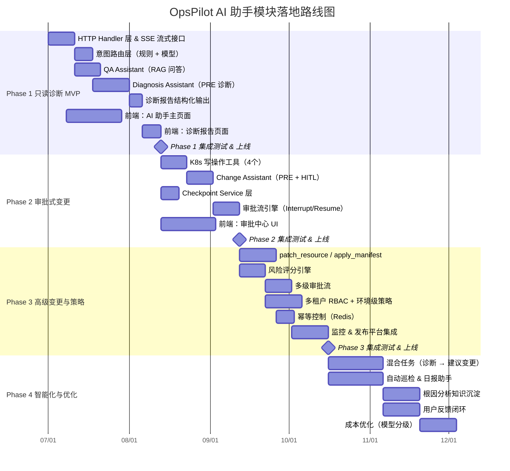

# AI 助手模块落地路线图总览

> **文档版本**：v1.1
> **最后更新**：2026-03-16
> **负责团队**：OpsPilot 平台工程组
> **阅读对象**：后端工程师、前端工程师、产品经理、技术负责人
> **修订说明**：本版已与 `phase1-phase2-technical-design.md` 和 `phase3-phase4-technical-design.md` 对齐关键设计决策

---

## 目录

1. [项目背景](#1-项目背景)
2. [现状评估](#2-现状评估)
3. [优先级原则](#3-优先级原则)
4. [四阶段路线图总览](#4-四阶段路线图总览)
5. [Phase 1 — 只读诊断 MVP](#5-phase-1--只读诊断-mvp)
6. [Phase 2 — 审批式变更](#6-phase-2--审批式变更)
7. [Phase 3 — 高级变更与策略](#7-phase-3--高级变更与策略)
8. [Phase 4 — 智能化与优化](#8-phase-4--智能化与优化)
9. [全局风险与依赖](#9-全局风险与依赖)
10. [关键技术决策记录](#10-关键技术决策记录)

---

## 1. 项目背景

**OpsPilot**（代码仓库：`k8s-manage`）是一个面向 Kubernetes 集群的 PaaS 运维平台，目标是通过 AI 助手降低 K8s 运维门槛，让研发和运维工程师能够用自然语言完成集群诊断、故障排查和受控变更操作。

### 1.1 技术栈

| 层次 | 技术选型 |
|------|----------|
| 后端运行时 | Go 1.26 + Gin + GORM + Cobra CLI |
| AI 编排框架 | CloudWeGo Eino ADK（Plan-Execute-Replan 架构） |
| 向量数据库 | Milvus（支持 RAG 检索） |
| 前端 | React 19 + Vite + Ant Design 6 + @ant-design/x |
| 数据库 | MySQL（含 Checkpoint 持久化） |
| 缓存 | Redis（会话状态、幂等控制） |

### 1.2 核心设计原则

- **安全优先**：写操作必须经过人工审批（Human-in-the-Loop），只读操作无需审批
- **渐进增强**：每个阶段都是独立可用的 MVP，后阶段在前阶段基础上叠加
- **可观测**：所有 AI 行为通过 `AITraceSpan` 记录，支持溯源审计
- **成本可控**：模型调用费用通过 `AIExecution` 追踪，支持分级调用策略

---

## 2. 现状评估

### 2.1 后端能力盘点

| 模块 | 路径 | 状态 | 备注 |
|------|------|------|------|
| PRE Agent 框架 | `internal/ai/agents/planexecute/` | ✅ 已实现 | Planner / Executor / Replanner 完整 |
| Router Agent | `internal/ai/agents/router.go` | ✅ 已实现 | 基础意图路由，无风险分级 |
| K8s 只读工具 | `internal/ai/tools/kubernetes/` | ✅ 已实现 | Query / List / Events / Logs 等 6 个工具 |
| 治理工具 | `internal/ai/tools/governance/` | ✅ 已实现 | UserList / RoleList / PermissionCheck 等 |
| 监控工具 | `internal/ai/tools/monitor/` | ✅ 已实现 | — |
| CI/CD 工具 | `internal/ai/tools/cicd/` | ✅ 已实现 | — |
| 发布工具 | `internal/ai/tools/deployment/` | ✅ 已实现 | — |
| 主机工具 | `internal/ai/tools/host/` | ✅ 已实现 | — |
| 服务工具 | `internal/ai/tools/service/` | ✅ 已实现 | — |
| 基础设施工具 | `internal/ai/tools/infrastructure/` | ✅ 已实现 | — |
| RAG 基础设施 | `internal/rag/` | ✅ 已实现 | Embedder / Ingestion / Retriever / Scheduler |
| 会话数据模型 | `internal/model/ai_chat.go` | ✅ 已实现 | Session / Message / Turn / Block |
| 审批任务模型 | `internal/model/ai_approval_task.go` | ✅ 已实现 | 状态流转：pending → approved/rejected → executed/expired |
| Checkpoint 模型 | `internal/model/ai_checkpoint.go` | ✅ 已实现 | MySQL mediumblob 持久化 |
| 执行记录模型 | `internal/model/ai_execution.go` | ✅ 已实现 | Token 统计 + 费用追踪 |
| Trace 模型 | `internal/model/ai_trace.go` | ✅ 已实现 | 可观测性 Span 记录 |
| **HTTP Handler 层** | `internal/service/ai/` | ❌ 待建设 | 目录为空，无任何接口实现 |
| **诊断助手** | — | ❌ 待建设 | PRE 仅配置只读诊断，无结构化输出 |
| **写操作工具** | — | ❌ 待建设 | scale / restart / rollback / delete 均未实现 |
| **HITL 审批流** | — | ❌ 待建设 | Interrupt → 审批 → ResumeWithParams 未打通 |
| **风险分级策略** | — | ❌ 待建设 | Router Agent 无风险等级输出 |

### 2.2 前端能力盘点

| 模块 | 路径 | 状态 | 备注 |
|------|------|------|------|
| AI API 客户端 | `web/src/api/modules/ai.ts` | ✅ 已实现 | 接口定义完整 |
| AI 用量统计页 | `web/src/pages/AI/Usage/` | ✅ 已实现 | 仅做数据统计展示 |
| **AI 助手主页面** | — | ❌ 待建设 | 聊天交互 + 任务状态 |
| **诊断报告页面** | — | ❌ 待建设 | 结构化诊断报告渲染 |
| **审批中心** | — | ❌ 待建设 | 待审批列表 / 详情 / 批准拒绝 |

### 2.3 关键缺口总结

> 当前最大的阻塞点是 **`internal/service/ai/` 为空**——模型层和工具层已准备就绪，但缺少连接用户请求与 AI 编排能力的 HTTP Handler 层。这是四阶段建设的共同前提。

---

## 3. 优先级原则

### 3.1 为什么以"只读诊断"开局（Phase 1 优先）

```
风险 ↑
      │                          ● Phase 3 高级变更
      │              ● Phase 2 审批变更
      │  ● Phase 1 诊断（只读）
      │
      └──────────────────────────── 交付价值 →
```

**理由一：零风险起步，快速验证价值**  
只读操作不会对生产环境产生任何副作用。团队可以在 4-6 周内交付可用产品，收集真实用户反馈，验证 AI 助手的问答质量和诊断准确率，再决定是否投入写操作建设。

**理由二：奠定技术基础**  
Phase 1 必须打通 HTTP Handler → 意图路由 → PRE Agent → RAG 的完整链路。这套管道是后续所有 Phase 的复用基础，写操作只是在此管道上新增工具和审批钩子。

**理由三：审批流依赖前端**  
HITL 审批流（Phase 2）要求前端有功能完整的审批中心 UI。Phase 1 先交付 AI 聊天主页面，积累前端组件经验，降低 Phase 2 的并行开发风险。

**理由四：合规窗口期**  
写操作工具上线前，安全团队需要完成 RBAC 策略评审和审批流合规确认。Phase 1 的建设周期正好是这个窗口期。

### 3.2 排序规则

| 原则 | 说明 |
|------|------|
| **价值优先** | 优先交付用户最高频的场景（诊断 > 变更） |
| **风险递进** | 从只读 → 审批变更 → 高级变更，每步风险增量可控 |
| **依赖前置** | 下一阶段的前提条件必须在上一阶段完成 |
| **可撤销性** | 每个阶段的交付物都可以独立回滚，不影响其他阶段 |

---

## 4. 四阶段路线图总览

### 4.1 时间轴（Mermaid Gantt）



### 4.2 各阶段一览

| 阶段 | 建议工期 | 核心目标 | 关键交付物 | 风险等级 |
|------|----------|----------|------------|----------|
| Phase 1 | 4-6 周 | 用户能用自然语言诊断 K8s 故障 | HTTP Handler + SSE + 诊断报告 | 🟢 低 |
| Phase 2 | 4-6 周 | 用户能通过 AI 执行审批后的 K8s 变更 | HITL 审批流 + 写操作工具 | 🟡 中 |
| Phase 3 | 6-8 周 | 支持复杂变更，补齐安全合规能力 | 风险评分 + 多级审批 + RBAC | 🟠 中高 |
| Phase 4 | 持续迭代 | 提升体验，沉淀知识，形成反馈闭环 | 知识沉淀 + 反馈训练 + 成本优化 | 🟢 低 |

---

## 5. Phase 1 — 只读诊断 MVP

> **目标**：4-6 周内交付可用的 AI 诊断助手，支持 K8s 知识问答和 Pod/Service/Deployment 故障诊断。

### 5.1 交付物清单

#### 后端

| 交付物 | 文件路径 | 说明 |
|--------|----------|------|
| AI 服务路由注册 | `internal/service/ai/routes.go` | 注册 `/api/v1/ai/*` 路由 |
| 聊天 Handler | `internal/service/ai/handler/chat.go` | POST `/api/v1/ai/chat`，SSE 流式响应 |
| 会话 Handler | `internal/service/ai/handler/session.go` | 会话 CRUD 接口 |
| 历史消息 Handler | `internal/service/ai/handler/history.go` | 分页拉取历史消息 |
| 意图路由层 | `internal/ai/router/intent_router.go` | 输出 `intent_type` + `risk_level` |
| 意图路由规则集 | `internal/ai/router/rules/` | 基于关键词 + 正则的规则引擎 |
| QA Assistant | `internal/ai/agents/qa/` | 接入 `internal/rag/retriever` |
| Diagnosis Assistant | `internal/ai/agents/diagnosis/` | PRE Agent，仅使用只读 K8s 工具 |
| 诊断报告结构体 | `internal/ai/agents/diagnosis/report.go` | `DiagnosisReport` 结构化输出 |
| 诊断报告 Handler | `internal/service/ai/handler/report.go` | GET `/api/v1/ai/diagnosis/report/:id` |
| AI 会话 DAO | `internal/dao/ai_chat_dao.go` | Session / Message / Turn / Block CRUD |
| AI 执行 DAO | `internal/dao/ai_execution_dao.go` | 执行记录写入 |

#### 前端

| 交付物 | 文件路径 | 说明 |
|--------|----------|------|
| AI 助手主页面 | `web/src/pages/AI/Assistant/index.tsx` | 聊天界面入口 |
| 聊天组件 | `web/src/components/AIAssistant/ChatWindow/` | 消息流 + SSE 实时渲染 |
| 会话列表组件 | `web/src/components/AIAssistant/SessionList/` | 历史会话管理 |
| 任务状态组件 | `web/src/components/AIAssistant/TaskStatus/` | 展示 PRE 执行步骤进度 |
| 诊断报告页面 | `web/src/pages/AI/DiagnosisReport/index.tsx` | 结构化报告渲染 |
| 诊断报告组件 | `web/src/components/AIAssistant/DiagnosisReport/` | 分析摘要 + 根因 + 建议 |

### 5.2 关键技术设计

#### SSE 流式响应协议

```
POST /api/v1/ai/chat
Content-Type: application/json

Response: text/event-stream
event: block      → 发送 AIChatBlock（思考/工具调用/最终文本）
event: status     → 更新任务执行状态
event: done       → 流式结束信号
event: error      → 错误信息
```

#### 意图路由输出规范

```go
// IntentRouteResult 意图路由结果，用于决定后续 Agent 分发策略。
type IntentRouteResult struct {
    IntentType  string // "qa" | "diagnosis" | "change" | "unknown"
    RiskLevel   string // "none" | "low" | "medium" | "high" | "critical"
    Confidence  float64
    MatchedRule string
}
```

#### 诊断报告结构

```go
// DiagnosisReport 结构化诊断报告，Phase 1 核心输出产物。
type DiagnosisReport struct {
    SessionID   string
    TurnID      string
    Target      DiagnosisTarget  // 诊断对象（Pod/Service/Deployment）
    Summary     string           // 摘要（1-2 句话）
    RootCauses  []RootCause      // 根因列表
    Suggestions []Suggestion     // 修复建议
    Evidence    []Evidence       // 证据（日志片段/事件/指标）
    CreatedAt   time.Time
}
```

### 5.3 成功标准

| 指标 | 目标值 | 验证方式 |
|------|--------|----------|
| 知识问答准确率 | ≥ 80%（人工评估 50 题） | 抽样 + 专家评分 |
| 诊断召回率 | ≥ 75%（已知故障场景） | 预设故障用例集 |
| 首 Token 延迟 | ≤ 3s（P95） | 压测 + APM 监控 |
| SSE 流式稳定性 | 0 次非预期断流（100 次测试） | 自动化测试 |
| 诊断报告完整率 | 100% 有效对话生成结构化报告 | 接口响应校验 |

### 5.4 依赖与前提

- RAG 知识库已完成文档导入（`internal/rag/ingestion/`）
- Milvus 集群可用，`MILVUS_HOST` 等环境变量已配置
- LLM API Key（`LLM_API_KEY`）已申请并配置
- 已有的 K8s 只读工具（`internal/ai/tools/kubernetes/`）通过集成测试

---

## 6. Phase 2 — 审批式变更

> **目标**：4-6 周内交付 K8s 变更能力，所有写操作必须经人工审批才能执行，不接受绕过审批的执行路径。

### 6.1 交付物清单

#### 后端

| 交付物 | 文件路径 | 说明 |
|--------|----------|------|
| Change Assistant | `internal/ai/agents/change/` | PRE Agent，含 HITL 中断逻辑 |
| Scale 工具 | `internal/ai/tools/kubernetes/scale_deployment.go` | 调整副本数 |
| Restart 工具 | `internal/ai/tools/kubernetes/restart_deployment.go` | 滚动重启 |
| Rollback 工具 | `internal/ai/tools/kubernetes/rollback_deployment.go` | 版本回滚 |
| Delete Pod 工具 | `internal/ai/tools/kubernetes/delete_pod.go` | 删除单个 Pod |
| 审批流引擎 | `internal/ai/hitl/approval_engine.go` | Interrupt → 创建审批任务 → Resume |
| Checkpoint Service | `internal/service/ai/logic/checkpoint_svc.go` | 基于 `AICheckPoint` 模型的持久化 |
| 审批任务 Handler | `internal/service/ai/handler/approval.go` | 审批 CRUD + 批准/拒绝接口 |
| Resume Handler | `internal/service/ai/handler/resume.go` | POST `/api/v1/ai/resume/step/stream` |
| 审批任务 DAO | `internal/dao/ai_approval_dao.go` | `AIApprovalTask` CRUD |
| Checkpoint DAO | `internal/dao/ai_checkpoint_dao.go` | `AICheckPoint` 读写 |

#### 前端

| 交付物 | 文件路径 | 说明 |
|--------|----------|------|
| 审批中心页面 | `web/src/pages/AI/ApprovalCenter/index.tsx` | 审批任务列表 |
| 审批详情组件 | `web/src/components/AIAssistant/ApprovalDetail/` | 变更内容 + 影响范围 + 操作按钮 |
| 变更预览组件 | `web/src/components/AIAssistant/ChangePreview/` | diff 展示（当前状态 vs 变更后） |
| 审批操作组件 | `web/src/components/AIAssistant/ApprovalActions/` | 批准 / 拒绝 / 修改后批准 |
| 审批状态角标 | `web/src/components/AIAssistant/ApprovalBadge/` | 导航栏待审批数量提示 |

### 6.2 HITL 审批流设计

```
用户发起变更请求
      │
      ▼
Change Assistant (PRE)
      │
      ├── Planner：分解变更步骤
      │
      ├── Executor：识别到写操作工具调用
      │       │
      │       └── 触发 HITL Interrupt（携带变更参数快照）
      │
      ├── 创建 AIApprovalTask（status=pending）
      │   持久化 AICheckPoint（保存 PRE 执行状态）
      │
      ├── 推送 SSE 事件：{ event: "approval_required", task_id: "..." }
      │
      ▼
[等待人工审批]
      │
      ├── 批准 → ResumeWithParams(approved=true)
      │            → 继续执行 → 更新 status=executed
      │
      └── 拒绝 → ResumeWithParams(approved=false)
                   → 终止执行 → 更新 status=rejected
```

### 6.3 写操作工具规范

所有写操作工具必须实现以下接口约定：

```go
// WriteTool 写操作工具必须实现的接口，用于 HITL 审批前展示变更预览。
type WriteTool interface {
    // DryRun 模拟执行，返回变更预览（不实际执行）。
    DryRun(ctx context.Context, params ToolParams) (*ChangePreview, error)
    // Execute 实际执行变更，必须在审批通过后调用。
    Execute(ctx context.Context, params ToolParams) (*ToolResult, error)
    // RiskLevel 返回此工具的默认风险等级。
    RiskLevel() string
}
```

### 6.4 成功标准

| 指标 | 目标值 | 验证方式 |
|------|--------|----------|
| 审批流完整性 | 100% 写操作经过审批节点 | 代码审查 + 集成测试 |
| Checkpoint 持久化成功率 | ≥ 99.9% | 压测 + 故障注入 |
| 审批后执行准确率 | ≥ 95%（50 次端到端测试） | 自动化测试用例 |
| 审批 → 执行延迟 | ≤ 5s（从批准到操作完成） | E2E 测试计时 |
| 拒绝后无副作用 | 100%（10 次拒绝场景测试） | 验证 K8s 资源无变化 |

### 6.5 依赖与前提

- Phase 1 的 SSE 框架和 Handler 层已稳定上线
- `AIApprovalTask` 和 `AICheckPoint` 模型已通过 Schema 验证
- K8s 服务账号已配置写操作权限（Namespace 级别最小权限原则）
- 安全团队已完成写操作审批流合规评审

---

## 7. Phase 3 — 高级变更与策略

> **目标**：6-8 周内支持复杂变更场景，补齐安全、合规和多租户能力，为生产环境大规模使用做准备。

### 7.1 交付物清单

| 交付物 | 文件路径 | 说明 |
|--------|----------|------|
| Patch 工具 | `internal/ai/tools/kubernetes/patch_resource.go` | 通用资源 patch，含 dry-run + diff |
| Apply 工具 | `internal/ai/tools/kubernetes/apply_manifest.go` | 应用 YAML manifest，含 diff |
| 风险评分引擎 | `internal/ai/risk/scorer.go` | 综合评估变更风险分 0-100 |
| 风险规则集 | `internal/ai/risk/rules/` | 基于资源类型/环境/影响范围的规则 |
| 多级审批路由 | `internal/ai/hitl/approval_router.go` | 按风险分数路由到不同审批级别 |
| 审批级别配置 | `configs/approval_policy.yaml` | 普通审批 / 管理员二次确认策略 |
| 工具级权限检查 | `internal/ai/rbac/tool_permission.go` | 检查调用者是否有权使用此工具 |
| 环境级策略 | `internal/ai/rbac/env_policy.go` | 生产环境限制策略 |
| 幂等控制器 | `internal/ai/idempotency/controller.go` | 基于 Redis，防止重复执行 |
| 监控集成 | `internal/ai/tools/kubernetes/metrics_compare.go` | 变更前后指标对比 |
| 变更后验证 | `internal/ai/agents/change/post_verify.go` | 自动验证变更是否生效 |

### 7.2 风险评分模型

> 风险评分模型已与 `phase3-phase4-technical-design.md` 对齐，Roadmap 不再维护独立的旧版评分表。
> 实现与阈值应以后端统一风险引擎为准。

```
风险评分采用 4 维度加权求和模型，各维度满分 25 分，总分 0-100 分。

维度一：影响范围（ImpactScore，0-25）
  受影响资源数 × 环境系数（prod×1.5 / staging×1.2 / dev×1.0），上限 25 分

维度二：操作不可逆性（ReversibleScore，0-25）
  不可逆操作（如删除配置、不可安全回滚的 apply）满 25 分
  可逆操作按工具类型给基础分（如 scale=5 / restart=8 / patch=10）

维度三：环境等级（EnvScore，0-25）
  prod=25 / staging=15 / dev=5 / unknown=20（保守处理）

维度四：当前健康状态（HealthScore，0-25）
  活跃告警数越多得分越高
  健康副本比越低得分越高
```

| 风险分 | 等级 | 审批策略 |
|--------|------|----------|
| 0-30 | 🟢 低 | Level 0，免审批或按工具策略直执行 |
| 31-60 | 🟡 中 | Level 1，普通审批 |
| 61-80 | 🟠 高 | Level 2，管理员审批 |
| 81-100 | 🔴 极高 | Level 3，双人审批 |

> 说明：
> - 是否允许免审批，除风险分外还受工具级策略约束
> - `patch_resource`、`apply_manifest` 等高风险工具可配置为“低分也强制审批”
> - 具体评分字段、样例和实现细节见 Phase 3 文档中的风险引擎章节

### 7.3 成功标准

| 指标 | 目标值 | 验证方式 |
|------|--------|----------|
| 风险评分准确率 | ≥ 85%（专家标注集） | 标注 100 个变更场景后对比 |
| 幂等覆盖率 | 100% 写操作工具覆盖 | 代码审查 |
| 多级审批流转成功率 | ≥ 99%（含超时/拒绝路径） | 集成测试用例覆盖 |
| RBAC 拦截准确率 | 100% 越权操作被拦截 | 安全渗透测试 |
| 变更后验证覆盖率 | ≥ 80% 变更操作有自动验证 | 工具清单统计 |

### 7.4 依赖与前提

- Phase 2 审批流已在生产环境稳定运行 ≥ 2 周
- Redis 集群可用，`REDIS_ADDR` 已配置（幂等控制依赖）
- Prometheus 已接入，`PROMETHEUS_ADDRESS` 已配置（监控集成依赖）
- 已与安全团队完成 RBAC 策略评审，环境级策略文件已定稿

---

## 8. Phase 4 — 智能化与优化

> **目标**：在 Phase 1-3 稳定运行的基础上，持续迭代提升用户体验，沉淀领域知识，形成数据飞轮。

### 8.1 交付物清单

| 交付物 | 文件路径 | 说明 |
|--------|----------|------|
| 混合任务 Orchestrator | `internal/ai/agents/hybrid/orchestrator.go` | 诊断完成后自动推荐变更方案 |
| 自动巡检 Agent | `internal/ai/agents/patrol/patrol_agent.go` | 定时触发，生成巡检日报 |
| 日报生成器 | `internal/ai/agents/patrol/report_generator.go` | 聚合多维度健康数据 |
| 知识沉淀 Writer | `internal/rag/knowledge/diagnosis_writer.go` | 将诊断结论写回 RAG 知识库 |
| 知识去重器 | `internal/rag/knowledge/dedup.go` | 防止重复知识条目污染向量库 |
| 反馈收集 Handler | `internal/service/ai/handler/feedback.go` | 点赞/踩 + 文字反馈接口 |
| 反馈数据管道 | `internal/ai/feedback/pipeline.go` | 将反馈数据清洗后写入训练集 |
| 模型分级调用器 | `internal/ai/chatmodel/tiered_client.go` | 按任务复杂度选择模型等级 |
| 成本分析报告 | `web/src/pages/AI/Usage/CostAnalysis.tsx` | Token 用量 + 费用趋势图 |
| 用户反馈组件 | `web/src/components/AIAssistant/Feedback/` | 消息气泡上的反馈按钮 |

### 8.2 混合任务流程设计

```
用户：「帮我看看 order-service 最近怎么了」
        │
        ▼
意图路由 → intent_type = "hybrid"
        │
        ▼
Diagnosis Assistant（只读）
  └── 发现问题：副本数不足，P99 延迟升高
        │
        ▼
Hybrid Orchestrator：生成变更建议
  └── 建议：scale order-service 副本数 2 → 4
        │
        ▼
用户确认 → 自动切换为 Change Assistant（Phase 2 流程）
  └── HITL 审批 → 执行 → 变更后验证
        │
        ▼
诊断结论 + 变更记录 → 写回知识库（Knowledge Writer）
```

### 8.3 模型分级调用策略

| 任务类型 | 建议模型等级 | 理由 |
|----------|-------------|------|
| 简单问答（RAG 直答） | 轻量级模型（如 qwen-turbo） | 无需复杂推理，成本优先 |
| 意图路由分类 | 轻量级模型 | 分类任务，提示词固定 |
| 诊断分析（PRE） | 标准模型（如 qwen-plus） | 需要多步推理，平衡性能与成本 |
| 复杂变更规划 | 旗舰模型（如 qwen-max） | 高风险操作，准确率优先 |
| 变更后验证 | 轻量级模型 | 验证逻辑简单，成本优先 |

### 8.4 知识沉淀闭环

```
每次诊断完成后：
  1. DiagnosisReport → 提取 RootCause + Suggestion
  2. 用户反馈（点赞/踩）→ 打质量标签
  3. 去重检查 → 与现有知识库向量相似度 > 0.95 则跳过
  4. 通过阈值 → 写入 RAG 知识库（JSONL 格式）
  5. 定期重新 Embedding → 更新 Milvus 索引
```

### 8.5 成功标准

| 指标 | 目标值 | 验证方式 |
|------|--------|----------|
| 混合任务用户满意度 | ≥ 4.0/5.0 | 内嵌反馈评分统计 |
| 知识库月增量 | ≥ 50 条有效知识 | 知识库条目统计 |
| 模型成本环比降低 | ≥ 20%（相对 Phase 3 基线） | `AIExecution` 费用统计 |
| 自动巡检覆盖率 | 100% 纳管集群每日巡检 | 巡检任务执行记录 |
| 反馈数据采集率 | ≥ 30% 用户对话有反馈 | 反馈表记录统计 |

---

## 9. 全局风险与依赖

### 9.1 技术风险

| 风险 | 概率 | 影响 | 缓解措施 |
|------|------|------|----------|
| LLM 输出不稳定（幻觉/格式错误） | 高 | 高 | 结构化输出校验 + fallback 逻辑 + 重试机制 |
| Eino ADK 版本兼容性问题 | 中 | 高 | 锁定依赖版本，升级前在测试环境验证 |
| Milvus 检索性能下降（知识库膨胀） | 中 | 中 | 定期清理低质知识，监控检索延迟 |
| Checkpoint 持久化失败导致状态丢失 | 低 | 高 | 幂等重试 + 告警 + 降级为重新规划 |
| K8s 写操作工具误操作生产资源 | 低 | 极高 | 严格 RBAC + 审批强制 + 操作审计日志 |
| SSE 长连接在网关层被断开 | 中 | 中 | 心跳保活 + 断线重连 + 任务状态轮询兜底 |

### 9.2 外部依赖

| 依赖项 | 类型 | 阻塞阶段 | 负责方 |
|--------|------|----------|--------|
| LLM API Key 申请与配额 | 外部服务 | Phase 1 | 平台工程组 |
| Milvus 向量数据库部署 | 基础设施 | Phase 1 | 基础设施组 |
| RAG 知识库初始文档导入 | 数据准备 | Phase 1 | 产品 + 运维 |
| K8s 服务账号写权限申请 | 权限管控 | Phase 2 | 安全团队 |
| 审批流合规评审通过 | 合规 | Phase 2 | 安全 + 合规团队 |
| Prometheus 接入 | 基础设施 | Phase 3 | 监控组 |
| Redis 集群高可用部署 | 基础设施 | Phase 3 | 基础设施组 |

### 9.3 组织风险

| 风险 | 缓解措施 |
|------|----------|
| 前后端并行开发接口不对齐 | Phase 1 第一周先定稿 API 契约（OpenAPI），前后端同时基于契约开发 |
| 安全评审周期不可控 | Phase 2 启动时同步启动安全评审，不串行等待 |
| 用户对 AI 建议信任度低 | 诊断报告展示证据链（日志/事件截图），透明化推理过程 |
| 审批疲劳（审批太多被忽视） | 智能分组 + 风险等级排序 + 低风险操作支持批量审批 |

---

## 10. 关键技术决策记录

### ADR-001：采用 Plan-Execute-Replan 架构而非 ReAct

**决策**：AI 核心流程采用 PRE（`internal/ai/agents/planexecute/`）而非简单 ReAct 循环。

**理由**：
- K8s 故障诊断通常需要多步骤、有序执行（先查事件，再查日志，再分析）
- PRE 支持动态重规划，当某步工具调用失败时可调整后续计划
- HITL 中断点可以精确插入在计划步骤之间，语义清晰

**权衡**：PRE 比 ReAct 实现复杂，首次响应延迟略高（需要先完成 Plan 步骤）。

---

### ADR-002：Checkpoint 持久化采用 MySQL 而非 Redis

**决策**：`AICheckPoint` 使用 MySQL mediumblob 存储（`internal/model/ai_checkpoint.go`），而非 Redis。

**理由**：
- 审批流可能跨天等待，Redis 的 TTL 机制不适合长期持久化
- MySQL 的事务保证了 Checkpoint 与 ApprovalTask 状态一致性
- 审计需要：所有历史 Checkpoint 可查询溯源

**权衡**：MySQL 读写延迟高于 Redis，但 Checkpoint 操作频率低（每次 HITL 中断才触发），可接受。

---

### ADR-003：意图路由采用规则优先 + 模型兜底策略

**决策**：`internal/ai/router/intent_router.go` 采用"规则引擎优先，LLM 分类兜底"的两阶段路由。

**理由**：
- 高频意图（查 Pod 状态、看日志）用规则匹配响应更快，成本更低
- 边界模糊的意图（"帮我修一下这个问题"）交给 LLM 分类，准确率更高
- 规则集可热更新，无需重新部署即可调整路由逻辑

**权衡**：规则集需要持续维护；规则与 LLM 分类结果冲突时以规则为准（可配置）。

---

### ADR-004：写操作工具强制 DryRun 接口

**决策**：所有 K8s 写操作工具必须实现 `DryRun` 方法，在 HITL 审批前向用户展示变更预览。

**理由**：
- 提升审批决策质量：审批人能看到"变更后会是什么样"而非"AI 想执行什么命令"
- 减少误审批风险：diff 可视化让影响范围一目了然
- 与 K8s `--dry-run=server` 语义一致，复用平台已有能力

**权衡**：增加了工具实现复杂度，DryRun 结果与实际执行结果存在极小概率不一致（资源版本冲突），需在执行前二次校验。

---

*文档结束。如有问题或建议，请在仓库 Issue 中讨论，或联系平台工程组。*