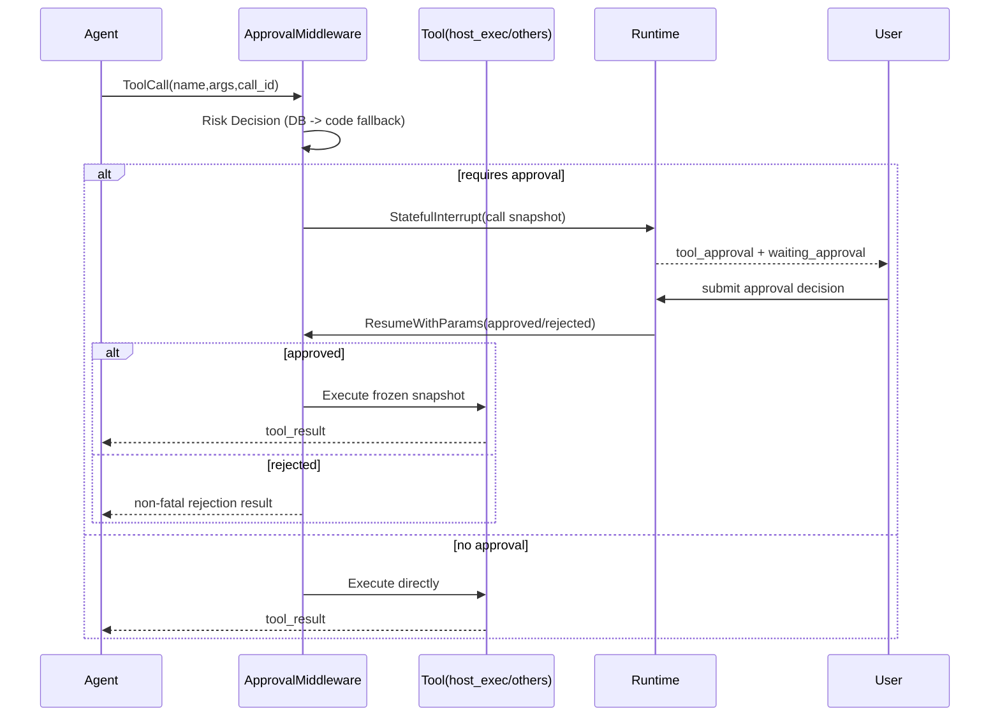

# Host Exec Unified Approval Design

- Date: 2026-03-23
- Status: Proposed
- Owner: AI Runtime / Tooling

## 1. Background

Current host execution and approval behavior still has fragmentation risks:

1. Host execution capabilities are spread across multiple legacy tool names.
2. Approval semantics can drift when tool layer and middleware layer both try to express approval states.
3. Cross-tool approval governance must stay consistent with Eino interrupt/resume semantics.

This change unifies host execution entry and enforces one approval model for all tools.

## 2. Goals

1. Keep only one host execution tool entry: `host_exec`.
2. Standardize `host_exec` input to `host_id + command/script`.
3. Ensure approval middleware is the only approval gateway (no approval-as-tool, no pseudo suspended result from tool layer).
4. Apply one identical approval decision and interrupt/resume model across all tools.
5. Enter interrupt only when risk decision requires approval; commands outside allowlist must go through approval.

## 3. Non-Goals

1. No approval UI redesign.
2. No outbox workflow redesign beyond existing `approval_requested` / `approval_decided` compatibility.
3. No unrelated planner/replanner architecture refactor.

## 4. Unified Host Exec Contract

## 4.1 Tool Name

Only expose:

1. `host_exec`

Remove legacy host exec tools from registration and model-visible toolset:

1. `host_exec_readonly`
2. `host_exec_change`
3. `host_exec_by_target`
4. `host_ssh_exec_readonly`

## 4.2 Input Schema

`host_exec` input fields:

1. `host_id` (required semantic)
2. `command` (optional string)
3. `script` (optional string)

Behavior:

1. `command` and `script` both empty: return validation error (`must provide either command or script`), do not execute.
2. `command` and `script` both non-empty: return parameter-conflict error.
3. Only one non-empty: continue to normal risk decision + execution path.

## 5. One Approval Model For All Tools

Approval middleware must be the single approval gateway for every tool call.

Unified pipeline:

1. Tool call enters `arg_normalizer -> approval_middleware`.
2. Approval middleware computes risk decision (`DB policy -> code registry fallback`, fail-closed).
3. `requires_approval=false`: execute tool immediately.
4. `requires_approval=true`: raise `StatefulInterrupt`, emit `tool_approval`, move run to `waiting_approval`.
5. Resume with decision:
   - approved: execute frozen call snapshot
   - rejected: return structured non-fatal rejection result

Reference sequence (single tool call):

Mandatory invariants:

1. Tool layer must not output pseudo approval pending status (for example `status=suspended`) as business result.
2. Before approval, blocked call must not emit success tool result.
3. Rejection/timeout must not force terminal runtime failure when the run can converge safely.

## 6. Risk Decision Semantics

All tools, including `host_exec`, use same decision stack:

1. DB risk policy when matched (`tool_name + scene + command_class`)
2. Code risk registry fallback
3. Fail-closed when classification or policy is uncertain

For `host_exec`, `command_class` derives from request content:

1. `command` path: classify via host policy/parser outcome.
2. `script` path: classify by script-risk rule configured in policy model.

Commands outside readonly allowlist must resolve to approval-required and enter interrupt.

## 6.1 Parsing Limits and Runtime Hardening

Static parsing/classification is routing support, not a full security boundary:

1. Shell/script static analysis can be evaded (encoding, indirection, expansion tricks, alias/function chains).
2. If parser/classifier cannot prove readonly safety with high confidence, decision must fail-closed to approval-required.
3. Execution safety must also rely on runtime controls (restricted execution identity, sandbox/container boundaries, least privilege, audit trail), not parser-only trust.

## 7. Migration and Cleanup

## 7.1 Phased Migration Plan

### Phase 1: Introduce and Prefer

1. Introduce `host_exec` with new schema.
2. Add DB policy mapping support for `host_exec`.
3. Update prompts/tool metadata so planner/executor prefer `host_exec`.
4. Keep legacy tools registered for compatibility.

### Phase 2: Observe and Drain

1. Add telemetry/log checks for legacy tool invocation counts.
2. Verify in-flight and resumed runs no longer rely on legacy tool names.
3. Gate removal on sustained zero/near-zero legacy usage window.

### Phase 3: Remove and Clean

1. Remove legacy registrations/wrappers once drain criteria are met.
2. Remove legacy risk-registry entries.
3. Finalize DB policy migration and cleanup residual records.

## 7.2 Host Tool Surface Cleanup

1. Refactor host tool factory to register only `host_exec` for execution operations.
2. Remove legacy host exec wrappers and associated docs/comments/tests.
3. Update prompts/tool metadata to stop referencing removed names.

## 7.3 Registry and Policy Cleanup

1. Remove legacy host exec tool names from code risk registry.
2. Migrate DB policy records from legacy host tool names to `host_exec` via a one-way normalization migration.
3. Keep policy versioning and audit fields for traceability.
4. Preserve replay compatibility for historical `tool_approval` / suspended `tool_result` events while new emissions use `host_exec`.

## 7.4 Agent Wiring Conformance

Ensure all tool-calling agents mount same middleware chain:

1. `change`
2. `diagnosis`
3. `inspection`
4. `qa`

Router agent remains transfer-only and does not execute tools.

## 8. Error Handling

1. Invalid `host_id`: return parameter error.
2. `command` and `script` both non-empty: return conflict error.
3. Both empty: return validation error (must provide one execution field).
4. Resume binding mismatch (`session/role/checkpoint`): re-interrupt, do not execute.
5. DB policy unavailable: fallback and fail-closed decision with audit metadata.

## 9. Observability and Audit

Approval middleware remains security choke point and must record:

1. `session_id`, `run_id`, `call_id`, `tool_name`
2. decision source (`db` or `fallback`)
3. matched policy/rule id (if any)
4. command class and digest
5. approval id, approver id, decision timestamp, reject reason

Runtime events must remain consistent with projection/replay contract:

1. `tool_approval`
2. `run_state=waiting_approval`
3. post-resume `tool_result` or rejection output

## 10. Test Plan

## 10.1 Host Exec Contract

1. empty `command/script` -> validation error, no execution.
2. both non-empty -> conflict error.
3. valid `command` path -> risk decision drives execute/interrupt.
4. `script` path -> policy decision drives execute/interrupt.
5. legacy approval events in stored run history remain readable after the `host_exec` migration.

## 10.2 Unified Approval Semantics

1. approval-required call emits `tool_approval` and waiting state.
2. approved resume executes same call snapshot.
3. rejected approval returns non-fatal result.
4. waiting approval path does not degrade to terminal `EXECUTION_FAILED` for recoverable flows.

## 10.3 Full Tool Governance

1. all high-risk tool families are governed by same middleware semantics.
2. no tool can bypass middleware with pseudo pending result.
3. agent wiring conformance tests cover `change/diagnosis/inspection/qa`.

## 11. Acceptance Criteria

1. `host_exec` is the only host execution tool entry exposed to model runtime.
2. Legacy host exec tool names are removed from registration and risk registry.
3. Approval middleware is the sole approval gateway across all tools.
4. Commands outside allowlist enter approval interrupt instead of direct execution.
5. Empty-input and conflict-input cases follow the exact contract defined above.
6. Approval-required flows produce actionable approval entities and can resume correctly.
