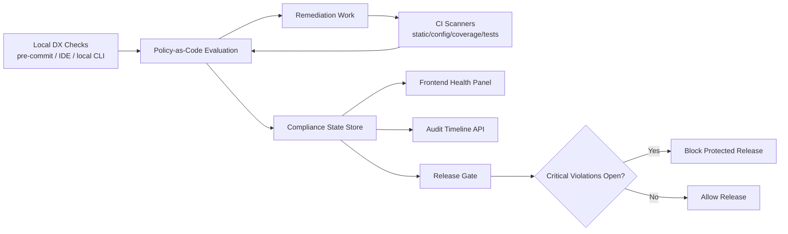

# Project Health Remediation Governance Design

## Purpose

Define a governance-first remediation specification that converts the existing project health assessment into enforceable, testable, and auditable requirements across backend, frontend, and operational layers. This design ensures that identified risks are not only fixed once, but prevented from reappearing through policy gates, verification loops, and visibility mechanisms.

## Normative Spec
See: ./2026-03-25-project-health-remediation-governance-spec.md

## Scope

This design applies to:
- Backend runtime safety and error handling contracts
- Security baseline and configuration hygiene
- Test coverage and quality gate enforcement
- Maintainability constraints for oversized or mixed-responsibility modules
- Frontend health visibility and remediation status reporting
- Platform observability and compliance audit trails

Out of scope:
- Product feature redesign unrelated to risk remediation
- Cross-team process changes not expressible as system requirements

## Design Principles

- Governance over ad hoc fixes: every remediation rule must be enforceable by system checks.
- Fail-safe defaults: unsafe configuration must be rejected or blocked in protected environments.
- Measurable compliance: each requirement must include objective pass/fail criteria.
- Layer parity: backend, frontend, and operations must share a single remediation truth source.
- Non-regression by default: fixes are incomplete unless covered by tests and policy gates.
- Shift-left by default: policy violations should be discoverable locally before CI.

## Criticality Taxonomy

To avoid ambiguity in coverage and gate strictness, the remediation spec will classify modules by risk tier.

Tier criteria dimensions:
- Data sensitivity: handles credentials, tokens, PII, secrets, or security-critical decisions.
- Blast radius: failure can crash shared runtime paths, block deployments, or impact many tenants/services.
- Exposure surface: internet-facing APIs, auth boundaries, and high-frequency operational entry points.
- Dependency centrality: widely imported or transitively depended-on modules.
- Change volatility: frequent changes in high-impact paths.

Risk tiers:
- Tier 0 (Critical): high score across sensitivity and blast radius, or explicit security/runtime ownership.
- Tier 1 (High): high operational impact but lower direct sensitivity than Tier 0.
- Tier 2 (Moderate): bounded impact and lower dependency centrality.

Governance mapping:
- Coverage thresholds, release gates, and response-time SLOs are strongest for Tier 0, then Tier 1, then Tier 2.
- Any module can be promoted to a higher tier by policy decision when incident or audit evidence warrants it.

## Requirement Architecture

The remediation spec will be written using superpowers requirement style:

- `## ADDED Requirements`
- `### Requirement: <name>`
- `#### Scenario: <name>` with `WHEN / THEN / AND`

Requirements are grouped by governance domains:
- Runtime Safety and Error Containment
- Security Baseline and Configuration Hygiene
- Test Coverage and Quality Gates
- Maintainability and Module Boundary Controls
- Frontend Health Visibility and Operator UX
- Observability, Audit, and Compliance Evidence
- Phased Rollout and Release Blocking Rules

## Domain Design

### Runtime Safety and Error Containment

The spec will prohibit crash-oriented error paths in production runtime flows and require structured error propagation.

Key controls:
- Forbid unrecovered `panic(err)` in AI tool execution paths and other request-serving flows.
- Require typed or normalized error returns with context.
- Require middleware-level panic recovery as a defensive safety net, not as primary control.

Acceptance direction:
- Static checks detect forbidden panic patterns in protected directories.
- Runtime failure scenarios confirm request-level isolation and service survival.

### Security Baseline and Configuration Hygiene

The spec will normalize security defaults and prevent risky configuration from being deployed.

Key controls:
- Enforce strict origin boundaries for cross-origin access (for example, no wildcard CORS in production).
- No plaintext real secrets in example or committed config files.
- Security-critical settings must be environment-configurable and validated at startup.

Acceptance direction:
- Policy checks fail builds on forbidden config patterns.
- Startup validation rejects invalid protected-environment security config.

### Test Coverage and Quality Gates

The spec will turn low-coverage findings into gated quality requirements.

Key controls:
- Risk-tiered modules must meet defined minimum coverage thresholds (strictest for Tier 0).
- New or modified critical code paths must include regression tests.
- CI quality gates block merges/releases when thresholds or mandatory suites fail.

Acceptance direction:
- Coverage report is generated in CI and compared against baseline thresholds.
- High-risk modules have mandatory unit/integration suites tied to remediation requirements.
- Local developer workflows can run the same policy/coverage checks pre-push.

### Maintainability and Module Boundary Controls

The spec will enforce structural constraints to reduce oversized files and mixed responsibilities.

Key controls:
- Define module boundary constraints with multi-metric limits, not file-size alone.
- Require decomposition plans for files exceeding limits.
- Require interface-level contracts when splitting logic into focused units.

Primary maintainability metrics:
- File-size threshold (secondary proxy, not sole gate).
- Cyclomatic complexity threshold for functions/methods.
- Cognitive complexity threshold for high-change paths.
- Coupling indicators (for example, import fan-in/fan-out and public surface size).
- Responsibility cohesion checks for mixed-domain files.

Acceptance direction:
- Structural checks report files exceeding limits in targeted directories.
- Refactor scenarios validate no behavior regressions after decomposition.
- Complexity/coupling checks report threshold violations with actionable owner metadata.

### Frontend Health Visibility and Operator UX

The spec will include frontend requirements to expose remediation and compliance state.

Key controls:
- Provide a health remediation panel showing requirement status by domain and severity.
- Expose critical blockers and unresolved regressions with actionable metadata.
- Align UI status with backend policy engine results and audit data.

Acceptance direction:
- Frontend scenarios validate rendering for compliant, degraded, and blocked states.
- API contract scenarios verify consistent status and reason-code mapping.

### Observability, Audit, and Compliance Evidence

The spec will require evidence-grade traceability for remediation progress and regressions.

Key controls:
- Persist remediation events, policy decisions, and gate outcomes.
- Provide timeline query interfaces for modules, domains, and date ranges.
- Track reopened risks and repeated violations to detect governance drift.

Acceptance direction:
- Query scenarios return ordered, filterable, and actor-attributed evidence records.
- Audit retention and access control rules are explicitly enforced.

### Phased Rollout and Release Blocking Rules

The spec will encode rollout sequencing and release protection.

Key controls:
- Phase 1: critical risk elimination and fail-safe enforcement.
- Phase 2: quality and maintainability hardening.
- Phase 3: optimization and architecture-level stabilization.
- Protected releases are blocked when unresolved critical violations exist.

Acceptance direction:
- Release gate scenarios validate block/allow behavior based on policy status.
- Phase completion requires explicit evidence checks, not manual declarations.

## Data Flow Design

Remediation governance follows a closed loop:

1. Detection
- Local checks (pre-commit hooks, IDE lint/policy integration, local CLI validation), plus CI static analysis, config scanning, coverage jobs, and runtime checks detect violations.

2. Policy Evaluation
- A Policy-as-Code engine maps violations to requirement clauses, severities, and enforcement actions.

3. Remediation Execution
- Teams implement fixes under requirement-specific constraints and contracts.

4. Verification
- CI, test suites, and runtime checks validate that remediation criteria are met.

5. Publication
- Compliance state and evidence are published to frontend and audit timelines.

6. Protection
- Release controls enforce block/allow decisions from current compliance state.

Mermaid overview:

## Error Handling Model

- Runtime enforcement failures must return structured machine-readable responses.
- Policy service failures must default to conservative behavior for protected environments.
- Observability pipeline failures must not silently drop compliance-critical events; they must route to a durable fallback queue and raise operator alerts.
- Frontend must show degraded-state indicators when compliance data is partial or stale.

## Testing Strategy

Required verification layers:
- Unit tests for policy evaluators, scanners, and normalization logic.
- Integration tests for backend policy-to-API contract behavior.
- Frontend tests for compliance status rendering and blocker UX.
- End-to-end tests for release blocking behavior under critical unresolved findings.
- Regression tests for previously remediated critical issues.
- Local policy test harness to validate policy rules without full CI cycle.

Quality gates:
- Mandatory passing status for policy and critical risk suites.
- Coverage threshold checks for critical modules.
- Build failure on forbidden security/runtime patterns.

Developer shift-left gates:
- Pre-commit enforcement for fast-fail rule classes.
- IDE diagnostics for policy and security-pattern violations where feasible.
- A local `health-policy check` command that mirrors CI policy engine decisions.

## Policy Engine Model

The remediation architecture adopts a Policy-as-Code model.

Design intent:
- Keep policy definitions declarative, versioned, reviewable, and testable.
- Separate policy decision logic from business handlers and UI components.
- Emit machine-readable decision outputs (`status`, `severity`, `reason_code`, `evidence_ref`) consumable by CI, release gates, and frontend.

Implementation flexibility:
- The model can be backed by OPA/Rego, equivalent policy engines, or a custom declarative evaluator, as long as policy artifacts remain versioned and testable.

## Migration Strategy

- Introduce governance checks in warning mode first where needed.
- Promote to hard-block mode after baseline cleanup and stabilization.
- Keep a temporary allowlist process with explicit expiry for unavoidable exceptions.
- Remove expired exceptions automatically through policy checks.

## Risks and Mitigations

- Risk: false positives in static/policy checks slow delivery.
  - Mitigation: rule calibration period and explicit exception expiry.

- Risk: remediation focus drifts back to manual review.
  - Mitigation: CI/release gate ownership stays with system-enforced rules.

- Risk: frontend and backend status diverge.
  - Mitigation: single source of truth in backend policy state and reason codes.

## Success Criteria

The design is considered successful when:
- Critical risk classes from the health assessment are encoded as enforceable requirements.
- CI and release workflows block unresolved critical violations.
- Frontend provides accurate remediation and blocker visibility.
- Compliance evidence is queryable, auditable, and attributable.
- Regression rate of previously fixed critical findings trends down over time.

## Output Plan

From this design, the next artifact will be a pure-English superpowers spec that:
- creates explicit `ADDED Requirements` and `Scenario` blocks,
- maps assessment findings to enforceable controls,
- defines measurable acceptance criteria per domain,
- supports implementation planning without additional structural reinterpretation.
