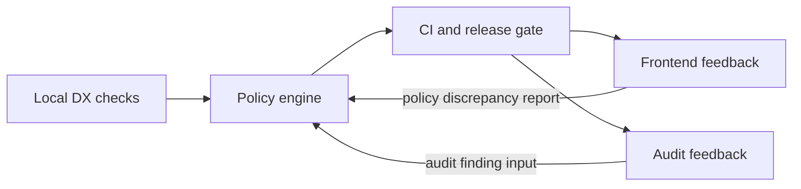

# Project Health Remediation Governance Spec

## Purpose
This spec defines the mandatory governance baseline for remediating project health findings so that runtime behavior, security configuration, test quality, structural maintainability, frontend visibility, compliance evidence, and release control are enforced as auditable policy rather than informal guidance.

## ADDED Requirements

## Criticality and Risk Tiers

- Tier 0 (Critical) MUST apply to protected modules whose failure can block release, corrupt state, compromise security, or disable recovery. Governance MUST treat Tier 0 findings as release-blocking and MUST require immediate remediation before protected release can proceed.
- Tier 1 (High) MUST apply to modules whose defects materially degrade correctness, availability, security posture, or maintainability. Governance MUST require prioritized remediation and MUST prevent protected release when the associated policy gates fail.
- Tier 2 (Moderate) MUST apply to modules whose defects are important but do not directly block protected release. Governance MUST require tracked remediation, and policy evaluation MUST record violations for review without automatically escalating to a release block unless a higher-tier rule is also triggered.

### Requirement: Runtime safety and error containment

#### Scenario: Reject crash-oriented runtime path
- **WHEN** a protected runtime path includes unrecovered panic-on-error behavior
- **THEN** policy evaluation MUST mark the violation as blocking for protected release
- **AND** remediation status MUST include a machine-readable reason code

#### Scenario: Block silent exception suppression
- **WHEN** a protected runtime component suppresses failures without recording them as errors
- **THEN** the policy engine MUST classify the condition as a release-blocking violation
- **AND** the remediation record MUST identify the suppressed failure path in a structured field

### Requirement: Security baseline and configuration hygiene

#### Scenario: Enforce strict cross-origin boundary
- **WHEN** protected environment configuration uses a wildcard origin policy
- **THEN** startup validation MUST fail and the release gate MUST block deployment

#### Scenario: Deny unauthenticated administrative exposure
- **WHEN** a deployment in a protected environment exposes an administrative interface without access control
- **THEN** policy evaluation MUST fail the release gate
- **AND** remediation evidence MUST record the missing control in a structured violation field

### Requirement: Risk-tiered quality and test gates

#### Scenario: Enforce tier-aware test gate
- **WHEN** Tier 0 module coverage or mandatory suites fail
- **THEN** CI MUST fail and protected release MUST remain blocked

#### Scenario: Escalate failed Tier 1 verification
- **WHEN** a Tier 1 module fails its required quality suite or baseline coverage threshold
- **THEN** policy evaluation MUST record a release-blocking violation and MUST require remediation before merge or release

#### Scenario: Track Tier 2 test debt without release escape
- **WHEN** a Tier 2 module misses its recommended test target but does not violate a Tier 0 or Tier 1 gate
- **THEN** the policy engine MUST record the deficiency and MUST require a remediation item for the owning change set

### Requirement: Maintainability control via structural metrics

#### Scenario: Block structural regression beyond threshold
- **WHEN** complexity or coupling metrics exceed the approved structural-regression threshold for protected modules
- **THEN** policy evaluation MUST mark the violation and MUST require a remediation-plan reference
- **AND** protected release MUST be blocked for Tier 0 and Tier 1 modules until compliance or an approved exception is recorded

#### Scenario: Enforce maintainability debt closure
- **WHEN** a protected module remains above the approved structural threshold after a remediation window
- **THEN** release approval MUST stay blocked until the module returns within the approved structural threshold or a formally approved exception is recorded

#### Scenario: Record moderate maintainability drift
- **WHEN** a non-critical module exceeds a warning threshold but remains within release-safe limits
- **THEN** policy evaluation MUST record the drift and MUST assign follow-up remediation without overriding higher-priority gates

### Requirement: Frontend health visibility and operator experience

#### Scenario: Render blocker state from policy result
- **WHEN** backend compliance status is blocking
- **THEN** frontend MUST render the blocking state and reason code mapping

#### Scenario: Surface operator-ready remediation details
- **WHEN** a compliance decision is delivered to the frontend with a non-blocking or blocking outcome
- **THEN** the frontend MUST display explicit fields (`decision_class`, `reason_codes`, `remediation_summary`)

### Requirement: Compliance evidence, timeline, and retention

#### Scenario: Preserve compliance event on primary pipeline failure
- **WHEN** the compliance event sink is unavailable
- **THEN** the system MUST route the event to a durable fallback queue
- **AND** the system MUST emit an operator alert event with a machine-readable alert code

#### Scenario: Preserve ordered evidence history
- **WHEN** compliance events are written for the same change set over time
- **THEN** the system MUST retain a chronological evidence trail with immutable UTC timestamps and immutable decision records

### Requirement: Policy-as-Code enforcement and release protection

#### Scenario: Local policy check mirrors CI decision
- **WHEN** a developer runs the local policy check command
- **THEN** the decision class and reason codes MUST match the CI policy engine output for the same input snapshot

#### Scenario: Release gate blocks on policy mismatch
- **WHEN** a policy evaluation returns a blocking decision during CI or release review
- **THEN** the release gate MUST prevent merge or deployment
- **AND** the recorded decision MUST include the same reason code set used by the frontend and audit trail

