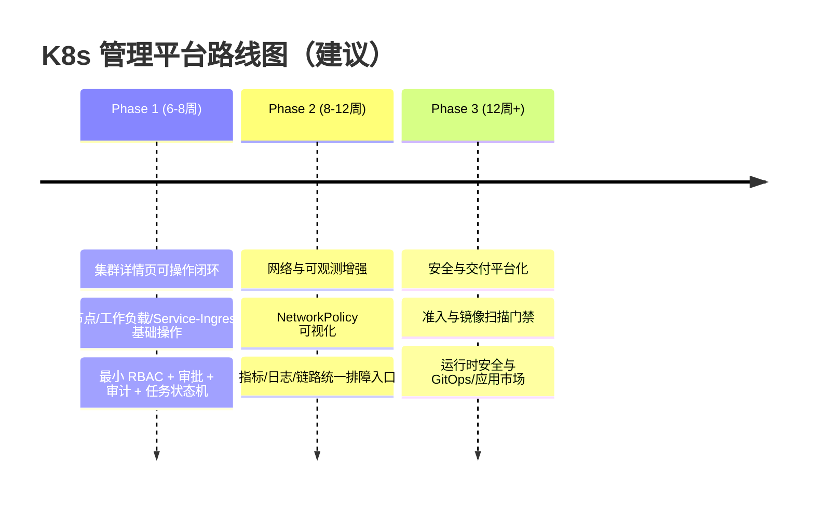
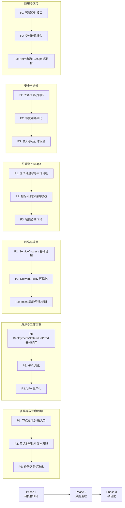
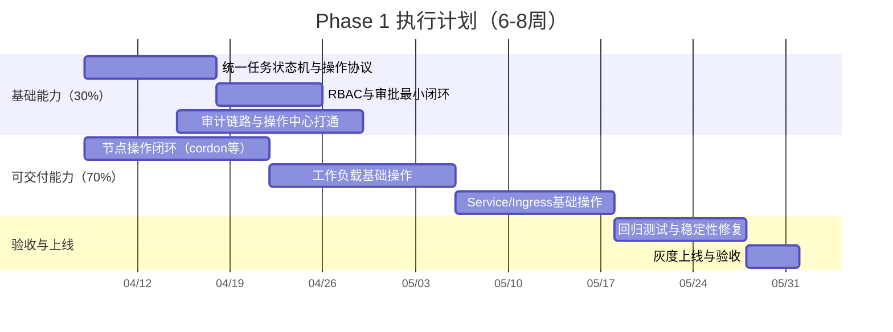

# K8s 管理平台路线规划图（Roadmap Chart）

## 1. 总览路线图（Phase 1 -> Phase 3）

## 2. 能力域推进节奏图（按阶段）

## 3. Phase 1（6-8周）执行甘特图

## 4. 里程碑与验收点

- M1（第2周）：节点操作能力可用，具备基础状态反馈。
- M2（第4周）：工作负载核心操作可用，审批与审计链路可跑通。
- M3（第6周）：Service/Ingress 基础能力可用，关键错误路径可恢复。
- M4（第8周）：完成回归、验收与上线。

## 5. 使用说明

- 该文档仅用于“路线规划图”可视化沟通。
- 需求边界、非目标、测试细节以主规格文档为准：
  - `docs/superpowers/specs/2026-04-04-k8s-platform-roadmap-design.md`

## 6. 当前执行状态（2026-04-05）

- Phase 1 任务进度：`8/8`（其中 Task 8 已完成收口记录与发布控制判断）
- 已闭环能力：
  - 节点操作（cordon/uncordon/drain/remove + 标签/污点）
  - 工作负载基础操作（重启/扩缩容/删除）
  - Service/Ingress 基础治理
  - 操作中心追踪与详情回链
  - 高风险失败恢复指引 + runbook
- 发布判定：
  - Phase 1 聚焦回归：通过
  - 仓库全量回归/构建：存在既有非 Phase 1 阻塞，需独立治理
- 对应验收记录：
  - `docs/superpowers/specs/2026-04-05-k8s-phase1-release-readiness.md`
